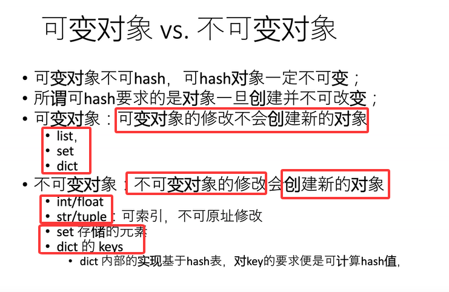
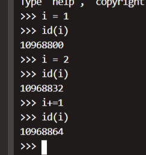
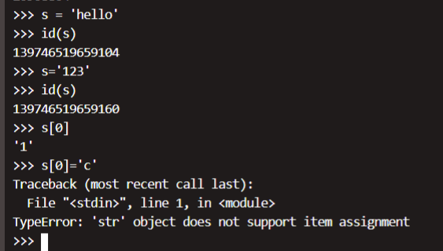
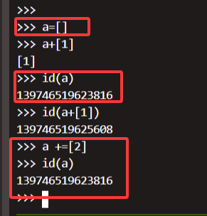
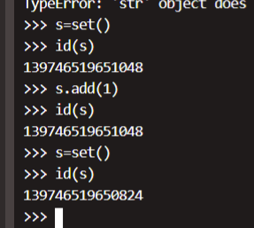
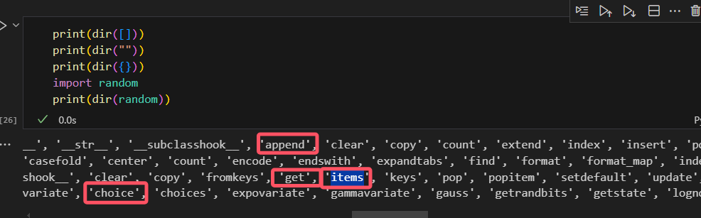
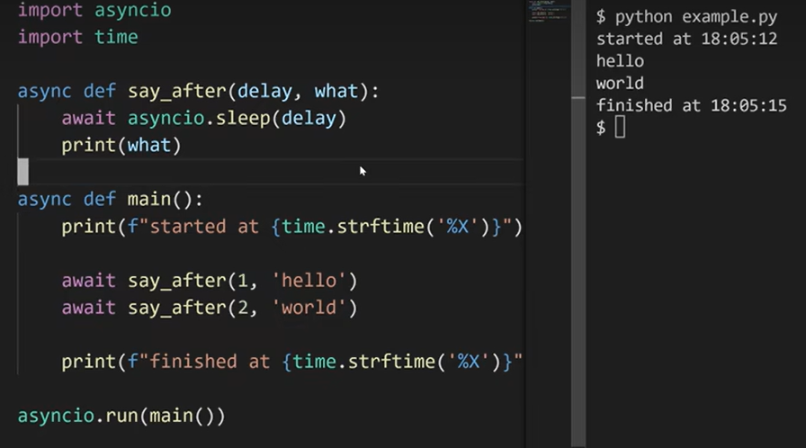
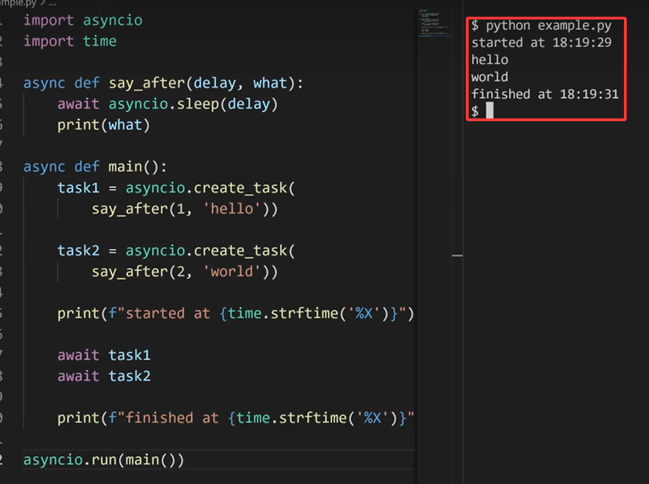
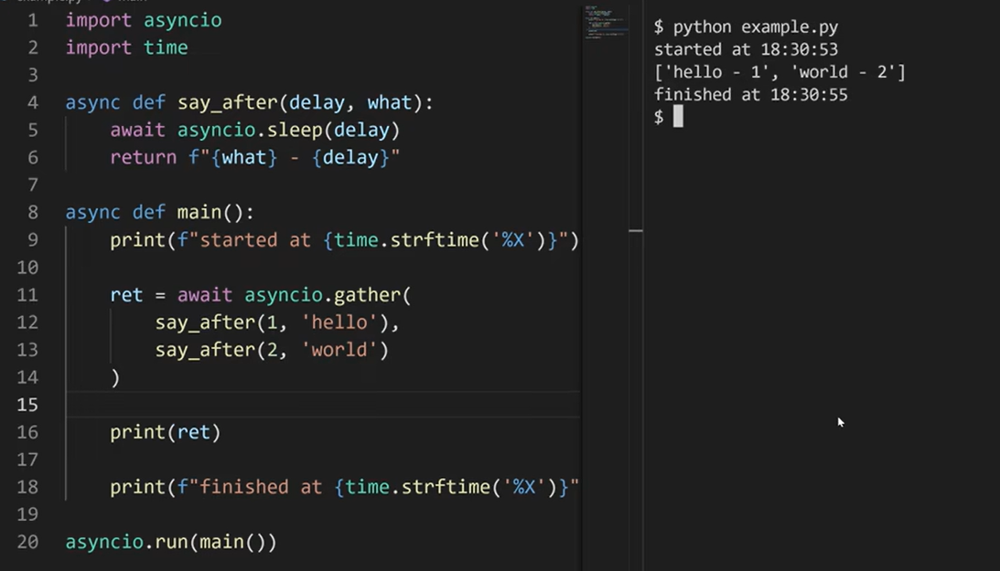

# python

## mutable可变与不可变对象,hashable与不可hashable对象
> 请注意，可变 具有很微妙的含义


不可变对象的修改，会创建新的对象
int类型为不可变对象

str类型同样为不可变对象， 可以对其索引但不可以修改



可变对象的修改 不会创建 新的对象
list的可变性，

set是可变对象，set存储的元素是不可变对象



可变对象不可hash

比如list

a=[1]
a+=[2]后
两者id相同， 但是a的值从[1] 变成了[1,2]

至于list为啥不可哈希，
由于hash是基于容器所有值进行统计计算的，
如果我们把 a=[1]作为key，进行了哈希计算放置在dict中，此时我们可以通过dict[a]来访问，此时会调用hash(a)来计算其在内部容器具体对应位置

而由于a是可变的，如把 a+=[2],那么当再次访问dict[a]时，调用hash(a)就发生了变化，此时该哈希值在内部容器中对应位置就跟上次不对应了！！！

## 内置函数与方法


> 函数是一段独立的、可重复使用的代码块，它通过`def`关键字定义。
>
> ```python
> def add_numbers(a, b):
>  return a + b
> ```
>
> **<font color='red'>方法是与对象相关联的函数。</font>**它定义在类（Class）的内部。
>
> ```python
> class Person:
>  def __init__(self, name):
>      self.name = name
>  def say_hello(self):
>      print(f"Hello, my name is {self.name}")
> ```
>
>  `__方法名__`格式是`python`针对对象提供的内置方法/属性。


### type 与 instance

​	`isinstance()`函数来判断一个对象是否是一个已知的类型，类似`type`。

```python
a = 2
print(type(a),isinstance(a, int))
a = lambda x: x-1
# print(type(a), isinstance(a, function))
""" 
>>>name 'function' is not defined
"""
print(type(a), isinstance(a, type(lambda:None)))
class A:
    def __init__(self):
        pass
a = A
print(type(a),isinstance(a,A))
""" 
<class 'int'> True
<class 'function'> True
<class 'type'> False
"""
```

### zip与zip(*)

 `zip() `函数用于将可迭代的对象作为参数，将**可迭代对象中位置相照应的元素打包成一个个元组**，然后返回由这些元组组成的对象

```python
>>>a = [1,2,3]
>>> b = [4,5,6]
>>> c = [4,5,6,7,8]
>>> zipped = zip(a,b)     # 返回一个对象
>>> zipped
<zip object at 0x103abc288>
>>> list(zipped)  # list() 转换为列表
[(1, 4), (2, 5), (3, 6)]
>>> list(zip(a,c))              # 元素个数与最短的列表一致
[(1, 4), (2, 5), (3, 6)]

```

  利用 `*` 号操作符，可以将元组解压为列表：

```python
a = [1,2,3]
b = [4,5,6]
print(list(zip(a,b)))
""" 
[(1, 4), (2, 5), (3, 6)]
"""
print(*zip(a,b))
print(list(zip( *zip(a,b) )))
""" 
(1, 4) (2, 5) (3, 6)
[(1, 2, 3), (4, 5, 6)]
"""
```

假设之前通过`zip`打包得到了一个类似`[(1, 4), (2, 5), (3, 6)]`这样的可迭代对象，***使用`zip(*)`可以把它还原成原来的各个可迭代对象***

### map

 `map() `会根据提供的函数对指定序列做映射。

map(function, iterable, ...)

```python
y = map(lambda x:x+1, [1,2,3])
print(list(y))
""" 
[2, 3, 4]
"""
z = map(lambda x,y:x+y, [1,2,3],[4,5,6])
print(list(z))
"""
[5, 7, 9]
"""
```


### dir 

使用 `dir()`函数可以查看***对象内的所有的属性和方法***

```python
print(dir([]))
print(dir(""))
print(dir({}))
import random
print(dir(random))
```



### str()与repr()

```python
>>> str(12345)
'12345'
>>> repr(12345)
'12345'
>>> str(5.6789)
'5.6789'
>>> repr(5.6789)
'5.6789'
>>> str(2/11)
'0.18181818181818182'
>>> repr(2/11)
'0.18181818181818182'
```

> - **str()和repr()的差异**：
>
>   ```python
>   >>> import datetime
>   >>> today = datetime.date.today()
>   >>> str(today)
>   '2019-08-09'
>   >>> repr(today)
>   'datetime.date(2019, 8, 9)'
>       
>   ```
>
>   `str()`函数致力于为<font color='red'>终端用户</font>创造字符串输出,目标是可读性（`readable`）,调用的是对象的`__str__()`函数,返回的字符串是<font color='red'>非正式地</font>
>
>
>   而`repr()`函数的返回字符串主要是用于软件开发的`debugging`和`developement`,目标是准确和无歧义,用的是对象的`__repr__()`函数,返回的字符串是<font color='red'>正式地</font>（`offcially`）代表某个对象


> > `print`函数输出使用的是 `__str__`

```python
class Person:
    def __init__(self, name):
        self.name = name
    def __str__(self):
        return f'I am {self.name}'
    def __repr__(self):
        return f'{self.name}'


p1 = Person('xinlin')
print(str(p1))

print(repr(p1))

print(p1)
""" 
'I am xinlin'
'xinlin'
I am xinlin
"""
```


----------------

下面是内置方法:

`__方法名__`格式是`python`针对对象提供的内置方法/属性。

### \__doc__

`__doc__`：获取一个函数的文档说明，比如：

```python
import random
print(random.randint.__doc__)
>>>Return random integer in range [a, b], including both end points.

```

### \__new__

`__new__`：使用`类名()`**创建对象**时，会被**自动**调用。是由`object`基类提供的**内置静态方法**。

  使用`类名()`创建对象时，`python`的解释器首先会调用`__new__`方法为对象分配空间。然后`__init__`初始化对象。

```python
class A:
    def __new__(cls, *args, **kwargs):
        instance = super().__new__(cls, *args, **kwargs)
        print("--- new ----")
        return instance

    def __init__(self):
        print('--- init -----')


a = A()
"""  
--- new ----
--- init -----
"""
```


### \_\_init\__ 与 \__del__

`__init__`：**对象被初始化时**，会被**自动**调用。

`__del__`：**对象从内存中销毁**前，会被**自动**调用。如果希望在对象被销毁前，再做一些事情，可以考虑一下`__del__`方法。

```python
class A:
    def __new__(cls, *args, **kwargs):
        instance = super().__new__(cls, *args, **kwargs)
        print("--- new ----")
        return instance

    def __init__(self):
        print('--- init -----')

    def __del__(self):
        print('--- del ---')

a = A()
del a
"""  
--- new ----
--- init -----
--- del ---
"""
```


### 私有属性和私有方法

`self`定义属性，`def`定义方法。

> 在定义属性或方法时，在属性名或者方法名前**增加两个下划线**，定义的就是私有属性或方法。

  如果父类中有公有方法调用了父类中的私有属性和私有方法的话，子类可以通过访问父类中的共有方法间接访问到私有属性和私有方法。


## 装饰器

普通装饰器

```python
def decorator(func):
    def wrapper(*args,**kwargs):
        print(f"{func.__name__} execute start")

        result = func(*args,**kwargs)

        print(f"{func.__name__} execute end")

        return result

    return wrapper

```

共有两种调用方法：

1.

```python
def compute():
    print("1+2==:",3)
decorator_compute = decorator(compute)

decorator_compute()
"""
compute execute start
1+2==: 3
compute execute end
"""
```

2.

```python
@decorator
def compute():
    print("1+2==:",3)
compute()
# """
# compute execute start
# 1+2==: 3
# compute execute end
# """
```


## collections

### 概述


相较于Python内置的数据类型和方法，<font color='red'>collections模块在这些内置类型(dict list set tuple)的基础提供了额外的高性能数据类型</font>，

比如基础的字典是不支持顺序的，collections模块的OrderedDict类构建的字典可以支持顺序，collections模块的这些扩展的类用处非常大，熟练掌握该模块，可以大大简化Python代码，提高效率


中文文档：[https://docs.python.org/zh-cn/3](https://link.zhihu.com/?target=https%3A//docs.python.org/zh-cn/3/library/collections.html%23module-collections)


用collections.__all__查看所有的子类，一共包含9个

```python
import collections
print(collections.__all__)
"""
>>>
['ChainMap', 'Counter', 'OrderedDict', 'UserDict', 'UserList', 'UserString', 'defaultdict', 'deque', 'namedtuple']
"""
```

| namedtuple() | 创建命名元组子类的工厂函数，生成可以使用名字来访问元素内容的tuple子类 |
| ------------ | ------------------------------------------------------------ |
| deque        | 类似列表(list)的容器，实现了在两端快速添加(append)和弹出(pop) |
| ChainMap     | 类似字典(dict)的容器类，将多个映射集合到一个视图里面         |
| Counter      | 字典的子类，提供了可哈希对象的计数功能                       |
| OrderedDict  | 字典的子类，保存了他们被添加的顺序，有序字典                 |
| defaultdict  | 字典的子类，提供了一个工厂函数，为字典查询提供一个默认值     |
| UserDict     | 封装了字典对象，简化了字典子类化                             |
| UserList     | 封装了列表对象，简化了列表子类化                             |
| UserString   | 封装了字符串对象，简化了字符串子类化（中文版翻译有误）       |


### 计数器-Counter

>  提供快速和方便的计数

Counter是一个<font color='red'>**dict**的子类</font>,用于**<font color='red'>计数可哈希对象</font>**。

它是一个集合，<font color='green'>元素像字典键(key)一样存储，它们的计数存储为值</font>。计数可以是任何整数值，包括0和负数，Counter类有点像其他语言中的bags或multisets。


```python
#计算列表中单词的个数
cnt = Counter()
for word in ['red', 'blue', 'red', 'green', 'blue', 'blue']:
    cnt[word] += 1
cnt
"""
>>>Counter({'red': 2, 'blue': 3, 'green': 1})
"""


#上述这样计算有点嘛，下面的方法更简单，直接计算就行
L = ['red', 'blue', 'red', 'green', 'blue', 'blue'] 
Counter(L)
"""
>>>Counter({'red': 2, 'blue': 3, 'green': 1})
"""

```


元素从一个iterable 被计数或从其他的mapping (or counter)初始化：

```python
from collections import Counter

#字符串计数
Counter('gallahad') 
"""
>>>Counter({'g': 1, 'a': 3, 'l': 2, 'h': 1, 'd': 1})
"""
#dict计数
Counter({'red': 4, 'blue': 2})  
"""
>>>Counter({'red': 4, 'blue': 2})
"""
#是个啥玩意计数
Counter(cats=4, dogs=8)
"""
>>>Counter({'cats': 4, 'dogs': 8})
"""
# list计数
Counter(['red', 'blue', 'red', 'green', 'blue', 'blue'])
"""
>>>Counter({'red': 2, 'blue': 3, 'green': 1})
"""
```


计数器对象除了**<font color='red'>字典方法</font>**以外，还提供了三个其他的方法：

#### elements()

**描述：**返回一个<font color='red'>迭代器</font>，其中<font color='red'>每个元素将重复出现计数值所指定次</font>。 <font color='green'>元素会按首次出现的顺序返回</font>。 如果一个元素的<font color='green'>计数值小于1，elements() 将会忽略它。</font>

```python
c = Counter( b=2,a=4, c=0, d=-2) 
list(c.elements()) # c,d被忽略  b，a按照首次出现的顺序
""" 
>>>['b', 'b', 'a', 'a', 'a', 'a']
""" 
sorted(c.elements())
"""
>>>['a', 'a', 'a', 'a', 'b', 'b']
"""
```


#### **most_common()**

返回一个<font color='red'>列表</font>，其中包含<font color='red'>n个最常见的元素及出现次数</font>，<font color='red'>按常见程度由高到低排序。</font>

如果<font color='green'> n 被省略或为None</font>，most_common() 将<font color='green'>返回计数器中的所有元素</font>，<font color='green'>计数值相等的元素按首次出现的顺序</font>排序，经常用来计算top词频的词语。

```python
Counter('abracadabra').most_common(3)
"""
>>>[('a', 5), ('b', 2), ('r', 2)]
"""

Counter('abracadabra').most_common()
"""
[('a', 5), ('b', 2), ('r', 2), ('c', 1), ('d', 1)]
"""
```


#### **数学操作**

加和减，结合计数器，通过加上或者减去元素的相应计数。

交集和并集返回相应计数的最小或最大值。每种操作都可以接受带符号的计数<font color='red'>，但是输出会忽略掉结果为零或者小于零的计数。</font>

```python
c = Counter(a=3, b=1)
d = Counter(a=1, b=2)
c + d                       # add two counters together:  c[x] + d[x]
>>>Counter({'a': 4, 'b': 3})
c - d                       # subtract (keeping only positive counts)
>>>Counter({'a': 2})
c & d                       # intersection:  min(c[x], d[x]) 
>>>Counter({'a': 1, 'b': 1})
c | d                       # union:  max(c[x], d[x])
>>>Counter({'a': 3, 'b': 2})
```


## heapq

要创建一个堆，可以新建一个空列表 `[]`，或者用函数 [`heapify()`](https://docs.python.org/zh-cn/3/library/heapq.html#heapq.heapify) 把一个非空列表变为堆。


| 函数                               | 说明                                                         |
| ---------------------------------- | ------------------------------------------------------------ |
| heapq.**heappush**(*heap*, *item*) | 将 *item* 的值加入 *heap* 中，保持堆的不变性                 |
| heapq.**heappop**(*heap*)          | 弹出并返回 *heap* 的最小的元素，保持堆的不变性。如果堆为空，抛出 [`IndexError`](https://docs.python.org/zh-cn/3/library/exceptions.html#IndexError) <br />使用 `heap[0]` ，可以只访问最小的元素而不弹出它。 |
| heapq.**heapify**(*x*)             | 将list *x* 转换成堆，原地，线性时间内。                      |

```python
h = []
heappush(h, (5, 'write code'))
heappush(h, (7, 'release product'))
heappush(h, (1, 'write spec'))
heappush(h, (3, 'create tests'))
heappop(h)
# (1, 'write spec')
```


>  默认小根堆
>
> 添加-号， 来使用大根堆

[215. 数组中的第K个最大元素](https://leetcode.cn/problems/kth-largest-element-in-an-array/)

```python
class Solution:
    def findKthLargest(self, nums: List[int], k: int) -> int:
        """
            可以快排或者利用堆

            对于利用堆而言，
                创建一个k个数的小根堆，超过k后pop掉最小的数，
                那么最后遗留下来的就是前k大数，此时同样pop最小的数，即为第k大数
        """

        heap = []
        for num in nums:
            heapq.heappush(heap,num)

            if len(heap) > k:
                heapq.heappop(heap)
        return heapq.heappop(heap)
```

## asyncio 协程

asyncio仍然是单进程单线程任务，并不能提升运算速度，
只是更适合io密集型等待任务，
在io密集性任务时，如网络通讯，我们可以挂起正在传输网络包的操作，进而执行一些其他操作

### 简单理解
asyncio的重点是，event_loop,
对于所有的task而言，event_loop决定哪一个task去运行，
当task运行时，event_loop无法剥夺其控制权，
只能等到其执行完毕，或者yield出控制权。

**假设一个情景，event_loop目前有一个task即main需要执行，**
**分别是main函数（内部首先将a,b函数注册为task，此时event_loop中就有总共三个task，但是控制权此时仍在main，然后await a, print(main),然后await b）**
**a函数 (asyncio.sleep 1秒钟，然后print a)**
**b函数 (内部await asyncio.sleep 2秒种，然后print b)**

***event_loop从main函数进入，控制权由event_loop转移到main， 执行时发现main需要 await等到a执行完毕，控制权从main返回event_loop， 此时event_loop有两个task，执行a时发现需要等1秒，就转而执行了b，发现需要等2秒，控制权就再返回给event_loop,1秒钟过后a状态变为可执行task，print(a),然后a执行完毕，控制权重回event_loop并且main也变成了可执行task，执行main，打印main，然后再经过类似变化，打印b然后终结***

```python

import asyncio


async def a():
    await asyncio.sleep(1)
    print("a")

async def b():
    await asyncio.sleep(2)
    print("b")
async def main():
    a_task = asyncio.create_task(
        a()
    )
    b_task = asyncio.create_task(
        b()
    )

    await a_task
    print("main") 
    await b_task
asyncio.run(main())

"""
a
main
b
"""


```
### coroutine 
coroutine(协程)一般指代两个事务，coroutine funciton与 coroutine object
*coroutine function在被调用时不会执行，*
*coroutine function 返回coroutine object*
```python
# coroutine funciton
async def main():
    print("123") 

coro = main() # coroutine obejct
print(type(main))
print(type(coro))
"""
<class 'function'>
<class 'coroutine'>
sys:1: RuntimeWarning: coroutine 'main' was never awaited
"""
# 没有执行print("123")
```

只有在async模式下，并且把 coroutine转换为 task，
才能执行

### async模式
```python
... 
asyncio.run( coro )
```

asyncio.run接受coroutine参数，并把它变成event_loop中的第一个task，
然后以async模式执行。

### task
如何把coroutin变成task，从而使其可以在async模式下执行

#### await
```python
...
res = await coro
```
await函数
1. 将接收的coroutine 变成 task注册到event_loop
2. 告诉event_loop目前的task，需要等到这个新的task执行完毕后，才能继续执行
3. yield出去控制权，event_loop调度其他的task去执行
4. 当新的task执行完毕 并且 event_loop再次调度该task时，将返回值保存给res然后继续执行

##### await存在的不足
>
> 如上图，由于等待机制
> 仍然执行3秒钟

#### asyncio.create_task函数
```python
task = asyncio.create_task(  coro )

res = await task

```
asyncio.create_task函数
* 将接收的coroutine 变成 task注册到event_loop

如上图，此时就只执行了2秒


#### asyncio.gather函数
```python
# func(1,2) == func(*[1,2])
future = asyncio.gather(*[coro..., task..., future... ])
res = await future
```
asyncio.gather函数
1. 返回一个future的list， await future得到结果
2. 接收coro，task，future作为参数，将这些合理注册到event_loop
3. 最终res返回值是一个list，并且是按参数传递顺序的结果

用法如下图所示，注意是返回结果 是 按顺序的。



## yaml
[YAML 语言教程](https://www.ruanyifeng.com/blog/2016/07/yaml.html) 

[YAML 入门教程](https://www.runoob.com/w3cnote/yaml-intro.html)

[python加载yaml](https://blog.csdn.net/John_xyz/article/details/80183244)
YAML 语言（发音 /ˈjæməl/ ）的设计目标，就是方便人类读写。在开发的这种语言时，YAML 的意思其实是："Yet Another Markup Language"（仍是一种标记语言)

<font color='red'>实质上是一种通用的数据串行化格式</font>。

这里简单介绍下YAML的语法。


### 简介

基本语法规则：

* <font color='red'>大小写敏感</font>
* 使用<font color='red'>缩进表示层级</font>关系
* 缩进时不允许使用Tab键，<font color='green'>只允许使用空格</font>。
* 缩进的<font color='red'>空格数目不重要</font>，只要相同层级的元素左侧对齐即可
* `#` 表示注释，从这个字符一直到行尾，都会被解析器忽略。

支持三种数据结构：

- 对象：<font color='red'>键值对的集合</font>，又称为映射（mapping）/ 哈希（hashes） / 字典（dictionary）
- 数组：<font color='green'>一组按次序排列的值</font>，又称为序列（sequence） / 列表（list）
- 纯量（scalars）：单个的、不可再分的值


### 对象

对象键值对使用冒号结构表示 **key: value**，冒号后面要加一个空格。

可以使用 **key:{key1: value1, key2: value2, ...}**。

还可以使用缩进表示层级关系；

key: 
    child-key: value
    child-key2: value2

---

下面是简单例子：

对象的一组键值对，使用冒号结构表示

```yaml
animal: pets
```

对应于{ animal: 'pets' }

Yaml 也允许另一种写法，将所有键值对写成一个行内对象。

```yaml
hash: { name: Steve, foo: bar }
```

对应于{ hash: { name: 'Steve', foo: 'bar' } }

### 数组

以 **-**（连词线） 开头的行表示构成一个数组：

```yaml
- Cat
- Dog
- Goldfish
- lion
```

对应于[ 'Cat', 'Dog', 'Goldfish' ]

数据结构的子成员是一个数组，则可以在该项下面缩进一个空格。

```yaml
-
 - Cat
 - Dog
 - Goldfish
```

对应于[ [ 'Cat', 'Dog', 'Goldfish' ] ]

YAML 支持多维数组，可以使用行内表示：

```yaml
animal: [cat, dog]
```


一个相对复杂的例子：

```yaml
companies:
    -
        id: 1
        name: company1
        price: 200W
    -
        id: 2
        name: company2
        price: 500W
```

意思是 companies 属性是一个数组，每一个数组元素又是由 id、name、price 三个属性构成。


复合使用，如

```yaml

languages:
 - Ruby
 - Perl
 - Python 
websites:
 YAML: yaml.org 
 Ruby: ruby-lang.org 
 Python: python.org 
 Perl: use.perl.org 
```

对应着

{ languages: [ 'Ruby', 'Perl', 'Python' ],
  websites: 
   { YAML: 'yaml.org',
     Ruby: 'ruby-lang.org',
     Python: 'python.org',
     Perl: 'use.perl.org' } }


### 纯量

纯量是最基本的，不可再分的值，包括：

- 字符串
- 布尔值
- 整数
- 浮点数
- Null
- 时间
- 日期


使用一个例子来快速了解纯量的基本使用：

```yaml
boolean: 
    - TRUE  #true,True都可以
    - FALSE  #false，False都可以
float:
    - 3.14
    - 6.8523015e+5  #可以使用科学计数法
int:
    - 123
    - 0b1010_0111_0100_1010_1110    #二进制表示
null:
    nodeName: 'node'
    parent: ~  #使用~表示null
string:
    - 哈哈
    - 'Hello world'  #可以使用双引号或者单引号包裹特殊字符
    - newline
      newline2    #字符串可以拆成多行，每一行会被转化成一个空格
date:
    - 2018-02-17    #日期必须使用ISO 8601格式，即yyyy-MM-dd
datetime: 
    -  2018-02-17T15:02:31+08:00    #时间使用ISO 8601格式，时间和日期之间使用T连接，最后使用+代表时区
```


### 引用

**&** 锚点和 ***** 别名，可以用来引用:

```yaml
defaults: &defaults
  adapter:  postgres
  host:     localhost

development:
  database: myapp_development
  <<: *defaults

test:
  database: myapp_test
  <<: *defaults
```


```yaml
defaults:
  adapter:  postgres
  host:     localhost

development:
  database: myapp_development
  adapter:  postgres
  host:     localhost

test:
  database: myapp_test
  adapter:  postgres
  host:     localhost
```


<font color='red'>**&** 用来建立锚点（defaults），**<<** 表示合并到当前数据，***** 用来引用锚点。</font>

下面是另一个例子:

```yaml
- &showell Steve 
- Clark 
- Brian 
- Oren 
- *showell 
```

转为 JavaScript 代码如下:

```javascript
[ 'Steve', 'Clark', 'Brian', 'Oren', 'Steve' ]
```


### python解析yaml

下面来看两个例子看python如何load和dump yaml文件。

#### load yaml文件

假设我们有如下yaml文件

```yaml
# test.yaml
age: 37
spouse:
  name: Jane Smith
  age: 25
children:
  - name: Jimmy Smith
    age: 15
  - name1: Jenny Smith
    age1: 12
```

可以使用yaml.load将文件解析成一个字典

```python
import yaml

with open('test.yaml','r') as f:
    data = yaml.load(f)

print(type(data))
print(data)

'''
输出结果
<type 'dict'>
{'age': 37, 'spouse': {'age': 25, 'name': 'Jane Smith'}, 'children': [{'age': 15, 'name': 'Jimmy Smith'}, {'age1': 12, 'name1': 'Jenny Smith'}]}

'''
```

#### dump yaml文件

```python
import yaml

data = {'name':'johnson', 'age':23,
        'spouse':{'name':'Hallie', 'age':23},
        'children':[{'name':'Jack', 'age':2}, {'name':'Linda', 'age':2}]}

with open('test2.yaml','w') as f:
    f.write(yaml.dump(data))
    print yaml.dump(data)
'''
输出结果：
age: 23
children:
- {age: 2, name: Jack}
- {age: 2, name: Linda}
name: johnson
spouse: {age: 23, name: Hallie}
'''
```

得到的yaml文件如下所示:

```yaml
# test2.yaml
age: 23
children:
- {age: 2, name: Jack}
- {age: 2, name: Linda}
name: johnson
spouse: {age: 23, name: Hallie}
```


## func_timeout

> 在开发时，有时我们需要限制某个函数的执行时间，避免其运行时间过长导致程序出现问题。
> python中有一个名为func_timeout的库，帮助我们实现这个功能。

1.安装

pip install func_timeout -i https://pypi.tuna.tsinghua.edu.cn/simple

2.

```python
from func_timeout import func_set_timeout
import func_timeout
import time


@func_set_timeout(3)
def task():
    print('hello world')
    time.sleep(5)
    return '执行成功_未超时'


if __name__ == '__main__':
    try:
        print(task())
    except func_timeout.exceptions.FunctionTimedOut:
        print('执行函数超时')

```


## json vs yaml vs toml


## path导入问题
在当前目录OpenManus下，准备两个文件test_path.py和test_path/test_path.py
两个文件内容都是
```python
import sys
print(__name__)
print(sys.path)
```  
然后下面是运行及结果
(OpenManus) # python test_path.py  
__main__  
\['/workspace/xsc_workspace/OpenManus', '/root/.local/share/uv/python/cpython-3.12.9-linux-x86_64-gnu/lib/python312.zip', '/root/.local/share/uv/python/cpython-3.12.9-linux-x86_64-gnu/lib/python3.12', '/root/.local/share/uv/python/cpython-3.12.9-linux-x86_64-gnu/lib/python3.12/lib-dynload', '/workspace/xsc_workspace/OpenManus/.venv/lib/python3.12/site-packages'\]  
  
(OpenManus) #python test_path/test_path.py  
__main__  
\['/workspace/xsc_workspace/OpenManus/test_path', '/root/.local/share/uv/python/cpython-3.12.9-linux-x86_64-gnu/lib/python312.zip', '/root/.local/share/uv/python/cpython-3.12.9-linux-x86_64-gnu/lib/python3.12',  
  '/root/.local/share/uv/python/cpython-3.12.9-linux-x86_64-gnu/lib/python3.12/lib-dynload', '/workspace/xsc_workspace/OpenManus/.venv/lib/python3.12/site-packages'\]   
(OpenManus) # python -m test_path.test_path  
__main__    
\['/workspace/xsc_workspace/OpenManus', '/root/.local/share/uv/python/cpython-3.12.9-linux-x86_64-gnu/lib/python312.zip', '/root/.local/share/uv/python/cpython-3.12.9-linux-x86_64-gnu/lib/python3.12', '/root/.local/share/uv/python/cpython-3.12.9-linux-x86_64-gnu/lib/python3.12/lib-dynload', '/workspace/xsc_workspace/OpenManus/.venv/lib/python3.12/site-packages']    
可见，sys.path依次打印了模块搜索路径，包括当前执行目录，标准库目录，最后是虚拟环境uv目录（uv是新的虚拟环境管理，就自己使用而言，亦可以理解为conda）   
从sys.path打印的目录第一个元素，我们可以看到运行 python -m test_path.test_path时，搜索路径还是OpenManus，   
而运行python test_path/test_path.py时，搜索目录却变成了/workspace/xsc_workspace/OpenManus/test_path，   
后者的这个情况，将导致一些包导入的问题。  
  
因此，之后的编码中需要妥善安排目录结构及测试，  
比如如下的目录结构  
- .
    - app
      - module1
        - __init__.py
        - test.py
    - config/
    - logs/
    - datas/
    - main.py
  
把module都安排在app目录下，并且所有的导包统一使用from app.  
所有的执行都与main.py app同目录，即.目录   
此时，如果要测试app/module1/test.py   
也放在 .目录下， 运行python -m app.module1.test来运行 test.py中的 if \_\_name\_\_ == "\_\_main\_\_":   
  

## end

