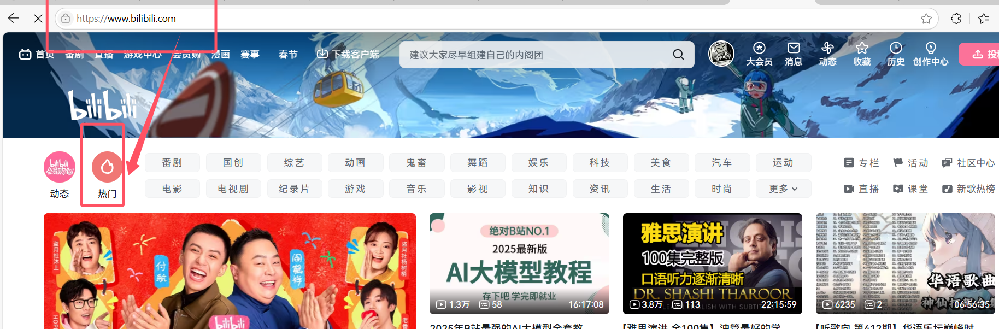
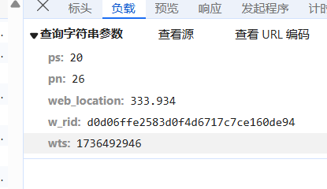
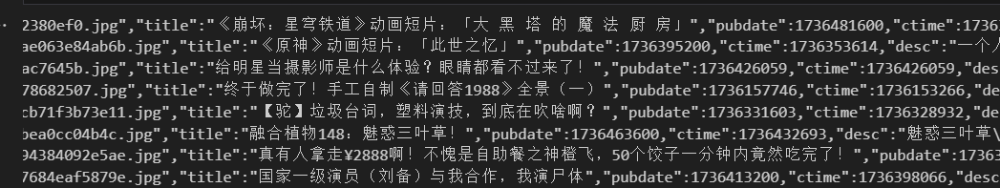
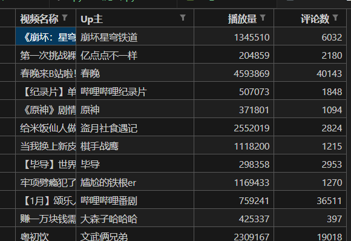
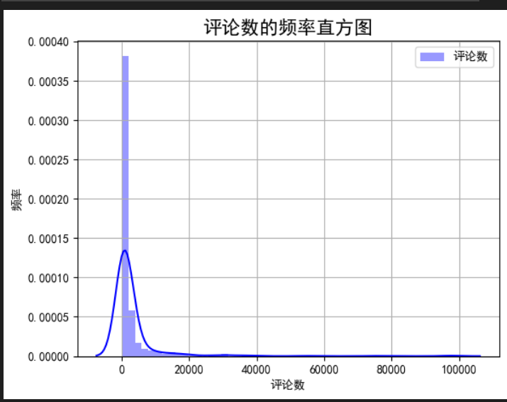
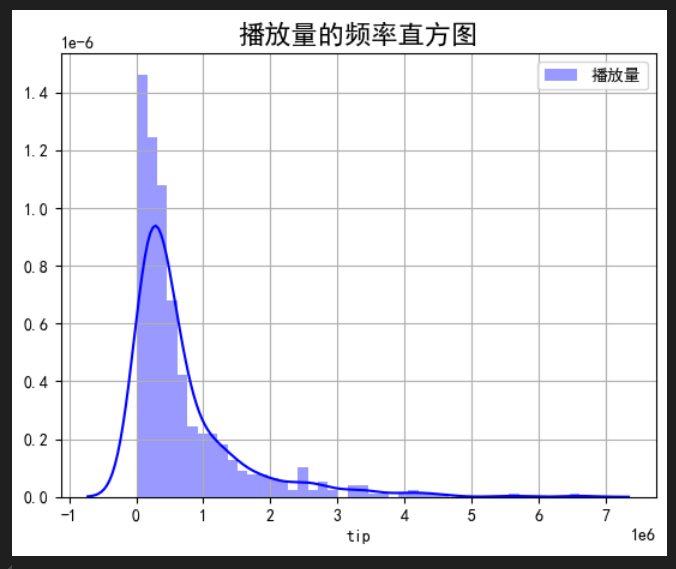
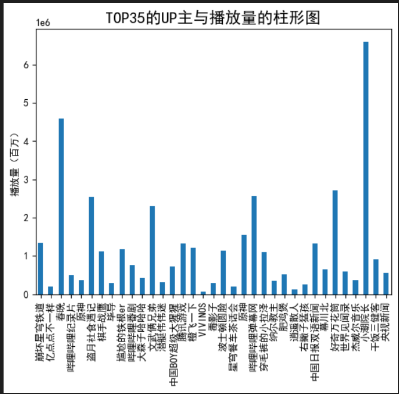
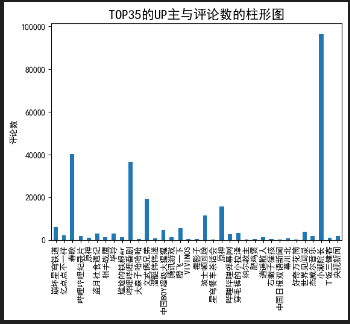
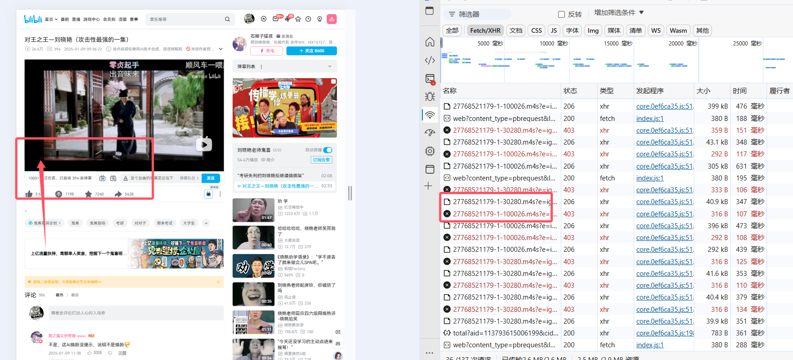

# 爬取bilibili综合热门榜及数据分析




也就是目标是这个网页

> 基本原理
>
> 访问网页就是向服务器发送 http等相应协议的 交互请求， 服务器据此返回对应内容。浏览器解析后渲染出来给用户看，爬虫即使用python大批量的模拟用户请求，获取数据

> ### 关于向服务器发送请求
>
> 
>
> - 协议方面
>
>   ：
>
>   - **HTTP 协议**：超文本传输协议是最为常用的一种，它基于请求 / 响应模型运作。当发起访问网页的请求时，客户端（比如浏览器或者模拟浏览器行为的爬虫程序）会构建一个符合 HTTP 规范的请求消息，其中包含请求行（指明请求方法如 GET、POST 等，请求的 URL 以及 HTTP 版本号）、请求头（包含诸如 User-Agent 来表明客户端类型、Accept 来告知服务器可接受的数据格式、Cookie 用于传递一些会话相关的标识信息等诸多字段）以及在 POST 等请求方法下可能存在的请求体（比如提交表单数据时用于存放要传递给服务器的具体内容）。除了 HTTP 协议外，现在还有 HTTP/2、HTTP/3 等新版本，它们在性能、传输效率等方面有进一步优化，例如 HTTP/2 采用二进制分帧层，能实现多路复用，提升资源传输的并行性。另外，也有像 HTTPS 协议，它是在 HTTP 基础上加入了 SSL/TLS 加密层，保障数据传输过程中的安全性，常用于涉及用户隐私信息交互的网页访问场景，像电商网站、网上银行等登录页面。
>   - **其他协议**：在一些特定场景下，还可能用到 FTP（文件传输协议，用于文件的上传下载等操作）、SMTP（简单邮件传输协议，用于发送邮件相关的交互）等协议，不过在常规网页访问获取数据场景中，HTTP 系列协议应用最为广泛。
>
> - 请求的构造与发送
>
>   ：
>
>   - 在 Python 中，若要模拟用户请求，像`requests`库是常用的工具。例如使用`requests.get(url)`语句就能简单地向指定的`url`（统一资源定位符，即网页地址）发起 GET 类型的请求，其内部会自动按照 HTTP 协议规范组装请求消息，并通过底层网络模块将请求发送到对应的服务器 IP 地址和端口（HTTP 默认端口是 80，HTTPS 默认端口是 443）。如果需要携带一些自定义的请求头信息，可以通过设置`headers`参数来实现，如`headers = {'User-Agent': 'Mozilla/5.0 (Windows NT 10.0; Win64; x64) AppleWebKit/527.36 (KHTML, like Gecko) Chrome/XX.XX.XXXX.XX Safari/537.36'}`（这里的 User-Agent 值模拟了常见的 Chrome 浏览器的标识），然后在请求中传入`headers`字典，像`requests.get(url, headers=headers)`，这样可以让服务器更以为是真实用户发起的请求，避免一些简单的反爬虫机制拦截。
>
> ### 服务器返回对应内容
>
> 
>
> - **响应状态码**：服务器接收到请求后，会根据请求的合法性、资源是否存在等情况返回相应的响应消息，其中响应状态码是重要的标识信息。比如常见的 200 状态码表示请求成功，服务器成功返回了客户端所请求的内容；404 状态码意味着请求的资源不存在，像输入了错误的网页链接路径时就可能收到该状态码；403 状态码则通常表示服务器拒绝了客户端的访问，可能是因为没有相应权限或者触发了服务器的一些访问限制规则，这在面对爬虫频繁访问等情况时较容易出现；500 状态码代表服务器内部出现错误，可能是服务器端代码执行出现异常等情况导致无法正常处理请求并返回正确内容。
>
> - 响应内容
>
>   ：
>
>   - **数据格式**：响应内容的数据格式多样，常见的有 HTML（超文本标记语言）文档，这是网页的基本结构内容，包含了页面的文本、图片、链接等各种元素的布局和描述信息，浏览器会根据 HTML 标签来解析并渲染出可视化的页面；还有 JSON 格式，它是一种轻量级的数据交换格式，常用于服务器返回 API 接口的数据，比如获取天气信息、股票数据等接口返回的数据很多就是 JSON 格式，方便客户端进行解析和处理；另外 XML 格式也曾较为常用，不过现在相对少些，主要在一些特定的行业或老系统中存在，它同样可以用于描述和传递数据结构。
>   - **数据关联**：服务器返回的内容可能还会关联到其他资源，例如 HTML 文档中的图片、样式表（CSS 文件）、脚本文件（JavaScript 文件）等，这些通常会通过相应的 URL 引用在 HTML 中，浏览器后续会根据这些引用再次发起请求去获取对应的资源，以完整地渲染出页面效果。
>
> ### 浏览器解析后渲染呈现给用户
>
> 
>
> - 解析过程
>
>   ：
>
>   - 浏览器接收到服务器返回的 HTML 文档后，首先会进行词法分析，将 HTML 代码按照标签、属性、文本等元素进行拆分，识别出各个组成部分，例如识别出`<html>`、`<body>`、`<p>`等标签以及它们包裹的内容。然后进行语法分析，构建出 DOM（文档对象模型）树，DOM 树以树形结构来表示 HTML 文档中的各个元素以及它们的层级关系，比如`<body>`标签下的子元素会在 DOM 树中作为其对应的节点及子节点呈现。对于 CSS 样式表，浏览器会解析样式规则，并根据选择器等将样式应用到 DOM 树对应的元素上，构建出渲染树（它会排除那些不可见的元素，比如设置了`display:none`的元素不会出现在渲染树中）。同时，浏览器会解析 JavaScript 脚本，JavaScript 可以操作 DOM 树、改变元素的样式、响应事件等，比如实现点击按钮弹出提示框、动态加载新的内容等交互效果。
>
> - 渲染展示
>
>   ：
>
>   - 基于构建好的渲染树，浏览器会进行布局计算，确定每个元素在页面中的位置和大小，这个过程会考虑元素的盒模型（包括内容、内边距、边框、外边距等尺寸信息）以及页面的布局模式（如流式布局、弹性布局、网格布局等不同的布局方式）。之后进行绘制操作，将各个元素按照其样式和布局的设定，通过图形绘制等方式呈现在屏幕上，最终完整地展示出网页给用户看到，并且会持续监听用户的操作，比如鼠标点击、滚动等，再通过 JavaScript 等机制来动态更新页面内容和效果。
>
> ### 爬虫模拟用户请求获取数据
>
> 
>
> - Python 爬虫库及框架
>
>   ：
>
>   - 除了前面提到的`requests`库用于简单的请求发送外，还有如`Scrapy`这样功能强大的爬虫框架。`Scrapy`提供了一套完整的爬虫开发架构，包括定义爬虫的起始请求、如何解析响应内容、如何跟进链接以及数据的存储等功能模块。使用`Scrapy`时，需要先创建项目，定义好`Item`（用于定义要爬取的数据结构，类似数据库表结构的定义），编写`Spider`类（其中定义了爬取的规则、起始 URL、如何解析页面提取数据等逻辑），然后通过命令行等方式启动爬虫运行，它能高效地处理大量网页的爬取任务，并且支持中间件机制，可以方便地设置请求头、处理代理、应对反爬虫措施等。
>
> - 反爬虫应对与规避
>
>   ：
>
>   - 由于大量的爬虫行为可能会对服务器造成负载压力或者涉及到数据的非法获取等问题，很多网站都设置了反爬虫机制。常见的反爬虫手段包括限制 IP 访问频率，比如同一 IP 在短时间内频繁发起请求就会被封禁；通过检查请求头中的 User-Agent 等字段来判断是否是正常浏览器访问；还有根据页面的访问行为模式，例如正常用户浏览页面的点击顺序、停留时间等有一定规律，而爬虫往往是快速批量访问不同页面，若不符合正常行为模式就可能被识别并阻止。针对这些，爬虫可以采用设置合理的访问时间间隔、使用代理 IP（轮换不同的 IP 地址来发送请求，避免单个 IP 被限制）、动态修改请求头信息模仿不同浏览器等多种策略来尽量规避反爬虫机制，合法地获取需要的数据。
>
> - 数据处理与存储
>
>   ：
>
>   - 爬虫获取到的数据往往需要进一步处理，比如从 HTML 页面中提取出想要的文本、图片链接等具体信息，可以使用`BeautifulSoup`、`lxml`等 HTML 解析库，通过它们提供的查找标签、属性等方法来精准提取数据。对于提取后的数据，常见的存储方式有保存到本地文件（如 CSV 文件用于存储表格类型的数据、JSON 文件用于存储结构化数据等），也可以存储到数据库中（像 MySQL 数据库用于关系型数据存储、MongoDB 用于存储非结构化或半结构化的文档型数据等），方便后续对数据进行分析、应用等操作。


### 版本1

> 基本的数据爬取与存储
>
> 包括反爬处理，异常处理

通过页面使用开发者工具（F12）找到network中的XHR,然后找到对应数据返回url


从所需爬取的页面中 ， 通过页面使用开发者工具（F12）找到network中的XHR通过查看Headers了解网页的请求方式，并且获取URL（https://api.bilibili.com/x/web-interface/popular?ps=20&pn=1&web_location=333.934&w_rid=3d2792ecf3421c26a431b78a69c6c641&wts=1736492729）

总共26页，每页20个视频




1.数据爬取与采集

```python
#导入所需要的库
import requests
import json
import csv
#爬虫部分
#1.数据是动态加载的，所以需要寻找数据地址
def Get_data():
    #处理一个小小的反爬，伪装成浏览器发送请求。
    header={
        'user-agent':'Mozilla/5.0 (Windows NT 10.0; Win64; x64) AppleWebKit/537.36 (KHTML, like Gecko) Chrome/91.0.4472.124 Safari/537.36'
    }
    url='https://api.bilibili.com/x/web-interface/popular'
    #从页面分析知道热门数据共有11页
    for i in range(1,27):
        #把URL的参数封装成一个字典
        param={
            'ps': 20,
            'pn': i
        }
        res=requests.get(url=url,headers=header,params=param)
        print(res.text)
       #Parse(res.text)#下一步需要利用的函数
        res.close()#关闭对网页的爬取

if __name__ == '__main__':
    Get_data()
```



（PS:因为动态加载的原因，爬取的内容可能和之后的可视化有点差异，但不影响结果的展示）

### 版本2

> 增加数据存储与分析


1.提取所需的数据，并存储

```python
#2.对爬取到的数据进行解析，获取每一条视频数据的标题，Up主，播放量，评论数

#对所有视频的数据都解析，每一条数据以元组的形式保存在列表中
all_data=[]
def Parse(text):
    dict=json.loads(text)#把数据转化为字典方便数据提取
   # print(dict['data']['list'])

    for i in dict['data']['list']:
        # print(i['title'])#标题
        # print(i['owner']['name'])#up主
        # print(i['stat']['view'])#播放量
        # print(i['stat']['danmaku'])#评论数

        temp=(i['title'],i['owner']['name'],i['stat']['view'],i['stat']['danmaku'])
        all_data.append(temp)

#3.对数据进行保存
def Save_data(all_data):
    with open(r'all_data.csv',mode='w',encoding='utf-8') as fp:
        writer=csv.writer(fp)#创建一个csv的写对象
        writer.writerow(['视频名称','up主','播放量','评论数'])#写一行数据作为数据头部
        for i in all_data:
            writer.writerow(i)#把all_data的数据写进去


if __name__ == '__main__':
    Get_data()
    #print(all_data)
    Save_data(all_data=all_data)
```


 生成的csv如下图：




2.数据清洗

获取的数据较完整，没有出现重复和空行情况。故不需要数据清洗


3.绘制频率直方图

```python
import pandas as pd
import matplotlib.pyplot as plt
import numpy as np
import matplotlib
import seaborn as sns
from sklearn import datasets
from sklearn.linear_model import LinearRegression
from sklearn.datasets import load_boston
import jieba
from pylab import *
from wordcloud import WordCloud


#评论数的频率直方图
%matplotlib inline
plt.rcParams['font.sans-serif'] = ['SimHei']
plt.rcParams['axes.unicode_minus'] = False
df=pd.read_csv('C:/Users/10365/Desktop/python期末作业/all_data.csv')
plt.figure

sns.distplot(df['评论数'].values,hist=True, kde=True,axlabel='tip',rug=False,fit=None,hist_kws = {'color':'b','label':'评论数'}, kde_kws={'color':'b'})
plt.title("评论数的频率直方图",fontsize=16)
plt.legend()
plt.xlabel('评论数')
plt.ylabel('频率')
plt.grid()


#播放量的频率直方图
sns.distplot(df['播放量'].values,hist=True, kde=True,axlabel='tip',rug=False,fit=None,hist_kws = {'color':'b','label':'播放量'}, kde_kws={'color':'b'})
plt.title("播放量的频率直方图",fontsize=16)
plt.legend()
plt.ylabel('')
plt.grid()
```







```python
#TOP35的UP主与播放量的柱形图
data=np.array(df['播放量'][0:35])
index=np.array(df['up主'][0:35])
print(data)
print(index)
plt.ylabel('播放量（百万）')

plt.title("TOP35的UP主与播放量的柱形图",fontsize=16)
s = pd.Series(data, index)

s.plot(kind='bar')
plt.savefig('TOP35的UP主与播放量的柱形图.jpg')


#TOP35的UP主与评论数的柱形图
data=np.array(df['评论数'][0:35])
index=np.array(df['up主'][0:35])
print(data)
print(index)
plt.ylabel('评论数')

s = pd.Series(data, index)

plt.title("TOP35的UP主与评论数的柱形图",fontsize=16)

s.plot(kind='bar')

#数据持久化
plt.savefig('TOP35UP主与评论数的柱形图.jpg')
```


4.绘制柱形图








5.绘制词云

```python
import jieba
from pylab import *
from wordcloud import WordCloud
text = '  '
a=''
df=pd.read_csv('all_data.csv')
for line in df['视频名称']:
    a+= line
    text+=a
# 使用jieba模块将字符串分割为单词列表
cut_text = '    '.join(jieba.cut(text))
cloud = WordCloud(
    background_color = 'white',
    # 对中文操作必须指明字体
    font_path='C:/Windows/Fonts/优设标题黑_猫啃网.ttf',
    mask = color_mask,
    max_words = 50,
    max_font_size = 200
    ).generate(cut_text)

# 保存词云图片
cloud.to_file('ciwordcloud.jpg')
plt.imshow(cloud)
plt.axis('off')
plt.show()
```


小结

1.经过对主题数据的分析与可视化，可以得到哪些结论？是否达到预期的目标？ 

 结论： （1）通过近期热门视频排行榜数据爬取得知播放量最高的up主是？？？，说明人们对这类视频的关注度高

​       （2）通过近期热门视频排行榜数据爬取并结合词云得知评论数最高的是？？？，说明人们对该视频的讨论激烈。

​       

2.在完成此设计过程中，得到哪些收获？以及要改进的建议？

   通过爬取bilibili近期热门排行榜，在项目代码编写阶段巩固了基础知识，并且通过网上的视频了解到对爬取页面和解析页面的多种方法，如（requests模块，bs4，json等）所以爬虫方面进展还是比较顺利的。但是由于基础的原因在数据可视化的实现中还是比较吃力的，参考了很多种实现方法。数据可视化这方面进展比较缓慢拉下完成项目的进度。

   日后要加强对绘图库的理解与使用，通过各种实战来熟练。

### 版本3

> 提取视频、
>
> 整合为函数、类
>
> 考虑更多反爬虫技术
>
> 考虑增加多线程，
>
> 考虑增加 gui等
>
> 综合整合后，撰写报告
>


1. 考虑拉取最受欢迎的视频



这里只是以该视频为例子，

点击播放按钮后，右侧30280和10026不断重复出现，

这两个链接即为对应视频和音频，我们直接点击还无法获得，

需要添加referer关键字。

```python
# 单个视频获取分析
import requests

headers = {
    "User-Agent": "Mozilla/5.0 (Windows NT 10.0; Win64; x64) AppleWebKit/537.36 (KHTML, like Gecko) Chrome/91.0.4472.124 Safari/537.36",
    # referer告诉server我是从哪个页面跳转过来的，因此可以获取视频
    "referer":"https://www.bilibili.com/video/BV1QmChYWECm/?spm_id_from=333.1007.tianma.1-1-1.click&vd_source=39767bfbc4ae772d0c2f8d8b32b54ce6",
}
url1="https://upos-hz-mirrorakam.akamaized.net/upgcxcode/45/05/27655930545/27655930545-1-30232.m4s?e=ig8euxZM2rNcNbdlhoNvNC8BqJIzNbfqXBvEqxTEto8BTrNvN0GvT90W5JZMkX_YN0MvXg8gNEV4NC8xNEV4N03eN0B5tZlqNxTEto8BTrNvNeZVuJ10Kj_g2UB02J0mN0B5tZlqNCNEto8BTrNvNC7MTX502C8f2jmMQJ6mqF2fka1mqx6gqj0eN0B599M=&uipk=5&nbs=1&deadline=1736493574&gen=playurlv2&os=akam&oi=3113718423&trid=ba628ee378f44afa92b42397227e8ab9u&mid=1003166533&platform=pc&og=hw&upsig=18c777182da3497c072d1c4db0faed0a&uparams=e,uipk,nbs,deadline,gen,os,oi,trid,mid,platform,og&hdnts=exp=1736493574~hmac=b314dc1ba73fe88a2a7c9fc089a0b936862372d7ba29f0ddd529efc3d156c040&bvc=vod&nettype=0&orderid=0,2&buvid=1744681E-BCD9-4110-F66E-A2FC865BB9BB08166infoc&build=0&f=u_0_0&agrr=0&bw=10873&logo=80000000"
url2="https://upos-hz-mirrorakam.akamaized.net/upgcxcode/45/05/27655930545/27655930545-1-100024.m4s?e=ig8euxZM2rNcNbdlhoNvNC8BqJIzNbfqXBvEqxTEto8BTrNvN0GvT90W5JZMkX_YN0MvXg8gNEV4NC8xNEV4N03eN0B5tZlqNxTEto8BTrNvNeZVuJ10Kj_g2UB02J0mN0B5tZlqNCNEto8BTrNvNC7MTX502C8f2jmMQJ6mqF2fka1mqx6gqj0eN0B599M=&uipk=5&nbs=1&deadline=1736493574&gen=playurlv2&os=akam&oi=3113718423&trid=ba628ee378f44afa92b42397227e8ab9u&mid=1003166533&platform=pc&og=hw&upsig=1a4aadf7ee06cd6390cc0951fd4b2e3d&uparams=e,uipk,nbs,deadline,gen,os,oi,trid,mid,platform,og&hdnts=exp=1736493574~hmac=b0903a71291cbcd199cad04c2d845db9e3875691a36bfd18ccaafe71416544d1&bvc=vod&nettype=0&orderid=1,2&buvid=1744681E-BCD9-4110-F66E-A2FC865BB9BB08166infoc&build=0&f=u_0_0&agrr=0&bw=39860&logo=40000000"
res1 = requests.get(url1,headers=headers)
res2 = requests.get(url2,headers=headers)

#获取视频、 声音
with open("b站1.mp4",'wb') as f:
    f.write(res1.content)

with open("b站2.mp4",'wb') as f:
    f.write(res2.content)
```

然后我们将视频和音频对齐到一起

```python
# 对齐视频和音频
from moviepy import *
ad = AudioFileClip("b站1.mp4") # 注意区分哪个是音频、视频
vd = VideoFileClip("b站2.mp4")

# 将音频添加到视频

vd = vd.without_audio()  #删除声音，返回新的视频对象，原有对象不更改
vd.audio = ad

vd.write_videofile('b站视频合并版.mp4')
```


此时就完成了。

> 可以考虑持续性获取播放度最高的视频， 然后年终做总结


2.考虑整合为函数、类， 并且完善异常处理、反爬处理

从代码架构上更改函数与类

动态代理IP等进行反爬处理。


略


3.考虑增加多线程，协程等

多线程爬取更快，但要结合IP代理等反爬取技术等


4. 考虑增加简单 gui等

pyqt、pygame库


进一步扩展更多反爬虫技术，加密解密，js逆向等等

## 报告


### 一.选题背景

> 这里主要阐释一下b站的火爆，用户量与日剧增，通过爬取b站近期热门排行榜得到的数据通过可视化分析可以了解人们的喜好，更方便的定位人们的需求。

可以考虑持续性获取播放度最高的视频， 然后年终做总结

### 二、基本技术原理介绍

爬虫技术原理

常用库的介绍

requests、matplotlib、pandas、moviepy


Scraper框架技术

### 三、技术实现细节

1. 系统架构设计那几个类

   数据类

   数据爬取类

   数据存储类

   数据分析类


​	

下面是数据处理类 Dataprocess的说明

| 属性 | 属性功能说明 |      |
| ---- | ------------ | ---- |
|      |              |      |
|      |              |      |
| 方法 | 方法说明     |      |


2.各版本详细设计

版本一 涉及到的


### 总结


总结分析结果，如版本2最后的小结


总结自己学习内容


3.展望改进手段。