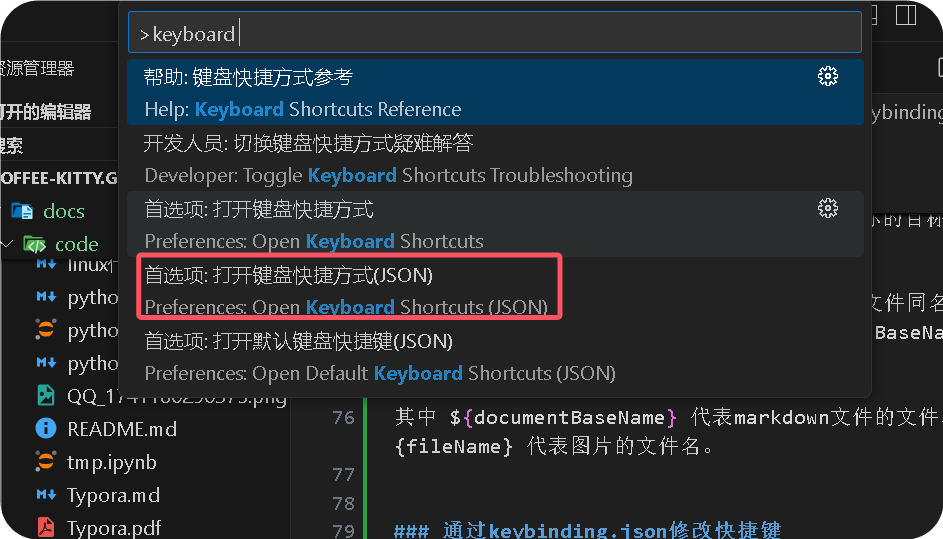

<!--
 * @Author: coffeecat
 * @Date: 2024-12-03 13:09:07
 * @LastEditors: Do not edit
 * @LastEditTime: 2025-03-22 21:18:49
-->
# vscode skill
## vscode插件配置

### jetbrains快捷键拓展


### markdown导出pdf(带目录)
下载安装markdown插件 Markdown All in One (方便编写)和 Markdown Preview Enhanced (提供导出功能
此时导出pdf不带目录

因为需要导出带有书签的pdf 所以这里我们 需要使用 Prince(可以将html导出pdf)
https://www.princexml.com/download/16/
最后注意配置环境变量
将Prince安装目录下的engine\bin对应的路径复制下来，新建到系统变量的Path路径下，我的路径是：
F:\Program Files\Prince\engine\bin
最后：
重启vscode即可，pdf默认生成路径为markdown文本对应的路径下
### 自动给文章加上编辑时间作者
https://blog.csdn.net/wj624/article/details/126777682
安装插件我使用的是 korofileheader
点击设置图标—设置—输入"@ext:obkoro1.korofileheader"—点击"在setting.json中编辑"

```json
"fileheader.customMade": {
        "Author": "tom",
        "Date": "Do not edit", // 文件创建时间
        "LastEditors": "Do not edit", // 最后编辑文件的人
        "LastEditTime": "Do not edit", // 文件最后编辑时间
        "FilePath": "Do not edit", // 文件在项目中的相对路径 自动更新
    },
    "fileheader.cursorMode": {}, //函数注释

```
生成头部注释的快捷键：ctrl + win + i
<!--
 * @Author: coffeecat
 * @Date: 2024-12-03 13:09:07
 * @LastEditors: Do not edit
 * @LastEditTime: 2025-03-05 21:18:53
-->

生成函数注释的快捷键：ctrl + win + t

/**
 * @description: 
 * @return {*}
 */
def a():
    return 123


## vscode设置
### 设置文本超出屏幕自动换行
1. 打开左下角的设置图标
2. 点设置
3. Editor: Word Wrap 搜索这个
4. 设为on将在视口宽度换行，设为off则永不自动换行

### 设置粘贴图片自动适配路径

https://www.cnblogs.com/xbotter/p/17528063.html

1. 打开设置界面,在搜索框中输入markdown.copy, 找到Markdown> Copy Files:Destination

2. 新增配置项 key 为 **/*.md , value 为 你的目标路径。

比如我想将图片放在 assets 目录下 markdown文件同名的目录下，那么我就可以设置为 assets/${documentBaseName}/${fileName}， 

其中 ${documentBaseName} 代表markdown文件的文件名，${fileName} 代表图片的文件名。

<!-- 
### 通过keybinding.json修改快捷键

1. 开命令面板：按下 Ctrl+Shift+P （Windows/Linux）或 Command+Shift+P （Mac）打开命令面板。

2. 搜索并打开首选项: 打开键盘快捷方式：)
   在命令面板中输入 >首选项: 打开键盘快捷方式 并选择相应的选项，这会打开 keybindings.json 文件，在这里配置快捷键。


3. 编写自定义命令脚本：
打开 keybindings.json 文件后，在文件中添加以下内容（如果文件为空，直接添加；如果已有内容，添加在合适的位置，通常在数组中）：
```json
{
    "command": "extension.wrapWithAsterisks",
    "args": {
        "text": "**",
        "action": "surround"
    },
    "when": "editorTextFocus",
    "key": "ctrl+r"
}
```
第一个 keybindings 项将 Ctrl+C 绑定到名为 extension.wrapWithAsterisks 的命令，并且限定在编辑器有文本焦点时生效。第二个 keybindings 项定义了 extension.wrapWithAsterisks 命令的具体行为，即使用 ** 包围选中的文本。


4. 保存 keybindings.json 文件：保存文件后，配置就生效了。此时在 VS Code 编辑器中选中一段文本，按下 Ctrl+C ，选中的文本就会被 ** 包围。 -->


## vscode调试小技巧

1. cwd
cd 到指定路径作为执行的根路径

2. "justMyCode": false
调试过程中要能够 step into 到源代码里去

```json

{
    "name": "Python Debugger: Current File",
    "type": "debugpy",
    "request": "launch",
    "program": "${file}",
    "console": "integratedTerminal",
    "cwd": "/workspace/xsc_workspace/OpenManus", // cd 到指定路径作为执行的根路径
    "justMyCode": false, // 调试过程中要能够 step into 到源代码里去
}
```


