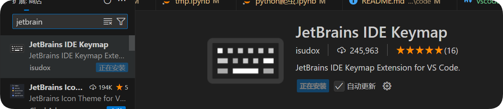
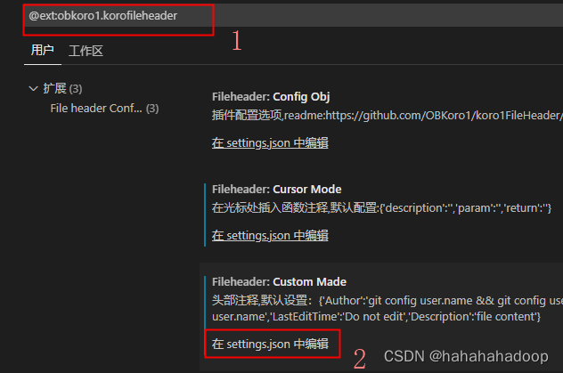

<!--
 * @Author: coffeecat
 * @Date: 2024-12-03 13:09:07
 * @LastEditors: Do not edit
 * @LastEditTime: 2025-03-10 16:47:35
-->
# vscode skill
## vscode插件配置

### jetbrains快捷键拓展


### markdown导出pdf(带目录)
下载安装markdown插件 Markdown All in One (方便编写)和 Markdown Preview Enhanced (提供导出功能
此时导出pdf不带目录

因为需要导出带有书签的pdf 所以这里我们 需要使用 Prince(可以将html导出pdf)
https://www.princexml.com/download/16/
最后注意配置环境变量
将Prince安装目录下的engine\bin对应的路径复制下来，新建到系统变量的Path路径下，我的路径是：
F:\Program Files\Prince\engine\bin
最后：
重启vscode即可，pdf默认生成路径为markdown文本对应的路径下
### 自动给文章加上编辑时间作者
https://blog.csdn.net/wj624/article/details/126777682
安装插件我使用的是 korofileheader
点击设置图标—设置—输入"@ext:obkoro1.korofileheader"—点击"在setting.json中编辑"

```json
"fileheader.customMade": {
        "Author": "tom",
        "Date": "Do not edit", // 文件创建时间
        "LastEditors": "Do not edit", // 最后编辑文件的人
        "LastEditTime": "Do not edit", // 文件最后编辑时间
        "FilePath": "Do not edit", // 文件在项目中的相对路径 自动更新
    },
    "fileheader.cursorMode": {}, //函数注释

```
生成头部注释的快捷键：ctrl + win + i
<!--
 * @Author: coffeecat
 * @Date: 2024-12-03 13:09:07
 * @LastEditors: Do not edit
 * @LastEditTime: 2025-03-05 21:18:53
-->

生成函数注释的快捷键：ctrl + win + t

/**
 * @description: 
 * @return {*}
 */
def a():
    return 123


## vscode调试小技巧

1. cwd
cd 到指定路径作为执行的根路径

2. "justMyCode": false
调试过程中要能够 step into 到源代码里去

```json

{
    "name": "Python Debugger: Current File",
    "type": "debugpy",
    "request": "launch",
    "program": "${file}",
    "console": "integratedTerminal",
    "cwd": "/workspace/xsc_workspace/OpenManus", // cd 到指定路径作为执行的根路径
    "justMyCode": false, // 调试过程中要能够 step into 到源代码里去
}
```