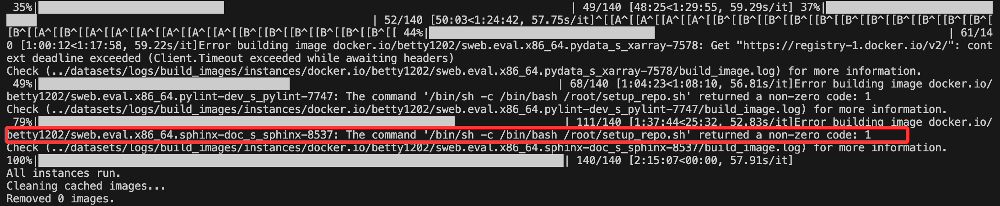

1.跑通了SWE-Perf的evaluation，但是有些commit没有构建成功

2.初步阅读了 PEACE: Towards Efficient Project-Level Efficiency  Optimization via Hybrid Code Editing

想法：

1.规则也需要从内外部两个来源获取
2.需要查看下PEACEXEC数据集，跟SWE-Perf很像，但是提供了history commit

