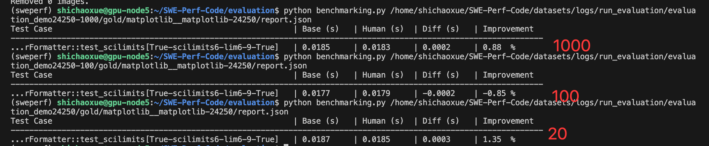

0. 完成一个机器学习课程结课报告
经历了找不到文件-》回宿舍老电脑找-〉在notion找到-》稍微修改
ok

1. 今天把matplotlib__matplotlib-24250和23712给整成
    一个证明该数据集有问题
        有些许进展

    这应该足以证明24250不行。
            计划下一步 可以据此 推出SWE-Perf-Verified 版本

        还发现了另一件事，一个diff诸如 23712 可能它这里对应了很多test，但是实际运行的时候，只有1个test有明显提升
            这个test也应该据此再筛选一下？

    一个跑一个profiler全流程尝试。这种import gc优化的
        也可以在sympy上先试试这种profiler优化的

    虽然历史有很多优化策略，但是历史代码受限于局限性，可能并不是最优优化，因此这里可以引入llm判别下

2. 阅读欢哥论文，完成欢哥那个bibtex替换的，是否需要补充收集论文等。
    添加bibtex
    
    补充收集unit llm efficiency
    bench 思考时间长短的， 思考模式转换的（1，2）

    

学习时候好好学，玩的时候开心玩！
