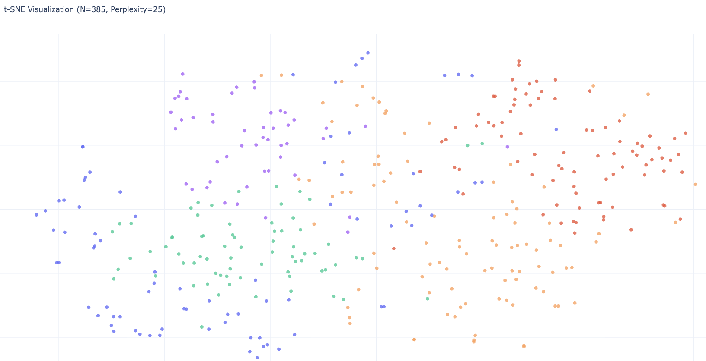
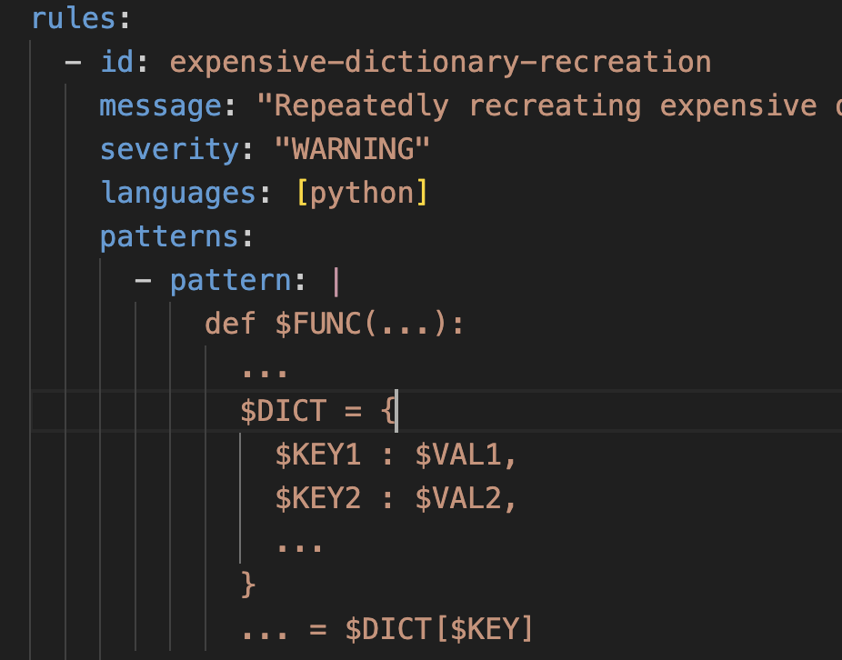

1. **明确任务**  
    给定 test作为输入，然后设计方法定位和优化callee函数，对这个test的目标做性能优化

    **与SWE-Perf的区别**  
    为了不跟agentless比， 与SWE-Perf有细微的差别，

    SWE-Perf任务   
    1.oracle模式下会给出真实优化的函数名，  
    2.realistic模式下会给出 所以被test call的函数当做 待优化序列
      
    区别即：直接给定test
     
    需要的数据集是，给定test，然后提交新commit后，跟之前速度有较明显提升。选择改造SWE-Perf为新数据集

2. **基于SWE-Perf构建新数据集** 

    **理由1**： 
    诸如数据 matplotlib__matplotlib-24250
    跑20次pytest有优化，但是这里跑1000次后，就基本不优化了   
      
    **理由2**：
    对于一条matplotlib__matplotlib-23712，它的test函数有13个，但真正有明显优化的只有1个（稳定的从0.26秒->0.23秒）  
    **将采取的做法**：
    1. 再跑多次，然后筛选出 稳定的speed up 5% 以上的test  
    2. 考虑引入 基于cpu指令数的efficient@k指标

**了解到hpc方面的一些论文，想了个大致优化方向：profiler，然后合理地写cython以及开启openmp并行来优化**

3. **规则**：一种RAG插件

    将给385个commit生成规则，并进行匹配，

    **存在两个问题：**
        1是ds生成的规则本身不好，2是运行巨慢  
        
    **尝试解决：**  
        1.ds开enable—thinking  
        2.用t-sne可视化后，发现熊老师论文中的聚类方法DBScan不是很合适，转用KNN聚类，聚6类（silhouette_score最高），每个簇大概60左右rule，每个簇抽取6个rule，最后得到36个 
    <!--  -->
    

    **效果：**
            匹配到了4个rule
    
    <!--  -->
    但是效果就还是一般   
**考虑到可能是规则太少的问题，后续计划收集更多规则**

4. 跟师兄做 test agent system as software

    看了两篇综述
    收集了约30篇论文，填到那个表里  
    
    **目前状况是：** 跟欢哥讨论后，对unit llm的bench有了更深理解，梳理的还行，不过
    问题是integration llm部分搜集论文还较少

