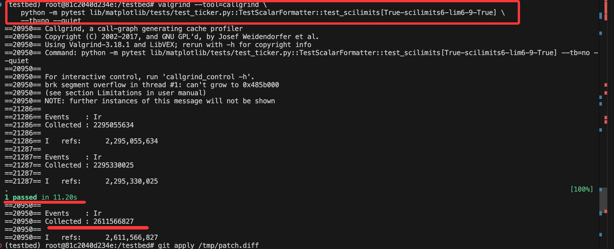

1. 筛出数据


天塌了。。
先用cirron无法测量，
然后valgrind （Valgrind 是运行在Linux 上的多用途代码剖析和内存调试软件。主要包括Memcheck、Callgrind、Cachegrind 等工具，每个工具都能完成一项任务调试、检测或分析。可以检测内存泄露、线程违例和Cache 的使用等。Valgrind 基于仿真方式对程序进行调试，它先于应用程序获取实际处理器的控制权，并在实际处理器的基础上仿真一个虚拟处理器，并使应用程序运行于这个虚拟处理器之上，从而对应用程序的运行进行监视。）



问题是 **居然有波动**

再经历一番波折，配置perf进行测量，perf是基于硬件指令计数器搞的
docker容器内还无法安装，这里通过link方式，映射使用宿主机的perf

``` bash
#启动容器
docker run \
  --privileged \
  --pid=host \
  --security-opt seccomp=unconfined \
  -v /usr/lib/linux-tools/5.4.0-100-generic/perf:/usr/bin/perf \
  -v /lib/modules:/lib/modules:ro \
  -v /sys:/sys \
  -it sweb.eval.x86_64.matplotlib__matplotlib-23712

#容器内还有安装必要依赖
apt update
apt install -y \
  libdw1 \
  libelf1 \
  libunwind8 \
  libnuma1 \
  zlib1g \
  libslang2

#然后perf运行成功
perf --version
perf stat ls
```

**还是有很大波动**
```bash
root@443a27a73ded:/testbed#   
for i in {1..20}; 
do
  perf stat -e instructions:u python -m pytest -W ignore::DeprecationWarning \
  lib/matplotlib/tests/test_colorbar.py::test_proportional_colorbars[png] \
  --tb=no --quiet 2>&1 | grep "instructions:u"
done
```

``` shell
  13936464545      instructions:u
  14989323021      instructions:u
  14586400671      instructions:u
  15096101878      instructions:u
  15026383400      instructions:u
  14737846087      instructions:u
  14502256028      instructions:u
  14809940472      instructions:u
  14879523926      instructions:u
  14921103462      instructions:u
  15041003472      instructions:u
  14841302747      instructions:u
  14627021507      instructions:u
  14758841210      instructions:u
  14674785560      instructions:u
  14800577391      instructions:u
  14693489337      instructions:u
  14687602531      instructions:u
  14669177799      instructions:u
  14597758539      instructions:u
# 注意前三次需要给删掉，发现总是最开始运行时，不稳定，三次后差不多可以
```
# 问题？
如果cpu指令数也有这么多波动的话，把原来基于时间的测量更改到cpu指令数上还有意义吗??


## 关于原数据的思考
1. PR爬取：  从SWE-Bench的12个repo爬取PR，保留 解决了**一个issue**的PR。
2. 识别性能提升PR：  
    * 为每个codebase配置**docker**环境，使用**pytest**统计**所有unit test** runtime。
        每个docker使用一个cpu core、16GB memory。 每格unit test重复运行3次。
    * **filter criteria** 
        1）correct and **ratio** < 0.3 ， **这个ratio很奇怪🤔**
        2）挑选unit test，test的程序执行流必须经过patch
3. 验证unit test性能提升：
    *  warm-up 3次
    *  执行**20🤔**次重复的pytest测量
    *  **过滤离群值🤔！**： 使用阈值乘数为1的IQR四分位距方法。
            过程为： 假设排序后数组 a1,a2,a3,......,a20
            则Q1: a5、a6的平均值  Q3:a15、a16的平均值
            取IQR= Q3-Q1
            然后过滤掉  小于Q1-IQR,大于Q3+IQR 的数据，这些数据即离群点
    *   计算统计意义上最小性能增益

        假设A为original code的runtimes，B为modified code runtimes
        
        不断的人为使得B变慢，每次乘以(1-x),x每步加0.01，减少百分之1的性能，看B是否仍然比A快，统计意义上 MannWhitneyUTest，p值这里取0.1

        最终最大的符合要求x，即为目标值。  过滤掉提升不足5%的数据。


还有俩问题：
1. 他用自己历史数据当作 human_performance,这不同机子，也不一样呀
2. 写了个脚本过滤有明显性能提升的，这用跟他一样的方法，23712，也就一个test满足啊。。
    不会把这些test的和一起算了吧！！！😢


