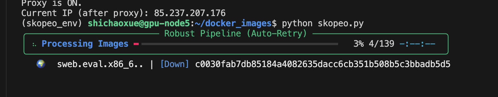
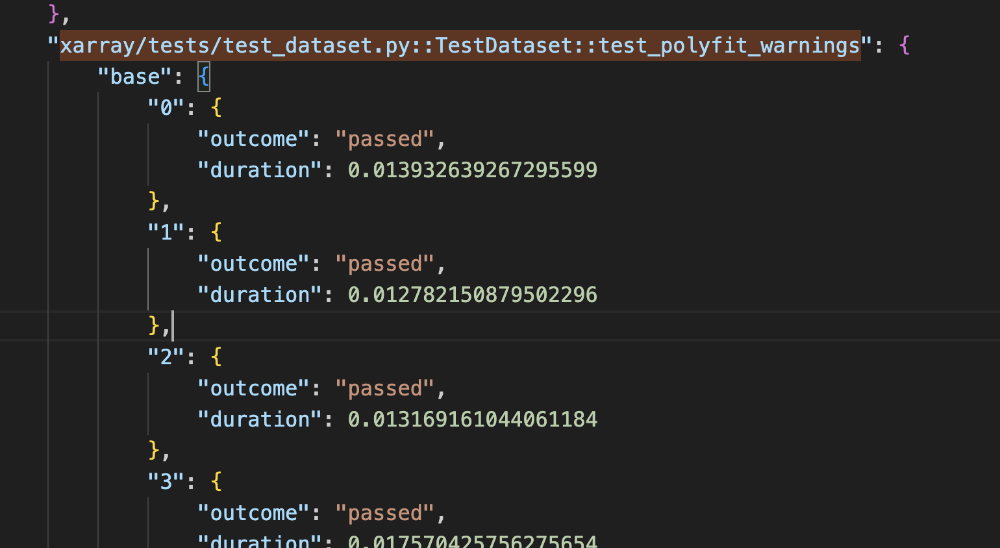
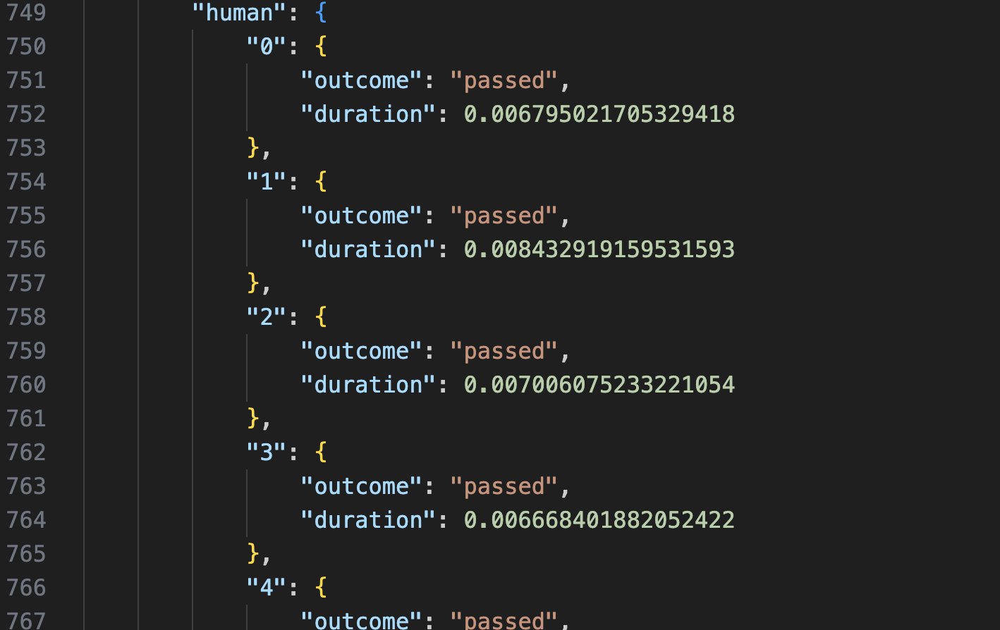
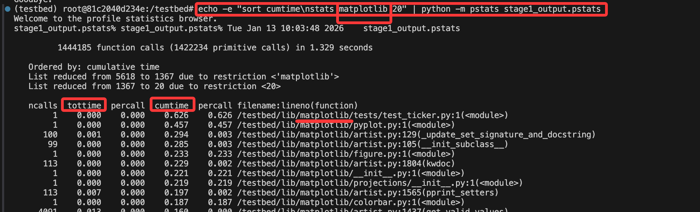
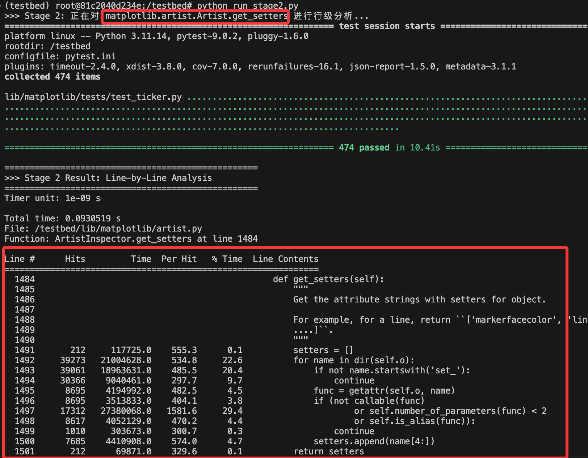

1. 硬着头皮筛数据

    今天的进展：
        1.1 
        发现之前 成功运行132条数据，8个没构建出来那次，都是基于远程下载的docker镜像进行操作的
        
        也就是说本地构建这么多镜像其实没用，只是增进了代码的理解
            理解：constants.py将url，安装包什么的都搞一个dict存储，然后make_test进行包装，给出各种script，接着docker_build、dockerfiles,docker_util是对docker的包装以及对上述script进行三层架构的镜像构造: sweb.base、env、instance，接下来对运行时检测下instance然后build一个container进行pytest测量
            
            筛出的数据就是都是基于pytest测量的。

        1.2 发现之前把所有 形如 betty关键字的images删掉 属实是错误了
```bash
(sweperf) shichaoxue@gpu-node5:~/SWE-Perf-Code/evaluation$ docker images | grep betty
betty1202/sweb.eval.x86_64.sympy_s_sympy-25852                                         latest                           846abd09428e   2 weeks ago     2.81GB
```
        自己重头构建，跑了一晚上就构建了2，3个，而且还是无法构建，这里后来下载betty的时候找到了问题

        这里包括之前docker构建的很慢的原因都是：
            docker daemon它是单独的开启代理配置！！！之前重新构建8个数据时，一个conda下载甚至要4个小时😭
        因为又没有root权限，所以这里采用skeope工具进行下载，写了个脚本基本逻辑是下载tar再导入docker

        


        1.3 简单用昨天的脚本看，这些数据（132条数据）是否有明显提升
            脚本逻辑： 接着沿用IQR、最小性能增益方法，即论文方法筛选，结果如下：

```bash
Thresholds: [0.05, 0.1]
Min improvement: 0.05%
================================================================================
Found 132 report.json files
......
Filtered results: 508 / 890 tests meet minimum improvement threshold
Results saved to 132dataanalyse.csv
================================================================================
Statistics:
Total tests analyzed: 890
Tests with improvement: 517
Average improvement: 3.40%
Median improvement: 0.67%
Tests meeting 5.0% threshold: 235 (26.4%)
Tests meeting 10.0% threshold: 143 (16.1%)
```
        总共有508个test是满足的，也就是剩下890-508条不行，  
**这里论文中明明说的就是test，怎么这里不像是呢🤔**


#todo 这里还需要做的就是，把所有140个instance下载完毕，然后跑一下还是论文逻辑20次，然后用脚本筛出提升幅度达到5%的test， 基本过滤就做完了
#todo 然后需要根据昨天的 perf测量，引入这个所谓的更稳定的指标，再筛一遍
#todo 最后还需要关掉代码中的超时300s，然后交替运行1000次这种，再稳定下时间基准，再筛一遍
上面三步做完，数据就算筛选完毕了

```bash
#就基于这20次运行，然后进行的划分
[1129 rows x 10 columns]

=== low === <0.05 甚至是负数

[9 rows x 10 columns]

=== medium === 0.05< <0.5

[69 rows x 10 columns]

=== high === 0.5< <0.8
                                  
[35 rows x 10 columns]

=== super === 0.8< <1

[11 rows x 10 columns]
```


2. 跑一条数据，想方法idea

先选一个较好的数据
挑选

pydata__xarray-9766
xarray/tests/test_dataset.py::TestDataset::test_polyfit_warnings



**一个很奇怪的观察🤔！**
明明上边这条数据显示是有提升的，但是我自己在docker容器中进行
pytest -rA --durations=0 --disable-warnings --tb=no --continue-on-collection-errors -vv --json-report --json-report-file=report.json  xarray/tests/test_dataset.py::TestDataset::test_polyfit_output

git apply /tmp/patch.diff

pytest -rA --durations=0 --disable-warnings --tb=no --continue-on-collection-errors -vv --json-report --json-report-file=report.json  xarray/tests/test_dataset.py::TestDataset::test_polyfit_output

却基本不怎么提升(都在0.26s附件徘徊)，然而呢

当我把test改为 stressful test
```python
#ds = create_test_data(seed=1)
ds = create_test_data(seed=1,dim_sizes=(20,2000,20))
#原本的默认dim_sizes是(8,9,10)
```
然后这个diff就有大幅度提升了(0.9s -> 0.3s)

#todo 需要讨论下，或许我需要做一个 压力测试版的sweperf...

#todo 关于方法的思考
1.两阶段定位
先用cProfile看出各个函数的整体调用情况

在用line_profiler插桩针对上面topk寻找是那一行的问题



3. 接着写 unit llm部分

3.1 阅读欢哥推荐的 https://www.anthropic.com/engineering/demystifying-evals-for-ai-agents


emm，一份model and agent harness的评估重要性、以及基本评估要素 的报告


