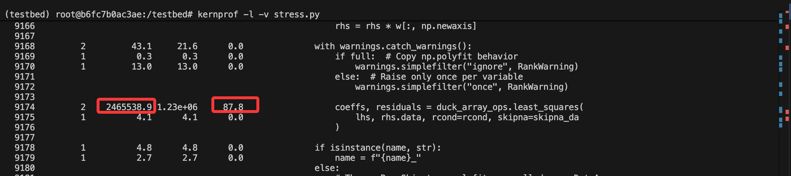
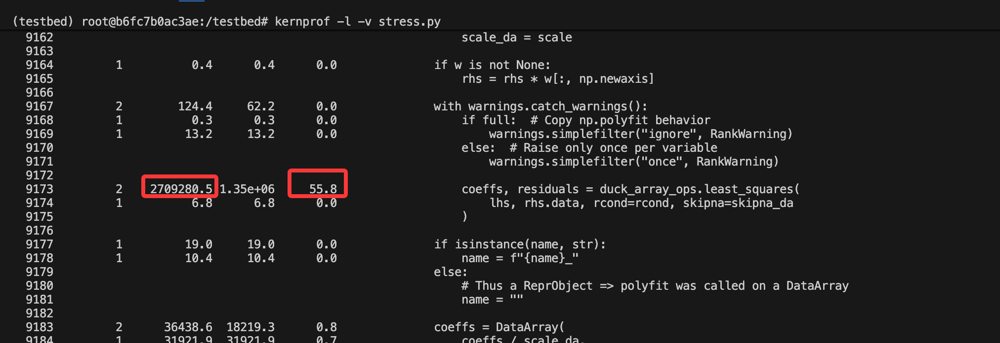
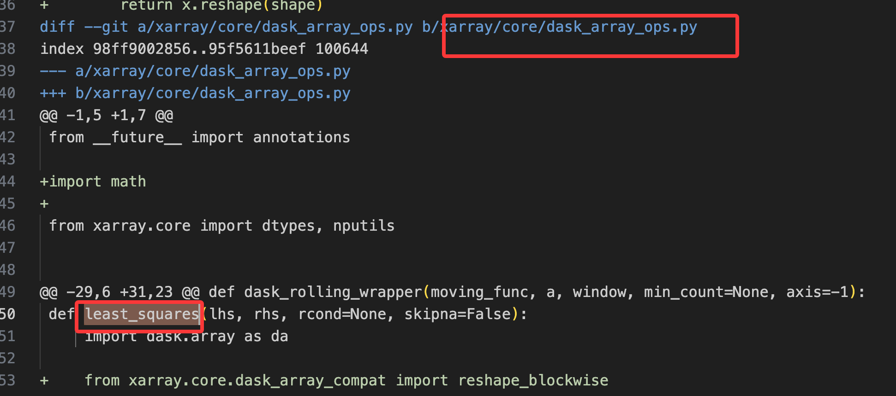
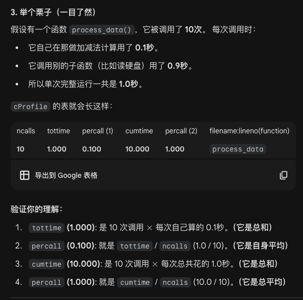

1. 140个instance images下载完毕

1.1 鉴于昨天时间不准的问题，这里再次运行一次，
发现有两个instance居然没有运行成功。。在test_spe.py中添加如下代码后成功运行
```python
# sphinx-doc__sphinx-6422这个环境冲突 需要'pip install "docutils<0.18"'或者'pip install roman'才能成功运行pytest
# sphinx-doc__sphinx-8537这个 则需要pip install roman才能成功运行
if instance['instance_id'] in {'sphinx-doc__sphinx-6422','sphinx-doc__sphinx-8537'}:
    tmp = 'pip install roman'
```

1.2 然后先运行自带的check_evaluation  
（该文件中human improved可以忽略，因为它是读取sweperf数据集中的durations来充当人类表现，不是现运行的， 此外，还是那个问题 由于时间均是零点几秒，这导致 它自己自带的durations中也是非常有问题 即(**fast_code也不是稳定的超过slow_code**）   
这里也发现这个IQR还存在一个数据也不去除的情况，比如0.23,0.24,0.25这种，归因于数据其实比较稳定了

```bash
# 下面的Human efficiency improved 就是它自带的了（在它的机子上运行的gold）
# Model efficiency improved是根据我们这次直接运行它这个gold数据得到的
# 观察可以发现：下面这三个仓库整体是很不准的，（这归因于 仓库的每个instance最多波动0.2s左右，然后合起来这几个整体上表现的也有较大波动）
#
#[astropy/astropy]
#Model efficiency improved: 0.01315972222222223
#Human efficiency improved: 0.050958333333333376
#
#[mwaskom/seaborn]
#Model efficiency improved: 0.0958333333333334
#Human efficiency improved: 0.1580000000000001
#
#[scikit-learn/scikit-learn]
#Model efficiency improved: 0.01471808976613665
#Human efficiency improved: 0.03245069617882121


(sweperf) shichaoxue@gpu-node5:~/SWE-Perf-Code/evaluation$ python -m check_evaluation     --dataset_dir  ~/resource/SWE-Perf/data     --log_root "../datasets/logs/run_evaluation/filter_10/gold/"     --output_path "../datasets/outputs/filter_10.csv"
================================
../datasets/logs/run_evaluation/filter_10/gold/
[total]
There are 140 data, 0 without prediction and 140 with prediction. 
There are 0.0 (0/140) failed patch, 1.0 (140/140) success patch
There are 0.007142857142857143 (1/140) failed run, 0.9928571428571429 (139/140) success run
Model efficiency improved: 0.09494535988123923
Human efficiency improved: 0.10738354148013694
Human total efficiency improved: 0.10851925576585122
================================
../datasets/logs/run_evaluation/filter_10/gold/
[astropy/astropy]
There are 12 data, 0 without prediction and 12 with prediction. 
There are 0.0 (0/12) failed patch, 1.0 (12/12) success patch
There are 0.0 (0/12) failed run, 1.0 (12/12) success run
Model efficiency improved: 0.01315972222222223
Human efficiency improved: 0.050958333333333376
Human total efficiency improved: 0.050958333333333376
================================
../datasets/logs/run_evaluation/filter_10/gold/
[matplotlib/matplotlib]
There are 3 data, 0 without prediction and 3 with prediction. 
There are 0.0 (0/3) failed patch, 1.0 (3/3) success patch
There are 0.0 (0/3) failed run, 1.0 (3/3) success run
Model efficiency improved: 0.019724358974358987
Human efficiency improved: 0.02169871794871796
Human total efficiency improved: 0.02169871794871796
================================
../datasets/logs/run_evaluation/filter_10/gold/
[mwaskom/seaborn]
There are 6 data, 0 without prediction and 6 with prediction. 
There are 0.0 (0/6) failed patch, 1.0 (6/6) success patch
There are 0.0 (0/6) failed run, 1.0 (6/6) success run
Model efficiency improved: 0.0958333333333334
Human efficiency improved: 0.1580000000000001
Human total efficiency improved: 0.1580000000000001
================================
../datasets/logs/run_evaluation/filter_10/gold/
[psf/requests]
There are 2 data, 0 without prediction and 2 with prediction. 
There are 0.0 (0/2) failed patch, 1.0 (2/2) success patch
There are 0.0 (0/2) failed run, 1.0 (2/2) success run
Model efficiency improved: 0.0
Human efficiency improved: 0.023500000000000017
Human total efficiency improved: 0.023500000000000017
================================
../datasets/logs/run_evaluation/filter_10/gold/
[pydata/xarray]
There are 54 data, 0 without prediction and 54 with prediction. 
There are 0.0 (0/54) failed patch, 1.0 (54/54) success patch
There are 0.0 (0/54) failed run, 1.0 (54/54) success run
Model efficiency improved: 0.07202463388316355
Human efficiency improved: 0.07388186869341233
Human total efficiency improved: 0.07388186869341233
================================
../datasets/logs/run_evaluation/filter_10/gold/
[pylint-dev/pylint]
There are 3 data, 0 without prediction and 3 with prediction. 
There are 0.0 (0/3) failed patch, 1.0 (3/3) success patch
There are 0.0 (0/3) failed run, 1.0 (3/3) success run
Model efficiency improved: 0.3905653153153155
Human efficiency improved: 0.399130630630631
Human total efficiency improved: 0.399130630630631
================================
../datasets/logs/run_evaluation/filter_10/gold/
[scikit-learn/scikit-learn]
There are 32 data, 0 without prediction and 32 with prediction. 
There are 0.0 (0/32) failed patch, 1.0 (32/32) success patch
There are 0.0 (0/32) failed run, 1.0 (32/32) success run
Model efficiency improved: 0.01471808976613665
Human efficiency improved: 0.03245069617882121
Human total efficiency improved: 0.03245069617882121
================================
../datasets/logs/run_evaluation/filter_10/gold/
[sphinx-doc/sphinx]
There are 8 data, 0 without prediction and 8 with prediction. 
There are 0.0 (0/8) failed patch, 1.0 (8/8) success patch
There are 0.125 (1/8) failed run, 0.875 (7/8) success run
Model efficiency improved: 0.09392559523809531
Human efficiency improved: 0.09760575396825401
Human total efficiency improved: 0.11748075396825403
================================
../datasets/logs/run_evaluation/filter_10/gold/
[sympy/sympy]
There are 20 data, 0 without prediction and 20 with prediction. 
There are 0.0 (0/20) failed patch, 1.0 (20/20) success patch
There are 0.0 (0/20) failed run, 1.0 (20/20) success run
Model efficiency improved: 0.3108425414862917
Human efficiency improved: 0.3177909271284273
Human total efficiency improved: 0.3177909271284273
```

然后运行昨天的脚本，查看自己运行的base、human—patch的整体情况
Statistics:
Total tests analyzed: 1129
Tests with improvement: 805
Average improvement: 12.13%
Median improvement: 3.05%
Tests meeting 5.0% threshold: 388 (34.4%)
Tests meeting 10.0% threshold: 283 (25.1%)

这都是跑20次的结果


考虑是否要引入压力测试


2. 接着搞方法

两阶段定位 ->


好像两阶段定位不大行

直接对test的目标函数加@profiler

git apply 后


这一行也就是patch.diff的修改地方，从上述执行时间可见，在压力测试场景下，这个时间确实是减少了很多


接下来仔细观察这个diff，
发现apply_before, apply_after之间最大的差别就是
apply_before除了上图占比时间最大的，也最明显的函数，给更改了，其余占比10%什么的这里是 数据打包和拆包，也被优化了
```python
#瓶颈一：打包 (Stack) - 耗时占比 3.5%
#行号: 9155
rhs = da.transpose(true_dim, *dims_to_stack).stack(
    {stacked_dim: dims_to_stack}
)
#问题: 为了把多维数组变成 2D 矩阵，它构建了一个极其昂贵的 Pandas MultiIndex。
#2. 瓶颈二：拆包系数 (Unstack Coefficients) - 耗时占比 19.7% (最慢!)
#行号: 9190
coeffs = coeffs.unstack(stacked_dim)
#问题: 拟合算完了，为了把结果还原回原来的形状（比如从一长条还原回经纬度网格），它需要对照索引把数据填回去。这比算数据还慢。
#3. 瓶颈三：拆包残差 (Unstack Residuals) - 耗时占比 11.2%
#行号: 9201
residuals = residuals.unstack(stacked_dim)
```
上面这三行，后面就也没有了，然后是主要函数duck_array_ops.least_squares的问题


下面是压力测试下，提升貌似是稳定了
ds = create_test_data(seed=1,dim_sizes=(20000,20000,20))
```bash
(testbed) root@b6fc7b0ac3ae:/testbed# python benchmark.py 
🚀 开始运行 20 次基准测试 (Target: 'call' duration)...
------------------------------------------------------------
✅ Run 01: 41.58899s
✅ Run 02: 39.53917s
✅ Run 03: 41.62247s
✅ Run 04: 39.63856s
✅ Run 05: 41.22714s
✅ Run 06: 40.78226s
✅ Run 07: 40.70827s
✅ Run 08: 41.91694s
✅ Run 09: 40.21519s
✅ Run 10: 40.74051s
✅ Run 11: 41.03153s
✅ Run 12: 40.96808s
✅ Run 13: 40.11355s
✅ Run 14: 42.89070s
✅ Run 15: 39.67621s
✅ Run 16: 41.38834s
✅ Run 17: 40.33784s
✅ Run 18: 39.51780s
✅ Run 19: 39.58323s
✅ Run 20: 41.45342s
------------------------------------------------------------
📊 统计结果 (20 runs):
   平均耗时 (Mean):   40.74701 s
   中位数   (Median): 40.76138 s
   最快     (Min):    39.51780 s
   最慢     (Max):    42.89070 s
   标准差   (StdDev): 0.92520 s
------------------------------------------------------------
(testbed) root@b6fc7b0ac3ae:/testbed# git status
HEAD detached at 91962d6a
Changes not staged for commit:
  (use "git add <file>..." to update what will be committed)
  (use "git restore <file>..." to discard changes in working directory)
        modified:   xarray/core/dask_array_ops.py
        modified:   xarray/core/dataset.py
        modified:   xarray/tests/test_dataset.py

Untracked files:
  (use "git add <file>..." to include in what will be committed)
        benchmark.py
        output.pstats
        report.json
        stress.py
        stress.py.lprof

no changes added to commit (use "git add" and/or "git commit -a")
(testbed) root@b6fc7b0ac3ae:/testbed# git apply /tmp/patch.diff 
(testbed) root@b6fc7b0ac3ae:/testbed# git status
HEAD detached at 91962d6a
Changes not staged for commit:
  (use "git add <file>..." to update what will be committed)
  (use "git restore <file>..." to discard changes in working directory)
        modified:   doc/whats-new.rst
        modified:   xarray/core/dask_array_ops.py
        modified:   xarray/core/dataset.py
        modified:   xarray/core/nputils.py
        modified:   xarray/tests/test_dataset.py

Untracked files:
  (use "git add <file>..." to include in what will be committed)
        benchmark.py
        output.pstats
        report.json
        stress.py
        stress.py.lprof
        xarray/core/dask_array_compat.py

no changes added to commit (use "git add" and/or "git commit -a")
(testbed) root@b6fc7b0ac3ae:/testbed# python benchmark.py 
🚀 开始运行 20 次基准测试 (Target: 'call' duration)...
------------------------------------------------------------
✅ Run 01: 42.36388s
✅ Run 02: 39.72165s
✅ Run 03: 39.81755s
✅ Run 04: 40.14738s
✅ Run 05: 40.24830s
✅ Run 06: 40.38358s
✅ Run 07: 39.63321s
✅ Run 08: 39.67120s
✅ Run 09: 41.09654s
✅ Run 10: 39.17425s
✅ Run 11: 40.19162s
✅ Run 12: 39.61738s
✅ Run 13: 39.46703s
✅ Run 14: 40.10980s
✅ Run 15: 40.93446s
✅ Run 16: 39.20351s
✅ Run 17: 40.05205s
✅ Run 18: 39.67952s
✅ Run 19: 40.58586s
✅ Run 20: 40.02977s
------------------------------------------------------------
📊 统计结果 (20 runs):
   平均耗时 (Mean):   40.10643 s
   中位数   (Median): 40.04091 s
   最快     (Min):    39.17425 s
   最慢     (Max):    42.36388 s
   标准差   (StdDev): 0.73506 s

```


cProfiler

percalls
tottime (Total Time - 自身耗时):

    定义: 函数自身逻辑执行所花费的时间（不包含它调用的子函数的时间）。

    含义: 如果一个函数的 tottime 很高，说明这个函数内部有复杂的循环、大量的计算或者低效的逻辑。

    对应场景: 纯计算函数，如矩阵乘法、复杂的数学公式计算。

cumtime (Cumulative Time - 累计耗时):

    定义: 函数从开始调用到结束返回的总时间（包含它调用的所有子函数的时间）。

    含义: 如果一个函数的 cumtime 很高，但 tottime 很低，说明它是一个管理者（Manager）。它自己干活很少，但它调用的“下属”（子函数）很慢。

    对应场景: 顶层 API（如 polyfit），它负责调度数据准备、调用计算库（Numpy/Pandas）、重组结果。

注意：tottime和cumtime是否算上了 这个函数ncalls次数的总时间



## 一个基本方法

1. 混合line_profiler与cProfiler定位，采集运行时信息

2. 节点角色分类 与 定位

manager：注意负责流程控制。 cumtime高，tottime低
worker：执行具体数学运算、逻辑判断等
boundary：调用第三方api

或者说瓶颈分类：
totime单独高，很可能是计算瓶颈
cumtime单独高，IO瓶颈
两者都高，混合瓶颈、内存瓶颈

3. 收集topk耗时部分

4. 针对性策略增强

5. 迭代式回归验证，  语义不变，性能提高


