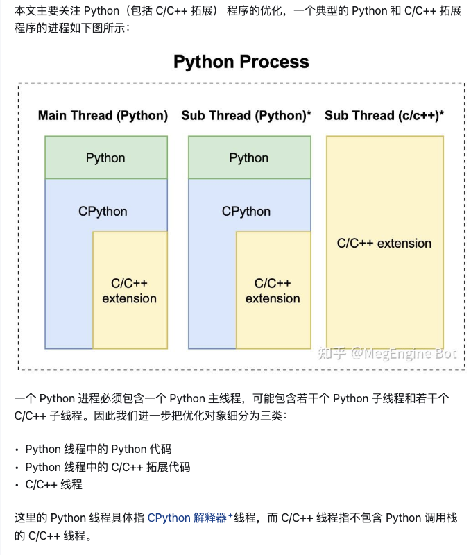
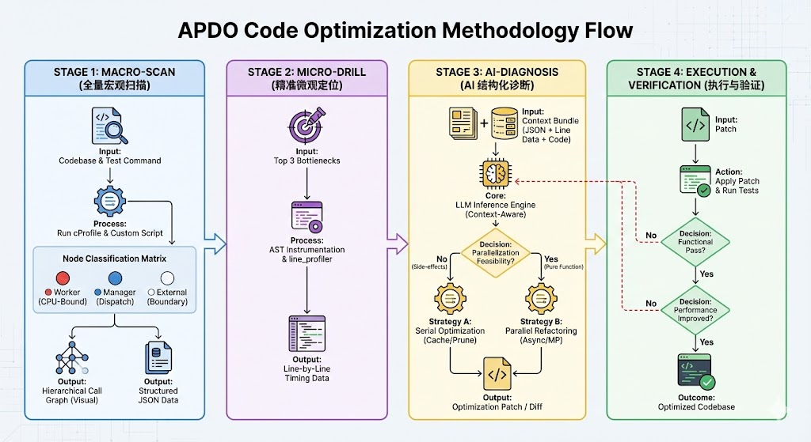

1. 今天再挑一个更好的例子，尝试接着完善方法

sphinx-doc__sphinx-8537
tests/test_ext_autodoc.py::test_autodoc_ignore_module_all
0.8822847245545644,
0.0435421424001106,        

```python
@pytest.mark.sphinx('html', testroot='ext-autodoc')
def test_autodoc_ignore_module_all(app):
    # default (no-ignore-module-all)
    options = {"members": None}
    actual = do_autodoc(app, 'module', 'target', options)
    assert list(filter(lambda l: 'class::' in l, actual)) == [
        '.. py:class:: Class(arg)',
    ]

    # ignore-module-all
    options = {"members": None,
               "ignore-module-all": None}
    actual = do_autodoc(app, 'module', 'target', options)
    assert list(filter(lambda l: 'class::' in l, actual)) == [
        '.. py:class:: Class(arg)',
        '.. py:class:: CustomDict',
        '.. py:class:: InnerChild()',
        '.. py:class:: InstAttCls()',
        '.. py:class:: Outer()',
        '   .. py:class:: Outer.Inner()',
        '.. py:class:: StrRepr'
    ]
```

``` bash
(testbed) root@b3433c970001:/testbed# perf stat -e instructions:u  pytest -rA --durations=0 --disable-warnings --tb=no  tests/test_ext_autodoc.py::test_autodoc_ignore_module_all | grep "instructions:u"

 Performance counter stats for 'pytest -rA --durations=0 --disable-warnings --tb=no tests/test_ext_autodoc.py::test_autodoc_ignore_module_all':

     2,705,971,007      instructions:u                                              

       0.671944930 seconds time elapsed

       0.610448000 seconds user
       0.061628000 seconds sys


(testbed) root@b3433c970001:/testbed# git apply -R patch.diff 

(testbed) root@b3433c970001:/testbed# perf stat -e instructions:u  pytest -rA --durations=0 --disable-warnings --tb=no  tests/test_ext_autodoc.py::test_autodoc_ignore_module_all | grep "instructions:u"

 Performance counter stats for 'pytest -rA --durations=0 --disable-warnings --tb=no tests/test_ext_autodoc.py::test_autodoc_ignore_module_all':

     7,383,537,539      instructions:u                                              

       1.284458442 seconds time elapsed

       1.194773000 seconds user
       0.089623000 seconds sys
# 注意这里前三次 结果不稳定，这里展示的是后面较稳定的
# 至于时间， apply前大概0.83s，apply后大概0.21s
```

```python
# 同test文件内包装的文件
def do_autodoc(app, objtype, name, options=None):
    if options is None:
        options = {}
    app.env.temp_data.setdefault('docname', 'index')  # set dummy docname
    doccls = app.registry.documenters[objtype]
    docoptions = process_documenter_options(doccls, app.config, options)
    state = Mock()
    state.document.settings.tab_width = 8
    bridge = DocumenterBridge(app.env, LoggingReporter(''), docoptions, 1, state)
    documenter = doccls(bridge, name)
    documenter.generate()

    return bridge.result
```

```bash
# 使用 cProfile 运行 pytest，并将结果保存为 sphinx.pstats
# -o sphinx.pstats: 输出文件
# -m pytest ...: 正常运行测试
# 运行 pytest 并将性能数据保存为 trace.pstats
python -m cProfile -o trace.pstats -m pytest -rA --durations=0 --disable-warnings --tb=no tests/test_ext_autodoc.py::test_autodoc_ignore_module_all
```

添加line_profiler的尝试
```python
@profile
def do_autodoc(app, objtype, name, options=None):
```
```bash
(testbed) root@b3433c970001:/testbed# kernprof -l -v  pytest -rA --durations=0 --disable-warnings --tb=no tests/test_ext_autodoc.py::test_autodoc_ign
ore_module_all
Line #      Hits         Time  Per Hit   % Time  Line Contents
==============================================================
    33                                           @profile
    34                                           def do_autodoc(app, objtype, name, options=None):
    35         2          2.3      1.2      0.0      if options is None:
    36                                                   options = {}
    37         2          3.5      1.8      0.0      app.env.temp_data.setdefault('docname', 'index')  # set dummy docname
    38         2          2.1      1.0      0.0      doccls = app.registry.documenters[objtype]
    39         2         85.9     42.9      0.0      docoptions = process_documenter_options(doccls, app.config, options)
    40         2        474.0    237.0      0.0      state = Mock()
    41         2        838.7    419.4      0.0      state.document.settings.tab_width = 8
    42         2         67.4     33.7      0.0      bridge = DocumenterBridge(app.env, LoggingReporter(''), docoptions, 1, state)
    43         2         24.4     12.2      0.0      documenter = doccls(bridge, name)
    44         2    2469976.7 1.23e+06     99.9      documenter.generate()
    45                                           
    46         2          2.1      1.0      0.0      return bridge.result
```


#todo 又想到了一个问题，优化一个unit test，会不会导致其他unit test通过不了的问题？  基本解决思路是 回归测试时跑整个文件的test，而非只有这单个unit test


2. 阅读https://zhuanlan.zhihu.com/p/362575905 程序性能优化指南

2.1 user time、system time、 on-cpu time、off-cpu time、wall clock time
user time: cpu在用户态的运行时间
system time：cpu在内核态的运行时间
on-cpu time = user time + system time
off-cpu time: 程序处于睡眠、等待状态的时间：比如等待文件从磁盘加载到内存等
wall clock time = on-cpu time + off-cpu time

对于计算密集型任务：on-cpu time会很大
对于IO密集型任务：off-cpu time会占比很大

2.2 性能观测工具 profiler
按观测范围：  进程级、系统级
    进程级（线程级）只观测一个进程或线程上发生的事情
    系统级 不局限单个进程线程
按观测方法： event based（tracer）、sampling based
    event based：在一个指定的 event 集合上进行，比如进入或离开某个/某些特定的函数、分配内存、异常的抛出等事件
    sampling based：以某一个指定的频率对运行的程序的某些信息进行采样，通常情况下采样的对象是程序的调用栈

除了 profiler，我们还需要一些工具来对 profiling 的结果进行可视化来分析性能瓶颈。与 profiler 不同的是，可视化工具一般具有较强通用性，一种广泛使用的工具是火焰图 (flamegraph)，

除此之外还会介绍一个火焰图的改进版工具：speedscope。




## 基本方法图baseline


