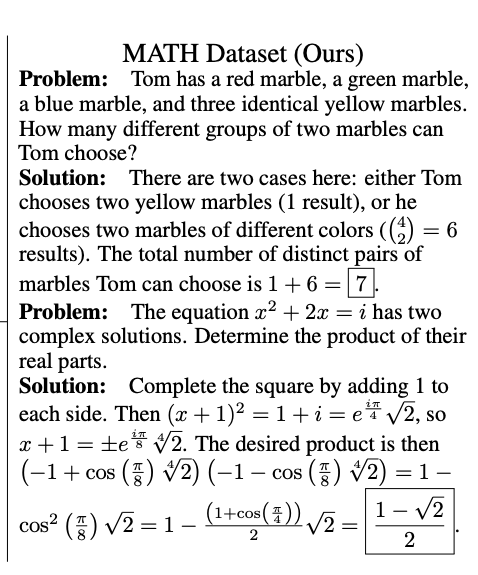
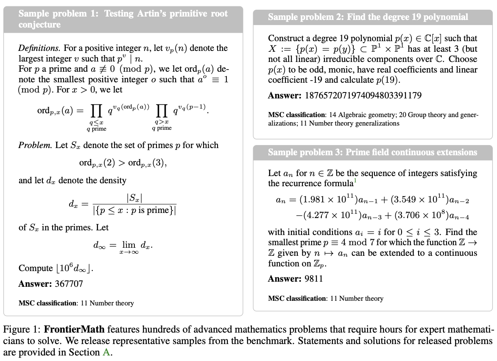

# plan
核心任务是 完成欢哥交与的任务  
若有剩余时间，跟欢哥开会讨论  
图神经网络的作业留置19号当天完成

## unit llm
尝试从capibility & regression的角度

第一段：
Correctness  

起初，我们评估llm的语言表达、知识理解、简单推理的能力。[GPQA 、SimpleQA、 MATH、 GSM8k、 HumanEval]
GPQA含 448 个由生物学、物理学和化学领域的专家编写的高难度多项选择题，
SimpleQA是一个极简、闭卷的事实问答数据集，专门用于评估LLM是否在参数中记住了基础世界知识，
MATH、GSM8k检验llm能否解决小学、初高中的数学问题、HumanEval评测llm在人工创造的函数级任务的效果。  

  接着，我们发现通过“分而治之”极其有助于复杂任务的完成。因此，我们评估llmplan并进行多步 reasoning的能力[PlanBench、AutoPlanBench、FlowBench、ACPBench、Natural Plan Bench]。
这些评测llm能否对日常生活任务输出合理、可接受的计划，以及该计划中的步骤是否基于正确的状态、是否遵循正确的流程。

  随着llm在这些任务上展现出惊人的成果，我们更进一步推动任务的复杂度。 [FrontierMath、ARC-AGI-2、GDPval、livebench、herm，MRCR, CharXiv]
FrontierMath直接评估llm是否具备数学专家能力，数据集涉及了现代数学的主要分支如实分析。ARC-AGI-2通过视觉逻辑谜题的形式，严格测试 AI 是否具备像人类一样的灵活推理能力和在陌生环境下的快速学习能力。GDPval、livebench、Herm等评测llm解决现实世界真实任务的能力。MRCR评测llm在长上下文中识别和检索的能力，CharXiv评估了多模态图表理解能力。

第二段：
  与此同时，为了将llm有效应用于真实世界，助力全社会的发展。我们同时也关注Robustness、safety、efficiency等方面。并先从之前的较简单任务上做regression。即这些数据集大都基于上述简单数据集进行构建。 

  在Robustness方面，我们主要衡量llm的幻觉、一致性、抗干扰方面。[AdvGLUE 、SCORE、TruthfulQA、HaluEval、AMBER、t-benchmark]
TruthfulQA评测llm回答特定问题时是否模仿人类常见谬误，HaluEval则构造了一个大规模的llm幻觉数据集。AMBER针对多模态llm构造了幻觉评估基准。
AdvGLUE、SCORE引入对抗攻击手段，如提示词变体，评估llm的抗扰动能力。
t-benchmark提出pass^k，指明在重要任务上llm多次输出均需具备一致性。

  此外，Safety方面，SafetyBench构建了11435个涵盖7个安全类别的多项选择题，Do-Not-Answer侧重于评估llm是否识别有害请求并拒绝，CoSafe首个研究多轮对话中llm的安全性，Case-Bench则指出语境的作用，指出llm不应拒绝在安全语境下可以回答的问题。

  最后，Efficency方面，不仅关注底层硬件的吞吐效率，而且审视推理过程中的计算资源浪费问题。
LLM-Inference-Bench、llmperf、mlperf提供了细粒度的度量指标，包括首词延迟（TTFT）、词间延迟（TPOT）和系统吞吐量。S1-Bench评估7B模型能够轻松回答的任务，llm是否会过度思考。OptimalThinkingBench则综合评测llm在简单任务中惩罚冗余思考，在复杂任务中触发深度推理的自适应规划能力。

## inter-llms

该部分主要介绍 llm自我反馈，以及不涉及复杂工具的多llm合作与竞争。

Correctness
    correctness是最重要的，intergrations of llm能强力帮助llm完成更复杂的任务

    一种思路是llm self check
    LLF-Bench评估了llm从人类给出的自然语言反馈中学习和反思的能力，
    ReflectionBench被设计用于评估 大语言模型（LLMs）的认知反思能力。该基准将“反思”细分为多个组成部分，包括：对新信息的感知、记忆的使用、在遭遇意外时对信念的更新、决策调整、反事实推理，以及元反思（对自身思考过程的反思）。

    另一种思路是多个llm 协作与竞争
    AgentSims和CAMEL通过角色扮演，评估了多llm协作的能力
    MultiAgentBench通过在6个不同的交互场景，多种协作方式评估了任务完成分数，沟通分数和规划分数。

Robustness
    应用场景中，集成系统的鲁棒性体现在面对内部冲突时的稳定性。与单模型的抗干扰能力不同，多模型系统的挑战在于如何处理“错误的共识”或“恶意节点的干扰”。
    
    MAS-Resilience通过注入“故障模型”，评估集成系统是否仍能通过交互机制保持结论的一致性和可靠性
    TAMAS，通过伪装、提示注入、合谋等手段扰动系统输入，直接对多智能体协作的对抗鲁棒性进行了基准测试。揭示了多智能体系统在通过分工提升任务能力的同时，因其复杂的通信链路和对“权威角色”的过度信任，暴露出了比单体系统更为脆弱的攻击面

Safety
    多个llm的协作可能会进一步引入安全风险，X-Teaming 与 AgentHarm 等基准测试显示，多智能体协作可能被攻击者利用，通过拆解恶意指令或“有毒协作”来绕过单体的防御屏障，这为安全评估提出了新的要求。

    X-Teaming: Multi-Turn Jailbreaks and Defenses with Adaptive Multi-Agents揭示了攻击者如何利用多智能体协作链条，将恶意指令拆分为无害片段进行传播，从而绕过单智能体的防御屏障。
    
    专门的基准测试如 AgentHarm: A Benchmark for Measuring Harmfulness of LLM Agents评估了模型之间是否会产生非预期的“有毒协作”，例如一个模型教导另一个模型如何规避安全过滤。
    
Efficiency
    多模型集成带来的负面影响是计算资源和 Token 消耗的急剧增加。
    MultiAgentBench通过Milestone Achievement Rates与交互轮数等指标，来评估协作的“进度条”是否高效。

## llms

### self-reflection self-check
早期评估大型语言模型（LLM）代理自我反思能力的尝试往往采取间接方式，通过改造现有推理或规划任务实现，
例如AGIEval（Zhong等人，2023）、MedMCQA（Pal等人，2022）、ALFWorld（Shridhar等人，2021）、 MiniWoB++（刘等人，2018）等任务

a standardized benchmark for interactive self-reflection：
LLFBench

LLM-Evolve被引入用于评估大型语言模型代理在标准基准（如MMLU）上的自我反思能力。
(Pan et al., 2025) 聚焦编程智能体领域，将APPS（Hendrycks et al., 2021a）和LiveCodeBench（Jain et al., 2024）等现有编程基准扩展至交互式场景

ReflectionBench：从认知科学的视角来看，ReflectionBench（Li 等，2024） 被设计用于评估 大语言模型（LLMs）的认知反思能力。该基准将“反思”细分为多个组成部分，包括：对新信息的感知、记忆的使用、在遭遇意外时对信念的更新、决策调整、反事实推理，以及元反思（对自身思考过程的反思）。

### collaborate、compete

MARBLE、AgentSims

llm之间需要 共享信息、协商、然后高效决策。

测量多个llm在共享环境中的交互、协商和决策效率
1.交互环境
AgentSims：虚拟小镇的社会环境
WebArena：互联网环境，处理网页任务
TheAgentCompany：企业级环境，真实公司的流程
2.评估维度
沟通效率：  收敛轮数
协商效率： 面对分歧时如何决策。 GAMEBENCH
贡献归因： 每个agent对最终成果的有效贡献占比、错误源定位
涌现行为：

