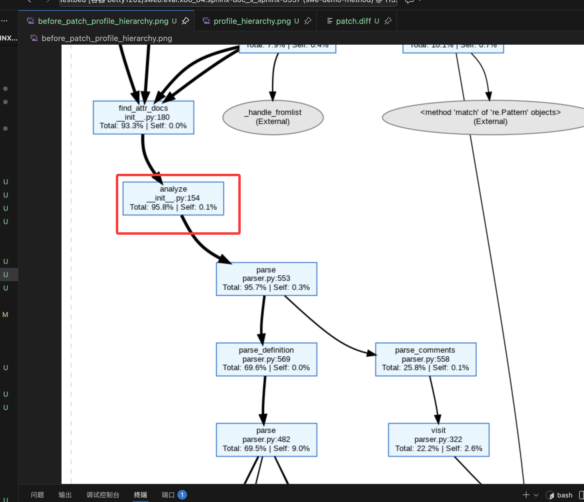
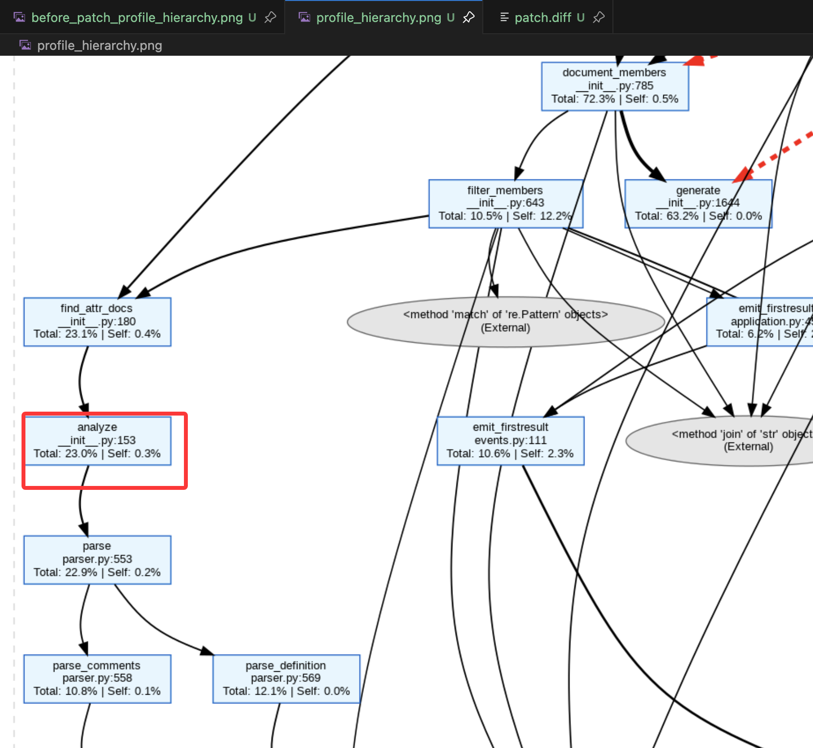
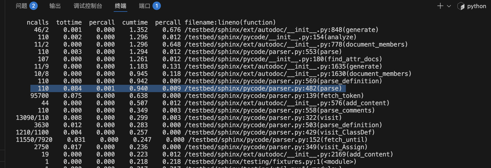
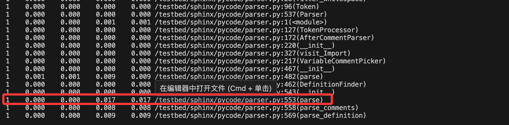

## plan

### llm as code optimizer

探索方法


异常节点定位：

1. 🛑 纯苦力 (The Worker)
特征：Ratio > 50%。

罪名：自身计算太慢。

场景：时间断层是因为它自己把 CPU 跑满了（解析、正则、矩阵运算）。

优化方向：算法优化、NumPy 向量化、编译加速。

下一步：直接上 line_profiler 查哪一行慢。

2. 📡 放大器 (The Amplifier / Manager)
特征：Ratio < 20% 且 ncalls 与 primitive_calls 差距巨大（或者子函数调用次数巨大）。

罪名：调度逻辑低效。

场景：时间断层是因为它疯狂调用了那些单次运行很快的子函数（Accumulated Overhead）。

Sphinx 案例：generate 自己不慢，但它调了 find_attr_docs 100 次。

优化方向：缓存 (Cache)、批量化 (Batching)、剪枝 (Pruning)、并行化 (Parallelism)。

下一步：line_profiler 查循环体，或者 LLM 检查循环逻辑。

3. 🟡 胖控制器 (The Fat Controller)
特征：20% <= Ratio <= 50%。

罪名：职责不清，既当爹又当妈。

场景：既有繁重的自身逻辑（如拼装大字典），又有频繁的子调用。

优化方向：重构 (Refactor)。先拆分，再优化。


> 这里并没有考虑gc抖动的情况，所以还是不会百分百准，但是已经可以作为baseline了


代码改了个bug。prepare_environment的时候没有pip install roman


> emm，agent肯定是能够跟profiler交互 会更好一些， 但是呢，如果给他一个大的方向的话，或许更好。 cumtime累计、tottime累计、pcalls调用次数


> 同时，也算想到了后面怎么用llm generate patch，给出bottleneck的位置，lineno,一个显示行号的工具，然后让llm生成patch


### 开会讨论后，认为需要多接触些例子

策略这部分 如果仅仅改为多线程 不够，
下一步是多跑几个case，看下这个问题是什么

1.sphinx-doc__sphinx-8537
tests/test_ext_autodoc.py::test_autodoc_ignore_module_all
0.8822847245545644,
0.0435421424001106,   

以这个为例子， 快速验证方法，并且尝试完善llm 修复这部分


-            self._parsed = True
+            self._analyzed = True







2.scikit-learn__scikit-learn-12543
sklearn/ensemble/tests/test_iforest.py::test_iforest_parallel_regression,
1.1141297638518153,
0.42087150824409036

把 IsolationForest（以及其 Bagging 基类）的并行后端，从“进程并行”切换为“线程并行”，从而显著降低内存拷贝与进程通信开销
IsolationForest 继承了 Bagging 的并行实现框架，
Bagging 统一改造了并行调用点，
而“是否、如何优化并行参数”必须由具体子类（如 iforest）来决定并实现。
```python
在iforest中添加下面这个，而其对应的父类中加上空实现 {}
+    def _parallel_args(self):
+        # ExtraTreeRegressor releases the GIL, so it's more efficient to use
+        # a thread-based backend rather than a process-based backend so as
+        # to avoid suffering from communication overhead and extra memory
+        # copies.
+        return _joblib_parallel_args(prefer='threads')
+
在父类的fit和predict_proba函数里改成如下
-        all_proba = Parallel(n_jobs=n_jobs, verbose=self.verbose)(
+        all_proba = Parallel(n_jobs=n_jobs, verbose=self.verbose,
+                             **self._parallel_args())
```

```bash
stats.sort_stats("tottime").print_stats("acquire",20)
stats.sort_stats("tottime").print_stats("wait",20)
```

```bash
Tue Jan 20 21:24:00 2026    ~/tmp/sweperf_workdir/scikit-learn__scikit-learn-12543/stage1_profiles/trace.pstats

         1145861 function calls (1122869 primitive calls) in 3.149 seconds

   Ordered by: internal time
   List reduced from 5519 to 9 due to restriction <'acquire'>

   ncalls  tottime  percall  cumtime  percall filename:lineno(function)
       17    0.738    0.043    0.738    0.043 {method 'acquire' of '_thread.lock' objects}
     1457    0.003    0.000    0.003    0.000 <frozen importlib._bootstrap>:78(acquire)
    ......

   Ordered by: internal time
   List reduced from 5519 to 6 due to restriction <'wait'>

   ncalls  tottime  percall  cumtime  percall filename:lineno(function)
        4    0.000    0.000    0.738    0.185 /opt/miniconda3/envs/testbed/lib/python3.6/threading.py:263(wait)
        9    0.000    0.000    0.000    0.000 {built-in method posix.waitpid}
    .....
```

> insight： 涉及python并行、并行时，可以profiler下acquire、wait看看
> 但是这里具体怎么定位到fit函数，emm， 看parallel的启动？


3.pydata__xarray-9881
xarray/tests/test_interp.py::test_interpolate_chunk_advanced[cubic],
27.08809580752246,
3.0876700349501336,    提升百分比： 88.60137657187155


4.pydata__xarray-9881
xarray/tests/test_interp.py::test_interpolate_chunk_advanced[pchip],
7.633375689051173,2.741754892775336,64.08201293291597


5.pydata__xarray-7206,
xarray/tests/test_groupby.py::test_groupby_grouping_errors
0.018240094116395888,  0.005084251647349447,   72.12595716389835


6.sympy__sympy-14278
sympy/sets/tests/test_fancysets.py::test_imageset_intersect_real,0.11208194684341403,0.030003639937300857,73.23062207402772


7.sympy__sympy-14331,sympy/utilities/tests/test_wester.py::test_P32,
0.5273012555509922,0.1433180292486213,72.82046501124594


8.sympy__sympy-25591	sympy/tensor/array/expressions/tests/test_convert_array_to_matrix.py::test_identify_removable_identity_matrices
	0.027675010001985356	0.01990627180202864	28.071311263842


9.pydata__xarray-9881	xarray/tests/test_interp.py::test_interpolate_chunk_advanced[slinear]	
5.3289798704499844	3.079620073499973	42.20995109069671


10.sympy__sympy-26004	sympy/functions/elementary/tests/test_piecewise.py::test_issue_14052	
0.1265988143706253	0.08680505830270704	31.432961095053987


