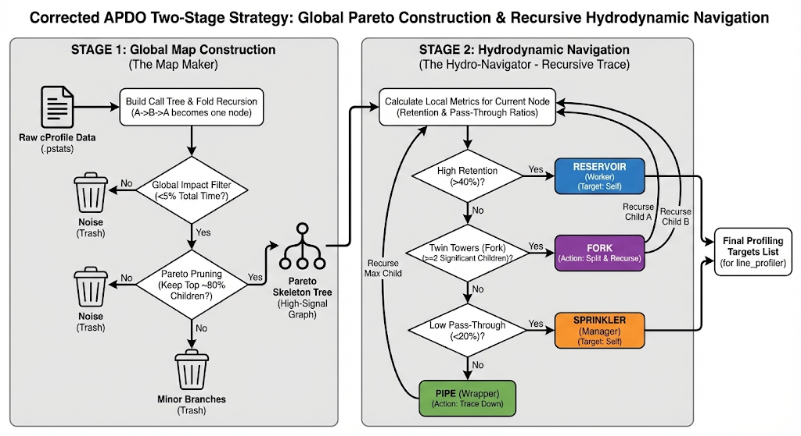
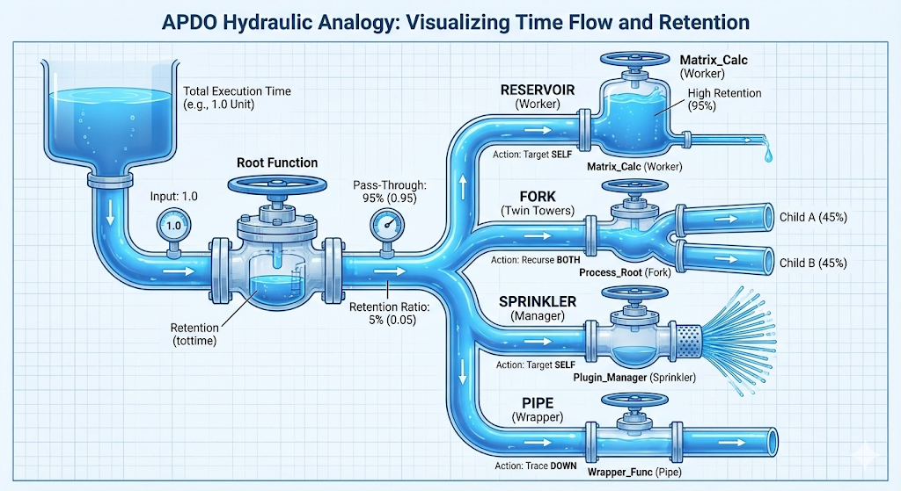

## plan

### 打磨unit llm，integrations llm

emm，简单人工改了改

### llm as optimizer

idea1.
能不能留存一颗树，树上占比达总时间80%

帕累托原则（80/20 法则）：
性能优化时，优先只关注那“占 80% 耗时的 20% 代码”，剩下的 20% 往往性价比极低。

Amdahl 定律：
整体加速比由最慢、占比最大的部分决定

idea2.
所有的耗时，一般意义上只有两种，
1是计算任务，可能自己写的循环计算这种
2是IO等待，等待外部api
两者最终代表两块问题，
1是 内部计算函数 tottime占比
2是 外部api tottime占比过高

对于1，它的本身cumtime应该就很高，
对2，它的直接调用者cumtime会很高，
也就是找最下层的cumtime最高的点，一般意义上应该是最耗时的

然后llm再结合上下文优化。

3.
emmm，那现在的整体定位逻辑是什么呢？

1) .先从test函数出发，然后每次进行bfs，记子节点的cumtime占当前节点cumtime的比值为x，按x排序，此外只添加高于5%，然后添加到80%即可，接着下一层，直到撞到外部api或者内置库函数调用，同时还有进行递归折叠

2) .运行基于”流体动力学“的算法，记test函数的cumtime为totaltime，然后每个节点inode的cumtime、tottime，同时需记录ncalls但不在分类中使用。接着计算每个节点的cumtime、tottime占totaltime的比值，即做 per_cumtime和per_tottime。然后进行同样bfs或者说拓扑排序，对于一个节点，若其per_tottime和per_cumtime都很大，证明该节点一定是计算密集型节点，分类为蓄水池。若per_cumtime和per_tottime占比均很小，emm，这里我觉得是非主干节点，但不知道怎么分。若per_cumtime较大而per_tottime占比较小，此时需要需要根据其子节点情况进一步分，记子节点的cumtime和tottime占该节点的比值分别为 child_tot，child_cum，首先若只有一个子节点，并且往往child_cum很大，那么说明该节点为 粗管子。其次若有若干个子节点，且child_cum较大而由于经过过滤子节点的per_cumtime又都无法忽略。这里可以考虑看是否是并行瓶颈，但也有可能不是。  这里分类为 分流渠。最后，若有众多小子节点，且child_cum都很小，分类为花洒

下面是之前的方法图

然后是基于 全局定位和流体局部形态定位的图

