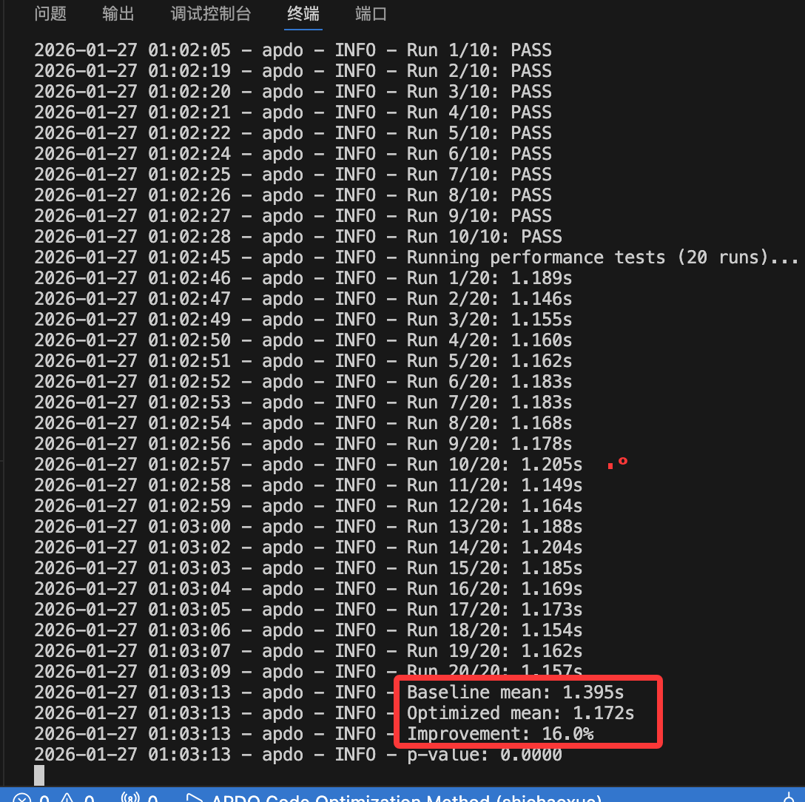

plan：
1. 想定位，尝试自动cython重写

2. 实际：
调整代码，
定位和插桩部分可以

在做llm生成patch部分

思考：
目前是在做一个pipeline
是不是应该造一个agent，自主和profiler交互更好，从而补充细节

## 总结
1. 服务器有时候不稳定
2. 完成了一个基本的baseline，
虽然只修改了 generate函数，但是还是加速了2秒

这跟model输出有关，有时候直接apply fail还