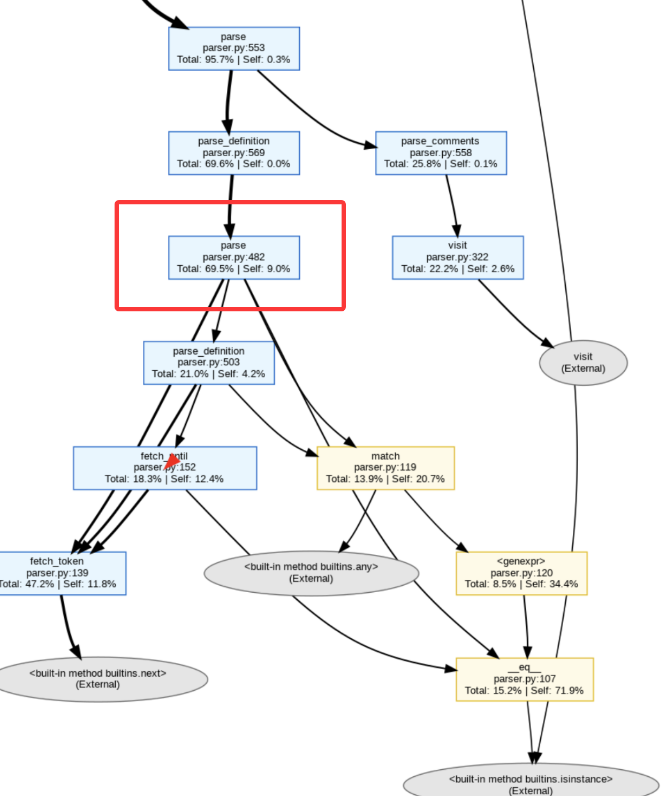
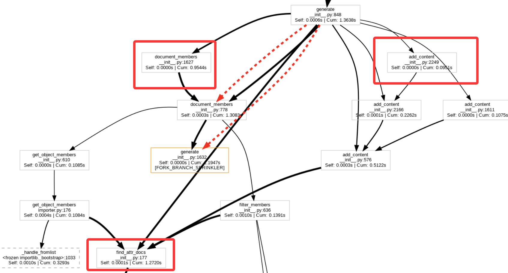

1. 改定位

现在定位很不准
但是何必只找一个呢，直接挑topk个可疑的

然后并行插桩line_profiler

接着逐个让llm判别能否在保证functional 的同时 优化performance，
每个同时送入上1层和下1层直接调用函数作为上下文。

2. 这一个test是否一定对应一个目标函数呢？？ 如果是的话，这里不妨再次更改任务到 profiler指定目标函数上。感觉更稳妥
3. 压力测试一定是要有的

 
啥也别改了
今天把10个case的patch为啥能提速，给一个一个剖析明白就算完成任务
## 1. yes
1.sphinx-doc__sphinx-8537
tests/test_ext_autodoc.py::test_autodoc_ignore_module_all
0.8822847245545644,
0.0435421424001106,   

```python
#1.从测试出发tests/test_ext_autodoc.py
@pytest.mark.sphinx('html', testroot='ext-autodoc')
def test_autodoc_ignore_module_all(app):
    # default (no-ignore-module-all)
    options = {"members": None}
    actual = do_autodoc(app, 'module', 'target', options)
    assert list(filter(lambda l: 'class::' in l, actual)) == [
        '.. py:class:: Class(arg)',
    ]


#2.先调用do_autodoc函数. tests/test_ext_autodoc.py 
#然后
(testbed) root@b3433c970001:/testbed# kernprof -l -v  -m pytest -rA --durations=0 --disable-warnings --tb=no tests/test_ext_autodoc.py::test_autodoc_ign
ore_module_all
Line #      Hits         Time  Per Hit   % Time  Line Contents
==============================================================
    33                                           @profile
    34                                           def do_autodoc(app, objtype, name, options=None):
    35         2          2.3      1.2      0.0      if options is None:
    36                                                   options = {}
    37         2          3.5      1.8      0.0      app.env.temp_data.setdefault('docname', 'index')  # set dummy docname
    38         2          2.1      1.0      0.0      doccls = app.registry.documenters[objtype]
    39         2         85.9     42.9      0.0      docoptions = process_documenter_options(doccls, app.config, options)
    40         2        474.0    237.0      0.0      state = Mock()
    41         2        838.7    419.4      0.0      state.document.settings.tab_width = 8
    42         2         67.4     33.7      0.0      bridge = DocumenterBridge(app.env, LoggingReporter(''), docoptions, 1, state)
    43         2         24.4     12.2      0.0      documenter = doccls(bridge, name)
    44         2    2469976.7 1.23e+06     99.9      documenter.generate()
    45                                           
    46         2          2.1      1.0      0.0      return bridge.result


#3. 瓶颈在generate函数 sphinx/ext/autodoc/__init__.py
然后呢，这个generate函数
```

``` bash
通过add_content、document_members、get_object_members等函数，最终调用到的是 find_attr_docs函数！！！

# 4. find_attr_docs函数。 sphinx/pycode/__init__.py
显然该函数调用的analyze函数
    def find_attr_docs(self) -> Dict[Tuple[str, str], List[str]]:
        """Find class and module-level attributes and their documentation."""
        self.analyze()
        return self.attr_docs

# 5.找到问题所在了，就在这个analyze函数
# 下面这个是patch
@@ -170,7 +170,7 @@ def analyze(self) -> None:
             self.overloads = parser.overloads
             self.tags = parser.definitions
             self.tagorder = parser.deforders
-            self._parsed = True
+            self._analyzed = True
         except Exception as exc:
             raise PycodeError('parsing %r failed: %r' % (self.srcname, exc)) from exc
# 分析
可见这个human_patch吧这里的self._parsed改为self._analyzed，
原因是 不论是 __init__函数还是analyze函数，他都是self._analyzed，然而之前的analyze函数在解析后错误的设置了self._parsed,
    这导致了每次运行analyze均会进行重复的解析， 从而严重影响了性能
def __init__(self, source: IO, modname: str, srcname: str) -> None:
        ...... #省略无关项
        self._analyzed = False
def analyze(self) -> None:
        """Analyze the source code."""
        if self._analyzed:
            return None

        try:
            parser = Parser(self.code)
            parser.parse()

            self.attr_docs = OrderedDict()
            for (scope, comment) in parser.comments.items():
                if comment:
                    self.attr_docs[scope] = comment.splitlines() + ['']
                else:
                    self.attr_docs[scope] = ['']

            self.annotations = parser.annotations
            self.finals = parser.finals
            self.overloads = parser.overloads
            self.tags = parser.definitions
            self.tagorder = parser.deforders
            self._parsed = True
        except Exception as exc:
            raise PycodeError('parsing %r failed: %r' % (self.srcname, exc)) from exc


Calls      | CumTime    | PerCall    | Function
--------------------------------------------------------------------------------
110        | 1.3068     | 0.01188    | sphinx/pycode/__init__.py:analyze
110        | 1.3047     | 0.01186    | sphinx/pycode/parser.py:parse


```

## 2. yes
2.scikit-learn__scikit-learn-12543
sklearn/ensemble/tests/test_iforest.py::test_iforest_parallel_regression,
1.1141297638518153,
0.42087150824409036

把 IsolationForest（以及其 Bagging 基类）的并行后端，从“进程并行”切换为“线程并行”，从而显著降低内存拷贝与进程通信开销
IsolationForest 继承了 Bagging 的并行实现框架，
Bagging 统一改造了并行调用点，
而“是否、如何优化并行参数”必须由具体子类（如 iforest）来决定并实现。
```python
在iforest中添加下面这个，而其对应的父类中加上空实现 {}
+    def _parallel_args(self):
+        # ExtraTreeRegressor releases the GIL, so it's more efficient to use
+        # a thread-based backend rather than a process-based backend so as
+        # to avoid suffering from communication overhead and extra memory
+        # copies.
+        return _joblib_parallel_args(prefer='threads')
+
在父类的fit和predict_proba函数里改成如下
-        all_proba = Parallel(n_jobs=n_jobs, verbose=self.verbose)(
+        all_proba = Parallel(n_jobs=n_jobs, verbose=self.verbose,
+                             **self._parallel_args())
```

```bash
stats.sort_stats("tottime").print_stats("acquire",20)
stats.sort_stats("tottime").print_stats("wait",20)
```

```bash
Tue Jan 20 21:24:00 2026    ~/tmp/sweperf_workdir/scikit-learn__scikit-learn-12543/stage1_profiles/trace.pstats

         1145861 function calls (1122869 primitive calls) in 3.149 seconds

   Ordered by: internal time
   List reduced from 5519 to 9 due to restriction <'acquire'>

   ncalls  tottime  percall  cumtime  percall filename:lineno(function)
       17    0.738    0.043    0.738    0.043 {method 'acquire' of '_thread.lock' objects}
     1457    0.003    0.000    0.003    0.000 <frozen importlib._bootstrap>:78(acquire)
    ......

   Ordered by: internal time
   List reduced from 5519 to 6 due to restriction <'wait'>

   ncalls  tottime  percall  cumtime  percall filename:lineno(function)
        4    0.000    0.000    0.738    0.185 /opt/miniconda3/envs/testbed/lib/python3.6/threading.py:263(wait)
        9    0.000    0.000    0.000    0.000 {built-in method posix.waitpid}
    .....
```

> insight： 涉及python并行、并行时，可以profiler下acquire、wait看看
> 但是这里具体怎么定位到fit函数，emm， 看parallel的启动？

### 挨个profile
```python
#test command
pytest -rA --durations=0 --disable-warnings --tb=no --continue-on-collection-errors -rA --durations=0 --disable-warnings --tb=no --continue-on-collection-errors -vv --json-report --json-report-file=/workdir/report.json sklearn/ensemble/tests/test_iforest.py::test_iforest_parallel_regression
```

```bash
测试下patch是否真的加速


report saved to: /workdir/report.json
============================ slowest durations =============================
0.98s call     sklearn/ensemble/tests/test_iforest.py::test_iforest_parallel_regression
0.00s setup    sklearn/ensemble/tests/test_iforest.py::test_iforest_parallel_regression
0.00s teardown sklearn/ensemble/tests/test_iforest.py::test_iforest_parallel_regression
========================= short test summary info ==========================
PASSED sklearn/ensemble/tests/test_iforest.py::test_iforest_parallel_regress

***************************
git apply ../patch.diff后
**************************

============================ slowest durations =============================
0.38s call     sklearn/ensemble/tests/test_iforest.py::test_iforest_parallel_regression
0.00s teardown sklearn/ensemble/tests/test_iforest.py::test_iforest_parallel_regression
0.00s setup    sklearn/ensemble/tests/test_iforest.py::test_iforest_parallel_regression
========================= short test summary info ==========================
PASSED sklearn/ensemble/tests/test_iforest.py::test_iforest_parallel_regression
======================= 1 passed, 1 warning in 0.57s =======================
```


### profiler调用链
```python
# 插桩
from line_profiler import profile
@profile
# 执行命令
kernprof -l -v  pytest -rA --durations=0 --disable-warnings --tb=no --continue-on-collection-errors -rA --durations=0 --disable-warnings --tb=no --continue-on-collection-errors -vv --json-report --json-report-file=/workdir/report.json sklearn/ensemble/tests/test_iforest.py::test_iforest_parallel_regression
```


```bash
# 从下图可以明显看到，njobs=3，在相同条件下反而比njobs=1要慢很多？？？
Line #      Hits         Time  Per Hit   % Time  Line Contents
==============================================================
   171                                           @pytest.mark.filterwarnings('ignore:default contamination')
   172                                           @pytest.mark.filterwarnings('ignore:threshold_ attribute')
   173                                           @pytest.mark.filterwarnings('ignore:behaviour="old"')
   174                                           @profile
   175                                           def test_iforest_parallel_regression():
   176                                               """Check parallel regression."""
   177         1        183.1    183.1      0.0      rng = check_random_state(0)
   178                                           
   179         1          2.6      2.6      0.0      X_train, X_test, y_train, y_test = train_test_split(boston.data,
   180         1          0.9      0.9      0.0                                                          boston.target,
   181         1        209.7    209.7      0.0                                                          random_state=rng)
   182                                           
   183         1          0.3      0.3      0.0      ensemble = IsolationForest(n_jobs=3,
   184         1     885517.2 885517.2     82.2                                 random_state=0).fit(X_train)
   185                                           
   186         1        199.8    199.8      0.0      ensemble.set_params(n_jobs=1)
   187         1      23134.8  23134.8      2.1      y1 = ensemble.predict(X_test)
   188         1        113.4    113.4      0.0      ensemble.set_params(n_jobs=2)
   189         1      23103.0  23103.0      2.1      y2 = ensemble.predict(X_test)
   190         1        208.2    208.2      0.0      assert_array_almost_equal(y1, y2)
   191                                           
   192         1          0.6      0.6      0.0      ensemble = IsolationForest(n_jobs=1,
   193         1     121386.4 121386.4     11.3                                 random_state=0).fit(X_train)
   194                                           
   195         1      23107.9  23107.9      2.1      y3 = ensemble.predict(X_test)
   196         1        137.6    137.6      0.0      assert_array_almost_equal(y1, y3)

# 接着进一步profiler
# 首先根据cProfiler查函数调用链
python -m cProfile -o trace.pstats $(which pytest) -rA --durations=0 --disable-warnings --tb=no --continue-on-collection-errors -rA --durations=0 --disable-warnings --tb=no --continue-on-collection-errors -vv --json-report --json-report-file=/workdir/report.json sklearn/ensemble/tests/test_iforest.py::test_iforest_parallel_regression

# python -m pstats trace.pstats
# > stats test_iforest_parallel_regression
# > callers test_iforest_parallel_regression
# > callees test_iforest_parallel_regression
/workdir/testbed/sklearn/ensemble/iforest.py:189(fit)

#然后去掉现有插桩，到该指定位置接着插桩
  261         2          1.2      0.6      0.0          self.max_samples_ = max_samples
   262         2         15.8      7.9      0.0          max_depth = int(np.ceil(np.log2(max(max_samples, 2))))
   263         2          2.3      1.2      0.0          super(IsolationForest, self)._fit(X, y, max_samples,
   264         2          0.5      0.2      0.0                                            max_depth=max_depth,
   265         2     892558.5 446279.2     93.1                                            sample_weight=sample_weight)
   266                                           
   267         2          2.6      1.3      0.0          if self.behaviour == 'old':
   268                                                       # in this case, decision_function = 0.5 + self.score_samples(X):

# 可见super(IsolationForest, self)._fit很慢
/workdir/testbed/sklearn/ensemble/bagging.py:246(_fit)  ncalls=2  cumtime=0.886930
再插桩这个函数，可见99.9的时间花到Parallel这里

  370         2         76.4     38.2      0.0          all_results = Parallel(n_jobs=n_jobs, verbose=self.verbose)(
   371         2          1.4      0.7      0.0              delayed(_parallel_build_estimators)(
   372                                                           n_estimators[i],
   373                                                           self,
   374                                                           X,
   375                                                           y,
   376                                                           sample_weight,
   377                                                           seeds[starts[i]:starts[i + 1]],
   378                                                           total_n_estimators,
   379                                                           verbose=self.verbose)
   380         2     987797.2 493898.6     99.9              for i in range(n_jobs))
   381                                        

# 也就是瓶颈目前在这里parallel这里，具体是下面这个函数  
/workdir/testbed/sklearn/externals/joblib/parallel.py:866(__call__)  ncalls=2  cumtime=0.885924

```


```bash
# 再次回顾patch.diff
@@ -243,6 +243,9 @@ def fit(self, X, y, sample_weight=None):
         """
         return self._fit(X, y, self.max_samples, sample_weight=sample_weight)
 
+    def _parallel_args(self):
+        return {}
+
     def _fit(self, X, y, max_samples=None, max_depth=None, sample_weight=None):
         """Build a Bagging ensemble of estimators from the training
            set (X, y).
@@ -365,7 +368,8 @@ def _fit(self, X, y, max_samples=None, max_depth=None, sample_weight=None):
         seeds = random_state.randint(MAX_INT, size=n_more_estimators)
         self._seeds = seeds
 
-        all_results = Parallel(n_jobs=n_jobs, verbose=self.verbose)(
+        all_results = Parallel(n_jobs=n_jobs, verbose=self.verbose,
+                               **self._parallel_args())(
             delayed(_parallel_build_estimators)(
                 n_estimators[i],
                 self,
@@ -686,7 +690,8 @@ def predict_proba(self, X):
         n_jobs, n_estimators, starts = _partition_estimators(self.n_estimators,
                                                              self.n_jobs)
 
-        all_proba = Parallel(n_jobs=n_jobs, verbose=self.verbose)(
+        all_proba = Parallel(n_jobs=n_jobs, verbose=self.verbose,
+                             **self._parallel_args())(
             delayed(_parallel_predict_proba)(
                 self.estimators_[starts[i]:starts[i + 1]],
                 self.estimators_features_[starts[i]:starts[i + 1]],
diff --git a/sklearn/ensemble/iforest.py b/sklearn/ensemble/iforest.py
index 00f440aefe73a..bb66e55ed32df 100644
--- a/sklearn/ensemble/iforest.py
+++ b/sklearn/ensemble/iforest.py
@@ -14,6 +14,7 @@
 from ..externals import six
 from ..tree import ExtraTreeRegressor
 from ..utils import check_random_state, check_array
+from ..utils.fixes import _joblib_parallel_args
 from ..utils.validation import check_is_fitted
 from ..base import OutlierMixin
 
@@ -186,6 +187,13 @@ def __init__(self,
     def _set_oob_score(self, X, y):
         raise NotImplementedError("OOB score not supported by iforest")
 
+    def _parallel_args(self):
+        # ExtraTreeRegressor releases the GIL, so it's more efficient to use
+        # a thread-based backend rather than a process-based backend so as
+        # to avoid suffering from communication overhead and extra memory
+        # copies.
+        return _joblib_parallel_args(prefer='threads')
+
     def fit(self, X, y=None, sample_weight=None):
         """Fit estimator.
```


```bash
这里有一个疑惑，这样的话，只修_fit是不是也可以，尝试下

可以看到的是这里修改，主要是_joblib_parallel_args函数，
所以如果让llm只针对_fit生成一个patch的话，主要就整理_joblib_parallel_args的内容

def _joblib_parallel_args(**kwargs):
    """Set joblib.Parallel arguments in a compatible way for 0.11 and 0.12+

    For joblib 0.11 this maps both ``prefer`` and ``require`` parameters to
    a specific ``backend``.

    Parameters
    ----------

    prefer : str in {'processes', 'threads'} or None
        Soft hint to choose the default backend if no specific backend
        was selected with the parallel_backend context manager.

    require : 'sharedmem' or None
        Hard condstraint to select the backend. If set to 'sharedmem',
        the selected backend will be single-host and thread-based even
        if the user asked for a non-thread based backend with
        parallel_backend.

    See joblib.Parallel documentation for more details
    """
    from . import _joblib

    if _joblib.__version__ >= LooseVersion('0.12'):
        return kwargs

    extra_args = set(kwargs.keys()).difference({'prefer', 'require'})
    if extra_args:
        raise NotImplementedError('unhandled arguments %s with joblib %s'
                                  % (list(extra_args), _joblib.__version__))
    args = {}
    if 'prefer' in kwargs:
        prefer = kwargs['prefer']
        if prefer not in ['threads', 'processes', None]:
            raise ValueError('prefer=%s is not supported' % prefer)
        args['backend'] = {'threads': 'threading',
                           'processes': 'multiprocessing',
                           None: None}[prefer]

    if 'require' in kwargs:
        require = kwargs['require']
        if require not in [None, 'sharedmem']:
            raise ValueError('require=%s is not supported' % require)
        if require == 'sharedmem':
            args['backend'] = 'threading'
    return args

针对原始patch做如下change
        parallel_kwargs = {}
        parallel_kwargs['backend'] = 'threading'

        all_results = Parallel(n_jobs=n_jobs, verbose=self.verbose,**parallel_kwargs)(
       
再次前后对比运行profiler可见
第一，时间也从1秒多降到0.5秒左右
第二，虽然还是占比99.9%，但是时间大幅度下降了

   373         2          1.4      0.7      0.0              delayed(_parallel_build_estimators)(
   374                                                           n_estimators[i],
   375                                                           self,
   376                                                           X,
   377                                                           y,
   378                                                           sample_weight,
   379                                                           seeds[starts[i]:starts[i + 1]],
   380                                                           total_n_estimators,
   381                                                           verbose=self.verbose)
   382         2     779881.2 389940.6     99.9              for i in range(n_jobs))


  371                                           
   372         2        130.3     65.2      0.0          all_results = Parallel(n_jobs=n_jobs, verbose=self.verbose,**parallel_kwargs)(
   373         2          1.6      0.8      0.0              delayed(_parallel_build_estimators)(
   374                                                           n_estimators[i],
   375                                                           self,
   376                                                           X,
   377                                                           y,
   378                                                           sample_weight,
   379                                                           seeds[starts[i]:starts[i + 1]],
   380                                                           total_n_estimators,
   381                                                           verbose=self.verbose)
   382         2     295254.2 147627.1     99.7              for i in range(n_jobs))
   383                                      

```


## 3. hard
3.pydata__xarray-9881
xarray/tests/test_interp.py::test_interpolate_chunk_advanced[cubic],
27.08809580752246,
3.0876700349501336,    提升百分比： 88.60137657187155

```python
@requires_scipy
@requires_dask
# quintic omitted because not enough points
@pytest.mark.parametrize("method", ("linear", "nearest", "slinear", "cubic", "pchip"))
@pytest.mark.filterwarnings("ignore:Increasing number of chunks")
def test_interpolate_chunk_advanced(method: InterpOptions) -> None:
    """Interpolate nd array with an nd indexer sharing coordinates."""
    # Create original array
    x = np.linspace(-1, 1, 5)
    y = np.linspace(-1, 1, 7)
    z = np.linspace(-1, 1, 11)
    t = np.linspace(0, 1, 13)
    q = np.linspace(0, 1, 17)
    da = xr.DataArray(
        data=np.sin(x[:, np.newaxis, np.newaxis, np.newaxis, np.newaxis])
        * np.cos(y[:, np.newaxis, np.newaxis, np.newaxis])
        * np.exp(z[:, np.newaxis, np.newaxis])
        * t[:, np.newaxis]
        + q,
        dims=("x", "y", "z", "t", "q"),
        coords={"x": x, "y": y, "z": z, "t": t, "q": q, "label": "dummy_attr"},
    )

    # Create indexer into `da` with shared coordinate ("full-twist" Möbius strip)
    theta = np.linspace(0, 2 * np.pi, 5)
    w = np.linspace(-0.25, 0.25, 7)
    r = xr.DataArray(
        data=1 + w[:, np.newaxis] * np.cos(theta),
        coords=[("w", w), ("theta", theta)],
    )

    xda = r * np.cos(theta)
    yda = r * np.sin(theta)
    zda = xr.DataArray(
        data=w[:, np.newaxis] * np.sin(theta),
        coords=[("w", w), ("theta", theta)],
    )

    kwargs = {"fill_value": None}
    expected = da.interp(t=0.5, x=xda, y=yda, z=zda, kwargs=kwargs, method=method)

    da = da.chunk(2)
    xda = xda.chunk(1)
    zda = zda.chunk(3)
    actual = da.interp(t=0.5, x=xda, y=yda, z=zda, kwargs=kwargs, method=method)
    assert_identical(actual, expected)
```

```bash
# 还是先测试下到底提升没

pytest -rA --durations=0 --disable-warnings --tb=no --continue-on-collection-errors -rA --durations=0 --disable-warnings --tb=no --continue-on-collection-errors -vv --json-report --json-report-file=/workdir/report.json xarray/tests/test_interp.py::test_interpolate_chunk_advanced[cubic]

确定有提升，速度从30s提升到3s
perf stat -e instructions:u pytest ......

162,793,760,761      instructions:u                     
26,529,466,670      instructions:u     
指令数也大幅度下降   

```
```bash 
#对测试函数前后进行line_profiler可见，变快的关键地方是这里
apply前：
  1007         1   33369017.1 3.34e+07     97.9      assert_identical(actual, expected)
apply后：
  1007         1    4498813.2  4.5e+06     85.9      assert_identical(actual, expected)
#这是个很令人费解的事情，怎么能从assert中优化呢？
然后利用cProfiler构造调用链
python -m cProfile -o trace.pstats $(which pytest) ...

test_interpolate_chunk_advanced
 └─ assert_identical  (xarray/tests/__init__.py → xarray/testing/assertions.py:143)
      └─ identical (cxarray/core/dataarray.py:4717)
           └─ _all_compat(xarray/core/dataarray.py:4596)
              compat(/xarray/core/dataarray.py:4599)
                └─ identical (xarray/core/variable.py:1842)
                     └─ equals(xarray/core/variable.py:1811)
                          └─ array_equiv(xarray/core/duck_array_ops.py:327)
                               └─ Dask Array.__bool__()(site-packages第三方库)
# 尝试让gpt在上面array_equiv进行修复，但是效果不佳，仅取得轻微效果
# 不如直接不让从有assert字样的函数里跑profiler
/workdir/testbed/xarray/core/dataarray.py:2226(interp) 
/workdir/testbed/xarray/core/dataset.py:3964(interp)cumtime=0.559318
/workdir/testbed/xarray/core/missing.py:605(interp)  ncalls=4  cumtime=0.528147
/workdir/testbed/xarray/core/missing.py:672(interp_func)  ncalls=2  cumtime=0.52508
分叉了这里
      /workdir/testbed/xarray/core/missing.py:787(_interpnd)  ncalls=1  cumtime=0.324849  (这个到头了下一个就是site-packages占比最大了)
      /workdir/testbed/xarray/namedarray/daskmanager.py:230(unify_chunks)  ncalls=1  cumtime=0.198900 (同样到头了，下一个就是site-packages)
# 尝试让llm修修这里
怎么修的修不好啊。


尝试直接并行插桩line_profiler采样，然后送信息给gpt，
gpt修了如下函数这三行
def interp_func(var, x, new_x, method: InterpOptions, kwargs):
    # 🔥 FAST FIX: cubic / pchip / akima 不能 chunk-wise
    if is_chunked_array(var) and method not in ("linear", "nearest", "slinear"):
        # 把所有被插值的轴整轴合并成一个 chunk
        axis_chunks = {var.ndim - len(x) + i: -1 for i in range(len(x))}
        var = var.rechunk(axis_chunks)
然后经过验证，加速测试从大概30s到25s左右，勉强有加速

```


4.pydata__xarray-9881
xarray/tests/test_interp.py::test_interpolate_chunk_advanced[pchip],
7.633375689051173,2.741754892775336,64.08201293291597

emm，这个看上去和上面那个函数 就是参数不太一样，先略过

## 5. yes
5.pydata__xarray-7206,
xarray/tests/test_groupby.py::test_groupby_grouping_errors
0.018240094116395888,  0.005084251647349447,   72.12595716389835

```bash
#测试命令
pytest -rA --durations=0 --disable-warnings --tb=no --continue-on-collection-errors -rA --durations=0 --disable-warnings --tb=no --continue-on-collection-errors -vv --json-report --json-report-file=/workdir/report.json xarray/tests/test_groupby.py::test_groupby_grouping_errors

apply前稳定0.13s
apply后0.12s
不太明显，加下压力测试
不涉及任何逻辑更改，单纯增大数据规模
def test_groupby_grouping_errors() -> None:
    size = 100_000
    dataset = xr.Dataset(
        {"foo": ("x", np.ones(size))},
        {"x": np.arange(size)},
    )
    # dataset = xr.Dataset({"foo": ("x", [1, 1, 1])}, {"x": [1, 2, 3]})
此时apply前稳定0.18s
apply后稳定0.14s
> 注意下面有发现，只看call那里时间，足以分辩0.15s到0.05s，所以后面没加压力测试
```

```bash
1.cProfiler分析调用链
python -m cProfile -o trace.pstats $(which pytest) .....
/workdir/testbed/xarray/tests/test_groupby.py:576(test_groupby_grouping_errors) 0.03s

/workdir/testbed/xarray/core/dataset.py:8963(groupby_bins)  ncalls=2  cumtime=0.009077
        /workdir/testbed/xarray/core/groupby.py:324(__init__)  ncalls=2  cumtime=0.009067（俩一样的。。）
/workdir/testbed/xarray/core/dataarray.py:6276(groupby_bins)  ncalls=2  cumtime=0.008263
        /workdir/testbed/xarray/core/groupby.py:324(__init__)  ncalls=2  cumtime=0.008253（俩一样的。。。）
                /workdir/testbed/xarray/core/common.py:1024(where)  ncalls=4  cumtime=0.016216
                /workdir/testbed/xarray/core/dataarray.py:372(__init__)  ncalls=2  cumtime=0.001765
                /workdir/testbed/xarray/core/dataarray.py:3159(dropna)  ncalls=4  cumtime=0.001629
                    再往下实在是太零散了
2.line_profiler插桩
/workdir/testbed/xarray/core/groupby.py:324(__init__)
看能修不能


成功优化！report.json中从0.15s稳定优化到0.05s左右

```
```python
# 优化的init函数
def __init__(
    self,
    obj: T_Xarray,
    group: Hashable | DataArray | IndexVariable,
    squeeze: bool = False,
    grouper: pd.Grouper | None = None,
    bins: ArrayLike | None = None,
    restore_coord_dims: bool = True,
    cut_kwargs: Mapping[Any, Any] | None = None,
) -> None:
    """Create a GroupBy object (optimized for large datasets)."""
    from xarray.core.dataarray import DataArray

    if cut_kwargs is None:
        cut_kwargs = {}

    if grouper is not None and bins is not None:
        raise TypeError("can't specify both `grouper` and `bins`")

    if not isinstance(group, (DataArray, IndexVariable)):
        if not hashable(group):
            raise TypeError(
                "`group` must be an xarray.DataArray or the "
                f"name of an xarray variable or dimension. Received {group!r} instead."
            )
        group = obj[group]

    if len(group) == 0:
        raise ValueError(f"{group.name} must not be empty")

    if group.name not in obj.coords and group.name in obj.dims:
        # DummyGroups should not appear on groupby results
        group = _DummyGroup(obj, group.name, group.coords)

    if getattr(group, "name", None) is None:
        group.name = "group"

    self._original_obj: T_Xarray = obj
    self._original_group = group
    self._bins = bins

    group, obj, stacked_dim, inserted_dims = _ensure_1d(group, obj)
    (group_dim,) = group.dims
    expected_size = obj.sizes[group_dim]

    if group.size != expected_size:
        raise ValueError(
            "the group variable's length does not match the length of this variable along its dimension"
        )

    full_index = None

    # bins 处理
    if bins is not None:
        if duck_array_ops.isnull(bins).all():
            raise ValueError("All bin edges are NaN.")
        binned, bins = pd.cut(group.values, bins, **cut_kwargs, retbins=True)
        new_dim_name = str(group.name) + "_bins"
        group = DataArray(binned, getattr(group, "coords", None), name=new_dim_name)
        full_index = binned.categories

    # 全 NaN /部分 NaN fast path
    if isinstance(group, DataArray):
        notnull = group.notnull()

        if not notnull.any():
            if bins is not None:
                raise ValueError(f"None of the data falls within bins with edges {bins!r}")
            else:
                raise ValueError("Failed to group data. Are you grouping by a variable that is all NaN?")

        if not notnull.all():
            obj = obj.where(notnull, drop=True)
            group = group.dropna(group_dim)

    # 处理 grouper
    if grouper is not None:
        index = safe_cast_to_index(group)
        if not index.is_monotonic_increasing:
            raise ValueError("index must be monotonic for resampling")
        full_index, first_items = self._get_index_and_items(index, grouper)
        sbins = first_items.values.astype(np.int64)
        group_indices = [slice(i, j) for i, j in zip(sbins[:-1], sbins[1:])] + [slice(sbins[-1], None)]
        unique_coord = IndexVariable(group.name, first_items.index)
    elif group.dims == (group.name,) and _unique_and_monotonic(group):
        # no need to factorize
        if not squeeze:
            group_indices = [slice(i, i + 1) for i in range(group.size)]
        else:
            group_indices = np.arange(group.size)
        unique_coord = group
    else:
        # 唯一值 + factorize
        group_as_index = safe_cast_to_index(group)
        sort = bins is None and (not isinstance(group_as_index, pd.MultiIndex))
        unique_values, group_indices = unique_value_groups(group_as_index, sort=sort)
        unique_coord = IndexVariable(group.name, unique_values)

    if len(group_indices) == 0:
        if bins is not None:
            raise ValueError(f"None of the data falls within bins with edges {bins!r}")
        else:
            raise ValueError("Failed to group data. Are you grouping by a variable that is all NaN?")

    # 保存属性
    self._obj: T_Xarray = obj
    self._group = group
    self._group_dim = group_dim
    self._group_indices = group_indices
    self._unique_coord = unique_coord
    self._stacked_dim = stacked_dim
    self._inserted_dims = inserted_dims
    self._full_index = full_index
    self._restore_coord_dims = restore_coord_dims
    self._bins = bins
    self._squeeze = squeeze

    # cached attributes
    self._groups: dict[GroupKey, slice | int | list[int]] | None = None
    self._dims: tuple[Hashable, ...] | Frozen[Hashable, int] | None = None
    self._sizes: Frozen[Hashable, int] | None = None


```

> 思考： 这里的profiler定位策略其实就是有重点就定位重点，如果是一盘散沙就直接profiler当前函数，感觉没毛病。。
那为啥基础方法效果不好呢？参数问题？bug问题？


## 6. error
6.sympy__sympy-14278
sympy/sets/tests/test_fancysets.py::test_imageset_intersect_real,
0.11208194684341403,0.030003639937300857,73.23062207402772

```bash
pytest -rA --durations=0 --disable-warnings --tb=no --continue-on-collection-errors -rA --durations=0 --disable-warnings --tb=no --continue-on-collection-errors -vv --json-report --json-report-file=/workdir/report.json sympy/sets/tests/test_fancysets.py::test_imageset_intersect_real

#还是先看下有没有提升
git apply
前后 call从0.09秒稳定提升到0.02秒

```
```bash
cProfiler看下调用链
python -m cProfile -o trace.pstats $(which pytest) ...
#加了这个后 call还从0.09s变成0.18s
python -m pstats trace.pstats


/workdir/testbed/sympy/sets/tests/test_fancysets.py:439(test_imageset_intersect_real) 0.18s

/workdir/testbed/sympy/sets/sets.py:95(intersect)  ncalls=2  tottime=0.000006  cumtime=0.141978

/workdir/testbed/sympy/sets/sets.py:1200(__new__)  ncalls=2  tottime=0.000064  cumtime=0.141972

/workdir/testbed/sympy/sets/sets.py:1896(simplify_intersection)  ncalls=2  tottime=0.000098  cumtime=0.126058

/workdir/testbed/sympy/multipledispatch/dispatcher.py:186(__call__)  ncalls=2  tottime=0.000017  cumtime=0.124584

/workdir/testbed/sympy/sets/handlers/intersection.py:225(intersection_sets)  ncalls=2  tottime=0.000051  cumtime=0.124553

/workdir/testbed/sympy/core/mul.py:781(as_real_imag)  ncalls=1  tottime=0.000021  cumtime=0.093227

/workdir/testbed/sympy/core/assumptions.py:242(getit)  ncalls=46  tottime=0.000024  cumtime=0.075804

    /workdir/testbed/sympy/core/assumptions.py:254(_ask)  ncalls=152  tottime=0.001772  cumtime=0.102495    (到这里没法子往下了，这个函数调了20多个函数。。)

    /workdir/testbed/sympy/core/assumptions.py:226(copy)  ncalls=746  tottime=0.000462  cumtime=0.016113
        /workdir/testbed/sympy/core/assumptions.py:215(__init__) ncalls=746  tottime=0.000883  cumtime=0.015651

直接问llm那个最可疑试试
```

```bash
1.llm回答如下
# 其实patch.diff是在sympy/functions/elementary/complexes.py 480行左右的 eval函数改的。。
#/workdir/testbed/sympy/functions/elementary/complexes.py:438(eval) 
应该先关注 as_real_imag 和 _ask，它们是核心瓶颈，优化这两块会显著加速你的测试函数。simplify_intersection 可以作为第二步优化

2.那就给前两个函数插桩line_profiler试下
然后送给llm修一修，加速试试

经过半天，gpt最后搞不好
直接又无法修改这两个文件

3.看下patch.diff怎么来的


再往上找不到。。
/workdir/testbed/sympy/core/cache.py:91(wrapper)  ncalls=82  tottime=0.000804  cumtime=0.074265

/workdir/testbed/sympy/core/function.py:235(__new__)  ncalls=4  tottime=0.000007  cumtime=0.003409

/workdir/testbed/sympy/functions/elementary/complexes.py:438(eval)  ncalls=14  tottime=0.000210  cumtime=0.052781


```

```bash
干脆全都给line_profiler下得了
试了试gemini，也都优化不了

尝试用gemini根据patch.diff解释这怎么定位到这里的


在上面的/workdir/testbed/sympy/core/mul.py:781(as_real_imag)  ncalls=1  tottime=0.000021  cumtime=0.093227中，根据profiler结果
                                              def as_real_imag(self, deep=True, **hints):
   784        58        255.0      4.4      1.0          from sympy import Abs, expand_mul, im, re
   785        58         20.8      0.4      0.1          other = []
   786        58         15.4      0.3      0.1          coeffr = []
   787        58         16.6      0.3      0.1          coeffi = []
   788        58         22.5      0.4      0.1          addterms = S.One
   789       185        100.9      0.5      0.4          for a in self.args:
   790       127       3807.1     30.0     15.6              r, i = a.as_real_imag()
   791       127        137.0      1.1      0.6              if i.is_zero:
   792        76         32.8      0.4      0.1                  coeffr.append(r)
   793        51       7773.1    152.4     31.8              elif r.is_zero:
   794        46        537.8     11.7      2.2 

然后文档第32行那里
/workdir/testbed/sympy/core/assumptions.py:254(_ask)  ncalls=152  tottime=0.001772  cumtime=0.102495    (到这里没法子往下了，这个函数调了20多个函数。。)

这个还真能往下找下，然后就到这里_eval_is_zero了
/workdir/testbed/sympy/functions/elementary/exponential.py:715(_eval_is_zero)  ncalls=1  tottime=0.000003  cumtime=0.068538

/workdir/testbed/sympy/core/assumptions.py:242(getit)  ncalls=1  tottime=0.000002  cumtime=0.068494

这里_eval_is_zero时间占比达70%，
这占了 test_imageset_intersect_real 总耗时 0.18s 的近 40%！）。

还是死活找不到patch.diff中的eval函数


 

profiler 为什么没有显示 complexes.py 的中间过程？
答案一句话：
因为 Pow.eval 是在 构造表达式时调用的，
而你 profiler 只 hook 了「运行期函数」，不是「表达式构造期」。

也就是这里profiler hook不到，实在是难以定位
```


## 7. little
7.sympy__sympy-14331,sympy/utilities/tests/test_wester.py::test_P32,
0.5273012555509922,0.1433180292486213,72.82046501124594

### test cmd
```bash
Test command: pytest -rA --durations=0 --disable-warnings --tb=no --continue-on-collection-errors -rA --durations=0 --disable-warnings --tb=no --continue-on-collection-errors -vv --json-report --json-report-file=/workdir/report.json sympy/utilities/tests/test_wester.py::test_P32


##实际加速
apply前整体显示0.7s，实际call函数test_P32是0.4s
apply后整体显示0.41s,实际call是0.11s

```

### profiler调用链
```python
#目标test函数
def test_P32():
    M = Matrix([[1, -2],
                [2, 1]])
    assert exp(M).rewrite(cos).simplify() == Matrix([[E*cos(2), -E*sin(2)],
                                                     [E*sin(2),  E*cos(2)]])

#cprofile command
#python -m cProfile -o trace.pstats $(which pytest) ...
#python -m pstats trace.pstats

0.
/workdir/testbed/sympy/utilities/tests/test_wester.py:1653(test_P32) cumtime=0.908

1.
/workdir/testbed/sympy/matrices/common.py:1773(simplify)  ncalls=1  tottime=0.000002  cumtime=0.878237

2.
/workdir/testbed/sympy/matrices/common.py:1526(applyfunc)  ncalls=1  tottime=0.000003  cumtime=0.878235

3.
/workdir/testbed/sympy/matrices/common.py:1486(_eval_applyfunc)  ncalls=1  tottime=0.000004  cumtime=0.878232

4.
/workdir/testbed/sympy/matrices/common.py:1787(<lambda>)  ncalls=4  tottime=0.000008  cumtime=0.878157

5.
/workdir/testbed/sympy/core/expr.py:3163(simplify)  ncalls=4  tottime=0.000015  cumtime=0.878149

6.
/workdir/testbed/sympy/simplify/simplify.py:385(simplify)  ncalls=4  tottime=0.000226  cumtime=0.878130

7.
/workdir/testbed/sympy/simplify/trigsimp.py:428(trigsimp)  ncalls=4  tottime=0.000028( 11.99%)  cumtime=0.626743( 71.37%)

8.
/workdir/testbed/sympy/simplify/trigsimp.py:506(<lambda>)  ncalls=4  tottime=0.000007( 24.18%)  cumtime=0.626708( 99.99%)

9.
/workdir/testbed/sympy/simplify/trigsimp.py:1066(futrig)  ncalls=4  tottime=0.000042(631.52%)  cumtime=0.626701(100.00%)

10.
/workdir/testbed/sympy/simplify/simplify.py:1037(bottom_up)  ncalls=4  tottime=0.000014( 34.08%)  cumtime=0.546077( 87.14%)

11.1 
simplify/simplify.py:1037(bottom_up) ===
/workdir/testbed/sympy/simplify/simplify.py:1044(<listcomp>)  ncalls=465  tottime=0.005871( 38.42%)  cumtime=0.577143( 88.48%)

11.2
/workdir/testbed/sympy/simplify/trigsimp.py:1098(<lambda>)  ncalls=58  tottime=0.000108(  0.71%)  cumtime=0.545504( 83.63%)

12.1  <- 11.1
    /workdir/testbed/sympy/simplify/simplify.py:1037(bottom_up)  ncalls=896  tottime=0.012515(213.16%)  cumtime=0.576610( 99.91%)（递归了）


12.2 <- 11.2
    /workdir/testbed/sympy/simplify/trigsimp.py:1110(_futrig)  ncalls=58  tottime=0.000383(355.00%)  cumtime=0.545397( 99.98%)

13.
/workdir/testbed/sympy/strategies/core.py:116(minrule)  ncalls=38  tottime=0.000045( 10.46%)  cumtime=0.597240( 98.13%)

14.
/workdir/testbed/sympy/strategies/core.py:42(chain_rl)  ncalls=38  tottime=0.000695(161.77%)  cumtime=0.585446( 99.99%)
(递归了)


```
### 优化
```bash
优化尝试

把上面调用链给gemini thinking，
然后同时给出调用链的这些函数，
gemini主要修的_futrig，加了cache
在经过n次import error后，最终版如下

然后加速达到从0.41s到0.24s
这里修的跟官方patch.diff不一样
patch.diff从0.41s到0.11s

最绝的是，这两个是互补的，可以一起apply，
然后 0.110s 变到 0.103s

```
```python
# llm的cache优化
# 1. 在函数外部定义一个全局简易缓存
_FUTRIG_CACHE = {}

def _futrig(e, **kwargs):
    """具有记忆化能力的 _futrig，针对矩阵运算大幅加速"""
    from sympy.core.symbol import S
    
    # 策略：仅对默认参数调用进行缓存（test_P32 属于此类）
    # 这样可以避开不可哈希的 kwargs 带来的风险
    if not kwargs:
        if e in _FUTRIG_CACHE:
            return _FUTRIG_CACHE[e]

    if not e.has(TrigonometricFunction):
        return e

    # 拆分系数，增加缓存命中率
    if e.is_Mul:
        coeff, e_inner = e.as_independent(TrigonometricFunction)
    else:
        coeff, e_inner = S.One, e

    if not kwargs and e_inner in _FUTRIG_CACHE:
        res = coeff * _FUTRIG_CACHE[e_inner]
        _FUTRIG_CACHE[e] = res 
        return res

    # 2. 动态获取 greedy，避开 ImportError
    # 我们先尝试从全局作用域拿，拿不到再尝试几种常见的导入路径
    _greedy = globals().get('greedy')
    if _greedy is None:
        try:
            import sympy.strategies as strats
            _greedy = getattr(strats, 'greedy', None)
        except ImportError:
            pass
    if _greedy is None:
        # 如果还是拿不到，说明你的环境里需要通过具体的 core/rl 拿
        # 但我们使用 try-except 包裹以确保不中断程序
        try:
            from sympy.strategies.core import greedy as _greedy
        except ImportError:
            try:
                from sympy.strategies.rl import greedy as _greedy
            except ImportError:
                # 最后的兜底方案：如果实在拿不到，说明环境极其特殊
                # 我们直接返回原表达式，不让测试 FAILED，只是变慢
                return e

    from sympy.simplify.fu import (
        TR1, TR2, TR3, TR2i, TR10, L, TR10i,
        TR8, TR6, TR15, TR16, TR111, TR5, TRmorrie, TR11, TR14, TR22,
        TR12)
    from sympy.core.compatibility import _nodes
    
    Lops = lambda x: (L(x), x.count_ops(), _nodes(x), len(x.args), x.is_Add)
    trigs = lambda x: x.has(TrigonometricFunction)

    tree = [identity, (
        TR3, TR1, TR12,
        lambda x: _eapply(factor, x, trigs),
        TR2, [identity, lambda x: _eapply(_mexpand, x, trigs)],
        TR2i, lambda x: _eapply(lambda i: factor(i.normal()), x, trigs),
        TR14, TR5, TR10, TR11, TR6,
        lambda x: _eapply(factor, x, trigs),
        TR14, [identity, lambda x: _eapply(_mexpand, x, trigs)],
        TRmorrie, TR10i, [identity, TR8],
        [identity, lambda x: TR2i(TR2(x))],
        [lambda x: _eapply(expand_mul, TR5(x), trigs),
         lambda x: _eapply(expand_mul, TR15(x), trigs)],
        [lambda x: _eapply(expand_mul, TR6(x), trigs),
         lambda x: _eapply(expand_mul, TR16(x), trigs)],
        TR111, [identity, TR2i],
        [identity, lambda x: _eapply(expand_mul, TR22(x), trigs)],
        TR1, TR2, TR2i,
        [identity, lambda x: _eapply(factor_terms, TR12(x), trigs)],
    )]

    # 调用 greedy 搜索
    res_inner = _greedy(tree, objective=Lops)(e_inner)
    final_res = coeff * res_inner

    # 写入缓存：记录本次昂贵的计算结果
    if not kwargs:
        _FUTRIG_CACHE[e_inner] = res_inner
        _FUTRIG_CACHE[e] = final_res

    return final_res
```
```bash
#官方oracle的优化
diff --git a/sympy/matrices/matrices.py b/sympy/matrices/matrices.py
index 7b50fd7e013d..7b0391f318a3 100644
--- a/sympy/matrices/matrices.py
+++ b/sympy/matrices/matrices.py
@@ -2517,10 +2517,14 @@ def _jblock_exponential(b):
 
         blocks = list(map(_jblock_exponential, cells))
         from sympy.matrices import diag
+        from sympy import re
         eJ = diag(*blocks)
         # n = self.rows
         ret = P * eJ * P.inv()
-        return type(self)(ret)
+        if all(value.is_real for value in self.values()):
+            return type(self)(re(ret))
+        else:
+            return type(self)(ret)
 
     def gauss_jordan_solve(self, b, freevar=False):
         """

```

## 8. big
8.sympy__sympy-25591	sympy/tensor/array/expressions/tests/test_convert_array_to_matrix.py::test_identify_removable_identity_matrices
	0.027675010001985356	0.01990627180202864	28.071311263842


### 测试加速
```bash
Test command: pytest -rA --durations=0 --disable-warnings --tb=no --continue-on-collection-errors -rA --durations=0 --disable-warnings --tb=no --continue-on-collection-errors -vv --json-report --json-report-file=/workdir/report.json sympy/tensor/array/expressions/tests/test_convert_array_to_matrix.py::test_identify_removable_identity_matrices

apply前该函数稳定在0.063s
后面稳定在0.057s


# test function
# 恰如其名，测试目标是： 正确识别并移除单位矩阵
def test_identify_removable_identity_matrices():

    D = DiagonalMatrix(MatrixSymbol("D", k, k))

    cg = _array_contraction(_array_tensor_product(A, B, I), (1, 2, 4, 5))
    expected = _array_contraction(_array_tensor_product(A, B), (1, 2))
    assert identify_removable_identity_matrices(cg) == expected
    ......
```


### profiler
python -m cProfile -o trace.pstats $(which pytest) ...
python -m pstats trace.pstats

0.
/workdir/testbed/sympy/tensor/array/expressions/tests/test_convert_array_to_matrix.py:593(test_identify_removable_identity_matrices) 0.158s

1.
/workdir/testbed/sympy/tensor/array/expressions/from_array_to_matrix.py:808(identify_removable_identity_matrices)  ncalls=4  tottime=0.000152(522.94%)  cumtime=0.154454( 97.80%)

2.
/workdir/testbed/sympy/assumptions/ask.py:362(ask)  ncalls=14  tottime=0.000266(174.46%)  cumtime=0.121384( 78.59%)

3.
<frozen importlib._bootstrap>:1002(_find_and_load)  ncalls=1  tottime=0.000003(  1.22%)  cumtime=0.075858( 62.49%) 这个不是本库函数
/workdir/testbed/sympy/assumptions/satask.py:15(satask)  ncalls=11  tottime=0.000207( 77.85%)  cumtime=0.027512( 22.67%)

4./workdir/testbed/sympy/assumptions/satask.py:83(check_satisfiability)  ncalls=11  tottime=0.000035( 16.98%)  cumtime=0.016920( 61.50%) 占总时间0.158s的十五分之一，截断


### llm修复
llm本身尝试直接修复
(identify_removable_identity_matrices)
然后效果不好，
将插桩ask的信息丢进去后，
   453        14      94771.7   6769.4     56.5      from sympy.assumptions.satask import satask


gemini还是修identify_removable_identity_matrices,
但是直接超出了人类专家的patch性能！！！！
相较于之前的
apply前该函数稳定在0.063s
后面稳定在0.057s
现在llm的直接从0.063s 变成 0.003s了


```python
#llm的优化方案
def identify_removable_identity_matrices(expr):
    from sympy import Identity, ask, Q
    try:
        from sympy.tensor.array.expressions.array_expressions import (
            _EditArrayContraction, OneArray, _array_contraction, _array_tensor_product
        )
    except ImportError:
        from sympy.tensor.array.expressions.conv_array_to_matrix import _EditArrayContraction
        from sympy.tensor.array.expressions.array_expressions import OneArray, _array_contraction, _array_tensor_product

    editor = _EditArrayContraction(expr)

    def _is_diagonal_fast(element):
        """核心加速：严禁无谓的 ask 调用"""
        # 1. 检查已知布尔属性 (O(1))
        if getattr(element, 'is_diagonal', None) is True: return True
        if getattr(element, 'is_Identity', None) is True: return True
        # 2. 检查特定类名
        if element.__class__.__name__ in ('Identity', 'DiagonalMatrix', 'DiagonalOf'):
            return True
        # 3. 拦截常见非对角阵，防止进入昂贵的 ask
        if element.__class__.__name__ in ('MatrixSymbol', 'Symbol', 'Matrix'):
            return False
        # 4. 兜底 (此时 ask 的 Hits 会极低)
        return ask(Q.diagonal(element))

    flag = True
    while flag:
        flag = False
        for arg_with_ind in editor.args_with_ind:
            element = arg_with_ind.element
            
            # --- 分支 1: Identity 处理 (保持原样，增加 fast 检查) ---
            if isinstance(element, Identity) or getattr(element, 'is_Identity', None) is True:
                k = element.shape[0]
                if arg_with_ind.indices == [None, None]:
                    continue
                elif None in arg_with_ind.indices:
                    ind = [j for j in arg_with_ind.indices if j is not None][0]
                    if editor.count_args_with_index(ind) == 1:
                        editor.insert_after(arg_with_ind, OneArray(k))
                        editor.args_with_ind.remove(arg_with_ind)
                        flag = True
                        break
                    elif editor.count_args_with_index(ind) > 2:
                        continue
                elif arg_with_ind.indices[0] == arg_with_ind.indices[1]:
                    ind = arg_with_ind.indices[0]
                    if editor.count_args_with_index(ind) > 1:
                        editor.args_with_ind.remove(arg_with_ind)
                        flag = True
                        break
            
            # --- 分支 2: 对角阵逻辑 (修复了导致 AssertionError 的索引更新问题) ---
            elif _is_diagonal_fast(element):
                if arg_with_ind.indices == [None, None]:
                    continue
                elif None in arg_with_ind.indices:
                    pass
                elif arg_with_ind.indices[0] == arg_with_ind.indices[1]:
                    ind = arg_with_ind.indices[0]
                    # 当 A_ai B_bi D_ii 形式出现时
                    if editor.count_args_with_index(ind) == 3:
                        # 找到受影响的两个参数
                        other_args = [j for j in editor.args_with_ind if j != arg_with_ind and ind in j.indices]
                        if len(other_args) == 2:
                            ind_new = editor.get_new_contraction_index()
                            # 关键修复：修改其中一个参数的索引，并让 editor 重新同步 axes
                            # 这种方式比手动改索引更安全，能通过 expr == expected 的断言
                            arg_with_ind.indices = [ind, ind_new]
                            other_args[1].indices = [ind_new if i == ind else i for i in other_args[1].indices]
                            flag = True
                            break

    return editor.to_array_contraction()
```


9.pydata__xarray-9881	xarray/tests/test_interp.py::test_interpolate_chunk_advanced[slinear]	
5.3289798704499844	3.079620073499973	42.20995109069671
    跟3就是参数不一样，先跳过


## 10. error
10.sympy__sympy-26004	sympy/functions/elementary/tests/test_piecewise.py::test_issue_14052	
0.1265988143706253	0.08680505830270704	31.432961095053987


### 测试

2026-02-01 16:30:10 - apdo - INFO - Test command: pytest -rA --durations=0 --disable-warnings --tb=no --continue-on-collection-errors -rA --durations=0 --disable-warnings --tb=no --continue-on-collection-errors -vv --json-report --json-report-file=/workdir/report.json sympy/functions/elementary/tests/test_piecewise.py::test_issue_14052

该函数从0.17s -> 0.13s


### profile

python -m cProfile -o trace.pstats $(which pytest) ...
python -m pstats trace.pstats

0.
/workdir/testbed/sympy/functions/elementary/tests/test_piecewise.py:1338(test_issue_14052) 0.231s

1.
/workdir/testbed/sympy/integrals/integrals.py:1405(integrate)  ncalls=1  tottime=0.000011(105.10%)  cumtime=0.227754( 98.42%)

2.
/workdir/testbed/sympy/integrals/integrals.py:383(doit)  ncalls=1  tottime=0.000120(355.89%)  cumtime=0.227578( 99.92%)


是不是有分叉了，llm裁决下比较好？
gpt建议都选。 但首选第一个
3.
    /workdir/testbed/sympy/integrals/integrals.py:383(doit)  ncalls=1  tottime=0.000062( 34.22%)  cumtime=0.224796( 98.78%) 递归调用

    /workdir/testbed/sympy/functions/elementary/piecewise.py:453(_eval_interval)  ncalls=1  tottime=0.000025( 13.67%)  cumtime=0.128617( 56.52%)
        4.1
        /workdir/testbed/sympy/functions/elementary/piecewise.py:583(_intervals)  ncalls=1  tottime=0.000028(110.44%)  cumtime=0.116870( 90.87%)
        5.1
        /workdir/testbed/sympy/functions/elementary/piecewise.py:610(_solve_relational)  ncalls=1  tottime=0.000009( 34.34%)  cumtime=0.116341( 99.55%)
        6.1
        /workdir/testbed/sympy/solvers/inequalities.py:711(_solve_inequality)  ncalls=1  tottime=0.000026(276.42%)  cumtime=0.116319( 99.98%)
        7.1
        /workdir/testbed/sympy/solvers/inequalities.py:383(solve_univariate_inequality)  ncalls=1  tottime=0.000088(335.28%)  cumtime=0.114122( 98.11%)
        8.1
        /workdir/testbed/sympy/calculus/util.py:160(function_range)  ncalls=1  tottime=0.000042( 48.38%)  cumtime=0.060333( 52.87%) 还有一个0.02占总比值太少剪掉
        9.1
        /workdir/testbed/sympy/solvers/solveset.py:2340(solveset)  ncalls=1  tottime=0.000012( 29.41%)  cumtime=0.052060( 86.29%)

            10.1
            /workdir/testbed/sympy/functions/elementary/piecewise.py:260(piecewise_integrate)  ncalls=1  tottime=0.000007(  8.72%)  cumtime=0.059917( 72.81%)
                11.1
                /workdir/testbed/sympy/integrals/integrals.py:1405(integrate)  ncalls=2  tottime=0.000011(123.16%)  cumtime=0.059647( 99.97%)
                12.1
                /workdir/testbed/sympy/integrals/integrals.py:383(doit)  ncalls=1  tottime=0.000120(355.89%)  cumtime=0.227578( 99.92%)这里递归了


            /workdir/testbed/sympy/integrals/trigonometry.py:29(trigintegrate)  ncalls=2  tottime=0.000047( 59.76%)  cumtime=0.056501( 68.66%)

    /workdir/testbed/sympy/integrals/integrals.py:823(_eval_integral)  ncalls=1  tottime=0.000079( 43.54%)  cumtime=0.082291( 36.16%)


### llm优化
在关键决策分叉点，让gpt决策出主干
然后最后让gpt根据这个主干调用链思考 最有可能可以优化的函数有哪些，将提供line_profiler信息
当提供该信息后请gpt直接给出优化后代码


一般这里有很多，所以先要求只优化一处

都没有明显加速


