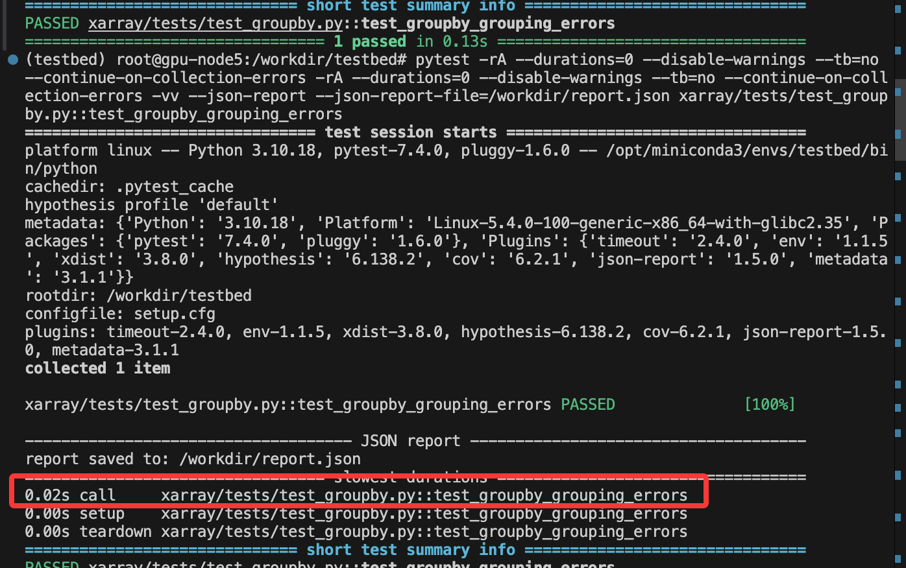
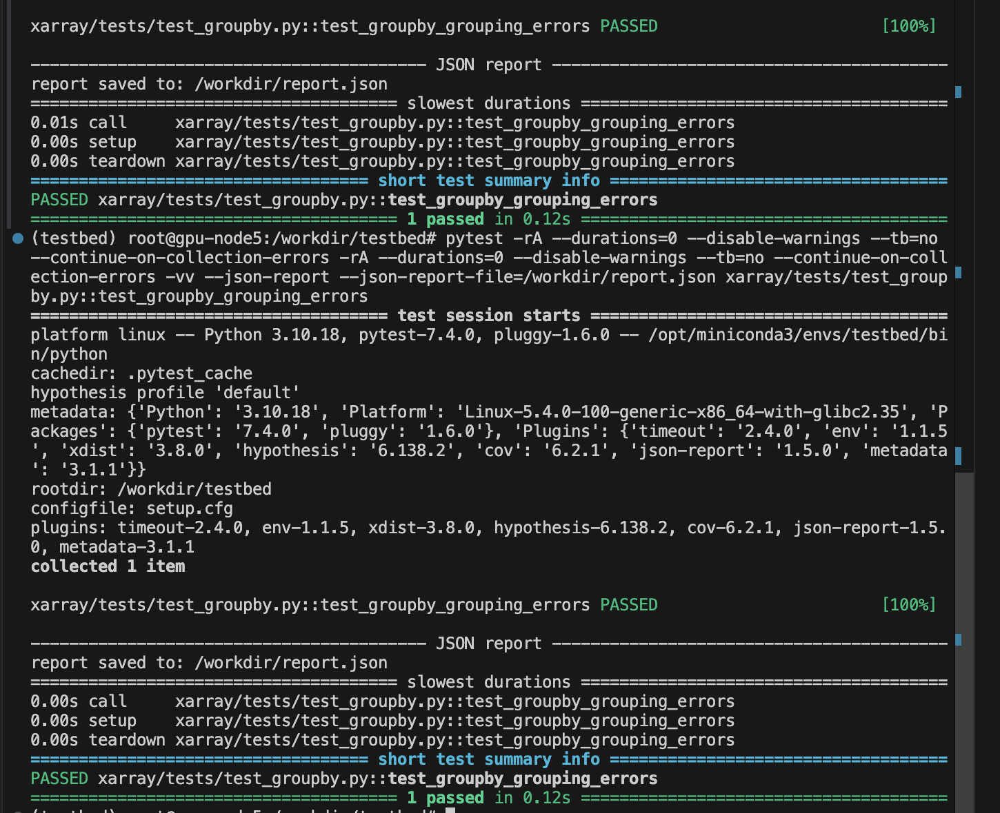

1. 接着10个case人肉结合llm搞搞

在 20260129.md里写

2. 有一个 finding 加深代码理解，源代码run_evaluation就是这么写的

3.1 实践发现，原先时间不对，计算了pytest整个框架的启动时间，然而实际上有精准test函数的 调用时间
之前的统计是基于整个框架的时间统计，
这是极度不负责任的，看下面这个
git apply前

git apply后

虽然整体上不是很显著，但是它包括了整个框架的时间，
这里call明显有加速的属于是

然后这个整体上看你0.13s， 0.12s差别不大，但是聚焦到这里call这里，差别非常大！！！
比如这里较稳定的 0.015和0.005

> SWE-Perf论文这里 也是直接看整体的，没看细节的！！！

