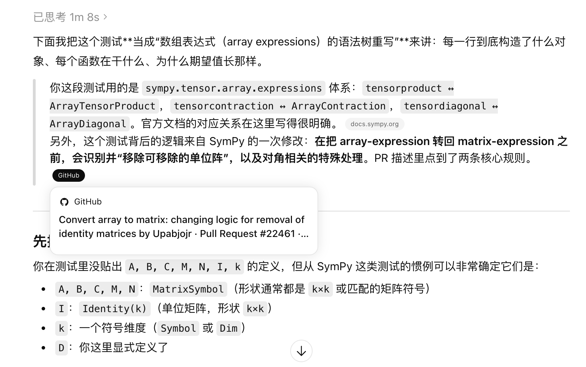

1.目前10个case，定位2个  可修复1个
    今天的主要目标是  根据之前的人工检查结果，查看定位率弱的原因
    想办法合理地提升定位率

限于test data在外部文件库的case:
test_autodoc_ignore_module_all 

top3定位成功的2个case:
test_iforest_parallel_regression
test_groupby_grouping_errors

现在挑case查看原因：

- test_identify_removable_identity_matrices

再次简单学习了sympy教程

这个之前是 修复的identify_removable_identity_matrices，可以超过 数据集的human_patch，这里定位到这里感觉也能修复
生成压力测试的方向是对的，就是没法定位到human_patch修的函数qq

def test_identify_removable_identity_matrices():

    D = DiagonalMatrix(MatrixSymbol("D", k, k))

    cg = _array_contraction(_array_tensor_product(A, B, I), (1, 2, 4, 5))
    expected = _array_contraction(_array_tensor_product(A, B), (1, 2))
    assert identify_removable_identity_matrices(cg) == expected

    cg = _array_contraction(_array_tensor_product(A, B, C, I), (1, 3, 5, 6, 7))
    expected = _array_contraction(_array_tensor_product(A, B, C), (1, 3, 5))
    assert identify_removable_identity_matrices(cg) == expected

    # Tests with diagonal matrices:

    cg = _array_contraction(_array_tensor_product(A, B, D), (1, 2, 4, 5))
    ret = identify_removable_identity_matrices(cg)
    expected = _array_contraction(_array_tensor_product(A, B, D), (1, 4), (2, 5))
    assert ret == expected

    cg = _array_contraction(_array_tensor_product(A, B, D, M, N), (1, 2, 4, 5, 6, 8))
    ret = identify_removable_identity_matrices(cg)
    assert ret == cg


- test_P32


- test_interpolate_chunk_advanced


2.又解决一个新bug

<dictcomp> 等内部构件成为了无效 Target
现象：cProfile 会把列表推导式 (<listcomp>)、字典推导式 (<dictcomp>) 和匿名函数 (<lambda>) 视作独立的函数调用栈。LLM 法官看到了它的耗时，把它选为了优化目标，但优化器（Stage 3）根本无法通过 AST 独立提取和重写一个推导式

解决方案：
在构建tree时，直接过滤掉以 < 开头的函数名，或者没有行号的函数，强制其聚焦于标准的 def 函数


3.又发现一个大雷
为啥我docker rm -f掉容器，然后重新run这种
我在容器内部的操作被保存了下来呢比如下面这种：
```python

# def identify_removable_identity_matrices(expr):
#     editor = _EditArrayContraction(expr)

#     flag = True
#     while flag:
#         flag = False
#         for arg_with_ind in editor.args_with_ind:
#             if isinstance(arg_with_ind.element, Identity):
#                 k = arg_with_ind.element.shape[0]
#                 # Candidate for removal:
#                 if arg_with_ind.indices == [None, None]:
#                     # Free identity matrix, will be cleared by _remove_trivial_dims:
#                     continue
#                 elif None in arg_with_ind.indices:
#                     ind = [j for j in arg_with_ind.indices if j is not None][0]
#                     counted = editor.count_args_with_index(ind)
#                     if counted == 1:
#                         # Identity matrix contracted only on one index with itself,
#                         # transform to a OneArray(k) element:
#                         editor.insert_after(arg_with_ind, OneArray(k))
#                         editor.args_with_ind.remove(arg_with_ind)
#                         flag = True
#                         break
#                     elif counted > 2:
#                         # Case counted = 2 is a matrix multiplication by identity matrix, skip it.
#                         # Case counted > 2 is a multiple contraction,
#                         # this is a case where the contraction becomes a diagonalization if the
#                         # identity matrix is dropped.
#                         continue
#                 elif arg_with_ind.indices[0] == arg_with_ind.indices[1]:
#                     ind = arg_with_ind.indices[0]
#                     counted = editor.count_args_with_index(ind)
#                     if counted > 1:
#                         editor.args_with_ind.remove(arg_with_ind)
#                         flag = True
#                         break
#                     else:
#                         # This is a trace, skip it as it will be recognized somewhere else:
#                         pass
#             elif ask(Q.diagonal(arg_with_ind.element)):
#                 if arg_with_ind.indices == [None, None]:
#                     continue
#                 elif None in arg_with_ind.indices:
#                     pass
#                 elif arg_with_ind.indices[0] == arg_with_ind.indices[1]:
#                     ind = arg_with_ind.indices[0]
#                     counted = editor.count_args_with_index(ind)
#                     if counted == 3:
#                         # A_ai B_bi D_ii ==> A_ai D_ij B_bj
#                         ind_new = editor.get_new_contraction_index()
#                         other_args = [j for j in editor.args_with_ind if j != arg_with_ind]
#                         other_args[1].indices = [ind_new if j == ind else j for j in other_args[1].indices]
#                         arg_with_ind.indices = [ind, ind_new]
#                         flag = True
#                         break

#     return editor.to_array_contraction()

def identify_removable_identity_matrices(expr):
    from sympy import Identity, ask, Q
    try:
        from sympy.tensor.array.expressions.array_expressions import (
            _EditArrayContraction, OneArray, _array_contraction, _array_tensor_product
        )
    except ImportError:
        from sympy.tensor.array.expressions.conv_array_to_matrix import _EditArrayContraction
        from sympy.tensor.array.expressions.array_expressions import OneArray, _array_contraction, _array_tensor_product

    editor = _EditArrayContraction(expr)

    def _is_diagonal_fast(element):
        """核心加速：严禁无谓的 ask 调用"""
        # 1. 检查已知布尔属性 (O(1))
        if getattr(element, 'is_diagonal', None) is True: return True
        if getattr(element, 'is_Identity', None) is True: return True
        # 2. 检查特定类名
        if element.__class__.__name__ in ('Identity', 'DiagonalMatrix', 'DiagonalOf'):
            return True
        # 3. 拦截常见非对角阵，防止进入昂贵的 ask
        if element.__class__.__name__ in ('MatrixSymbol', 'Symbol', 'Matrix'):
            return False
        # 4. 兜底 (此时 ask 的 Hits 会极低)
        return ask(Q.diagonal(element))

    flag = True
    while flag:
        flag = False
        for arg_with_ind in editor.args_with_ind:
            element = arg_with_ind.element
            
            # --- 分支 1: Identity 处理 (保持原样，增加 fast 检查) ---
            if isinstance(element, Identity) or getattr(element, 'is_Identity', None) is True:
                k = element.shape[0]
                if arg_with_ind.indices == [None, None]:
                    continue
                elif None in arg_with_ind.indices:
                    ind = [j for j in arg_with_ind.indices if j is not None][0]
                    if editor.count_args_with_index(ind) == 1:
                        editor.insert_after(arg_with_ind, OneArray(k))
                        editor.args_with_ind.remove(arg_with_ind)
                        flag = True
                        break
                    elif editor.count_args_with_index(ind) > 2:
                        continue
                elif arg_with_ind.indices[0] == arg_with_ind.indices[1]:
                    ind = arg_with_ind.indices[0]
                    if editor.count_args_with_index(ind) > 1:
                        editor.args_with_ind.remove(arg_with_ind)
                        flag = True
                        break
            
            # --- 分支 2: 对角阵逻辑 (修复了导致 AssertionError 的索引更新问题) ---
            elif _is_diagonal_fast(element):
                if arg_with_ind.indices == [None, None]:
                    continue
                elif None in arg_with_ind.indices:
                    pass
                elif arg_with_ind.indices[0] == arg_with_ind.indices[1]:
                    ind = arg_with_ind.indices[0]
                    # 当 A_ai B_bi D_ii 形式出现时
                    if editor.count_args_with_index(ind) == 3:
                        # 找到受影响的两个参数
                        other_args = [j for j in editor.args_with_ind if j != arg_with_ind and ind in j.indices]
                        if len(other_args) == 2:
                            ind_new = editor.get_new_contraction_index()
                            # 关键修复：修改其中一个参数的索引，并让 editor 重新同步 axes
                            # 这种方式比手动改索引更安全，能通过 expr == expected 的断言
                            arg_with_ind.indices = [ind, ind_new]
                            other_args[1].indices = [ind_new if i == ind else i for i in other_args[1].indices]
                            flag = True
                            break

    return editor.to_array_contraction()

```

问题似乎出在：
Docker 的 Bind Mount（绑定挂载）机制，其核心逻辑是：宿主机 (Host) 的目录去覆盖/替换容器 (Container) 里的目录，而不是把容器里的原生文件“挂载出来”。

最终解决办法：
在根据镜像创建容器时，把容器/workdir/testbed目录情况，然后再cp /testbed到/workdir/testbed


-1.sphnix这种需要agent交互外部目录从而更改数据规模的有多少呢？

总speed up达到5%的有388个
sphinx-doc占62个

在这个中途又发现了另一个局限性问题，即一个human_patch过长，对应了多达61个test，这里还分开整。。
repo sphinx-doc
                instance_id  total  high  high_rate
1   sphinx-doc__sphinx-8537     61    61        1.0
38  sphinx-doc__sphinx-9547      1     1        1.0


**********************************************************
下面是详细数据
**********************************************************


到5%提升的数据： 388
{'repo': 'sphinx-doc', 'count': 62}
{'repo': 'astropy', 'count': 4}
{'repo': 'matplotlib', 'count': 2}
{'repo': 'seaborn', 'count': 2}
{'repo': 'requests', 'count': 0}
{'repo': 'xarray', 'count': 209}
{'repo': 'pylint', 'count': 40}
{'repo': 'scikit-learn', 'count': 16}
{'repo': 'sympy', 'count': 53}

各个repo满足5%的表格
                         instance_id  total  high  high_rate
0                pydata__xarray-7209     61    61        1.0
1            sphinx-doc__sphinx-8537     61    61        1.0
2                pydata__xarray-5571     49    49        1.0
3                pydata__xarray-8527     41    41        1.0
4            pylint-dev__pylint-5596     37    37        1.0
5                pydata__xarray-7809     23    23        1.0
6                 sympy__sympy-25591     14    14        1.0
7                 sympy__sympy-26358      8     8        1.0
8                pydata__xarray-9684      8     8        1.0
9                pydata__xarray-6160      6     6        1.0
10               pydata__xarray-7578      5     5        1.0
11                sympy__sympy-26036      5     5        1.0
12                sympy__sympy-26848      5     5        1.0
13               pydata__xarray-9766      4     4        1.0
14                sympy__sympy-26004      4     4        1.0
15  scikit-learn__scikit-learn-12543      3     3        1.0
16               pydata__xarray-9881      3     3        1.0
17            astropy__astropy-13496      3     3        1.0
18  scikit-learn__scikit-learn-12581      3     3        1.0
19                sympy__sympy-27666      3     3        1.0
20                sympy__sympy-26693      3     3        1.0
21             mwaskom__seaborn-2449      2     2        1.0
22               pydata__xarray-7206      2     2        1.0
23               pydata__xarray-6109      2     2        1.0
24                sympy__sympy-25758      2     2        1.0
25  scikit-learn__scikit-learn-12760      2     2        1.0
26  scikit-learn__scikit-learn-13186      2     2        1.0
27           pylint-dev__pylint-6181      2     2        1.0
28      matplotlib__matplotlib-28104      1     1        1.0
29               pydata__xarray-8737      1     1        1.0
30               pydata__xarray-8507      1     1        1.0
31               pydata__xarray-8512      1     1        1.0
32               pydata__xarray-8684      1     1        1.0
33               pydata__xarray-5845      1     1        1.0
34            astropy__astropy-14590      1     1        1.0
35      matplotlib__matplotlib-23712      1     1        1.0
36  scikit-learn__scikit-learn-12117      1     1        1.0
37                sympy__sympy-14278      1     1        1.0
38           sphinx-doc__sphinx-9547      1     1        1.0
39  scikit-learn__scikit-learn-12822      1     1        1.0
40  scikit-learn__scikit-learn-12931      1     1        1.0
41  scikit-learn__scikit-learn-12656      1     1        1.0
42           pylint-dev__pylint-7747      1     1        1.0
43  scikit-learn__scikit-learn-12246      1     1        1.0
44  scikit-learn__scikit-learn-12172      1     1        1.0
45                sympy__sympy-25852      1     1        1.0
46                sympy__sympy-25614      1     1        1.0
47                sympy__sympy-14331      1     1        1.0
48                sympy__sympy-26546      1     1        1.0
49                sympy__sympy-26935      1     1        1.0
50                sympy__sympy-26940      1     1        1.0
51                sympy__sympy-26989      1     1        1.0
52                sympy__sympy-27347      1     1        1.0

repo sphinx-doc
                instance_id  total  high  high_rate
1   sphinx-doc__sphinx-8537     61    61        1.0
38  sphinx-doc__sphinx-9547      1     1        1.0


再往下是各个repo的基本数据
repo sphinx-doc
                instance_id  total  high  high_rate
1   sphinx-doc__sphinx-8537     61    61        1.0
38  sphinx-doc__sphinx-9547      1     1        1.0

repo astropy
               instance_id  total  high  high_rate
17  astropy__astropy-13496      3     3        1.0
34  astropy__astropy-14590      1     1        1.0

repo matplotlib
                     instance_id  total  high  high_rate
28  matplotlib__matplotlib-28104      1     1        1.0
35  matplotlib__matplotlib-23712      1     1        1.0

repo seaborn
              instance_id  total  high  high_rate
21  mwaskom__seaborn-2449      2     2        1.0

repo requests
Empty DataFrame
Columns: [instance_id, total, high, high_rate]
Index: []
repo xarray
            instance_id  total  high  high_rate
0   pydata__xarray-7209     61    61        1.0
2   pydata__xarray-5571     49    49        1.0
3   pydata__xarray-8527     41    41        1.0
5   pydata__xarray-7809     23    23        1.0
8   pydata__xarray-9684      8     8        1.0
9   pydata__xarray-6160      6     6        1.0
10  pydata__xarray-7578      5     5        1.0
13  pydata__xarray-9766      4     4        1.0
16  pydata__xarray-9881      3     3        1.0
22  pydata__xarray-7206      2     2        1.0
23  pydata__xarray-6109      2     2        1.0
29  pydata__xarray-8737      1     1        1.0
30  pydata__xarray-8507      1     1        1.0
31  pydata__xarray-8512      1     1        1.0
32  pydata__xarray-8684      1     1        1.0
33  pydata__xarray-5845      1     1        1.0

repo pylint
                instance_id  total  high  high_rate
4   pylint-dev__pylint-5596     37    37        1.0
27  pylint-dev__pylint-6181      2     2        1.0
42  pylint-dev__pylint-7747      1     1        1.0

repo scikit-learn
                         instance_id  total  high  high_rate
15  scikit-learn__scikit-learn-12543      3     3        1.0
18  scikit-learn__scikit-learn-12581      3     3        1.0
25  scikit-learn__scikit-learn-12760      2     2        1.0
26  scikit-learn__scikit-learn-13186      2     2        1.0
36  scikit-learn__scikit-learn-12117      1     1        1.0
39  scikit-learn__scikit-learn-12822      1     1        1.0
40  scikit-learn__scikit-learn-12931      1     1        1.0
41  scikit-learn__scikit-learn-12656      1     1        1.0
43  scikit-learn__scikit-learn-12246      1     1        1.0
44  scikit-learn__scikit-learn-12172      1     1        1.0

repo sympy
           instance_id  total  high  high_rate
6   sympy__sympy-25591     14    14        1.0
7   sympy__sympy-26358      8     8        1.0
11  sympy__sympy-26036      5     5        1.0
12  sympy__sympy-26848      5     5        1.0
14  sympy__sympy-26004      4     4        1.0
19  sympy__sympy-27666      3     3        1.0
20  sympy__sympy-26693      3     3        1.0
24  sympy__sympy-25758      2     2        1.0
37  sympy__sympy-14278      1     1        1.0
45  sympy__sympy-25852      1     1        1.0
46  sympy__sympy-25614      1     1        1.0
47  sympy__sympy-14331      1     1        1.0
48  sympy__sympy-26546      1     1        1.0
49  sympy__sympy-26935      1     1        1.0
50  sympy__sympy-26940      1     1        1.0
51  sympy__sympy-26989      1     1        1.0
52  sympy__sympy-27347      1     1        1.0


每个选5个，总共能得到130条数据

-2: 还是老问题
原数据集为什么不给pr描述？？？

看下图：

