##
使用snakeviz
idx = 0
提升幅度实在不明显。

idx=1
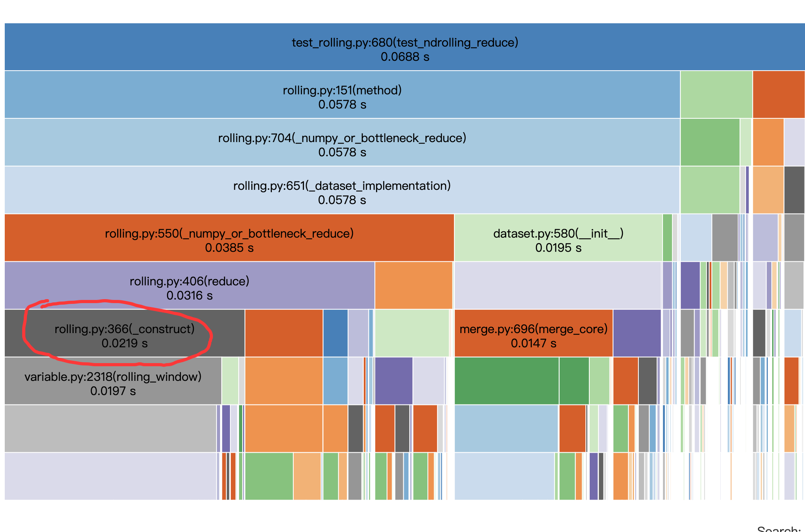

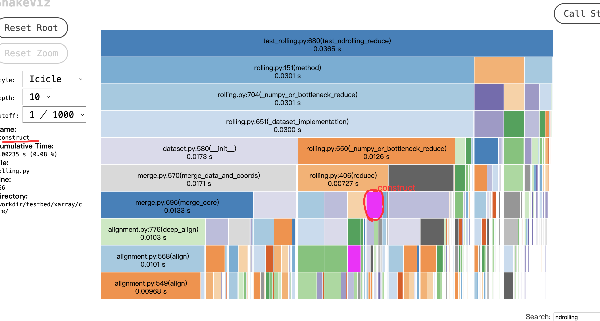

pure Function: ('/workdir/testbed/xarray/core/rolling.py', 366, '_construct'), Cum Delta: -0.019517813000000002 
seconds, Cum Delat Rate:0.6046497384596854 Cum Rank Delta: 610

pure Function: ('/workdir/testbed/xarray/core/variable.py', 2318, 'rolling_window'), Cum Delta: -0.019119844 
seconds, Cum Delat Rate:0.5923209057280129 Cum Rank Delta: 1613

idx=2

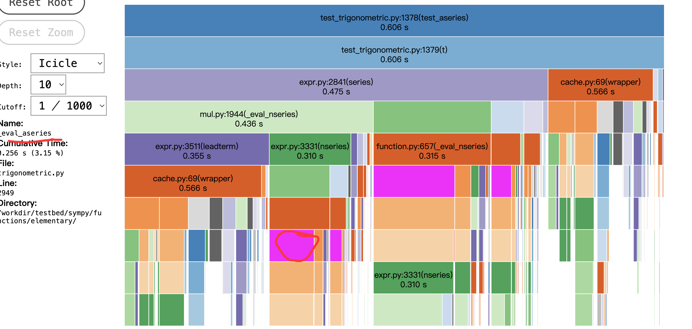
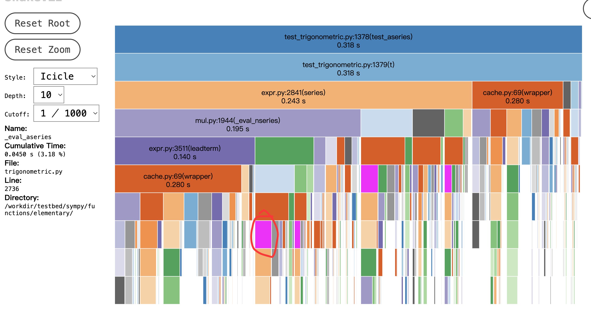
human patch ['sympy/functions/elementary/trigonometric.py:_eval_aseries']
直接优化hotspots策略

idx=3
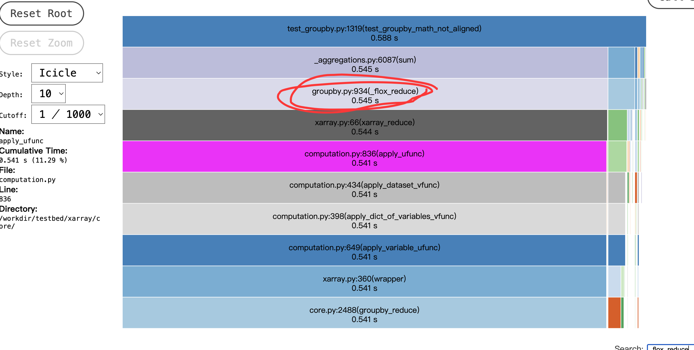
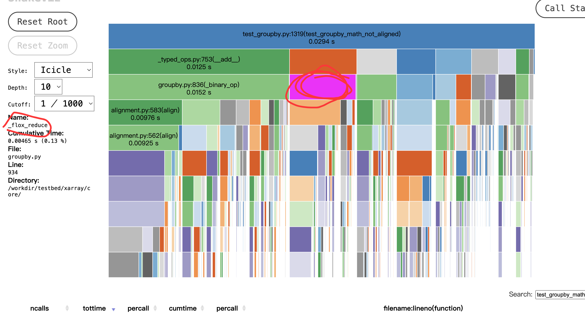
human patch 'xarray/core/groupby.py:_flox_reduce'
这定位到中间了真没招。。

idx=4
[
    'asv_bench/benchmarks/renaming.py:time_swap_dims_newindex',
    'xarray/core/alignment.py:_get_indexes_and_vars',
    'xarray/core/variable.py:to_index_variable',
    'xarray/core/indexes.py:_copy',
    'xarray/core/indexes.py:copy',
    'xarray/core/indexes.py:copy_indexes',
    'xarray/core/indexes.py:get_indexer_nd',
    'xarray/core/alignment.py:override_indexes',
    'asv_bench/benchmarks/renaming.py:setup',
    'asv_bench/benchmarks/renaming.py:time_swap_dims'
]
还是无法找到这个target func到底干的啥
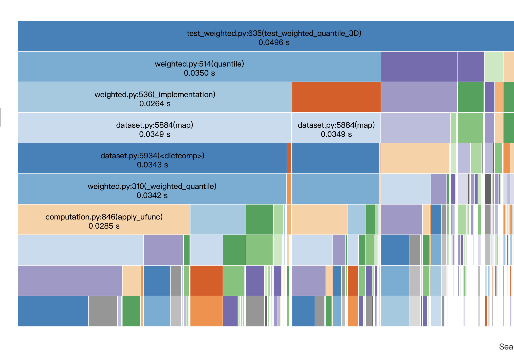
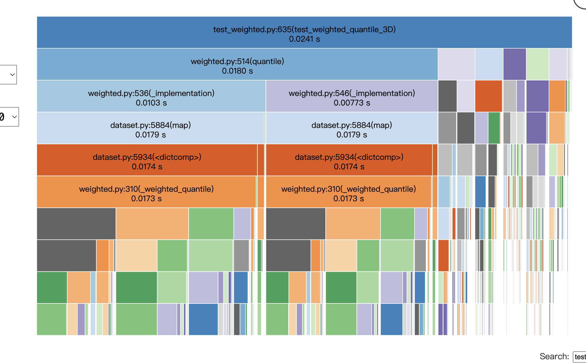

idx = 5
sympy__sympy-26358
sympy/integrals/tests/test_integrals.py::test_issue_15124
['sympy/integrals/heurisch.py:_iter_mappings', 'sympy/integrals/heurisch.py:heurisch']
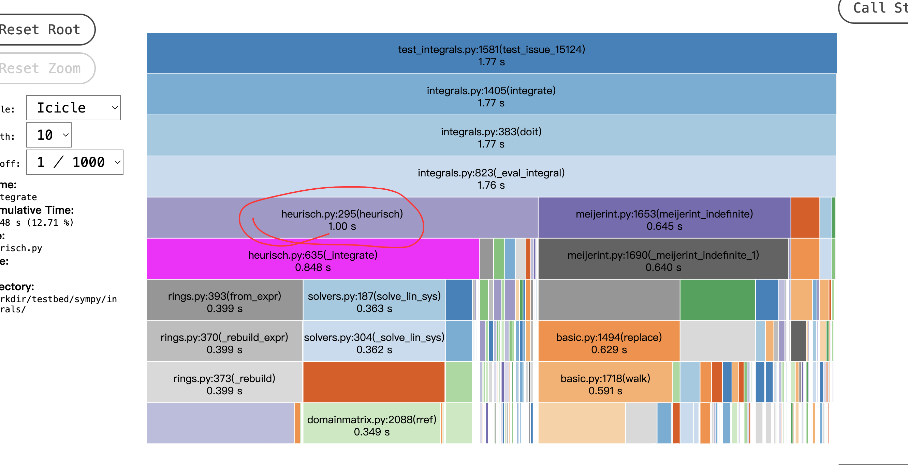
    
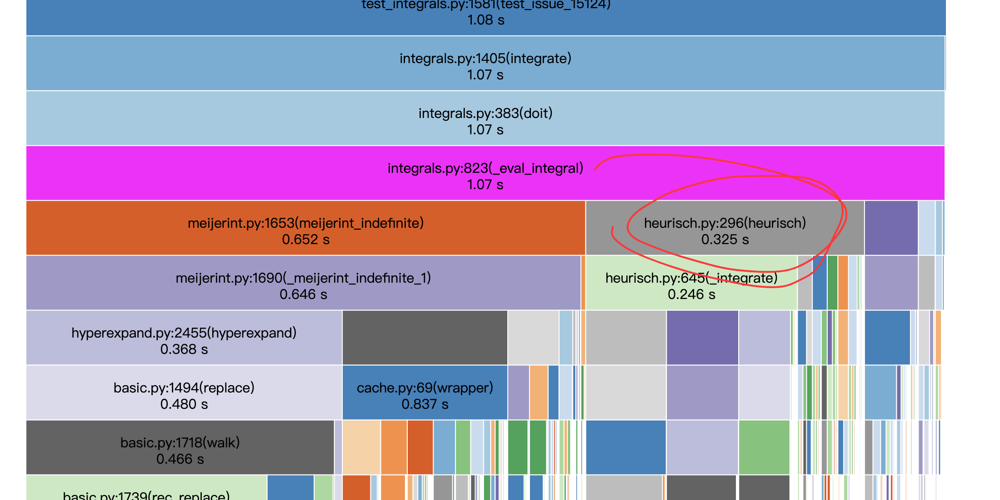

idx = 6
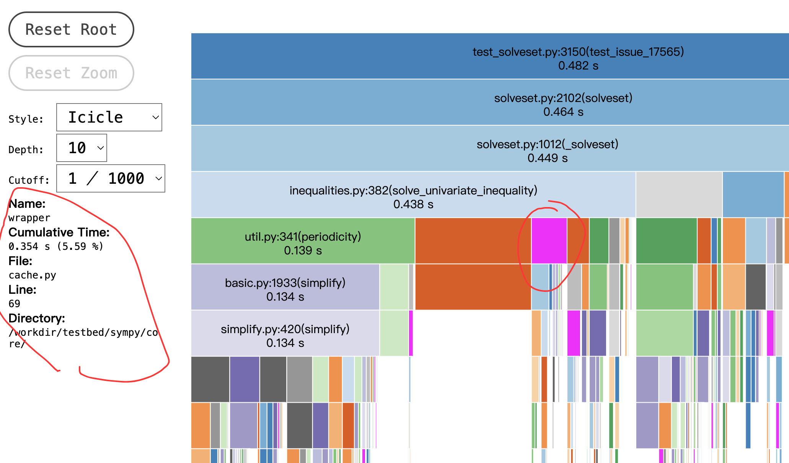
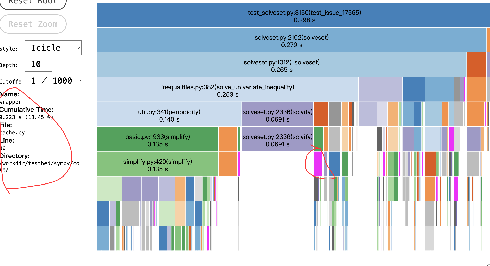
虽然hotspots在wrapper，但是
['sympy/solvers/inequalities.py:valid', 'sympy/solvers/solvers.py:_invert']
主要更改点居然是旁边的valid函数
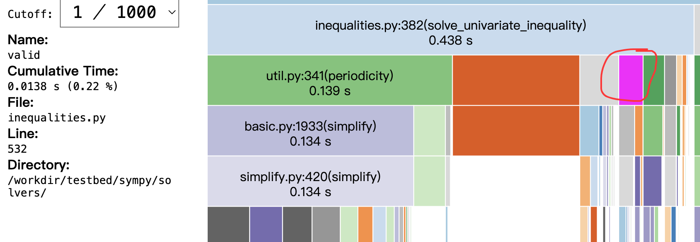

## 统计分析：

直接或者去除Pure得到的function他还是有问题
cum一度占比超过root

思考解决方法：
仅仅保留能被root call到的Stats。

**保留属于目标 test root 调用闭包的函数**

分析hotspots

分析patch

## 新的问题
patch 在前后pstats没找到，是不是意味着这是个假定位

patch target的前后delta cum居然不等于test root的。这又是为啥？

