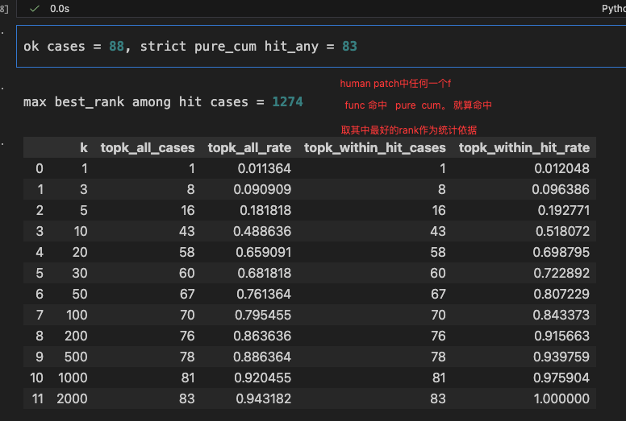
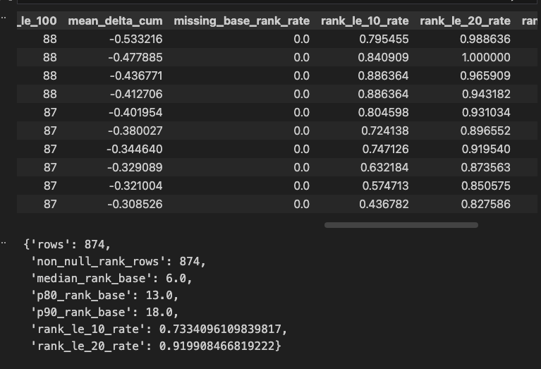

direct的 cum和tot基本没有一点用

# findings 编辑函数召回 
取human patch func，计算其在pure cum中的rank，取其中最好的rank作为统计数据

从下图看topk100， 取100比较合理， 50可以达到80%的命中，100可以达到84%， 200可以达到91%

但是，**提取 patch 里被修改/受影响的函数块，它本质是“编辑痕迹信号”，不是“优化意图信号”**

# exp   hotspots_delta_max的统计

这个实验可以完全不看 human_patch_targets，只用 patch 前/后两份 profile 做：
定义（每个 case 单独算）
- pure 视图：只保留仓库内函数（/workdir/testbed/），排除外部依赖、<module>、/tests/、conftest.py（和你 notebook 里 strict 口径一致）。
- 对每个 pure 函数 f（用同一 canonical key：relative_path:function）取：
  - cum_base(f)：patch 前 cumulative time（缺失当 0）
  - cum_head(f)：patch 后 cumulative time（缺失当 0）
  - Δcum(f) = cum_head(f) - cum_base(f)（越负代表“变好”越多：更快或不再被调用）
- TopKΔ（你说的 topk delta pure cum）：按 Δcum 从小到大排序，取前 K 个函数。
你要的“patch 前 rank”怎么取
- 先把 patch 前所有 pure 函数按 cum_base 从大到小排出 rank：rank_base(f)（1 = 最热）。
- 然后对 TopKΔ 里的每个函数 f，直接查它的 rank_base(f)。
- 最终输出就是：每个 case 的 [(delta_rank, f, Δcum, cum_base, cum_head, rank_base)]。
你应该汇总哪些统计（回答“这些 intent 函数在 patch 前有多热”）
- 对所有 case、所有 TopKΔ 函数收集 rank_base，给出分布：median / p80 / p90 / max。
- 重点两个比例：P(rank_base ≤ 10)、P(rank_base ≤ 20)（分别对应“意图函数是否通常就在 baseline top10/top20 热点里”）。
- 额外标一个关键解释列：present_head?（如果 patch 后函数直接不出现了，cum_head=0，这往往是“控制点把路径关掉/减少调用”的意图，不一定是改热点本体）。
这套实验的好处是：TopKΔ 更接近“优化意图（成本下降发生在哪）”，而不是“人改了哪”。这个实验可以完全不看 human_patch_targets，只用 patch 前/后两份 profile 做：
定义（每个 case 单独算）
- pure 视图：只保留仓库内函数（/workdir/testbed/），排除外部依赖、<module>、/tests/、conftest.py（和你 notebook 里 strict 口径一致）。
- 对每个 pure 函数 f（用同一 canonical key：relative_path:function）取：
  - cum_base(f)：patch 前 cumulative time（缺失当 0）
  - cum_head(f)：patch 后 cumulative time（缺失当 0）
  - Δcum(f) = cum_head(f) - cum_base(f)（越负代表“变好”越多：更快或不再被调用）
- TopKΔ（你说的 topk delta pure cum）：按 Δcum 从小到大排序，取前 K 个函数。
你要的“patch 前 rank”怎么取
- 先把 patch 前所有 pure 函数按 cum_base 从大到小排出 rank：rank_base(f)（1 = 最热）。
- 然后对 TopKΔ 里的每个函数 f，直接查它的 rank_base(f)。
- 最终输出就是：每个 case 的 [(delta_rank, f, Δcum, cum_base, cum_head, rank_base)]。
你应该汇总哪些统计（回答“这些 intent 函数在 patch 前有多热”）
- 对所有 case、所有 TopKΔ 函数收集 rank_base，给出分布：median / p80 / p90 / max。
- 重点两个比例：P(rank_base ≤ 10)、P(rank_base ≤ 20)（分别对应“意图函数是否通常就在 baseline top10/top20 热点里”）。
- 额外标一个关键解释列：present_head?（如果 patch 后函数直接不出现了，cum_head=0，这往往是“控制点把路径关掉/减少调用”的意图，不一定是改热点本体）。
这套实验的好处是：TopKΔ 更接近“优化意图（成本下降发生在哪）”，而不是“人改了哪”。

# hotspots 在trunk的统计
现在的 topk_trunk_summary_df 结果是：
- k=1
  - mean_delta_rate_visible ≈ 0.438
  - mean_delta_mass_rate_visible ≈ 0.452
- k=2
  - mean_delta_rate_visible ≈ 0.597
  - mean_delta_mass_rate_visible ≈ 0.600
- k=3
  - mean_delta_rate_visible ≈ 0.637
  - mean_delta_mass_rate_visible ≈ 0.632
- k=5
  - mean_delta_rate_visible ≈ 0.711
  - mean_delta_mass_rate_visible ≈ 0.701

# 直接拿 TopKΔ 里的 canonical_key
- 与 human_patch_targets 规范化后的 relative_path:function
- 做精确字符串匹配
- 不做 ancestor / 邻域放宽
- patch funcs 用 all 口径，不再做 visible 过滤
验证结果
- delta_patch_hit_df_shape = (356, 10)
- delta_patch_hit_summary_df 结果：
- Top1Δ
  - hit_any_rate ≈ 0.213
- Top3Δ
  - hit_any_rate ≈ 0.404
- Top5Δ
  - hit_any_rate ≈ 0.539
- Top10Δ
  - hit_any_rate ≈ 0.640

# 新的方法

沿着主干profiler
读取总结所有code

下一步确定hotspots，
然后思考优化策略，

再确定edit location，
然后进行优化。

1.看 profiler / flame graph，定位时间花在哪
2.沿调用链找真正可改、值得改的控制点
3.改完再 profile 验证，确认收益来自哪里

用sisyphus写一个试试得了

# 这些统计都需要验证下

