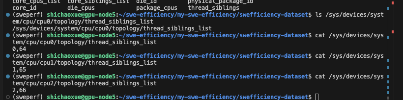

# 0.
 开始看罗素的《幸福之路》
看完一篇后，思考下脉络逻辑，或许读论文也是这样

# 1. 看论文

师兄推了 **formula code** 这个benchmark，
顺藤摸瓜又找了个 **swe efficiency**的benchmark

发现了一个致命的问题

这个workload 和 correctness test，它必须要分开啊！！！

现在从俩中挑一个，选作数据集，然后把 fuzz、stress、profiler往 workload上面用。

## asv 和 porfiler区别 ？

# 搭建swe-efficiency环境，并尝试stress和profiler workload

workload是不是就是最小复现问题的脚本啊

# 2. 最后选择SWE-efficiency作为新数据集

一是因为这代码是老套路啊， 只不过多加了一层 workload image

而且，这里分配给docker的cpu考虑的真的细啊，wk

考虑了 超线程SMT 以及 NUMA

每个物理核有 2 个线程（SMT=2），并且它们的编号相隔 64
也就是说：
物理核	逻辑 CPU（threads）
core 0	0 和 64
core 1	1 和 65
core 2	2 和 66

这里写的太牛了！！！

