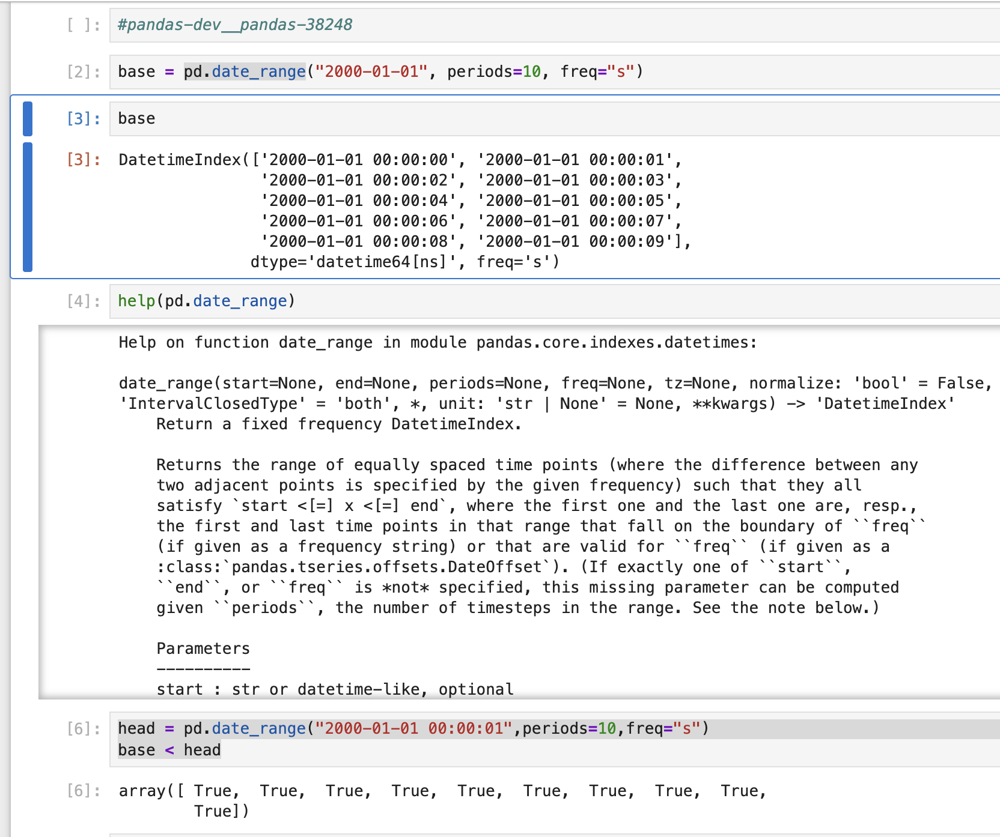
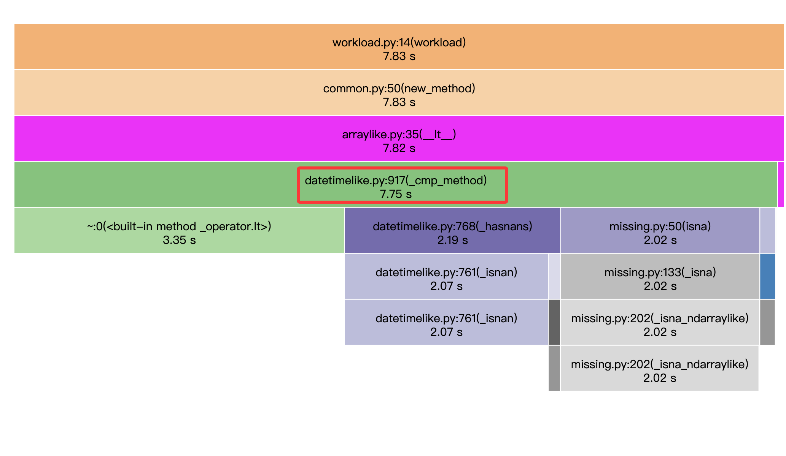
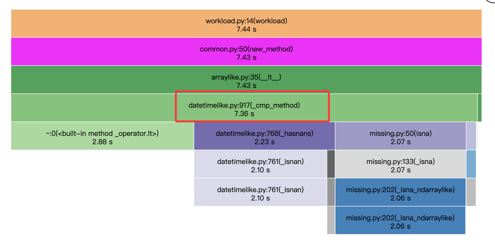
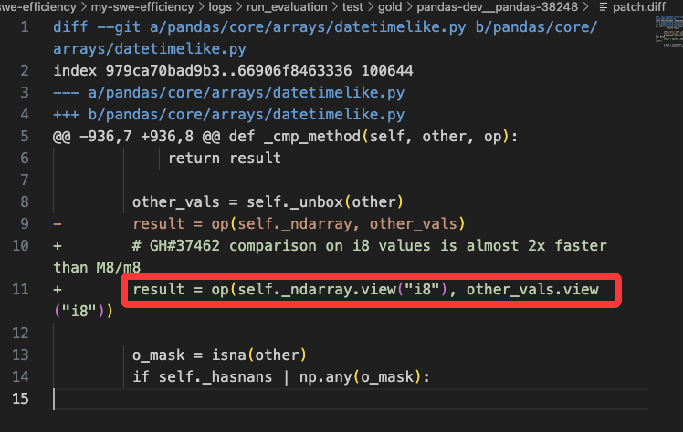
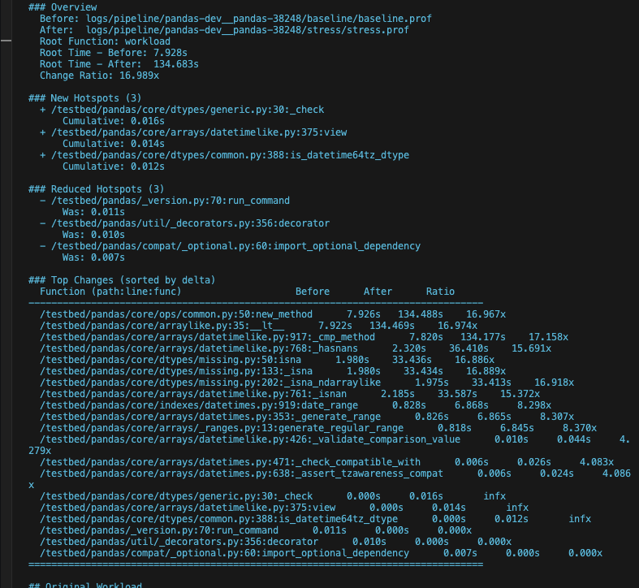
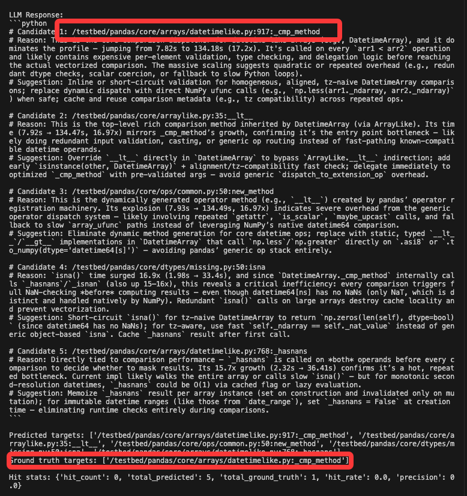
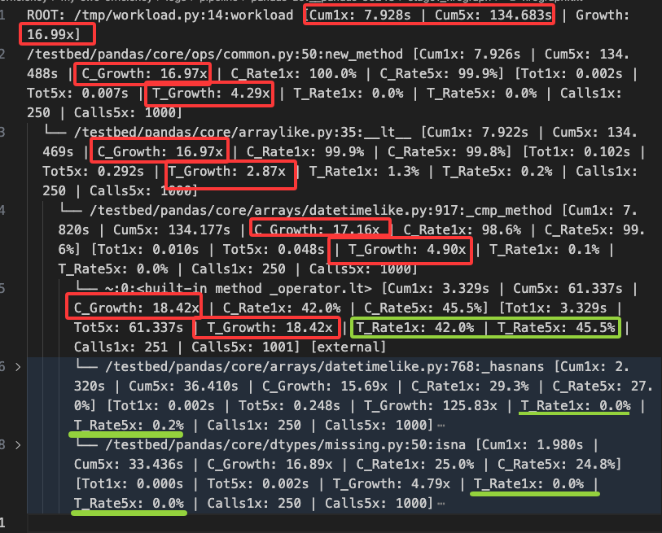

## 理解coverage的三个文件
### 理解run_to_run_isolation
把原始 workload 脚本改写成"每次 timeit 迭代在独立子进程中执行"的版本。
这样可以消除以下 run-to-run 干扰因素：
- 模块级缓存（lru_cache, dict cache 等）
- 全局状态污染
- Python 解释器热身效应
- JIT 编译器的 warmup（如 numba）
- 内存碎片化

## 理解case，写初步profile代码

1是就这条case，``ghcr.io/swefficiency/swefficiency-images:pandas-dev__pandas-38248``,尝试理解代码，

代码背景：

patch及前后profile

patch本身理解：

编了一天代码，
最后可能由于该case的简易性，定位成功！

因为workload里就是简单的对 datetimelike这个class的数据进行  < 这个比大小操作，
然后这里明显__lt__可能是一个 抽象基类，
这里llm应该是思考推理了的。

仔细看这个图
**增长最快的cum还真是要改的**

明显该类型属于，高tot的最近项目邻接点

## 发现了另一个现象
这个每次运行，它是有 方差的

这就导致hotspots也会发生变化，这种细微的变化对定位有帮助吗？

