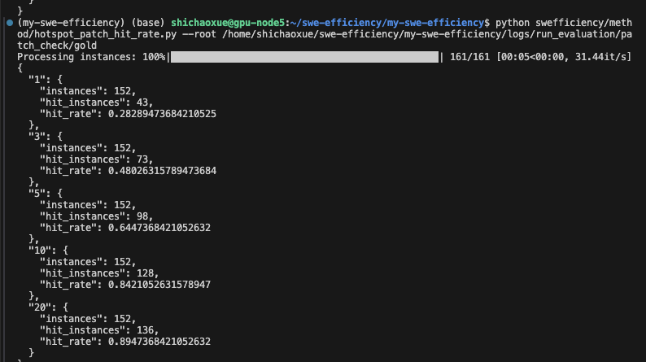

1. 通过昨天的例子，似乎因为workload的原因，数据质量还不错？


现在验证下hotspots cum的topk命中率

直接起飞了。。



```json
{
  "1": {
    "instances": 152,
    "hit_instances": 43,
    "hit_rate": 0.28289473684210525
  },
  "3": {
    "instances": 152,
    "hit_instances": 73,
    "hit_rate": 0.48026315789473684
  },
  "5": {
    "instances": 152,
    "hit_instances": 98,
    "hit_rate": 0.6447368421052632
  },
  "10": {
    "instances": 152,
    "hit_instances": 128,
    "hit_rate": 0.8421052631578947
  },
  "20": {
    "instances": 152,
    "hit_instances": 136,
    "hit_rate": 0.8947368421052632
  }
}
Skipped 9 instances (missing prof/patch).
```


果然就是workload的重要性啊，
但是这样子怎么搞创新呢？？？


## 跟师兄简单讨论后：主要目的是把profiler的作用发挥出来

压力tot/正常tot  这个比值topk的   在  正常tot/优化后tot 这个比值里面是不是也排top k


主要思路是 **有性能问题的函数在压力测试下耗时增加更加显著，所以“压力tot/正常tot ”比值大**；优化也主要就是为了提升这些有性能问题的函数，因此**优化后的性能提升也会比较明显 “正常tot/优化后tot”值大**


**看了20条左右数据，好多年 n=多少 来定义闺蜜的**
这样子，只做数据规模的压力测试，似乎好像真的可以。


撰写stress_optimization_correlation文件，用于上述实验统计


