## astropy_astropy-7616. 关于copy=True， stress漂移了
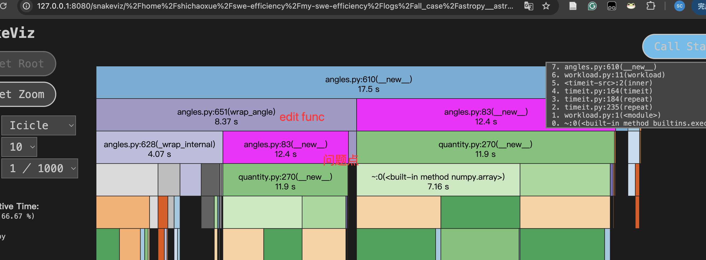

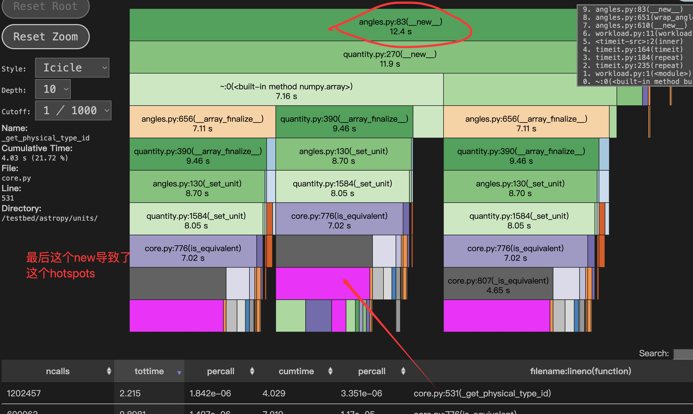

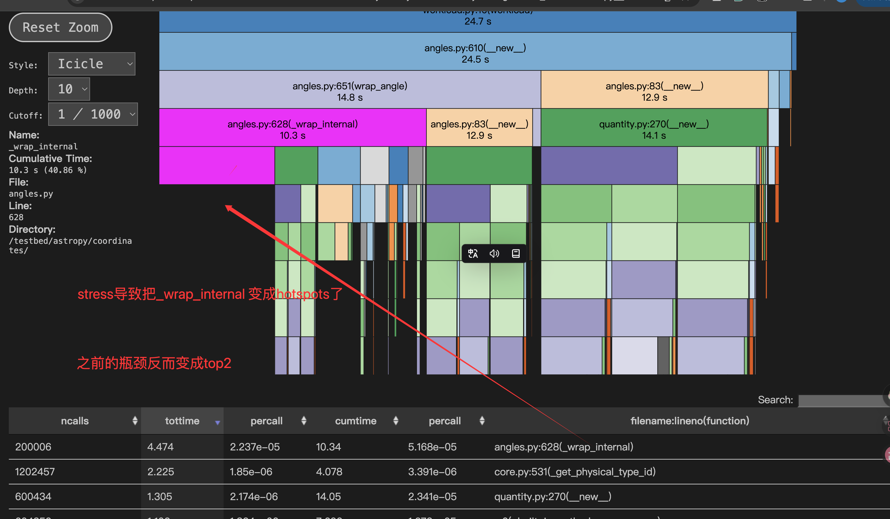

不过在stress_pre. - stress_post中wrap_internal倒不是最高的
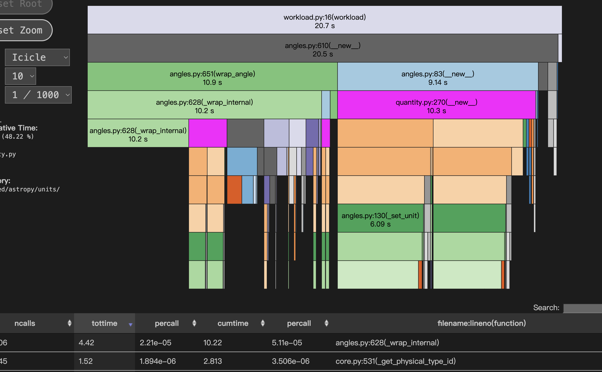

**hybrid_time_compare_all_case**/astropy__astropy-7616/top1_comparisons.csv. 完美体现了这个问题
**stress_hybrid_time_compare_all_case**/astropy__astropy-7616/top1_comparisons.csv

也就是pre-post、stress_pre - stress_post 都是对的，体现了/testbed/astropy/units/core.py:531:_get_physical_type_id
而base本身体现的就是_get_physical_type_id， 但stress把_wrap_internal给搞出来了


## astropy__astropy-13471

base
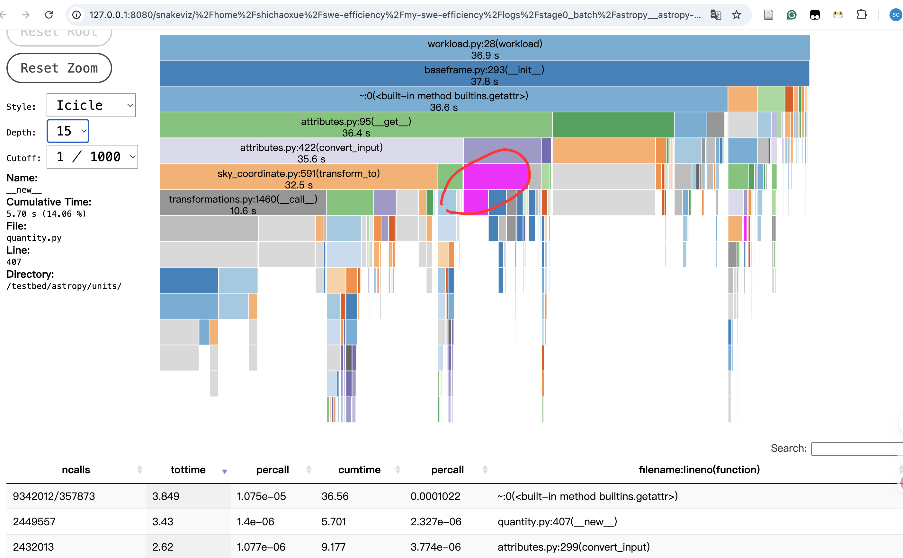

patch
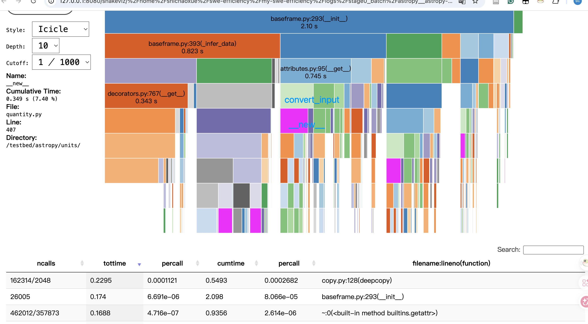

stress
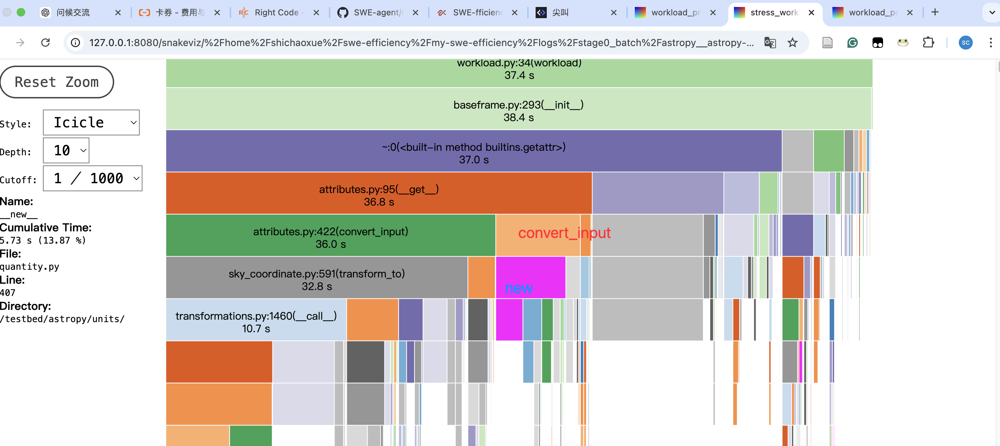

stress本身是对的， stress-base又错了。。


## astropy__astropy-10814


## astropy__astropy_13497 hotspots就是edit func
hotspots就是edit func
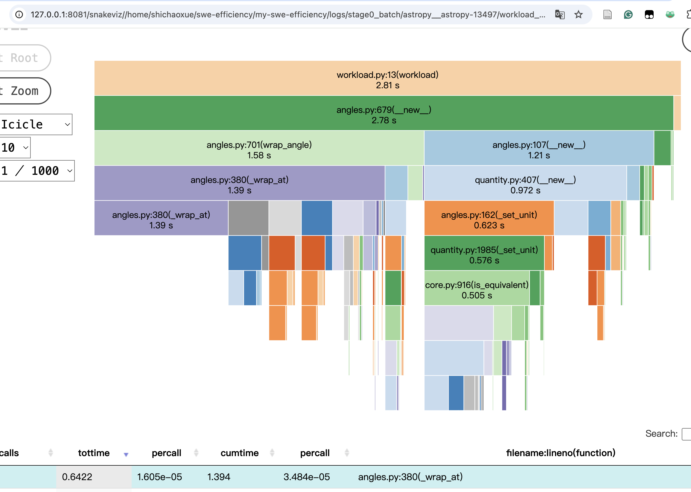


## astropy__astropy-12699 hotspots向上走多跳


patch如下：
```patch
--- a/astropy/units/format/fits.py
+++ b/astropy/units/format/fits.py
@@ -98,7 +98,7 @@ def _validate_unit(cls, unit, detailed_exception=True):
 
     @classmethod
     def _parse_unit(cls, unit, detailed_exception=True):
-        cls._validate_unit(unit)
+        cls._validate_unit(unit, detailed_exception=detailed_exception)
         return cls._units[unit]
```
关键代码如下：
```python
    @classmethod
    def _validate_unit(cls, unit, detailed_exception=True):
        if unit not in cls._units:
            if detailed_exception:
                raise ValueError(
                    "Unit '{}' not supported by the FITS standard. {}".format(
                        unit, utils.did_you_mean_units(
                            unit, cls._units, cls._deprecated_units,
                            cls._to_decomposed_alternative)))
            else:
                raise ValueError()

        if unit in cls._deprecated_units:
            utils.unit_deprecation_warning(
                unit, cls._units[unit], 'FITS',
                cls._to_decomposed_alternative)

    @classmethod
    def _parse_unit(cls, unit, detailed_exception=True):
        cls._validate_unit(unit)
        return cls._units[unit]
```

prof
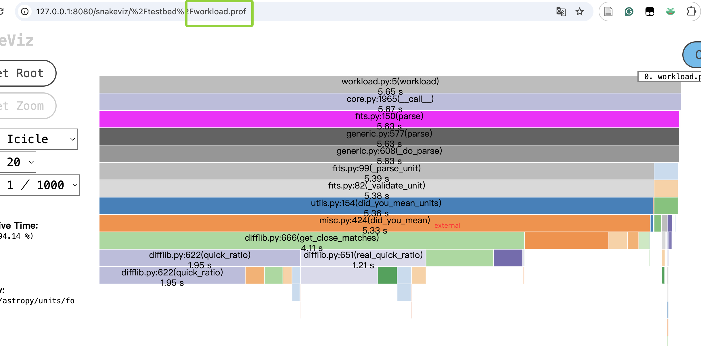

patch 后的prof
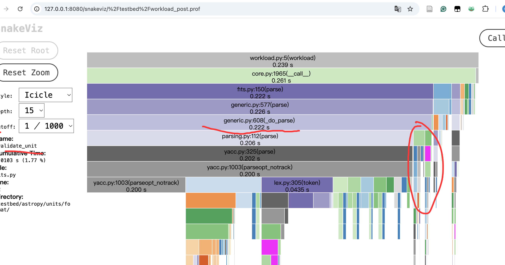

根据patch.diff我们可以知道，edit function在_parse_unit。
那么hotspots是啥？？？如下图
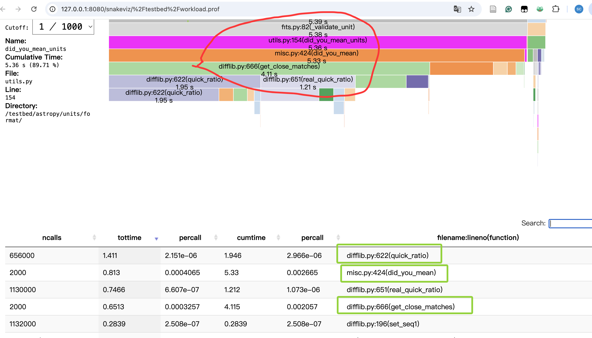

patch后这些hotspots还存在吗？不存在，因为代码都不走这个did you mean了。


**stress:下面看stress对不对**: **同构做的很好，是对的**。
```python

import timeit
import statistics
import astropy.units as u

def setup():
    # 创建大量不同的FITS单位字符串
    # 包括各种速度单位的表示法，以及一些复合单位
    # 增加数据量到400个不同的单位字符串
    global unit_strings
    base_units = [
        'km/s', 'm/s', 'km s-1', 'm s-1', 'km.s-1', 'm.s-1',
        'km s**-1', 'm s**-1', 'km / s', 'm / s', 'km s⁻¹', 'm s⁻¹',
        'km*s^-1', 'm*s^-1', 'km * s^-1', 'm * s^-1', 'km s^-1', 'm s^-1',
        'km.s**-1', 'm.s**-1', 'km/h', 'm/h', 'km hr-1', 'm hr-1',
        'km.hr-1', 'm.hr-1', 'km hr**-1', 'm hr**-1', 'km / hr', 'm / hr',
        'km*hr^-1', 'm*hr^-1', 'km hr^-1', 'm hr^-1', 'km.hr**-1', 'm.hr**-1',
        'km/min', 'm/min', 'km min-1', 'm min-1', 'km.min-1', 'm.min-1',
        'km min**-1', 'm min**-1', 'km / min', 'm / min', 'km*min^-1', 'm*min^-1',
        'km min^-1', 'm min^-1', 'km.min**-1', 'm.min**-1'
    ]
    
    # 创建复合单位：速度单位与其他单位的组合
    # 这些应该仍然可以被解析为速度单位（通过等效性检查）
    compound_units = []
    for base in ['km/s', 'm/s', 'km s-1', 'm s-1']:
        compound_units.extend([
            f'{base} * Hz',  # 速度 * 频率 = 加速度？
            f'{base} / Hz',  # 速度 / 频率 = 距离？
            f'{base} * s',   # 速度 * 时间 = 距离
            f'{base} / s',   # 速度 / 时间 = 加速度
            f'{base} * m',   # 速度 * 距离 = 面积/时间？
            f'{base} / m',   # 速度 / 距离 = 频率
            f'{base} * kg',  # 速度 * 质量 = 动量
            f'{base} / kg',  # 速度 / 质量 = 特定动量
        ])
    
    # 添加一些更复杂的表达式（但仍然有效）
    complex_units = []
    for i in range(50):
        complex_units.append(f'km/s * (s^{i%3+1}) / (m^{i%2+1}) * (kg^{i%4})')
    
    # 合并所有单位字符串
    unit_strings = base_units * 5 + compound_units * 3 + complex_units
    
    # 设置全局索引
    global current_index
    current_index = 0

def workload():
    # 保持原始功能：创建'km/s'单位
    # 但增加负载：每次调用解析多个单位字符串
    global current_index
    
    # 每次解析10个单位字符串（增加workload复杂度）
    for i in range(10):
        idx = (current_index + i) % len(unit_strings)
        unit_str = unit_strings[idx]
        
        # 使用FITS格式创建单位（原始功能的核心）
        try:
            unit = u.Unit(unit_str, format='fits')
            # 检查是否与速度单位等价（增加一些计算）
            _ = unit.is_equivalent('km/s')
        except (ValueError, u.UnitsError):
            # 如果解析失败，跳过（某些复杂表达式可能无效）
            pass
    
    # 更新索引供下次调用使用
    current_index = (current_index + 10) % len(unit_strings)
    
    # 仍然执行原始操作以确保功能等价
    base_unit = u.Unit('km/s', format='fits')

runtimes = timeit.repeat(workload, number=1, repeat=2000, setup=setup)

print("Mean:", statistics.mean(runtimes[-1000:]))
print("Std Dev:", statistics.stdev(runtimes[-1000:]))

```

接着我们从profile上看，能否揭发出什么共性：
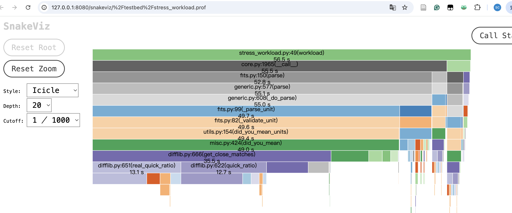

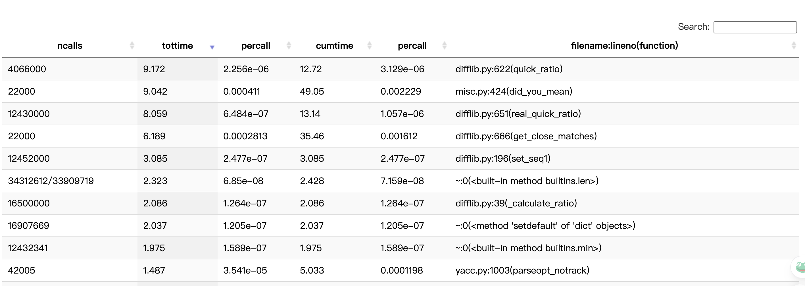


发现了一个外部库的问题
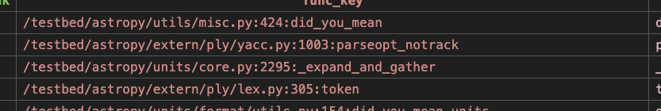

**问题：**就算一个项目有多个external，它这种external也就影响了上层，那这个时候直接改上层不就得了

到底要不要留下external呢？


## astropy__astropy_12701

```python
import timeit
import statistics
from astropy.time import Time, TimeDelta
import astropy.units as u
import numpy as np

def setup():
    global t0, t1, dt
    dt = TimeDelta(1 * u.hour)
    t0 = Time('2021-01-01')
    t1 = Time('2022-01-01')
    
def workload():
    global t0, t1, dt
    Time(np.arange(t0, t1, dt))

runtimes = timeit.repeat(workload, number=1, repeat=20, setup=setup)

print("Mean:", statistics.mean(runtimes[-10:]))
print("Std Dev:", statistics.stdev(runtimes[-10:]))
```
上面会导致下面这种情景

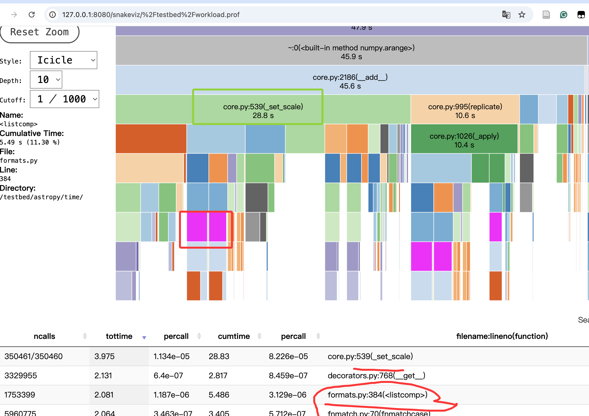


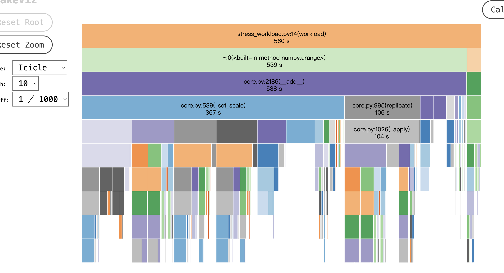
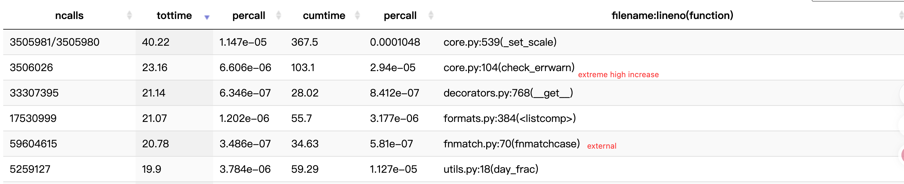

core.py:104(check_errwarn)也是external，这样的话，这个函数才是瓶颈点呀？


## 到dask上没用了。。

dask下瓶颈老是在compute中的 tread.acquire，
然而其修改往往在数据准备阶段，它不在workload tree下。


## sympy__sympy-11676

难搞，优化了1s，总共60s

profile图上找不到优化的理由


## pydata__xarray-7472
经典多跳
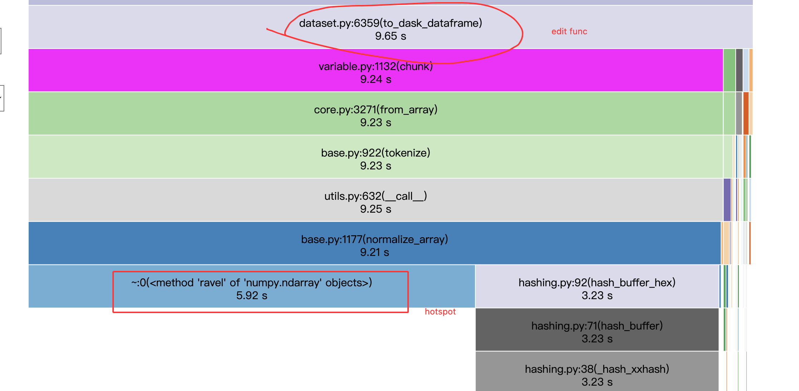

## scipy__scipy-10064也是一个很神奇的case
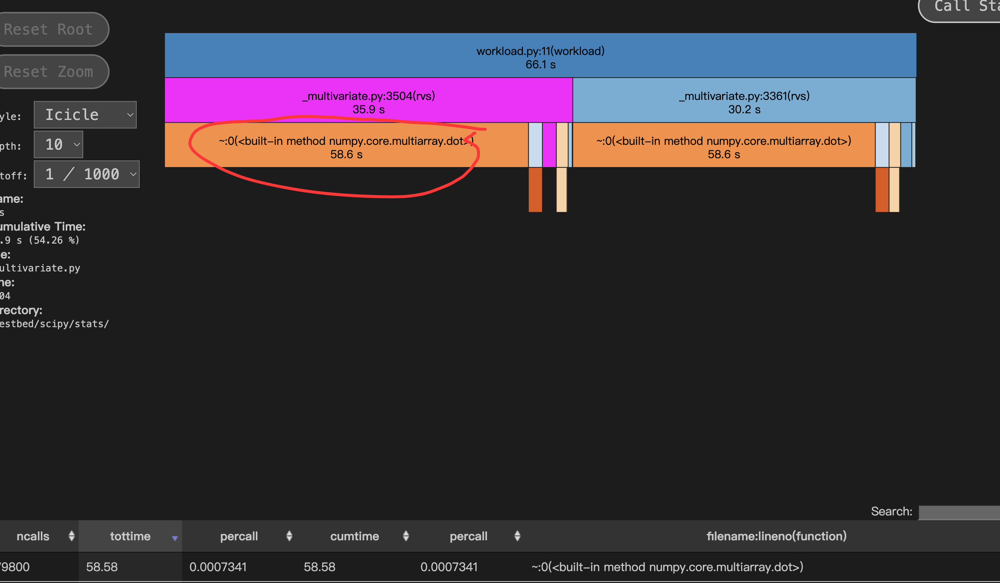

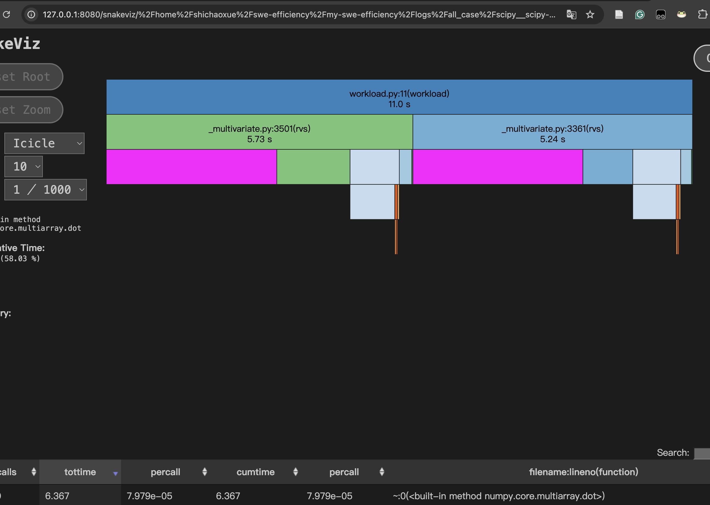

human patch两个rvs函数都修改了啊。。

stress如下
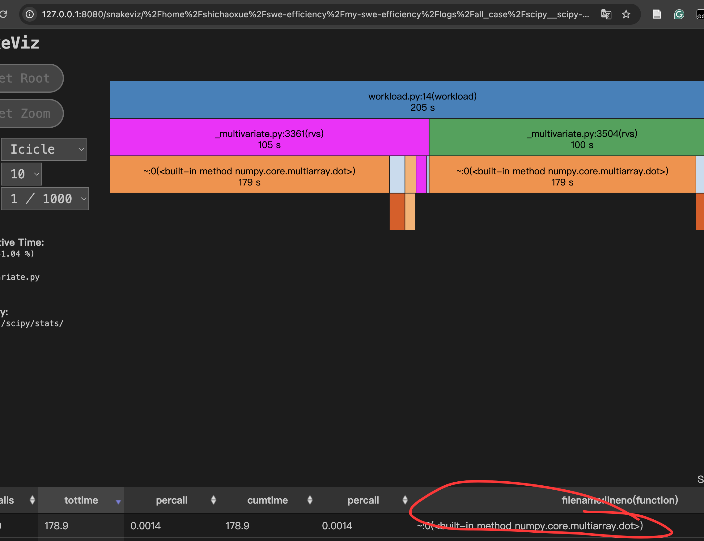

所以这个不匹配其实还是匹配了
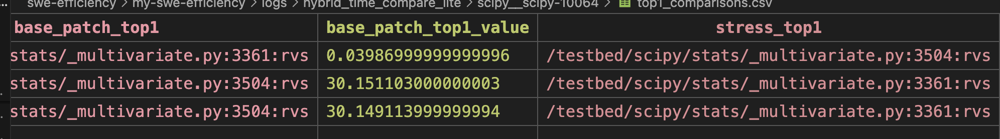

## numpy__numpy-13250 一个很神奇的case
真的可以only_stress_match
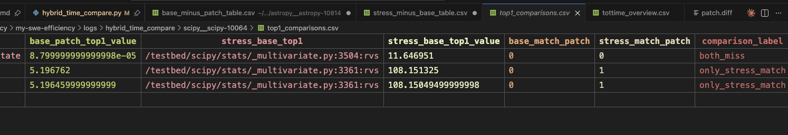


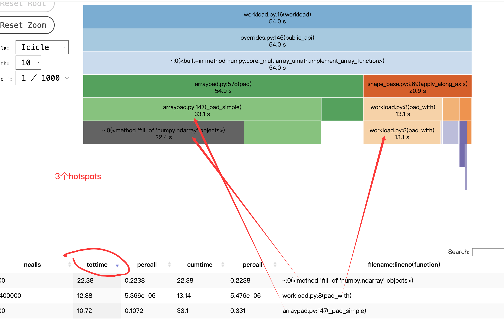
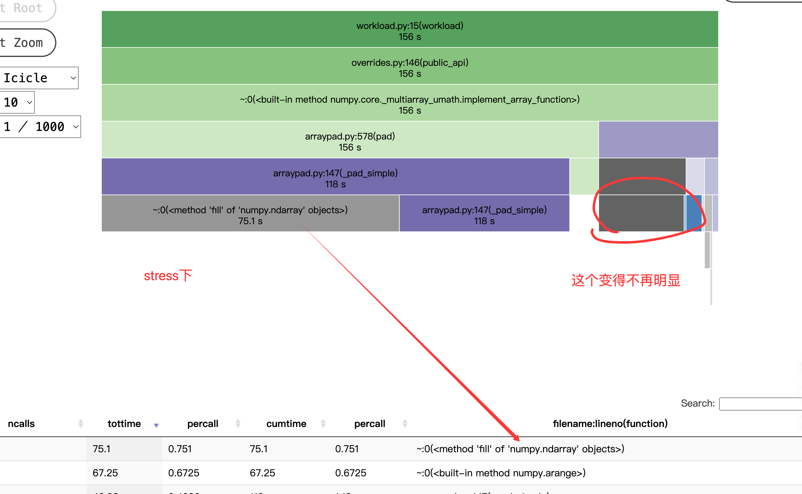

而patch改的是
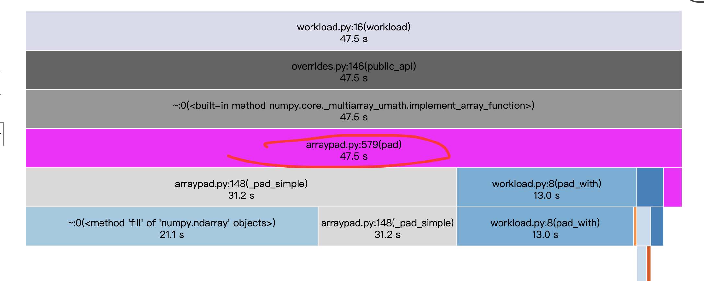


no-stress的简单profiler tree上llm的预测效果： **没有命中**
```text
# Candidate 1: /tmp/workload.py:8:pad_with
# Reason: High self time (12.802s) with extremely high call count (2.4M calls). This is a Python callback function being called repeatedly by apply_along_axis, causing significant overhead due to Python function call overhead in a hot loop.
# Suggestion: Replace the custom pad_with callback with built-in numpy padding modes or vectorized operations. Consider using np.pad with mode='constant' or other built-in modes instead of a custom function.

# Candidate 2: /testbed/numpy/lib/shape_base.py:269:apply_along_axis
# Reason: Significant cumulative time (20.965s) calling the expensive pad_with function 2.4M times. This function iterates over array axes and applies the callback function, creating overhead for each iteration.
# Suggestion: Avoid using apply_along_axis for padding operations. Use vectorized numpy operations directly on the array instead of iterating with a Python callback.

# Candidate 3: /testbed/numpy/lib/arraypad.py:147:_pad_simple
# Reason: High self time (10.282s) performing the actual padding operations. This is where the array allocation and filling happens, called 100 times.
# Suggestion: Consider pre-allocating padded arrays with optimal memory layout or using more efficient padding strategies like memory views if possible.

# Candidate 4: ~:0:<method 'fill' of 'numpy.ndarray' objects>
# Reason: Highest self time (21.681s) but this is a numpy internal method. However, it's called from _pad_simple which we can optimize.
# Suggestion: While we can't directly modify numpy's fill method, we can reduce calls to it by optimizing the padding approach in _pad_simple or using alternative padding methods.

# Candidate 5: /testbed/numpy/core/_asarray.py:88:asanyarray
# Reason: Extremely high call count (2.4M calls) though relatively low self time. This indicates unnecessary array conversions happening in a hot loop.
# Suggestion: Avoid unnecessary array conversions in the padding callback. Ensure data stays as numpy arrays without repeated conversions.
```

有stress的呢？**命中了**

```text
# Candidate 1: /testbed/numpy/lib/arraypad.py:147:_pad_simple
# Reason: This function has the second highest self time (42.925s at 5x stress) and shows significant growth (4.00x Tot_Growth) when workload size increases. It's a core internal function in the pad operation that handles the actual padding logic. The high cumulative time (118.029s) indicates it's a major bottleneck in the call chain.
# Suggestion: Optimize the array slicing and assignment operations within this function. Consider using vectorized operations instead of element-wise assignments, and pre-allocate memory more efficiently. Profile the specific operations inside to identify if certain edge cases or padding modes are particularly expensive.

# Candidate 2: /testbed/numpy/lib/arraypad.py:578:pad
# Reason: While its self time is low (0.016s), it has extremely high cumulative time (155.581s) as it's the direct caller of _pad_simple. The 1.59x Tot_Growth shows it scales poorly. This is the main entry point for padding operations and orchestrates the padding process, making it critical for overall performance.
# Suggestion: Add early checks for trivial padding cases (pad_width=0). Consider caching or reusing intermediate arrays. Optimize the parameter validation and dispatch logic to reduce overhead. Implement specialized paths for common padding patterns.

# Candidate 3: /testbed/numpy/core/overrides.py:146:public_api
# Reason: This function has the highest call count (1501 calls) and appears in every call chain. While its self time is minimal, its high cumulative time (155.582s) suggests it adds significant overhead through repeated calls. This decorator function handles NumPy's API overrides and dispatching.
# Suggestion: Consider memoizing or caching the dispatch results since the same functions are likely being called repeatedly. Reduce the overhead of argument parsing and validation in the decorator. For hot paths, consider bypassing the decorator overhead entirely.

# Note: The external function <method 'fill' of 'numpy.ndarray' objects> has the highest self time (75.099s) but is marked as external, so it cannot be directly edited. However, its performance is likely influenced by how it's called from _pad_simple, so optimizing the calling patterns in the internal functions should help reduce its impact.

# Note 2: The workload function itself has minimal self time, confirming that the bottleneck is indeed in the NumPy padding implementation rather than the user code.
```

这个case完美的反映了，从hotspots向上爬寻找edit function时，
如果遇到多个hotspots怎么办？能否通过stress来确认最重要的stress。


## numpy__numpy-12321
base

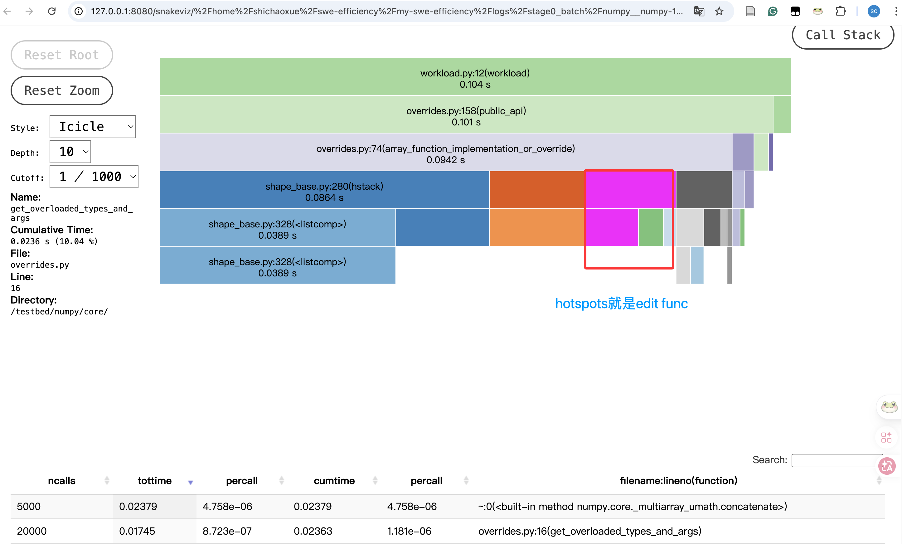
patch
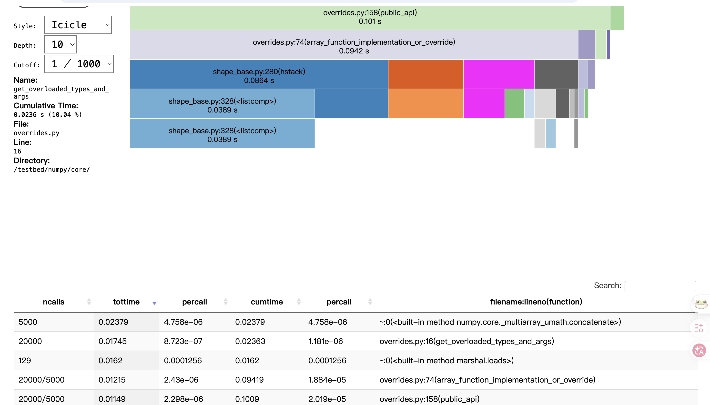


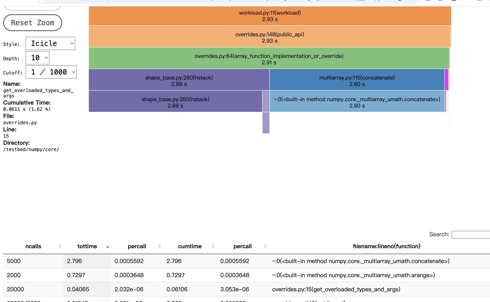
stress偏了


## pandas-dev__pandas-23772
base
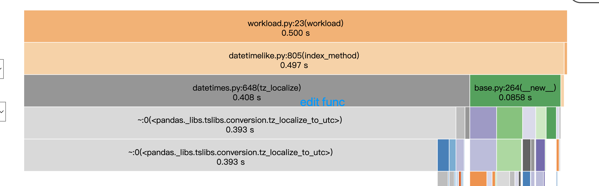
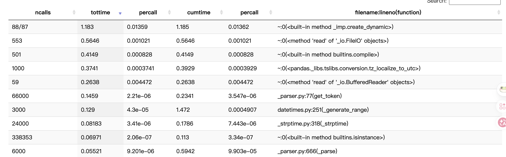

patch
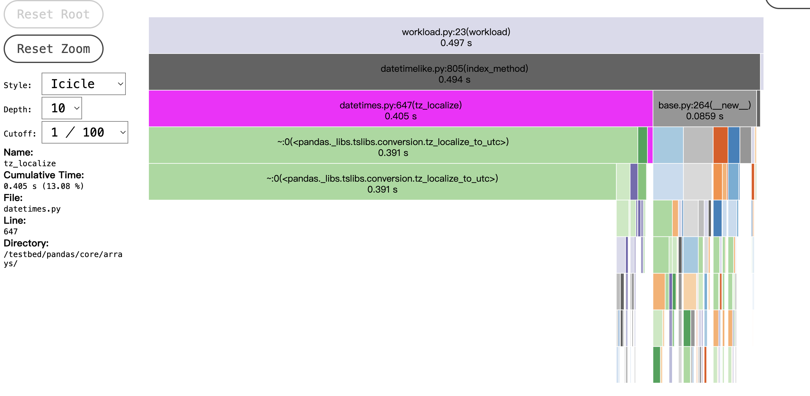

stress
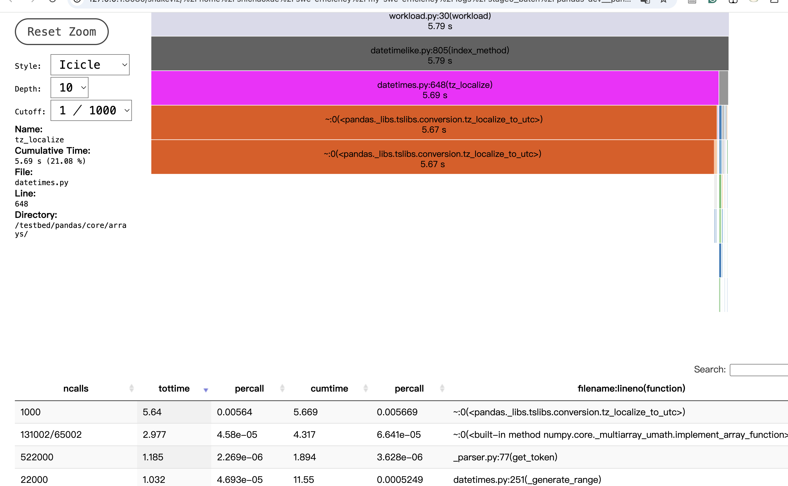
这个怎么理解呢。
数据本身问题？
在hybridtime统计下，stress是对的，其base-patch反而是错的


## sympy__sympy-10621
base
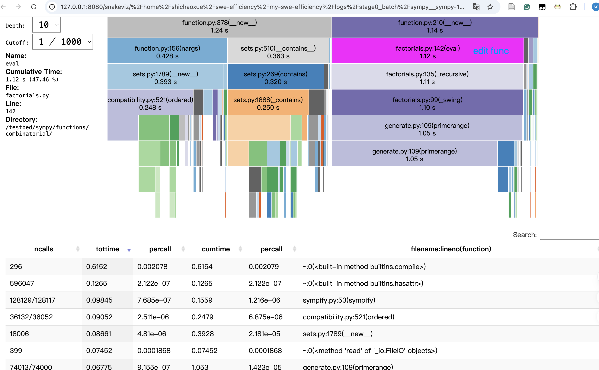
patch
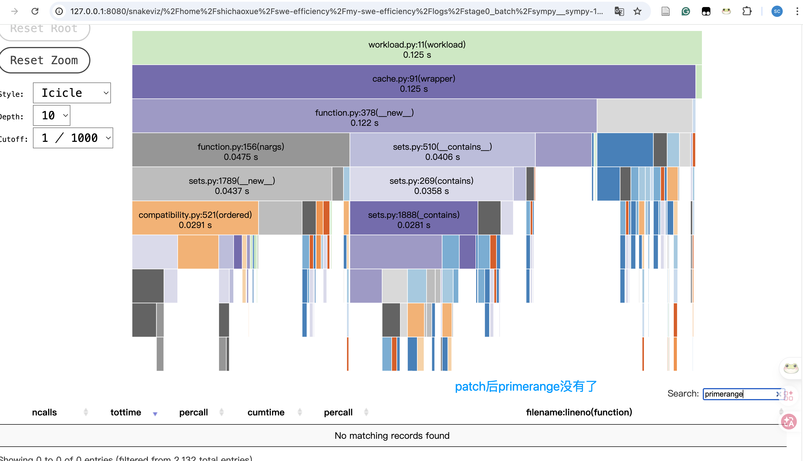
stress
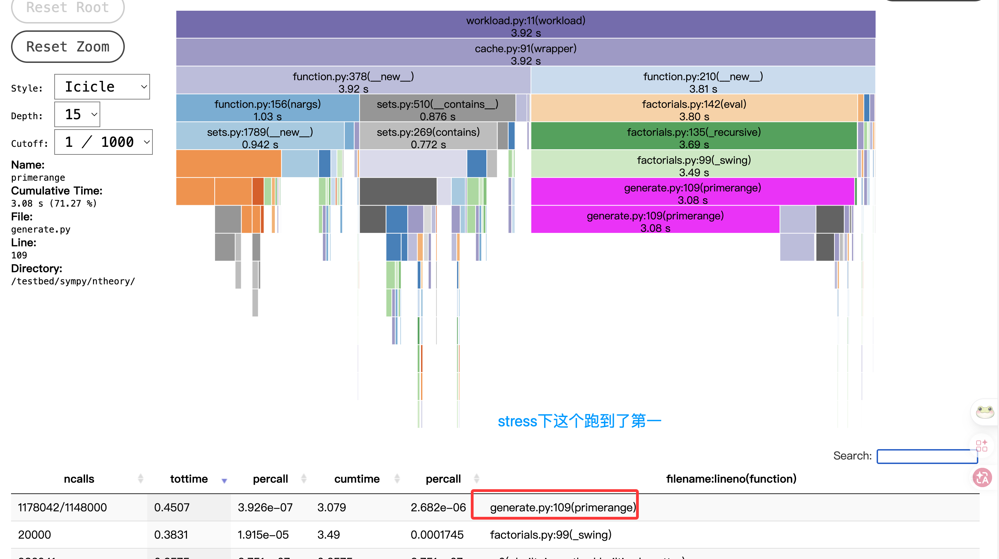

又是stress才是正确的，甚至stress-base也是正确的
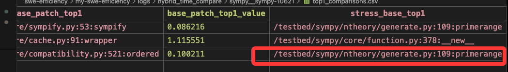

## 思考


**stress的作用？：**
stress下各个hotspots会有增长，然后我们看这些hotspots增长的比例占workload增长的占比，增长最多的就很有可能是极恶性占比。


我想到一个问题，profiler可以把调用关系打出来，这样根据文件和行号去找代码，比只有shell的swe-agent还是好很多啊


**第一：**能不能从hotspots出发，反向向上搜索？或者双向图搜索？


**第二：**，**mini-swe-agent是不是连调用图都没有啊**，那它修个鸡毛啊？找多久才能找到
平均20 30 trajectory length。


**第三：**stress ratio，是否能从多个hotspots中暴露出最高的那个，还有就是hotspots重叠在路径的问题？
还是应该从我的profiler tree出发，因为是第一个external节点终止（external节点不再区分cumtime和tottime），下面就是从这些hotspots中找到即可
