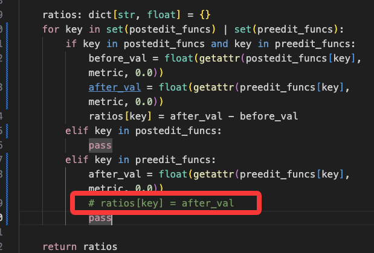

1. 探索指标。 过滤、阈值、除法

探索stress的作用


用stress-base虽然重叠率达到了70%
但是base本身能达到更高

这样stress就还是没有作用啊。


用porfiler tree的节点做，重叠率更低了，
失真了，说明漏了一些hotspots，也是合理的


2. 师兄针对 base 比 stress-base好的现象说明了下，然后让统计下是不是互补的

对于 100O(N)  2*O(N^2)， N增长不达到一定标准的话， 确实前者更大
可能patch_base改的是前者，而不是后者，
然后stress把后者暴露了出来

         "both_overlap": 27,
          "only_stress_overlap": 0,
          "only_baseline_overlap": 9,
          "both_no_overlap": 3,


**关于这个数据我的疑问及操作**
起初数据是    stress_base = 0.69, base = 0.92

1) 当我把 只在preedit出现的函数（不在postedit出现的函数）也pass掉，

得到结果为：


```json
"k_overlap_rates": {
      "1": {
        "tottime": {
          "mean": 0.3333333333333333,
          "se": 0.07548513560963971
        },
        "cumtime": {
          "mean": 0.41025641025641024,
          "se": 0.07876386131162097
        }
      }},
"baseline_k_overlap_rates": {
      "1": {
        "tottime": {
          "mean": 0.4358974358974359,
          "se": 0.0794033618863734
        },
        "cumtime": {
          "mean": 0.5641025641025641,
          "se": 0.07940336188637338
        }
      }}
```
改成inf又都降到0.25。。。


2) 把这些tottime时间表都打印出来看下

第一个发现astropy还有 extern文件算作外来文件，所以把这个也关键词过滤了， 也就是说现在对比的hotspots都是 /testbed开头的包内文件

如果去掉这种external的，不过滤呢？
stress_base的重叠率编程0.62, base的重叠率变成0.84


3) 简单看下各个instance自己情况
扫了39个一眼，差不多就是有很多重叠的


3. 简单了解了clash 代理组的概念，服务器反向代理
   gpt帮我写了一个全局覆写js文件，
   包括url-test的auto代理组，以及基本国内流量分流操作，chatgpt单独走美国节点


4. 尝试介入minisweagent观测

gpt简单写了一个，还需要debug走一遍看看


