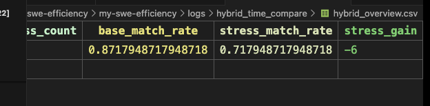
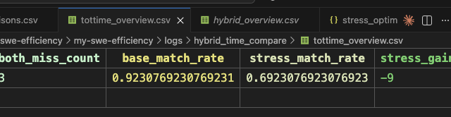
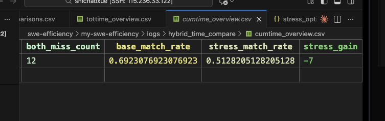
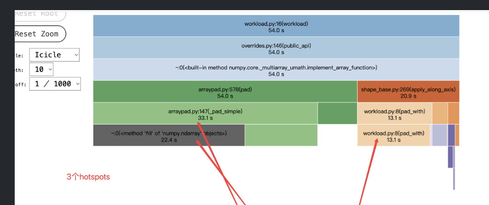
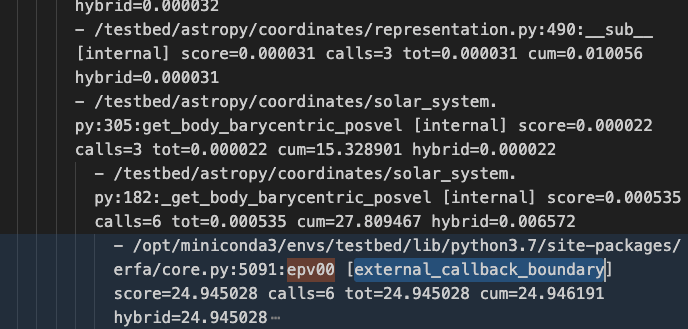
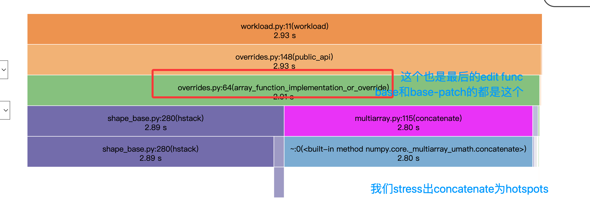
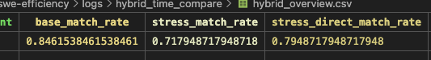
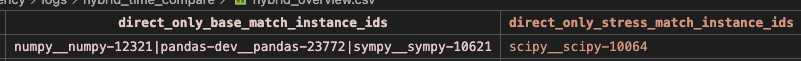
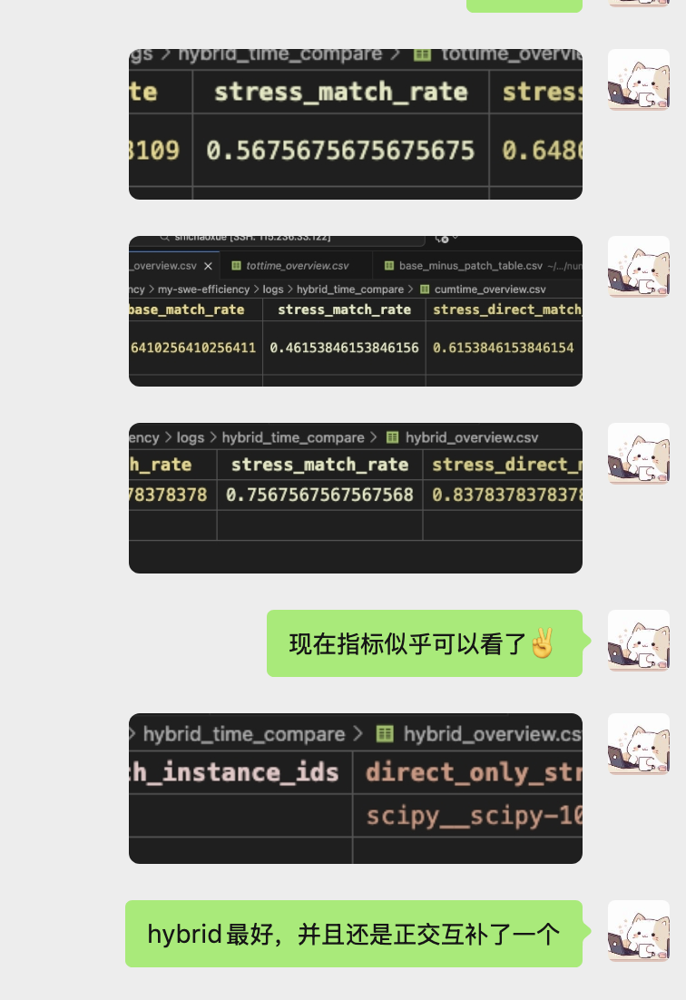

## 组会

1. 在分析hotspots重叠率

首先过滤workload闭包函数
然后核心原则就是不管怎么样都要改的是内部代码库的节点，包括hotspots确认和edit

操作就是
第一阶段主要是定位函数级别，所以利用tottime和cumtime做了一次时间归因，搞个新指标hybridtime
先利用call关系构建cumtime tree和tottime tree，
然后融合两者，就是如果第一次external函数，就把它的cumtime计算加到上层internal函数中hybridtime，hybridtime的初值就是tottime，
这样子搞了一个全是internal的hybrid tree

这样stress_match_rate提升到了0.71

这些hotspots是否都在edit func的调用闭包里呢？下一步可以做下这个再。但是stress为什么会没有用呢这里。

2. 看了些profile图

## Today

1. 按照hybridtime进行 hotspots重叠率统计

指标提升了一点点 0.69 -> 0.71

发现了一个bug
numpy__numpy-13250 hybridtime为什么没命中呢？看下

遇到了这种情况，这种属于external吗？
解决方案：

internal_A
  -> external_X [callback_boundary]
       -> internal_B
       -> internal_C
这里应该这样处理：
- internal_A.hybrid
  - 不加 external_X.cumtime
- external_X
  - 保留在树上，作为 callback boundary
  - 只显示一个很薄的节点信息
- internal_B/internal_C
  - 正常展开
  - 正常参与后续 hotspot 判断

加入callback_boundary后的效果：

### 验证几个case，看现在是否满足要求

代码写的有bug

改掉了

又找到一个，但是stress本身可以命中，
加一个stress_direct

又找到一个bug，但是似乎也是正确的。

查看了三个问题instance，有2个都是stress才是正确的

**经过一番验证：**

