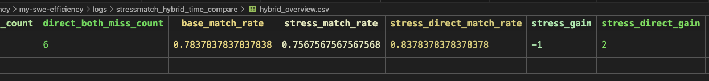
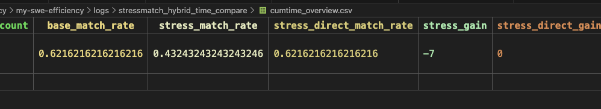
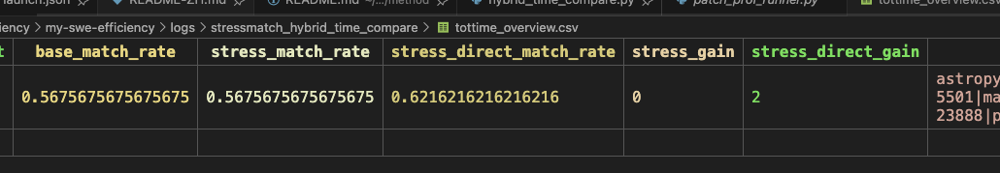

## stress base - stress patch作为hotspots跑完了，








## 熟悉代码，重构

旧有运行cProfile逻辑依赖make_test_spec，
问题是dataset里提供了commit和rebuild_cmd，
这里想解耦合出来这些东西，
每次

```text
主流程收敛成：
- 固定前导命令：
  - source /opt/miniconda3/bin/activate
  - conda activate testbed
  - cd /testbed
  - git config --global --add safe.directory /testbed

reset、pip设置清华源

- preedit:
  - git reset --hard base_commit
  - rebuild_cmd
  - profile workload.py
  - profile workload_stress.py
- postedit:
  - git reset --hard base_commit
  - apply patch
  - rebuild_cmd
  - profile workload.py
  - profile workload_stress.py
这样基本就不需要：
- make_test_spec()
- MAP_REPO_VERSION_TO_SPECS
- performance_profiling_script_list
```

rebuild_cmd老是失败。不要rebuild_cmd可不可以？
不行

workload_preedit 失败了，对于'scipy__scipy-10393'

这意味着 harness 的 profiling 脚本实际不是单纯：
python -m cProfile -o /tmp/workload_cprofile.prof /tmp/workload.py
而是更像：
source ...
conda activate ...
cd /testbed
git status
git show
export PIP_INDEX_URL=...
export PIP_TRUSTED_HOST=...
<specs["install"]>
python -m cProfile -o /tmp/workload_cprofile.prof /tmp/workload.py


### 发现了个问题，可以直接运行workload，不需要准备环境。。

下一步可以重构stage0_stress生成了


## method实现，给定profiler tree以及topk个hotspots
挨个进行需要查看的函数挑选，然后缓存下，
多个messages列表，
llm顺着爬，最终给出需要更改的edit function，以及具体更改策略

最后根据该上下文迭代给出最终实现。


给本机改成ssh协议认证的git push， https协议每次都要输入用户名和密码， ssh协议只需要配置一次rsa即可


