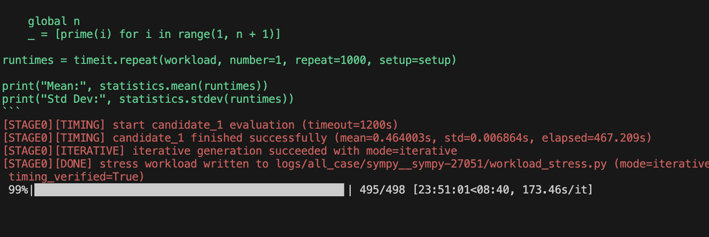
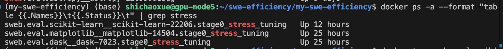
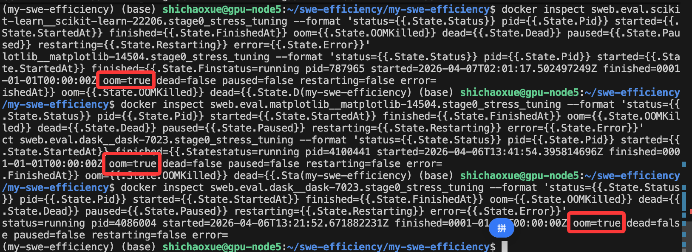

主要两件事

1.对整体数据分析
```bash
uv run -m swefficiency.method.stages.stage0_stress_workload   --instances-file swefficiency/method/getdataset/instances_all_repo.txt   --output-dir logs/all_case   --result-file logs/all_case/stress_generates.json   --max-workers 5 --timeout 600 --max-iterations 5  --stress-timeout 1200

```

运行完。先过滤下，delta时间增幅太小的，这不是stress的目标

**卡住了3个，这很奇怪**



用docker查看，容器空转了



原来是OOM了



下一步运行出来4个prof用来分析
```bash
uv run -m swefficiency.method.runtime.profiling_runner --instances-file /home/shichaoxue/swe-efficiency/my-swe-efficiency/swefficiency/method/getdataset/instances_all_repo.txt --stage0-dir logs/all_case --timeout 600 --stress-timeout 1200 --max-workers 5
```


2。把guided_locator加一个输出最终patch的

这个现在也还有点问题，先是解决了输出的patch 缩进问题

现在是没有import导入的问题
下一步可能需要加一下few shot，或者就要迭代生成了。


