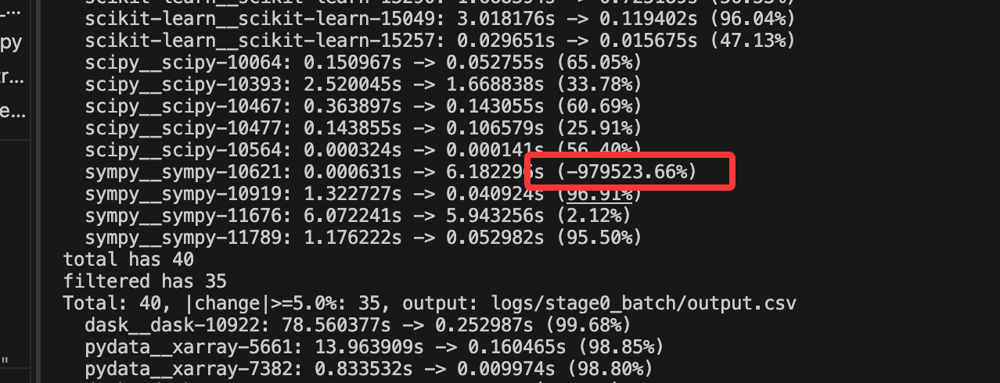

## 1.终于跑完了前后4个prof

跑了约36个小时

### 过滤5%
又发现之前过滤用的绝对值，这玩意居然还有负的。。 指标还能再提升。。闹麻了



498个中，超时了52个。。
total has 446
**filtered has 400**
Total: 446, speedup >=5.0%: 400, output: logs/all_case/output.csv


hybrid_time_compare还得改一点


swe-efficiency/my-swe-efficiency/logs/all_case/pandas-dev__pandas-50078/workload_stress.py
这个居然stress没写出来workload函数。

## 2. 找原因

###
只有 377 个目录真正产出了 top1_comparisons.csv 并进入 overview 聚合。
这 23 个没进统计的实例列： 是“目录先建了，但中途被 skip/失败了”。
**因为缺少 stress prof 或 stress prof 找不到 workload root 被跳过**
```bash
missing_top1_count=23
astropy__astropy-12699
astropy__astropy-17461
astropy__astropy-7924
dask__dask-5884
matplotlib__matplotlib-19760
matplotlib__matplotlib-23759
numpy__numpy-19618
numpy__numpy-21832
pandas-dev__pandas-28099
pandas-dev__pandas-28447
pandas-dev__pandas-31409
pandas-dev__pandas-32856
pandas-dev__pandas-37149
pandas-dev__pandas-42841
pandas-dev__pandas-43335
pandas-dev__pandas-43353
pandas-dev__pandas-48502
pandas-dev__pandas-49851
pandas-dev__pandas-50078
pandas-dev__pandas-51339
pandas-dev__pandas-53152
pandas-dev__pandas-55736
scikit-learn__scikit-learn-25490
```


###
stress又干不过base了


```bash
only_base_hit

astropy__astropy-16813|astropy__astropy-7616|astropy__astropy-7649|matplotlib__matplotlib-18018|matplotlib__matplotlib-22875|numpy__numpy-12321|pandas-dev__pandas-25070|pandas-dev__pandas-26605|pandas-dev__pandas-26721|pandas-dev__pandas-27448|pandas-dev__pandas-29820|pandas-dev__pandas-33032|pandas-dev__pandas-33324|pandas-dev__pandas-33540|pandas-dev__pandas-34737|pandas-dev__pandas-36280|pandas-dev__pandas-37118|pandas-dev__pandas-37450|pandas-dev__pandas-38103|pandas-dev__pandas-41911|pandas-dev__pandas-41924|pandas-dev__pandas-42197|pandas-dev__pandas-42268|pandas-dev__pandas-43237|pandas-dev__pandas-43274|pandas-dev__pandas-43308|pandas-dev__pandas-43760|pandas-dev__pandas-46235|pandas-dev__pandas-47781|pandas-dev__pandas-48611|pandas-dev__pandas-49596|pandas-dev__pandas-50306|pandas-dev__pandas-50310|pandas-dev__pandas-50620|pandas-dev__pandas-51344|pandas-dev__pandas-51630|pandas-dev__pandas-52057|pandas-dev__pandas-52109|pandas-dev__pandas-53150|pandas-dev__pandas-54883|pandas-dev__pandas-55515|pandas-dev__pandas-56902|pandas-dev__pandas-56990|pandas-dev__pandas-57812|pandas-dev__pandas-58027|scikit-learn__scikit-learn-15834|scikit-learn__scikit-learn-28064|scipy__scipy-10064|scipy__scipy-19324|scipy__scipy-21440|sympy__sympy-10919|sympy__sympy-21455|sympy__sympy-25591
```

- hybrid 行里，base_match_rate=0.8090，但 stress_direct_match_rate=0.6737，而且 stress_direct_gain=-51；这说明改成直接 stress 后，不是少量回退，而是净亏了 51 个实例。
- tottime 更差，0.7056 -> 0.5756，stress_direct_gain=-49；cumtime 也差，0.5968 -> 0.5464，stress_direct_gain=-19。
- 三个 metric 都是同一个方向：stress direct 匹配率 consistently 低于 base


得找找原因

**base-patch 当真值代理本身有偏差，**
**stress 可能会偏离，stress 带来的排序变化大多不是“纠正”，而是“漂移”。**
**用 top1 严格相等做命中标准太苛刻，忽略了目标可能只是 stress 里的 top3/top5，或者只是同一调用链上的邻近函数**


## 2.方法完善
加了一个简单的反馈，

-Speedup 结果：约 1.42x 加速
- 修改前 workload 均值：55.66s
- 修改后 workload 均值：39.29s
- 时间比率：0.706（即耗时降至原来的 ~70.6%）
- 加速比：1.42x
@functools.lru_cache(maxsize=128) 加在 @classmethod 下面对 _select_subfmts 的缓存起效了， (cls, pattern) 作为 key 消除了大量重复 fnmatchcase 调用。


这个加cache的还真可以，加速了好多

ok


为什么human_patch反而倒退了
  "success": true,
  "workload_summary": {
    "time_before": 17.628925,
    "time_after": 20.378224,
    "time_change_ratio": 1.1559538655930524,
    "speedup": 0.865086427551292
  },


## 3. refactor
请继续review下/home/shichaoxue/swe-efficiency/my-swe-efficiency/swefficiency/method下所有代码，一个可能的方向是提出一个config.py文件

这个先稍微等等。


另一个方向是不依赖harness，把其中的常量文件给搬过来就行。

算了。。


## 思考

human_patch，从文件中读取，这样子ok
mini-swe-agent得到一堆patch
我这种得到一些patch

