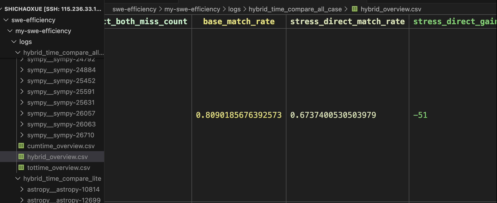
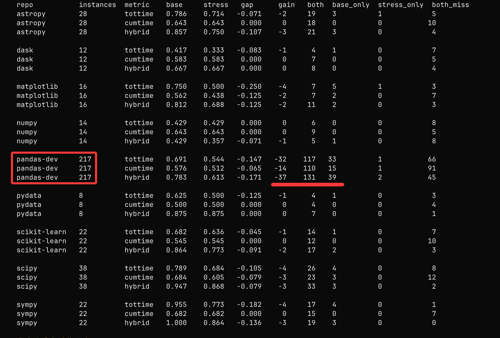
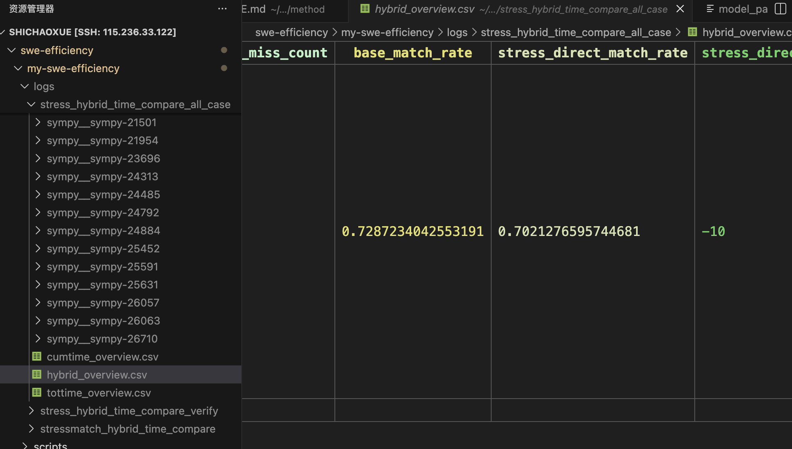
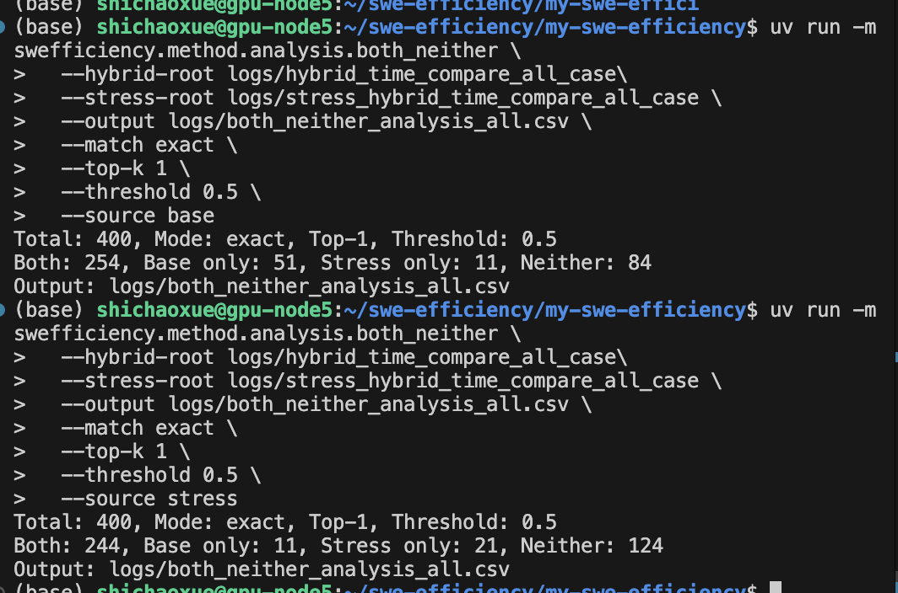

## 今天最核心的目的就是找原因


###
只有 377 个目录真正产出了 top1_comparisons.csv 并进入 overview 聚合。
这 23 个没进统计的实例列： 是“目录先建了，但中途被 skip/失败了”。
**因为缺少 stress prof 或 stress prof 找不到 workload root 被跳过**
```bash
missing_top1_count=23
astropy__astropy-12699. 没有stress成功，postedit报错
astropy__astropy-17461 同1
astropy__astropy-7924 同1
dask__dask-5884 同1
matplotlib__matplotlib-19760 同1
matplotlib__matplotlib-23759 同1
numpy__numpy-19618 同1
numpy__numpy-21832 stress_workload中没保留workload， 这个属于是qwen-plus有点拉
pandas-dev__pandas-28099 同1
pandas-dev__pandas-28447 同1
pandas-dev__pandas-31409 同1
pandas-dev__pandas-32856 同2 stress_workload中没保留workload， 这个属于是qwen-plus有点拉
pandas-dev__pandas-37149 同1
pandas-dev__pandas-42841 同1
pandas-dev__pandas-43335 同1
pandas-dev__pandas-43353 同1
pandas-dev__pandas-48502 同1
pandas-dev__pandas-49851 同1
pandas-dev__pandas-50078 同2 stress_workload中没保留workload， 这个属于是qwen-plus有点拉
pandas-dev__pandas-51339 同1
pandas-dev__pandas-53152 同2 stress_workload中没保留workload， 这个属于是qwen-plus有点拉
pandas-dev__pandas-55736 同1 
scikit-learn__scikit-learn-25490 同1
```


###
stress又干不过base了

base-patch作为hotspots

详细情况：


stress_base - stress_patch作为hotspots的情况


base跟base-patch匹配， 基于此， 与stress与stress_base - stress_patch匹配

下面是都是stress去匹配


```bash
only_base_hit

astropy__astropy-16813|astropy__astropy-7616|astropy__astropy-7649|matplotlib__matplotlib-18018|matplotlib__matplotlib-22875|numpy__numpy-12321|pandas-dev__pandas-25070|pandas-dev__pandas-26605|pandas-dev__pandas-26721|pandas-dev__pandas-27448|pandas-dev__pandas-29820|pandas-dev__pandas-33032|pandas-dev__pandas-33324|pandas-dev__pandas-33540|pandas-dev__pandas-34737|pandas-dev__pandas-36280|pandas-dev__pandas-37118|pandas-dev__pandas-37450|pandas-dev__pandas-38103|pandas-dev__pandas-41911|pandas-dev__pandas-41924|pandas-dev__pandas-42197|pandas-dev__pandas-42268|pandas-dev__pandas-43237|pandas-dev__pandas-43274|pandas-dev__pandas-43308|pandas-dev__pandas-43760|pandas-dev__pandas-46235|pandas-dev__pandas-47781|pandas-dev__pandas-48611|pandas-dev__pandas-49596|pandas-dev__pandas-50306|pandas-dev__pandas-50310|pandas-dev__pandas-50620|pandas-dev__pandas-51344|pandas-dev__pandas-51630|pandas-dev__pandas-52057|pandas-dev__pandas-52109|pandas-dev__pandas-53150|pandas-dev__pandas-54883|pandas-dev__pandas-55515|pandas-dev__pandas-56902|pandas-dev__pandas-56990|pandas-dev__pandas-57812|pandas-dev__pandas-58027|scikit-learn__scikit-learn-15834|scikit-learn__scikit-learn-28064|scipy__scipy-10064|scipy__scipy-19324|scipy__scipy-21440|sympy__sympy-10919|sympy__sympy-21455|sympy__sympy-25591
```

- hybrid 行里，base_match_rate=0.8090，但 stress_direct_match_rate=0.6737，而且 stress_direct_gain=-51；这说明改成直接 stress 后，不是少量回退，而是净亏了 51 个实例。
- tottime 更差，0.7056 -> 0.5756，stress_direct_gain=-49；cumtime 也差，0.5968 -> 0.5464，stress_direct_gain=-19。
- 三个 metric 都是同一个方向：stress direct 匹配率 consistently 低于 base


得找找原因

**base-patch 当真值代理本身有偏差，**
**stress 可能会偏离，stress 带来的排序变化大多不是“纠正”，而是“漂移”。**
**用 top1 严格相等做命中标准太苛刻，忽略了目标可能只是 stress 里的 top3/top5，或者只是同一调用链上的邻近函数**


## 需要一个新功能，关于hytbrid time tree的导出


需要一个新功能，关于hytbrid time tree的导出
首先跟我讨论输出格式，然后讨论在哪里最小修改，最后形成完整计划，编码完毕后同步更新文档，并且最后给出git相关命令，但是git命令的执行必须由我来

下一个优化点，一个函数的子函数不需要过多


## 功能1.stress情况下和base情况下，时间分布图


## 功能2. model speedup和人类speedup的对比


## 应该中的看 base 没有匹配上 base-patch的


