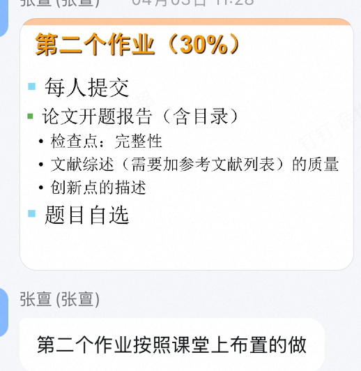
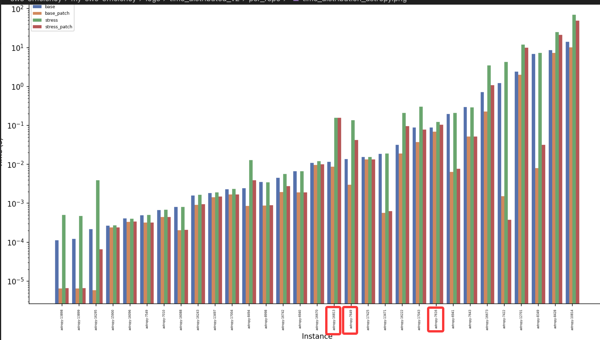
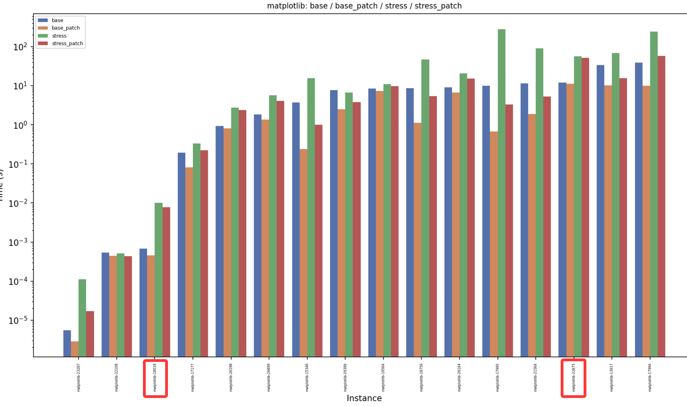
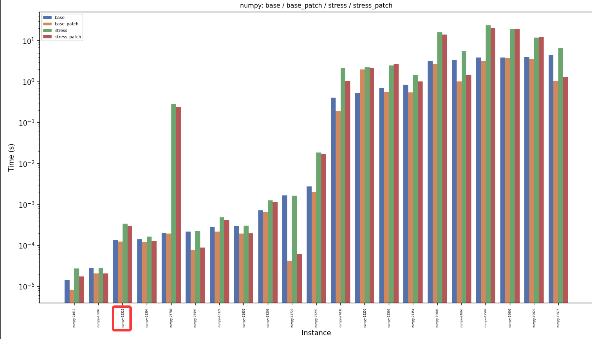
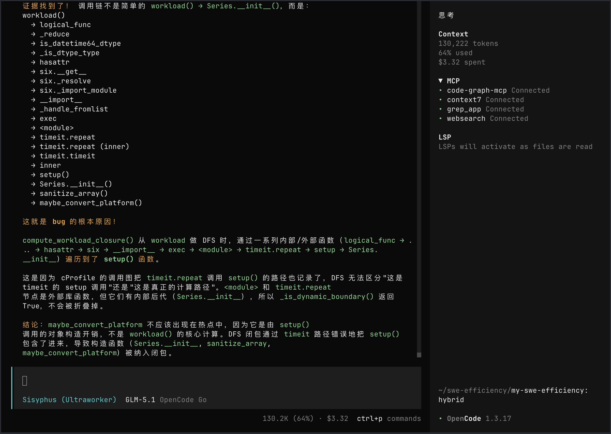
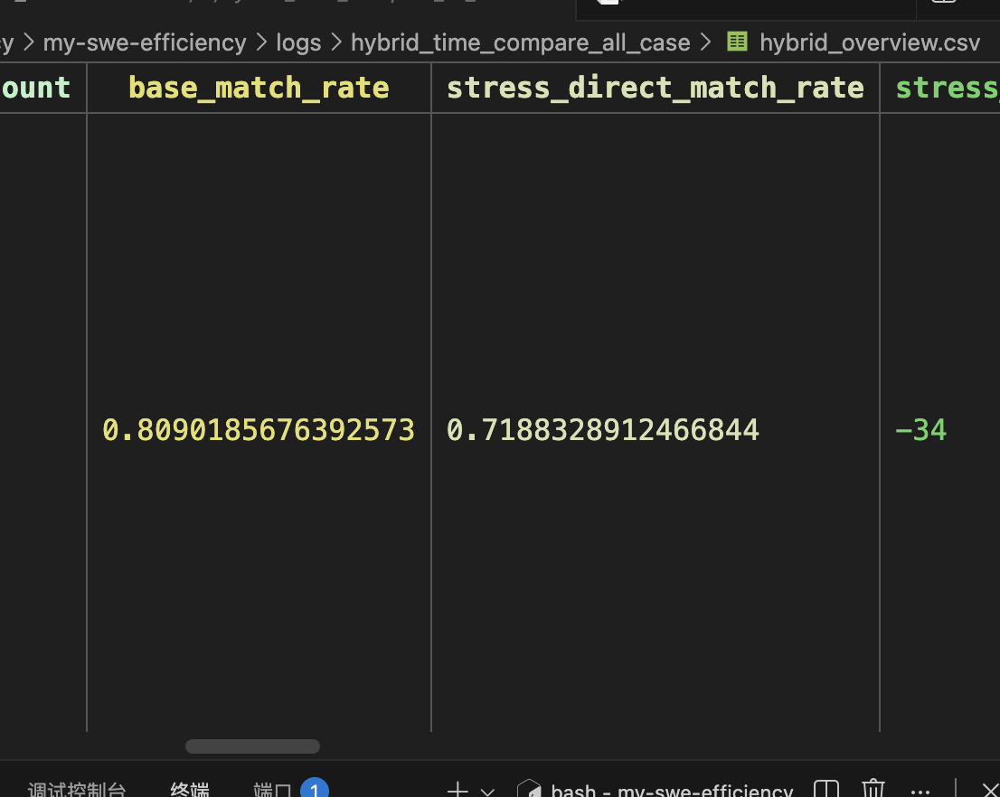
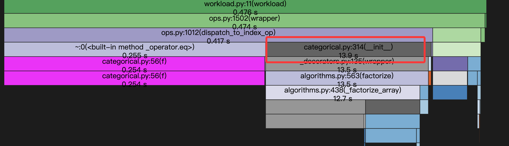
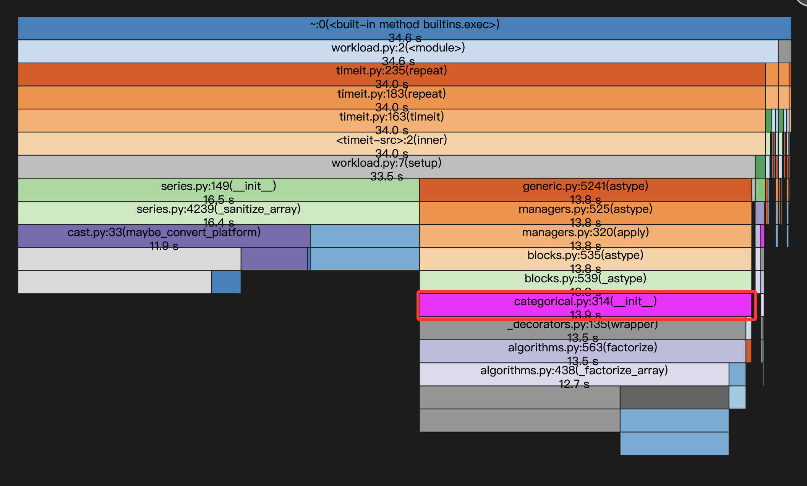
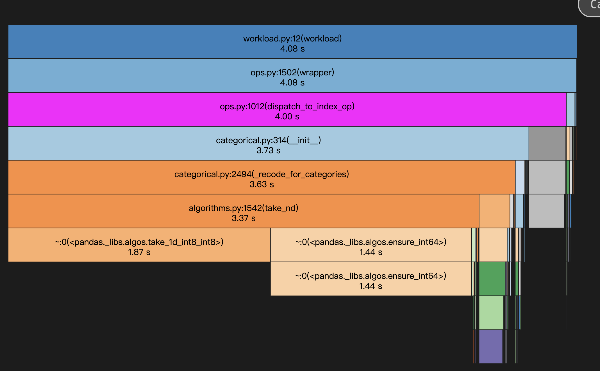
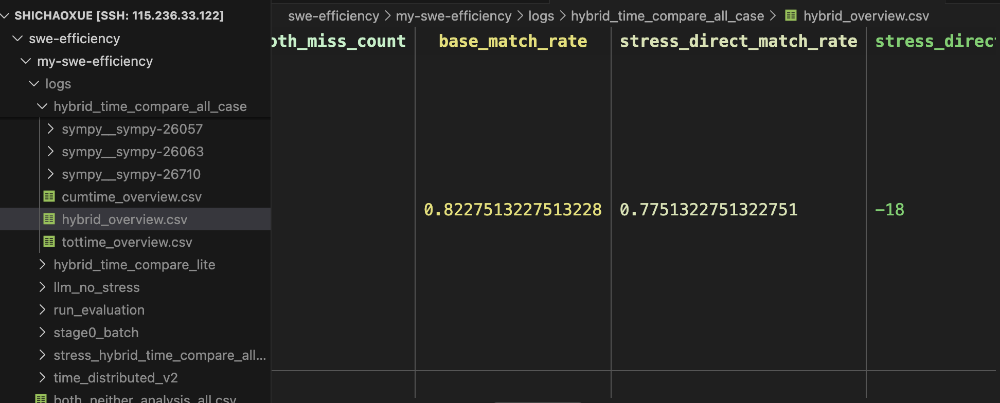

## 简单学习下dask

Dask 的核心是构建一张任务依赖图（DAG），
每个节点表示一个计算任务（function + arguments），
边表示数据依赖关系。

Dask 对象（delayed / bag / array / dataframe）都是这张图的不同抽象层。

计算是 lazy 的，只有在调用 compute 时才会执行，
调度器根据 DAG 自动并行执行可独立的任务。


Dask = DAG + Lazy + Scheduler

## 完成论文写作与指导的作业



基本ok


## 想办法找到stress不好的原因，那么偏移的hotspots时间分布、还有用snakeviz看几个case







```bash
only_base_hit

astropy__astropy-16813|astropy__astropy-7616|astropy__astropy-7649|matplotlib__matplotlib-18018|matplotlib__matplotlib-22875|numpy__numpy-12321|pandas-dev__pandas-25070|pandas-dev__pandas-26605|pandas-dev__pandas-26721|pandas-dev__pandas-27448|pandas-dev__pandas-29820|pandas-dev__pandas-33032|pandas-dev__pandas-33324|pandas-dev__pandas-33540|pandas-dev__pandas-34737|pandas-dev__pandas-36280|pandas-dev__pandas-37118|pandas-dev__pandas-37450|pandas-dev__pandas-38103|pandas-dev__pandas-41911|pandas-dev__pandas-41924|pandas-dev__pandas-42197|pandas-dev__pandas-42268|pandas-dev__pandas-43237|pandas-dev__pandas-43274|pandas-dev__pandas-43308|pandas-dev__pandas-43760|pandas-dev__pandas-46235|pandas-dev__pandas-47781|pandas-dev__pandas-48611|pandas-dev__pandas-49596|pandas-dev__pandas-50306|pandas-dev__pandas-50310|pandas-dev__pandas-50620|pandas-dev__pandas-51344|pandas-dev__pandas-51630|pandas-dev__pandas-52057|pandas-dev__pandas-52109|pandas-dev__pandas-53150|pandas-dev__pandas-54883|pandas-dev__pandas-55515|pandas-dev__pandas-56902|pandas-dev__pandas-56990|pandas-dev__pandas-57812|pandas-dev__pandas-58027|scikit-learn__scikit-learn-15834|scikit-learn__scikit-learn-28064|scipy__scipy-10064|scipy__scipy-19324|scipy__scipy-21440|sympy__sympy-10919|sympy__sympy-21455|sympy__sympy-25591
```


### bug1
我发现了一个bug，/home/shichaoxue/swe-efficiency/my-swe-efficiency/logs/hybrid_time_compare_all_case/pandas-dev__pandas-25070/stress_table.csv中为什么cast.py:35(maybe_convert_platform)能够占据第一，这个明明是setup函数调用的，我们不是用workload闭包函数应该把这个过滤掉了吗？

好一个酣畅淋漓的抽象调用。。



**解决方案就是dfs workload的闭包是，遇到timeit、setup调用就停止先**

应该还有bug，rate从0.67提升到了0.71


```bash
astropy__astropy-16813|astropy__astropy-7649|numpy__numpy-12321|pandas-dev__pandas-26391|pandas-dev__pandas-26721|pandas-dev__pandas-27448|pandas-dev__pandas-33540|pandas-dev__pandas-34737|pandas-dev__pandas-36280|pandas-dev__pandas-37118|pandas-dev__pandas-37450|pandas-dev__pandas-42197|pandas-dev__pandas-42268|pandas-dev__pandas-43237|pandas-dev__pandas-43274|pandas-dev__pandas-43308|pandas-dev__pandas-43760|pandas-dev__pandas-46235|pandas-dev__pandas-47781|pandas-dev__pandas-49596|pandas-dev__pandas-50306|pandas-dev__pandas-50310|pandas-dev__pandas-50620|pandas-dev__pandas-51344|pandas-dev__pandas-51630|pandas-dev__pandas-54883|pandas-dev__pandas-55515|pandas-dev__pandas-56902|pandas-dev__pandas-56990|pandas-dev__pandas-57812|pandas-dev__pandas-58027|scikit-learn__scikit-learn-28064|scipy__scipy-10064|scipy__scipy-19324|scipy__scipy-21440|sympy__sympy-10919|sympy__sympy-21455|sympy__sympy-25591
```


### bug2

但是对于setup和workload联合调用的函数，这该怎么办呢



categorical.py:314(\_\_init\_\_)

**能不能更改现有的profile模式，改成只对workload函数做profile采集，应该是可行的**


ok，修好了，修改策略如下
```python
import cProfile
pr = cProfile.Profile()
def profiled_workload():
    pr.enable()
    try:
        return workload()
    finally:
        pr.disable()
runtimes = timeit.repeat(profiled_workload, number=5, repeat=100, setup=setup)
print("Mean:", statistics.mean(runtimes))
print("Std Dev:", statistics.stdev(runtimes))
pr.dump_stats("/tmp/workload_cprofile.prof")

```


现在需要重跑所以workload.prof


在 pandas-dev__pandas-23888 


uv run -m swefficiency.method.analysis.hybrid_time_compare \
  --instances-file <(printf '%s\n' 'pandas-dev__pandas-23888') \
  --stage0-root logs/stage0_batch \
  --output-root logs/hybrid_time_compare_single
**重新运行，都match了**。

#### 跑所有case下一步
第一步生成过stress_workload了，
所以直接第二步：
```bash
uv run -m swefficiency.method.runtime.profiling_runner --instances-file swefficiency/method/getdataset/instances_all_repo.txt --stage0-dir logs/all_case --timeout 600 --stress-timeout 1200 --max-workers 6 --run-id profiling_runner_workload_only
```
提升到0.77了



