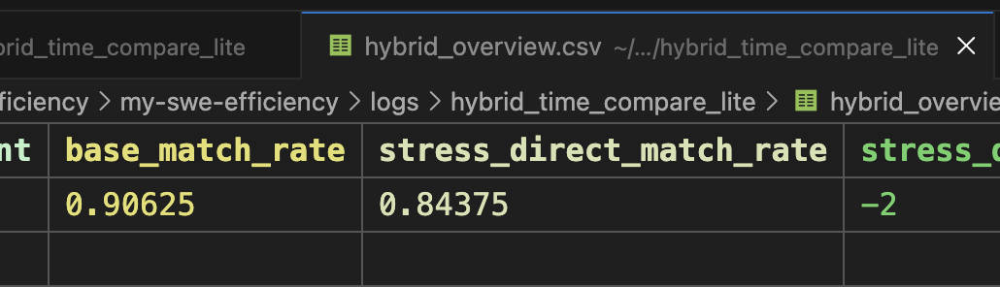
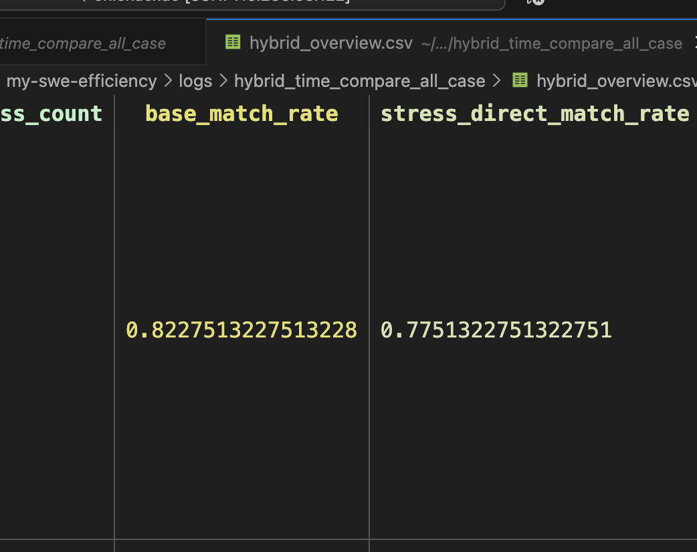

## 接着找bug

### hotspots

hybrid_time

```bash
numpy__numpy-12321|
pandas-dev__pandas-23772|
scipy__scipy-10064  这个不好说，其实跟命中了没什么区别
```




only base match：
```bash
astropy__astropy-16813|  stress偏了
astropy__astropy-7616|
astropy__astropy-7649|numpy__numpy-12321|
pandas-dev__pandas-26391|
pandas-dev__pandas-37450|
pandas-dev__pandas-42197|
pandas-dev__pandas-42268|
pandas-dev__pandas-42270|
pandas-dev__pandas-43308|
pandas-dev__pandas-43760|
pandas-dev__pandas-46235|
pandas-dev__pandas-47781|
pandas-dev__pandas-48611|
pandas-dev__pandas-50310|
pandas-dev__pandas-51344|
pandas-dev__pandas-54835|
scikit-learn__scikit-learn-28064|
scipy__scipy-10064|
scipy__scipy-21440|
sympy__sympy-21455|
sympy__sympy-25591
```

### 试下mini-swe-agent的效果


