# 数据过滤


# 3个rq

可以加一个lines of code指标
ds\qwen\gpt\llama

## 小数据集
success has 39
failed has 4
empty_p2p filtered has 1
filtered has 37
Success: 39, Failed: 4, EmptyP2P: 1, |change|>=5.0%: 37, output: logs/stage0_batch/output.csv


### hotspots
#### base hotspots
cumtime
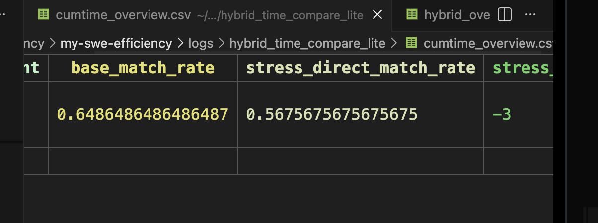
tottime
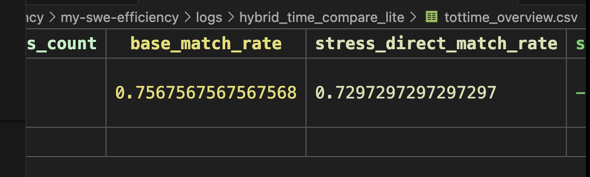
hybrid_time
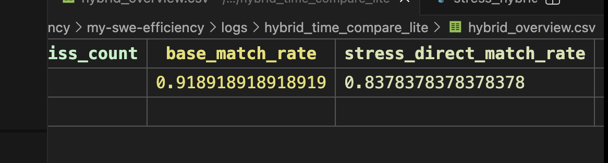

base和base-patch匹配是极高的，这证明了什么？
在该数据集上，一般的hotspots即为目标hotspots

#### stress hotspots
cumtime
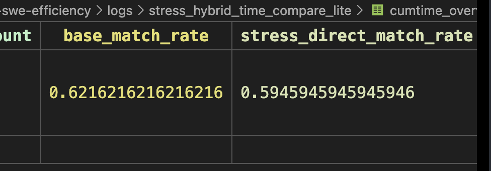
tottime
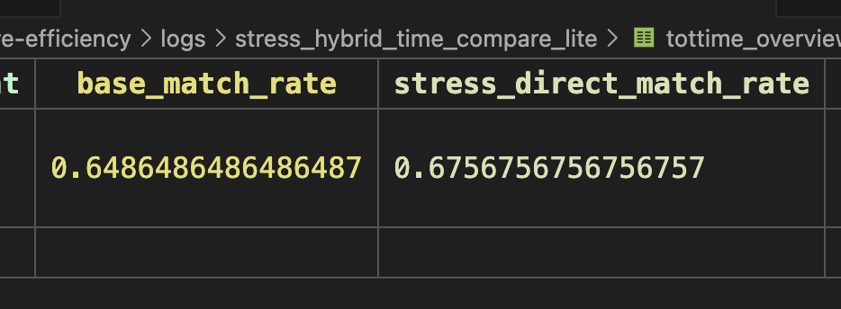
hybrid_time
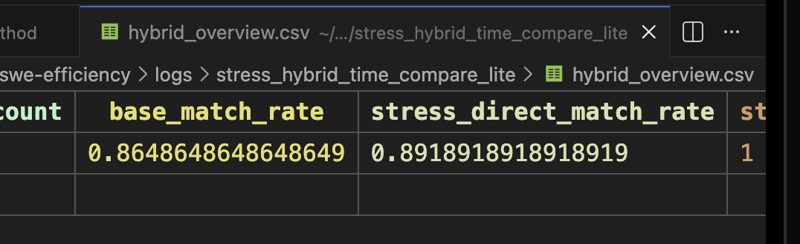


### edit function
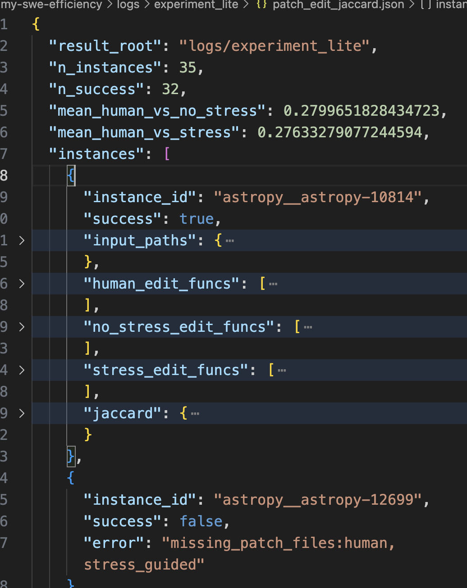

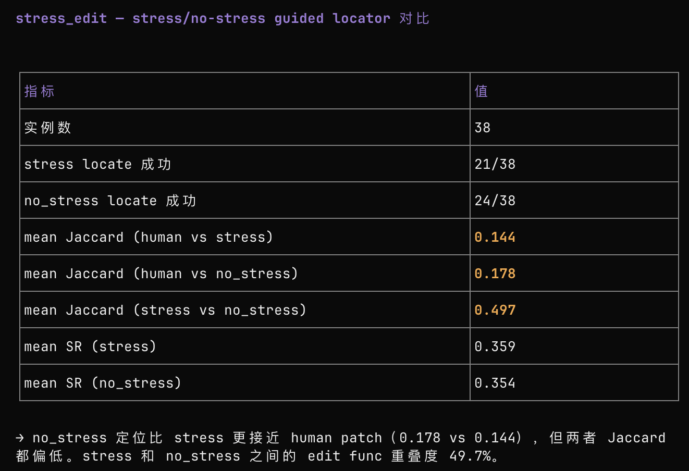

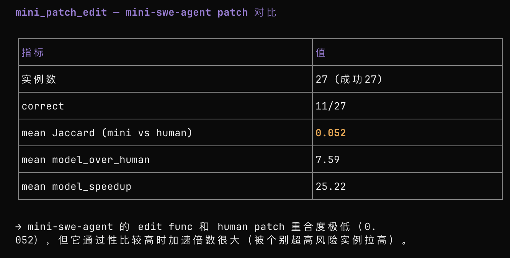

有一个怀疑，是不是locate steps给太少了，导致没打过。。

### speedsup

logs/experiment_lite
```bash
uv run -m swefficiency.method.workflows.stress_pipeline \
  --mode all \
  --instances-file swefficiency/method/getdataset/test_instances.txt \
  --output-root logs/experiment_lite \
  --reuse-prof-root /home/shichaoxue/swe-efficiency/my-swe-efficiency/logs/all_case \
  --top-k 1 \
  --timeout 600 \
  --stress-timeout 1200 \
  --max-rounds 5 \
  --max-generate-iterations 5 \
  --max-workers 3
```

```json
  "summary": {
    "mode": "all",
    "n_instances": 35,
    "human_speedup_mean": 24.698311996395663,
    "no_stress": {
      "n_instances": 35,
      "correct_count": 13,
      "speedup_success_count": 25,
      "model_speedup_mean": 1.546334187382713,
      "model_over_human_mean": 0.46580811149340307
    },
    "stress": {
      "n_instances": 35,
      "correct_count": 10,
      "speedup_success_count": 20,
      "model_speedup_mean": 1.2519604064411167,
      "model_over_human_mean": 0.5008715170386896
    },
    "stress_minus_no_stress": {
      "correct_count_gain": -3,
      "speedup_mean_gain": -0.2943737809415963,
      "ratio_mean_gain": 0.03506340554528653
    }
  }
```
#### mini-swe-agent

```bash
# 只渲染prompt
bash src/minisweagent/run/benchmarks/swefficiency_render_prompt.sh
# 跑一个case
bash src/minisweagent/run/benchmarks/swefficiency_single_run.sh
# 跑小数据集
bash src/minisweagent/run/benchmarks/swefficiency_batch_run.sh

# 评估
uv run -m swefficiency.method.workflows.mini_patch_pipeline \
  --instances-file swefficiency/method/getdataset/filtered_instances_by_repo.txt \
  --mini-run-root /home/shichaoxue/swe-efficiency/mini-swe-agent/logs/swefficiency-batch \
  --output-root logs/mini_patch_eval_lite \
  --timeout 600 \
  --max-workers 5
```

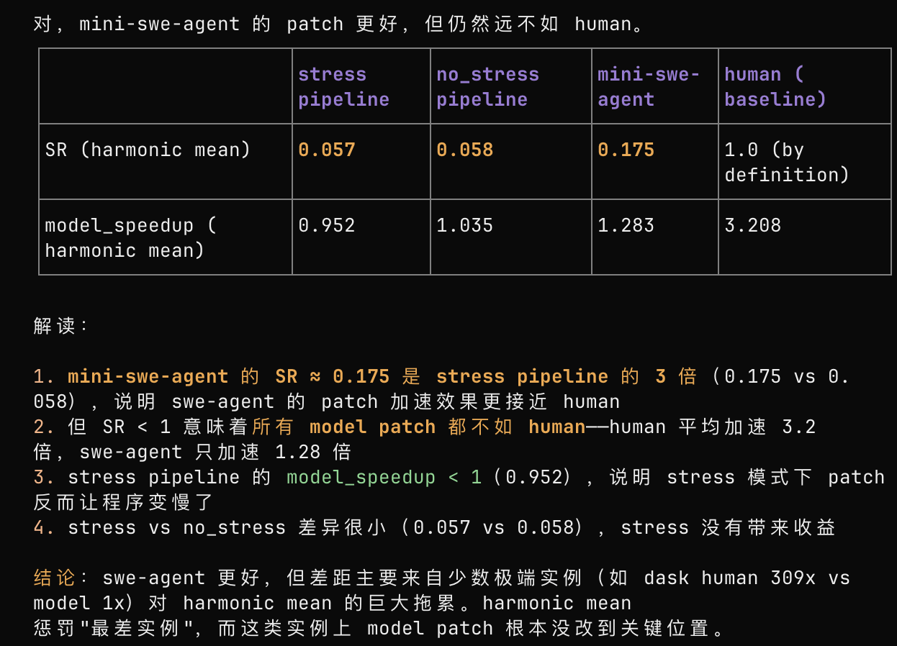

去掉astropy__astropy-10814这个PASS_TO_PASS为空的case


## 整个数据集
success has 449
failed has 46
empty_p2p filtered has 3
filtered has 437
Success: 449, Failed: 46, EmptyP2P: 3, |change|>=5.0%: 437, output: logs/all_case/output.csv


### hotspots
<!-- #### base hotspots
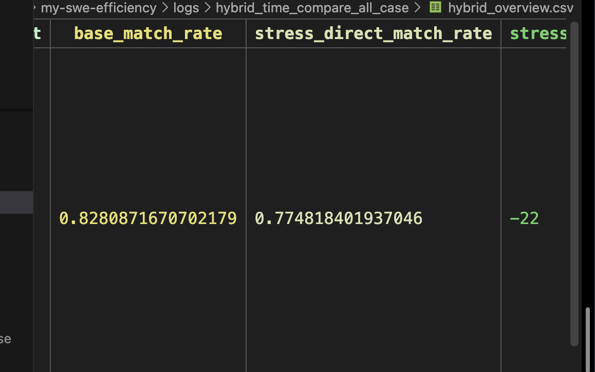

only base match：
```bash
astropy__astropy-16813|astropy__astropy-7616|astropy__astropy-7649|numpy__numpy-12321|pandas-dev__pandas-26391|pandas-dev__pandas-37450|pandas-dev__pandas-42197|pandas-dev__pandas-42268|pandas-dev__pandas-42270|pandas-dev__pandas-43308|pandas-dev__pandas-43760|pandas-dev__pandas-46235|pandas-dev__pandas-47781|pandas-dev__pandas-48611|pandas-dev__pandas-50310|pandas-dev__pandas-51344|pandas-dev__pandas-54835|scikit-learn__scikit-learn-28064|scipy__scipy-10064|scipy__scipy-21440|sympy__sympy-21455|sympy__sympy-25591
```

#### stress hotspots
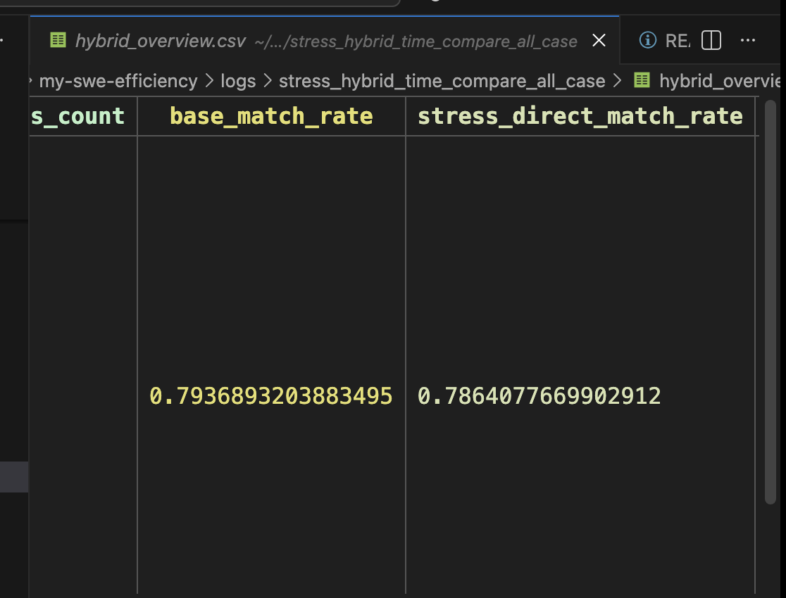 -->

## 做个base speedup， stress speedup的表格，看下stress speedup >= base speedup 的，有没有，有的话就作为 O(n^2)的case

```bash
 uv run python -m swefficiency.method.analysis.case_split --root logs/all_case --output-dir logs/case_split
stress: 201
normal: 222
error: 75
output_dir: logs/case_split
```
### normal上进行 base的 analysis
先在normal上 运行base的hybrid time analysis


### 在stress上 运行stress的hybrid time analysis
然后是在stress上 运行stress的hybrid time analysis


# question

## hotspots != edit func
用的base - patch的hotspots
跟human patch命中一个就算命中
### lite
lite (40 实例): hit_rate = 0.4500 (18/40)


### all
- 445 实例，149 命中，命中率 33.5%
- 命中的例子：top1 热点与 patch edit function 完全匹配（如 _select_subfmts、_wrap_at）


# 思考
## RQ1, hotspots != edit func
ok
## RQ2, hybrid过滤后，base和stress场景下的重叠率
ok
## RQ3, 给mini-swe装插件的效果（多llm）
plugin section1：hybrid time的hotspots

plugin section2：profiler tree

plugin section3：stress暴露的hotspots以及porfiler tree的路径


## RQ4， 消融

## RQ5，case study
