# mini-swe-agent理解
## 基础agent loop
https://minimal-agent.com/#dealing-with-exceptions-in-the-control-flow


## repo 架构(精简版)

```bash
.
├── docs
│   ├── advanced
│   │   ├── control_flow.md
│   │   ├── cookbook.md
│   │   ├── environments.md
│   │   ├── global_configuration.md
│   │   ├── v2_migration.md
│   │   └── yaml_configuration.md
│   ├── data
│   │   └── all_models.txt
│   ├── faq.md
│   ├── _footer.md
│   ├── index.md
│   ├── models
│   │   ├── local_models.md
│   │   ├── quickstart.md
│   │   └── troubleshooting.md
│   ├── overrides
│   │   ├── 404.html
│   │   └── main.html
│   ├── quickstart.md
│   ├── reference
│   │   ├── agents
│   │   │   ├── default.md
│   │   │   └── interactive.md
│   │   ├── environments
│   │   │   ├── bubblewrap.md
│   │   │   ├── contree.md
│   │   │   ├── docker.md
│   │   │   ├── local.md
│   │   │   ├── singularity.md
│   │   │   ├── swerex_docker.md
│   │   │   └── swerex_modal.md
│   │   ├── index.md
│   │   ├── models
│   │   │   ├── extra.md
│   │   │   ├── litellm.md
│   │   │   ├── litellm_response_toolcall.md
│   │   │   ├── openrouter.md
│   │   │   ├── overview.md
│   │   │   ├── portkey.md
│   │   │   ├── portkey_response.md
│   │   │   ├── requesty.md
│   │   │   ├── test_models.md
│   │   │   └── utils.md
│   │   └── run
│   │       ├── config.md
│   │       ├── hello_world.md
│   │       ├── inspector.md
│   │       ├── mini_extra.md
│   │       ├── mini.md
│   │       ├── swebench.md
│   │       └── swebench_single.md
│   ├── SECURITY.md
│   └── usage
│       ├── config.md
│       ├── inspector.md
│       ├── mini.md
│       ├── output_files.md
│       ├── python_bindings.md
│       └── swebench.md
├── logs
│   ├── swefficiency_20260415_114938.log
│   └── swefficiency-lite
│       ├── astropy__astropy-10814
│       │   ├── prompt.txt
│       │   ├── result.json
│       │   ├── submission.patch
│       │   └── trajectory.json
│       └── summary.json
├── mkdocs.yml
├── pyproject.toml
├── README.md
├── src
│   ├── **minisweagent**
│   │   ├── exceptions.py
│   │   ├── __init__.py
│   │   ├── __main__.py
│   │   ├── py.typed
│   │   └── **utils**
│   │       ├── __init__.py
│   │       ├── log.py
│   │       └── serialize.py
│   │   ├── **1.run**
│   │   │   ├── benchmarks
│   │   │   │   ├── __init__.py
│   │   │   │   ├── swebench.py
│   │   │   │   ├── swebench_single.py
│   │   │   │   ├── **swefficiency_single.py**
│   │   │   │   └── utils
│   │   │   │       ├── batch_progress.py
│   │   │   │       └── __init__.py
│   │   │   ├── extra
│   │   │   │   └── __init__.py
│   │   │   ├── hello_world.py
│   │   │   ├── __init__.py
│   │   │   ├── mini.py
│   │   │   ├── README.md
│   │   │   └── utilities
│   │   │       ├── config.py
│   │   │       ├── __init__.py
│   │   │       ├── inspector.py
│   │   │       ├── mini_extra.py
│   │   ├── **2.config**
│   │   │   ├── benchmarks
│   │   │   │   ├── __init__.py
│   │   │   │   ├── swebench_backticks.yaml
│   │   │   │   ├── swebench_modal.yaml
│   │   │   │   ├── swebench_xml.yaml
│   │   │   │   ├── swebench.yaml
│   │   │   │   └── sweefficiency.yaml
│   │   │   ├── default.yaml
│   │   │   ├── __init__.py
│   │   │   ├── inspector.tcss
│   │   │   ├── mini_textbased.yaml
│   │   │   ├── mini.yaml
│   │   │   └── README.md
│   │   ├── **3.1 agents**
│   │   │   ├── default.py
│   │   │   ├── __init__.py
│   │   │   ├── interactive.py
│   │   │   ├── README.md
│   │   │   └── utils
│   │   │       ├── __init__.py
│   │   │       ├── prompt_user.py
│   │   ├── **3.2 environments**
│   │   │   ├── docker.py
│   │   │   ├── extra
│   │   │   │   ├── bubblewrap.py
│   │   │   │   ├── contree.py
│   │   │   │   ├── __init__.py
│   │   │   │   ├── swerex_docker.py
│   │   │   │   └── swerex_modal.py
│   │   │   ├── __init__.py
│   │   │   ├── local.py
│   │   │   ├── README.md
│   │   │   └── singularity.py
│   │   ├── **3.3 models**
│   │   │   ├── extra
│   │   │   │   ├── __init__.py
│   │   │   │   └── roulette.py
│   │   │   ├── __init__.py
│   │   │   ├── litellm_model.py
│   │   │   ├── litellm_response_model.py
│   │   │   ├── litellm_textbased_model.py
│   │   │   ├── openrouter_model.py
│   │   │   ├── openrouter_response_model.py
│   │   │   ├── openrouter_textbased_model.py
│   │   │   ├── portkey_model.py
│   │   │   ├── portkey_response_model.py
│   │   │   ├── README.md
│   │   │   ├── requesty_model.py
│   │   │   ├── test_models.py
│   │   │   └── utils
│   │   │       ├── actions_text.py
│   │   │       ├── actions_toolcall.py
│   │   │       ├── actions_toolcall_response.py
│   │   │       ├── anthropic_utils.py
│   │   │       ├── cache_control.py
│   │   │       ├── content_string.py
│   │   │       ├── __init__.py
│   │   │       ├── openai_multimodal.py
│   │   │       └── retry.py
│   └── mini_swe_agent.egg-info
│       ├── ......
├── tests
│   ├── ......
└── uv.lock
```


## source code 理解

```bash
- mini-swe-agent是从 run/ 入口脚本 出发
- 然后把 config 解析/合并
- 再分别构造 model / environment / agent
- 最后才进入 agent.run() 这条核心闭环
```

### exceptions
**src/minisweagent/exceptions.py** 中
对应实现了 InterruptAgentFlow，
然后继承实现了 **LimitsExceeded、FormatError、UserInterruption、Submitted** 四个标志

### utils
#### utils/serialize

核心函数：**recursive_merge**，这是全局配置、yaml文件配置，cli配置合并的关键函数

多层配置的递归合并,
把多个 dict 合成一个，后面的覆盖前面的，并且支持嵌套 dict 的递归合并，同时**跳过 UNSET**


### run目录关键文件 职责
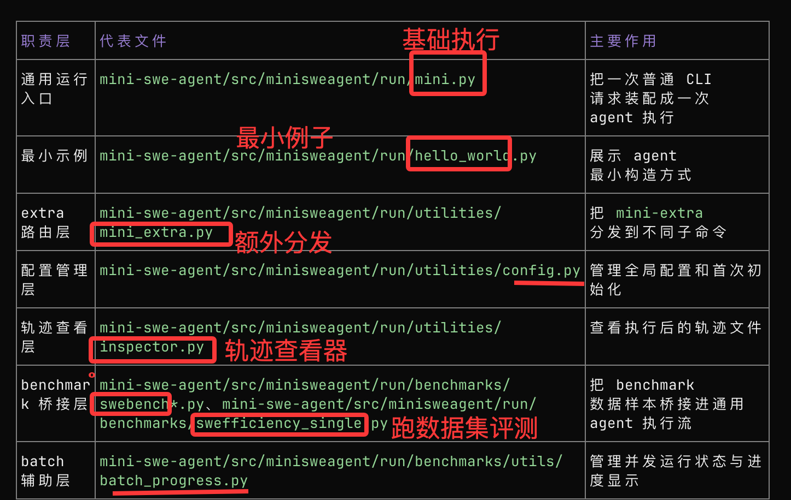

可以把 run 目录理解成 4 层
- 入口层
  - mini.py
  - utilities/mini_extra.py
- 示例层
  - hello_world.py
- 工具层
  - utilities/config.py
  - utilities/inspector.py
- benchmark 桥接层
  - benchmarks/swebench.py
  - benchmarks/swebench_single.py
  - benchmarks/swefficiency_single.py
  - benchmarks/utils/batch_progress.py

**swefficiency_single现在是自己瞎加的**

同时要知道 pyproject.toml中如下进行入口配置
```toml
[project.scripts]
# 命令 mini -> minisweagent.run.mini:app
mini = "minisweagent.run.mini:app"

# 命令 mini-swe-agent -> 同一个入口
mini-swe-agent = "minisweagent.run.mini:app"

# 额外工具命令
mini-extra = "minisweagent.run.utilities.mini_extra:main"
```

#### hello_world.py
最小可运行示例，展示如何手工 new 一个 DefaultAgent。

职责：最小教学示例，不走工厂，不走复杂 config merge。
  - 它直接：
    - LitellmModel(model_name=...)
    - LocalEnvironment()
    - DefaultAgent(...)
    - agent.run(task)
  - 这个文件的意义不是“正式入口”，而是让你快速看清最小依赖面：agent 只需要 model + environment + agent-config。

#### utilities
##### utilities/config.py
四个函数进行全局配置.env
- setup 交互式初始化配置
- set KEY VALUE 设置配置项
- unset KEY 删除配置项
- edit 直接用nano打开配置文件手改

##### utilities/inspector.py
把一条 agent 运行轨迹按“步骤 step”切分页，然后提供一个 TUI 界面让你左右翻步骤、上下滚动内容、切换不同轨迹文件，必要时还能用 jless 打开原始 JSON。

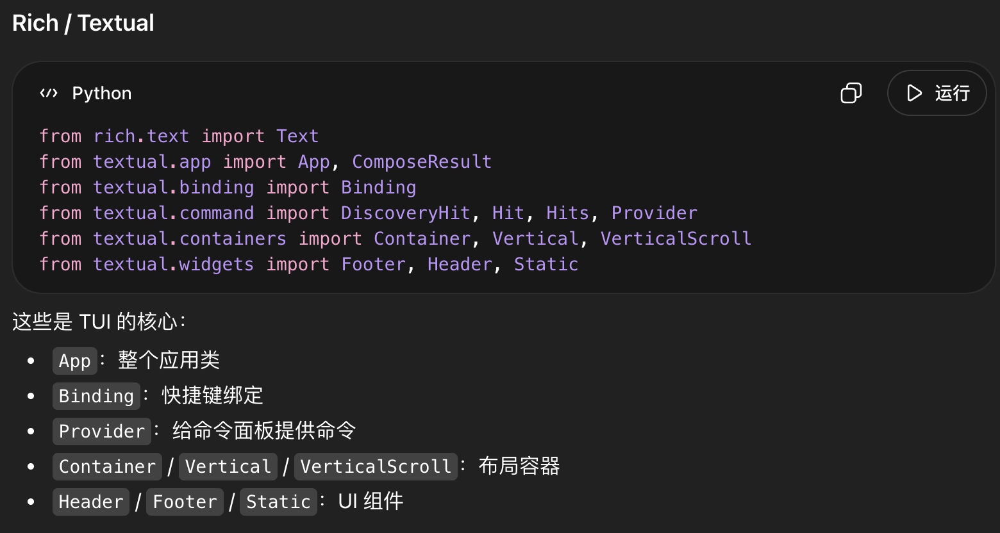

核心函数：**_messages_to_steps**
把trajectory.json分组成多个“step”，每个 step 其实就是 UI 中的一页。
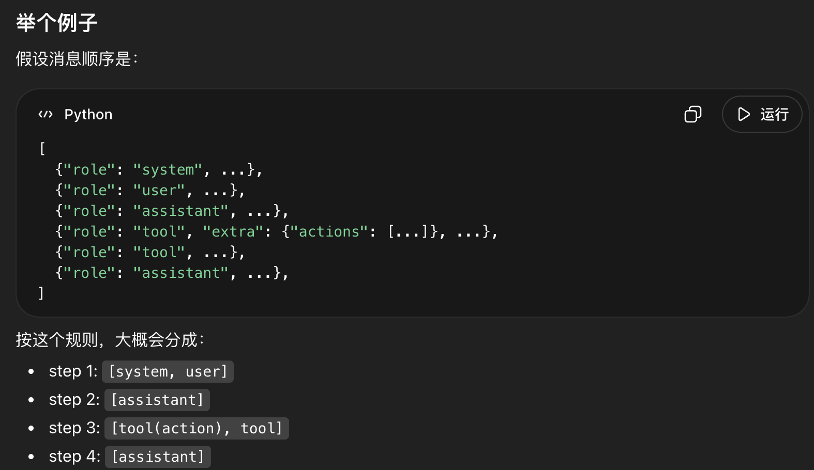

```text
基本流程
    1.进入 main(path)
        判断 path 是文件还是目录
        收集轨迹文件列表
    2.创建 TrajectoryInspector 类
        读样式
        初始化索引状态
        加载第一条轨迹
        把 messages 按 _messages_to_steps 分组
        inspector.run()
        构建 UI
        调 on_mount()
        调 update_content() 把当前 step 画出来
    3.用户交互阶段
        l / 右键：下一 step
        h / 左键：上一 step
        L / H：切轨迹
        j / k：滚动
        e / E：用 jless 看 JSON
        q：退出
```


#### mini.py
- 职责：把一次普通 CLI 调用转成一次 agent run

- 把命令行参数、默认配置文件、额外配置覆盖项合并成最终配置，然后创建 model / environment / agent，并启动 agent 去执行任务。

#### utilities/mini_extra.py
 - 职责：额外命令统一入口，相当于 mini-extra ... 的总路由器。
  - 它维护一个 subcommands 表，把子命令 alias 映射到对应模块：
    - config -> run.utilities.config
    - inspect -> run.utilities.inspector
    - swebench -> run.benchmarks.swebench
    - swebench-single -> run.benchmarks.swebench_single
    - swefficiency-single -> run.benchmarks.swefficiency_single
  - 真正做法是：读 sys.argv，匹配 alias，然后 import_module(module_path).app(...) 把控制权转交给子模块的 Typer app。

#### benchmark/ 下跑swebench

##### swebench_single.py

 - 职责：SWE-bench 单样本入口。
  - 和 mini.py 很像，但多了 benchmark 数据桥接：
    - 先 load_dataset(...)
    - 根据 instance_spec 选定一个 instance
    - 合并 config
    - 调 get_sb_environment(config, instance) 用 benchmark 的容器与 startup 逻辑
    - 再走 get_model(...) -> get_agent(...) -> agent.run(problem_statement)
##### swebench.py

- 职责：SWE-bench 批量运行入口。
  - 这是 benchmark runner 的典型模板，值得当“标准桥接层”来看。
  - 定义数据集子集映射 DATASET_MAPPING。
  - get_swebench_docker_image_name()：根据 instance 生成容器镜像名。
  - get_sb_environment()：把 instance 的 image + startup command 注入 environment config，创建 benchmark 专用环境。
  - process_instance()：单个样本的完整执行单元：建 model、建 env、new agent、run、保存轨迹、写 preds。
  - filter_instances()：支持 regex/filter/slice/shuffle 的样本筛选。
  - main()：加载 dataset、过滤实例、合并 config、创建进度管理器、用线程池并发跑。


ProgressTrackingAgent ：给默认 agent 加上“每步更新进度”的能力。

get_swebench_docker_image_name ：从实例元数据推导 benchmark 镜像名。

get_sb_environment：根据 config + instance 创建 benchmark 环境，并执行可选启动命令。

update_preds_file：线程安全地更新结果汇总文件。

remove_from_preds_file：重新跑实例前，删掉旧结果。

process_instance：批处理中真正处理单个实例的 worker 函数。

filter_instances：对实例列表做 shuffle / regex filter / slice。

main：批处理总控入口：加载数据、筛选、构建配置、并发执行、显示进度。


### models目录，litellm
- models/ 目录是 mini-swe-agent 的“模型适配层”。
- 它的核心职责不是“决定做什么”，而是把 agent 的消息历史转换成某个 LLM API 能接受的请求，再把返回结果转换回 agent 能继续处理的统一消息格式。
- 默认主线路是 LitellmModel；
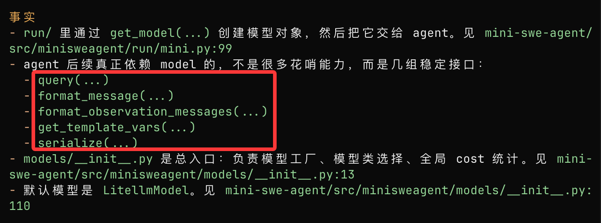

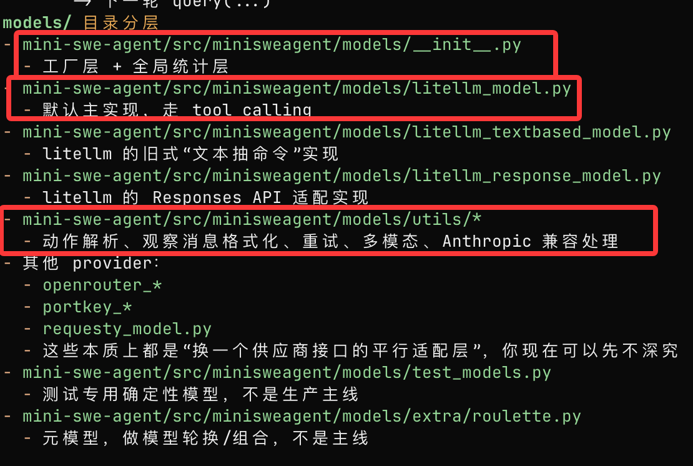

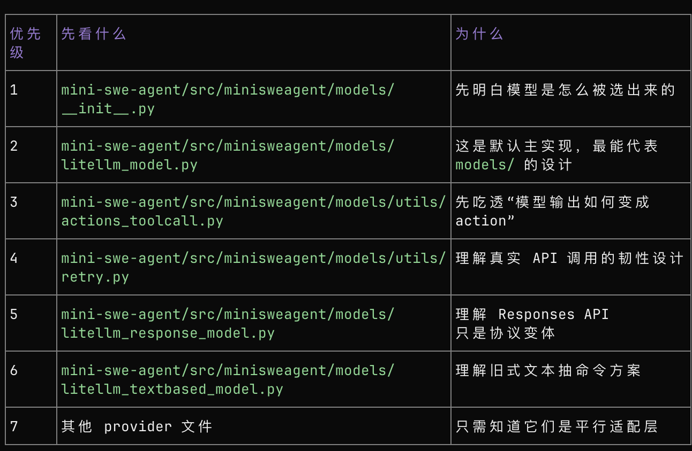

#### __init__.py
- GlobalModelStats 全局模型调用账本，记录总花费和总调用次数，并可设置全局上限。

- **GLOBAL_MODEL_STATS** 全局单例统计器。

- get_model_name 按“参数 > config > 环境变量”的优先级解析模型名。

- get_model_class 解析模型类；若显式指定则动态导入，否则默认返回 LitellmModel。

- **get_model** 综合模型名、模型类和配置，补默认项后实例化模型对象。


#### litellm_model.py
职责：
- 把 agent 内部的消息格式整理好，调用 litellm.completion() 发给模型，解析 tool call，计算 cost，记录到 extra 里，再把结果返回给 agent。

**1.LitellmModelConfig**

这是 LiteLLM 模型的配置数据结构，规定模型名、额外参数、成本跟踪、cache control、observation 模板、多模态规则等配置。

**2.LitellmModel**

这是 mini-SWE-agent 的 LiteLLM 适配器，负责把消息发给大模型、处理重试、解析 tool call、统计成本，并返回标准化消息。
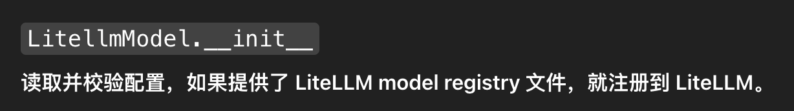
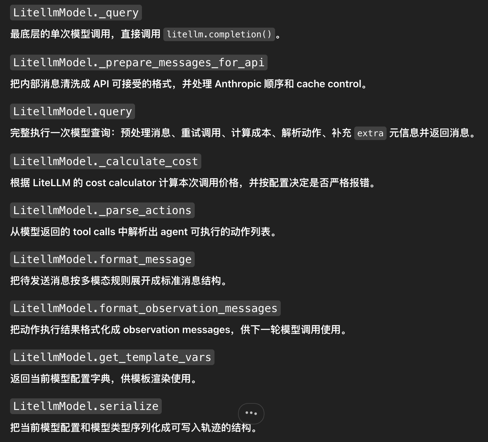


#### utils/*

**action_toolcall.py** 
职责：
    把模型返回的 tool calls 解析成 agent 可执行的 actions；再把 action 的执行结果格式化成下一轮发给模型的 observation messages。
- BASH_TOOL：定义给模型看的工具 schema
- parse_toolcall_actions(...)：解析模型调用
- format_toolcall_observation_messages(...)：格式化执行结果


**cache_control.py** 
职责：
Anthropic（Claude）体系特有的能力，给 Anthropic 一类支持 prompt caching / cache control 的模型 用的。

核心字段是：
```json
{"type": "ephemeral"}
```
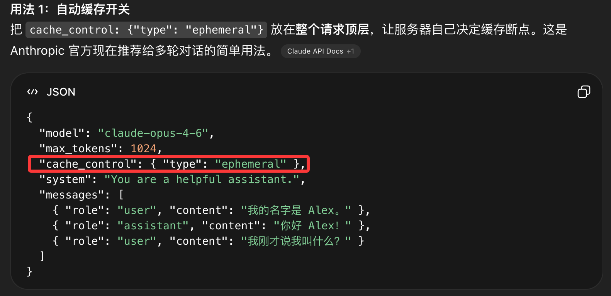
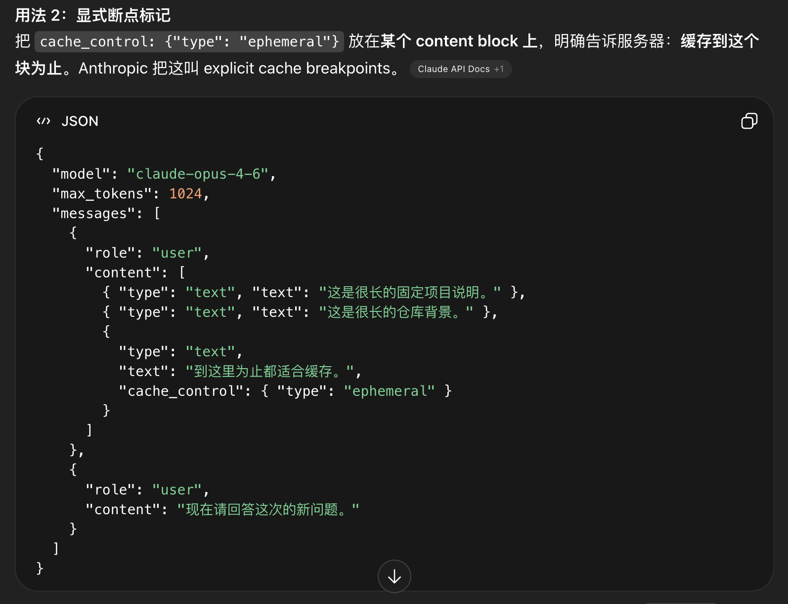

这个文件的作用是：
**在一串 messages 里，清掉旧的缓存边界，然后只在“最后一条消息”上重新设置一个新的 cache_control 标记。**
本质上是：给 Anthropic/Claude prompt caching 服务的“缓存边界整理器”
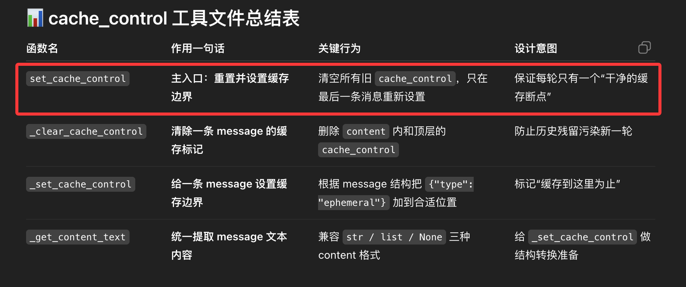

**retry.py**
经典的tenacity库的封装

**litellm_response_model.py**
**litellm_textbased_model.py**
**utils/openai_multimodal.py**  

### environments目录，local、docker
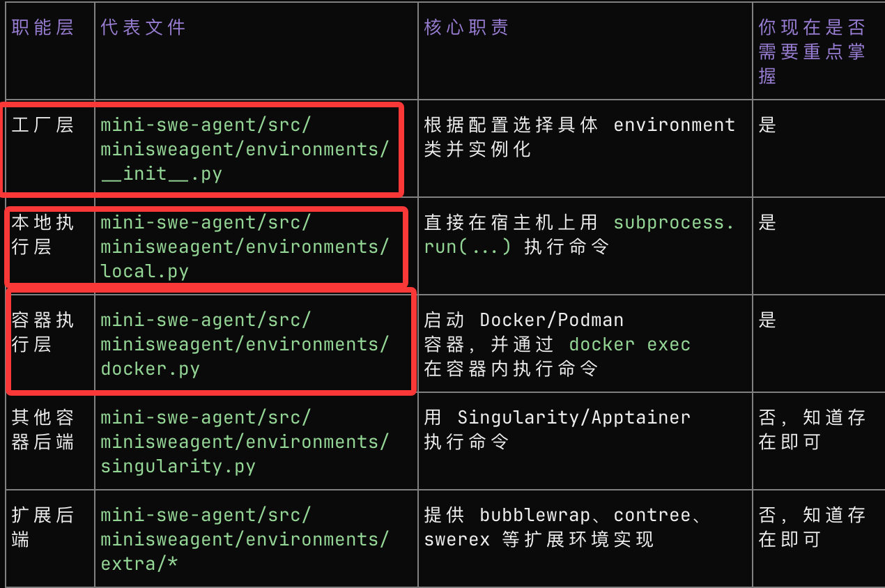
同样的套路，在__init__基于importlib.import_module，做环境分发，入口是get_environment

我们这里只关注local和docker

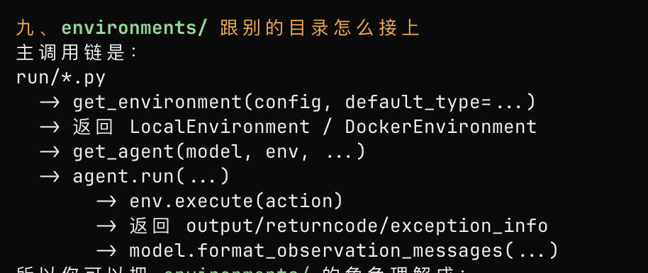

**local.py**
就一个配置类和一个LocalEnvironment类
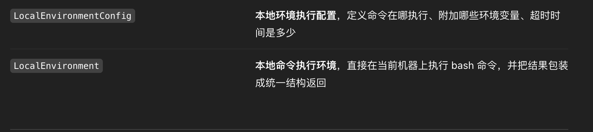
LocalEnvironment类的核心函数及功能
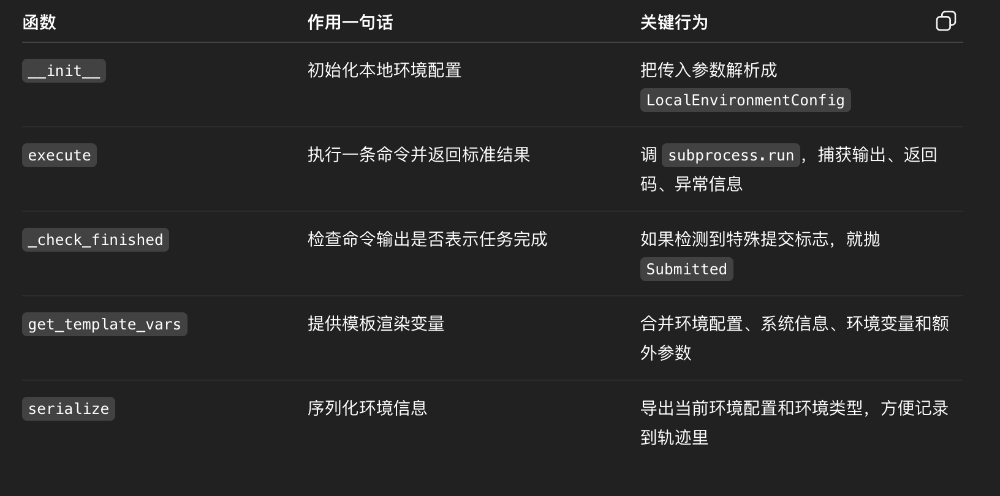

**docker.py**
同样的DockerEnvironment类如下
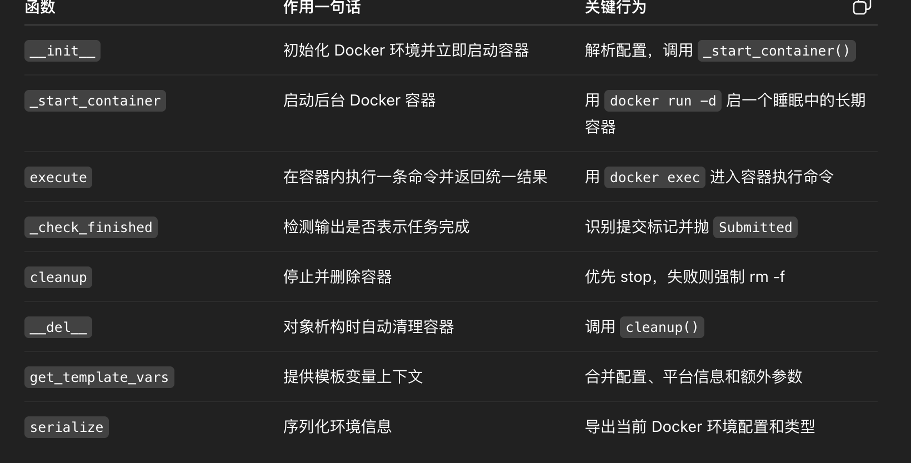

**一个重要的执行逻辑：**
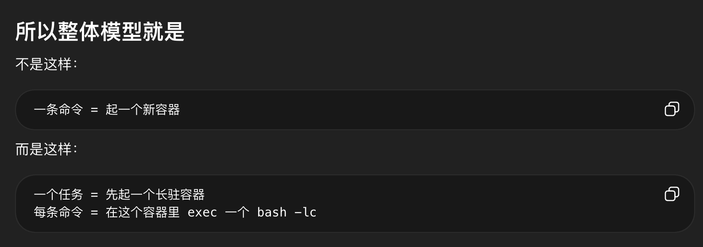


### agents目录
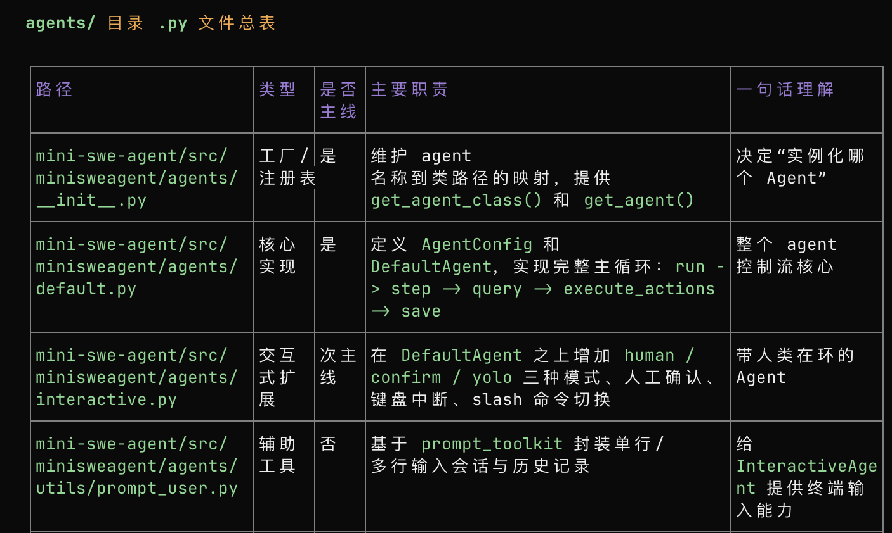

**default.py** 基础agent
**interactive.py** 交互式agent， human in loop


