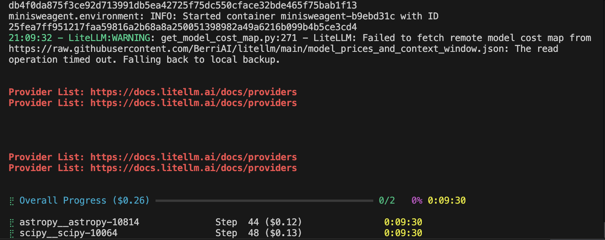
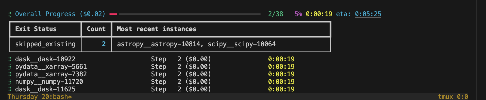

## 1.扫了一遍mini-swe-agent相关源代码
ok

## 完成新中特作业
ok

## mini-swe-agent适配swefficiency的实验
根据swebench_single.py,swebench.py
搞出来swefficiency_single.py,swefficiency.py

跑下小数据集

ok

## 找stress干不过base的bug

## 少了一个互补的实验

## 少了一个直接hotspots跟edit func对比的实验

## 似乎可以根据base/stress两种情况下的human patch的加速比，进行case的分类

