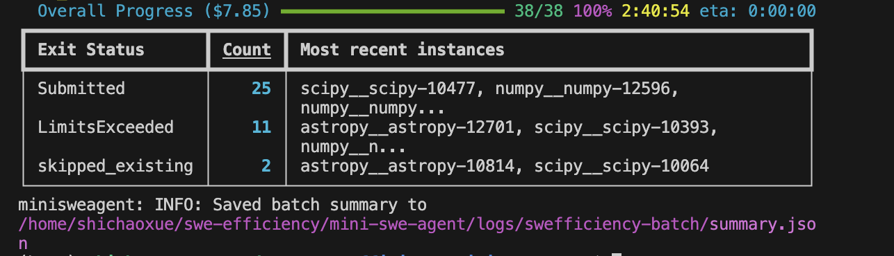
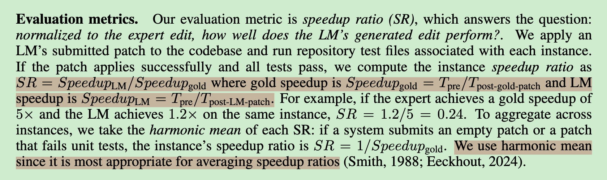
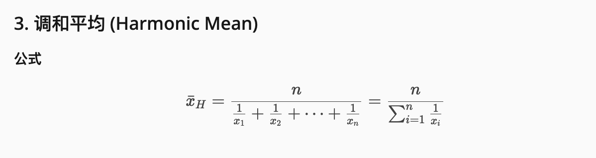
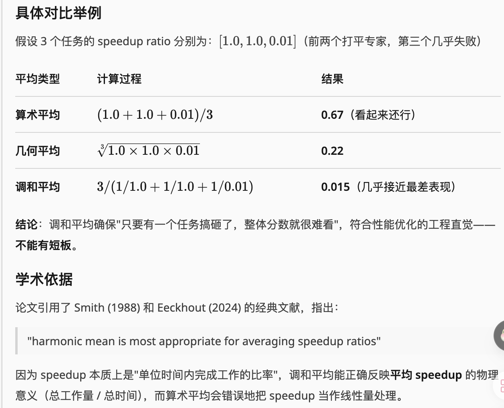

回退版本curl -fsSL https://opencode.ai/install | bash -s -- --version 1.3.13

## 1.查看mini-swe的轨迹
38个case


limitsExceeded（100 steps）了11个


**调和平均**





增加harmonic mean的代码，增加batch评估的代码，进行评估

指标统计是 human_patch的speedup作为除数，这种model_patch除以human_patch的speedup之后的作为指标SR，然后多个instances时 SR是要做调和平均

再修下
重构下

```bash
# Step 1: 重跑 human baseline
uv run -m swefficiency.method.workflows.human_patch_pipeline \
  --instances-file swefficiency/method/getdataset/filtered_instances_by_repo.txt \
  --output-root logs/human_baseline_lite
# Step 2: 跳过！直接用旧 generate 结果
# --generate-root logs/experiment_lite 就是旧结果
# Step 3: 用旧 generate + 新 human baseline 跑 eval
uv run -m swefficiency.method.workflows.stress_eval_pipeline \
  --mode all \
  --instances-file swefficiency/method/getdataset/filtered_instances_by_repo.txt \
  --generate-root logs/experiment_lite \
  --human-root logs/human_baseline_lite \
  --output-root logs/stress_eval_lite \
  --timeout 600 --max-workers 3
# Step 4: mini-swe-agent patch 评估
uv run -m swefficiency.method.workflows.mini_patch_pipeline \
  --instances-file swefficiency/method/getdataset/filtered_instances_by_repo.txt \
  --mini-run-root /home/shichaoxue/swe-efficiency/mini-swe-agent/logs/swefficiency-batch \
  --human-root logs/human_baseline_lite \
  --output-root logs/mini_patch_eval_lite \
  --timeout 600 --max-workers 3
```


## 少了一个互补的实验


## 少了一个直接hotspots跟edit func对比的实验

## 似乎可以根据base/stress两种情况下的human patch的加速比，进行case的分类

## 找stress干不过base的bug

## 小问题


