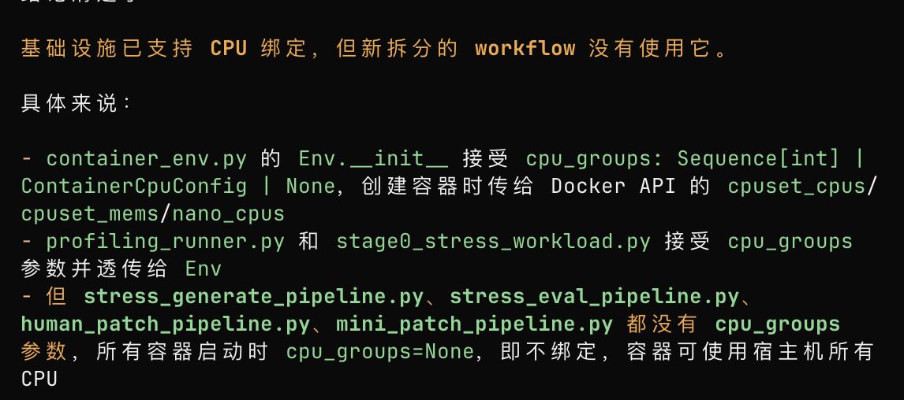
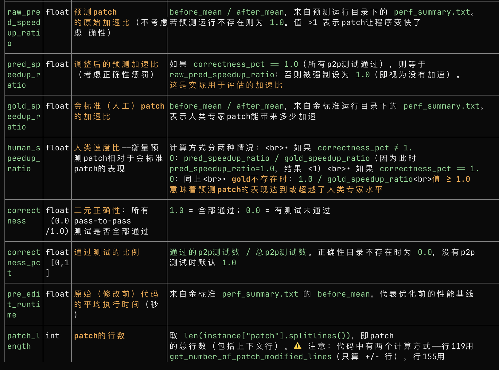

## 少了一个互补的实验
base和stress两种场景
热点分别是 base-patch、stressbase-stresspatch

互补说的应该是这两个是互补的吧？


### 做的有没有问题 -》 有点小问题，base侧怎么能读stress表呢

应该是 stress的hybrid time topk1
在两种场景下base hotspots、stress hotspots 命中的是互补的

那做的又没有问题了，命中肯定是base workload跟base-patch，stress workload跟stress base-stress patch。

这种指标没干过，但是互补性，可以说明暴露出潜在优化空间


然后可以基于这个想要优化的空间，再设计针对性stress保留优化路径，基于这个假设，再让llm去修复

### 那直接比较 hotspots和stress hotspots这是在干嘛？
相当于热点hotspots的偏移
Both: 386, Base only: 1, Stress only: 0, Neither: 58


### base workload与hotspots匹配的， vs stress workload与hotspots匹配的
那这里也应该直接两者匹配才对啊
对的

```bash
Total: 445, Mode: exact, Top-1, 
Both: 318, Base only: 28, Stress only: 9, Neither: 90
Output: logs/both_neither/both_neither_all_base.csv
# 互补倒是互补，但是回退太多了啊。
```

## 似乎可以根据base/stress两种情况下的human patch的加速比，进行case的分类

这个思路的立意是把 基于在base、stress情景的不同来筛掉这些数据

但是有一个前提是stress workload是正确的


## swe efficiency没中的原因是啥


## 找stress干不过base的bug

## 会不会数据不适合stress呢？


## 小问题 没给docker绑定cpu运行



## mini-swe更优


关于/home/shichaoxue/swefficiency-oracle/eval_reports/eval_report_deepseek-reasoner_maxiter_100_N_v0.51.1-no-hint-run_1.csv的理解



一个反直觉的，这个SR由于调和平均整体较小，但是会有个别很高的

在小数据集上抽出来（oracle的deepseek3.1）
harmonic_mean(human_speedup_ratio) = 0.066381


## 少了一个直接hotspots跟edit func对比的实验

hotspots重叠率那里 base-patch的函数，是否已经都命中了edit func

用的base - patch的hotspots
跟human patch命中一个就算命中
### lite
lite (40 实例): hit_rate = 0.4500 (18/40)


### all
- 445 实例，149 命中，命中率 33.5%
- 命中的例子：top1 热点与 patch edit function 完全匹配（如 _select_subfmts、_wrap_at）


## edit fun


有一个怀疑，是不是locate steps给太少了，导致没打过。。


