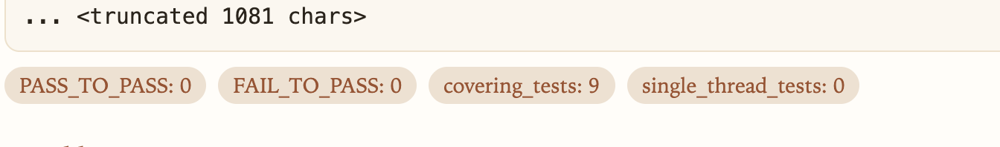
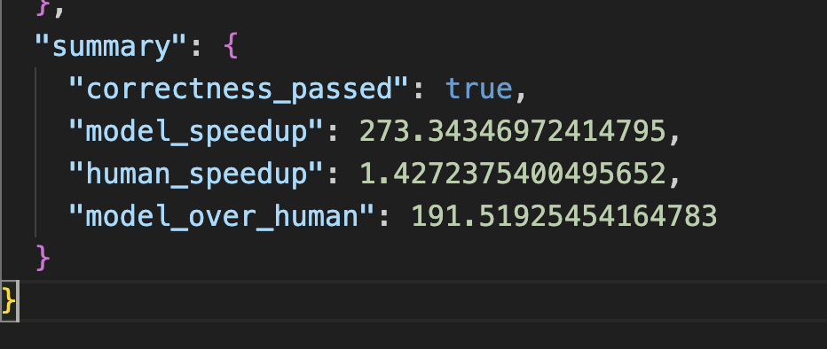
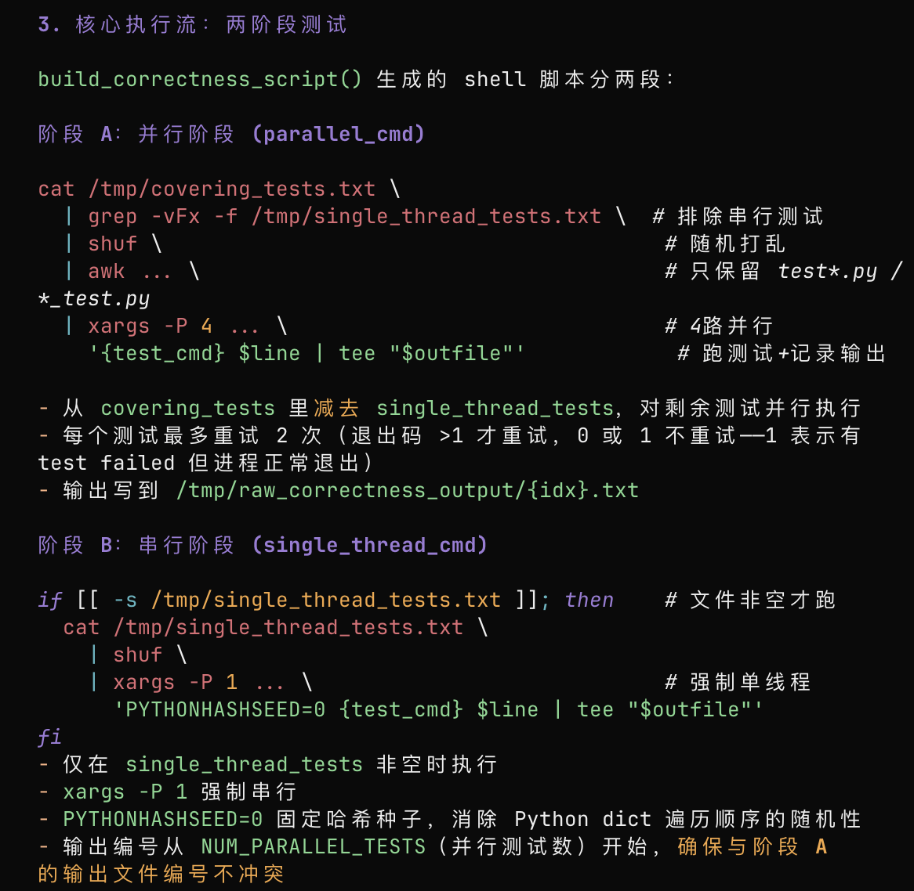
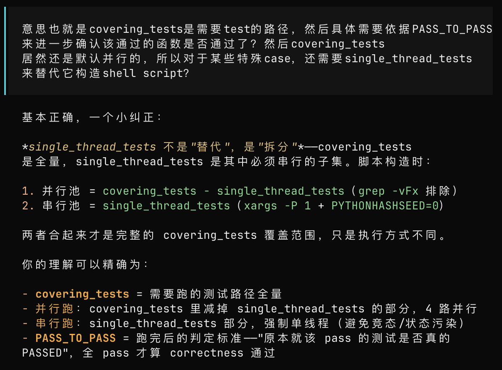
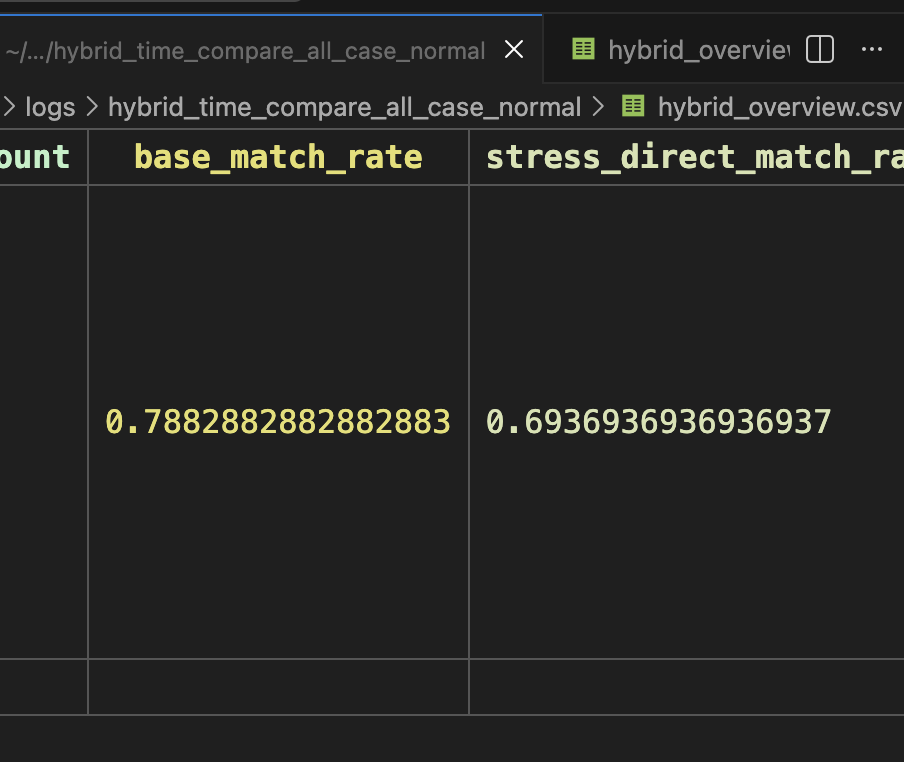
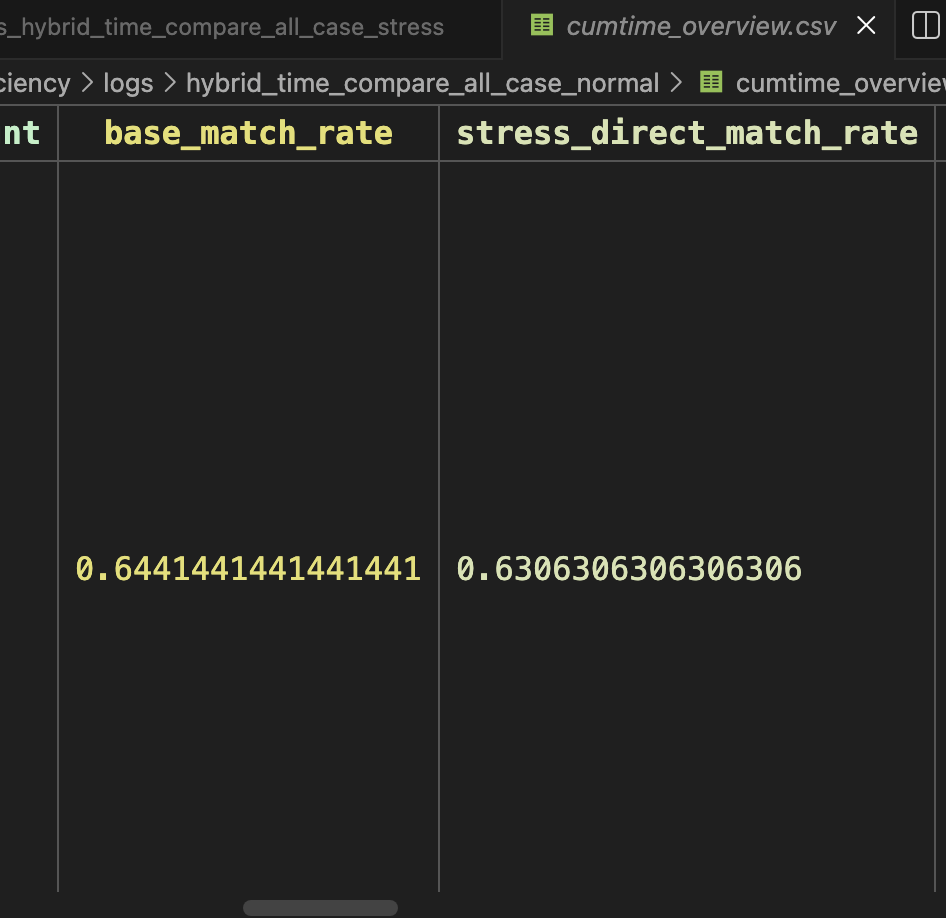
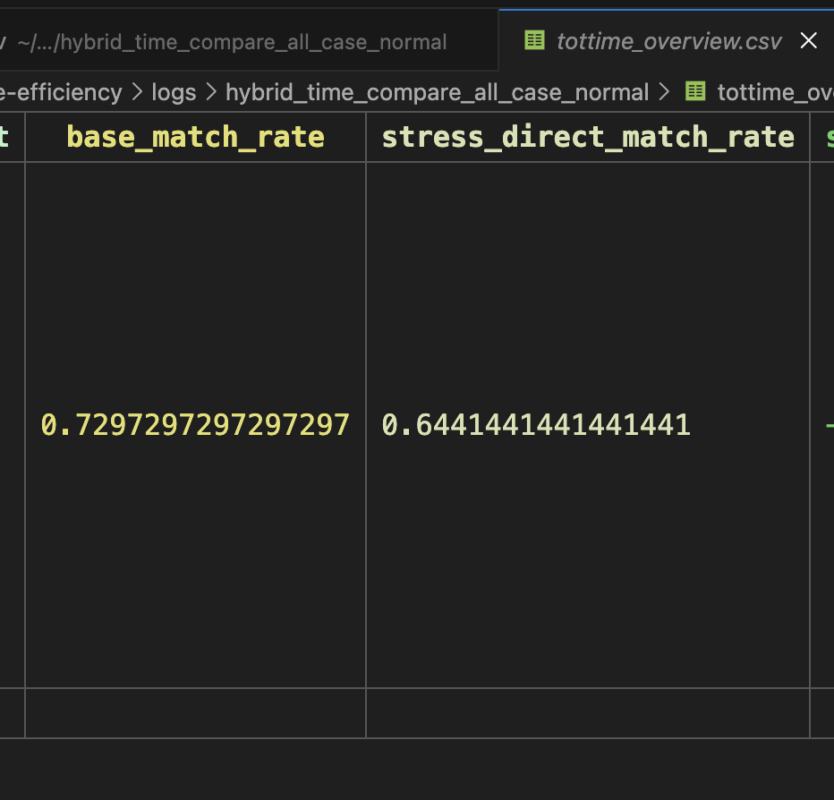
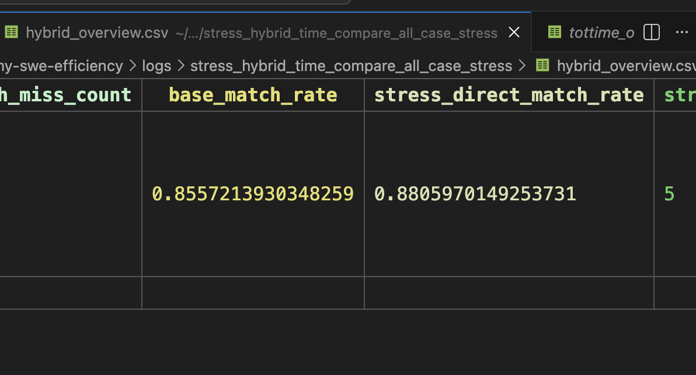
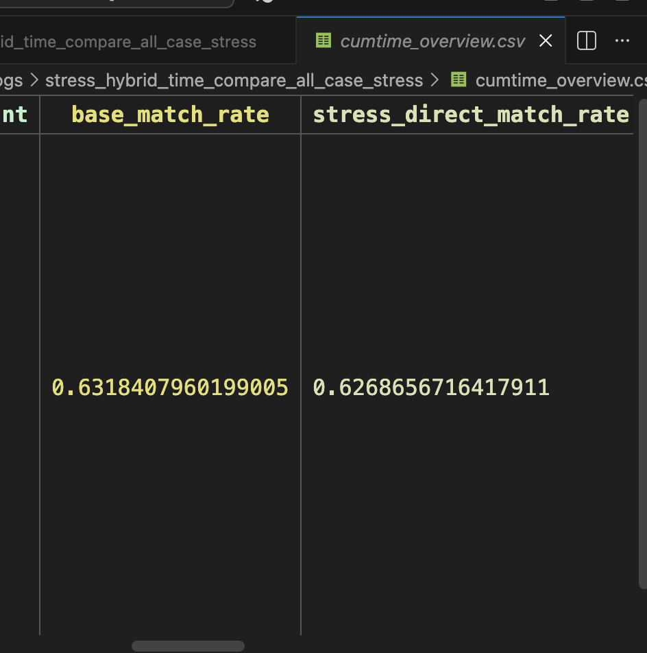
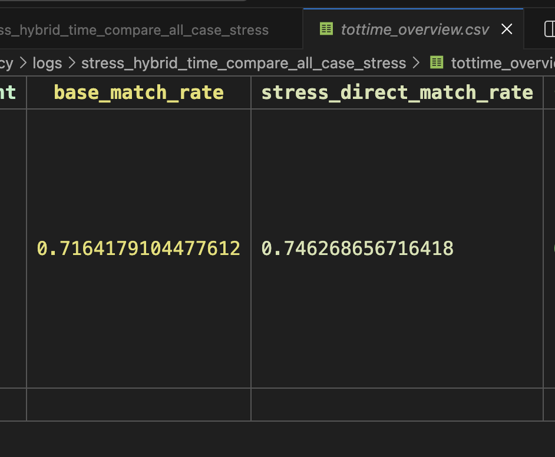

1.完成了工程伦理考试
2.简单看了点基层中国的运行逻辑
3.完成零茶试炼，一个小脑筋急转弯题目 


现在接着swe-efficiency
先再好好看一遍代码，分析下已有结果


## 思考把pipeline改成插件装上去mini-swe-agent
可以先拆一个porfiler tree
以及base hybrid time表


## swe efficiency没中的原因是啥


## 找stress干不过base的bug


## 会不会数据不适合stress呢？


## PASS_TO_PASS为0的数据，也应该过滤掉吧？

我说怎么astropy__astropy-10814怎么这么高



## correctness evaluate的细节





## 互补实验
base和stress两种场景
热点分别是 base-patch、stressbase-stresspatch

### base workload与hotspots匹配的， vs stress workload与hotspots匹配的
那这里也应该直接两者匹配才对啊
对的

```bash
Total: 445, Mode: exact, Top-1, 
Both: 318, Base only: 28, Stress only: 9, Neither: 90
Output: logs/both_neither/both_neither_all_base.csv
# 互补倒是互补，但是回退太多了啊。
```

## 似乎可以根据base/stress两种情况下的human patch的加速比，进行case的分类

这个思路的立意是把 基于在base、stress情景的不同来筛掉这些数据

但是有一个前提是stress workload是正确的


## 做个base speedup， stress speedup的表格，看下stress speedup >= base speedup 的，有没有，有的话就作为 O(n^2)的case

```bash
 uv run python -m swefficiency.method.analysis.case_split --root logs/all_case --output-dir logs/case_split
stress: 201
normal: 222
error: 75
output_dir: logs/case_split
```
### normal上进行 base的 analysis
先在normal上 运行base的hybrid time analysis




### 在stress上 运行stress的hybrid time analysis
然后是在stress上 运行stress的hybrid time analysis





