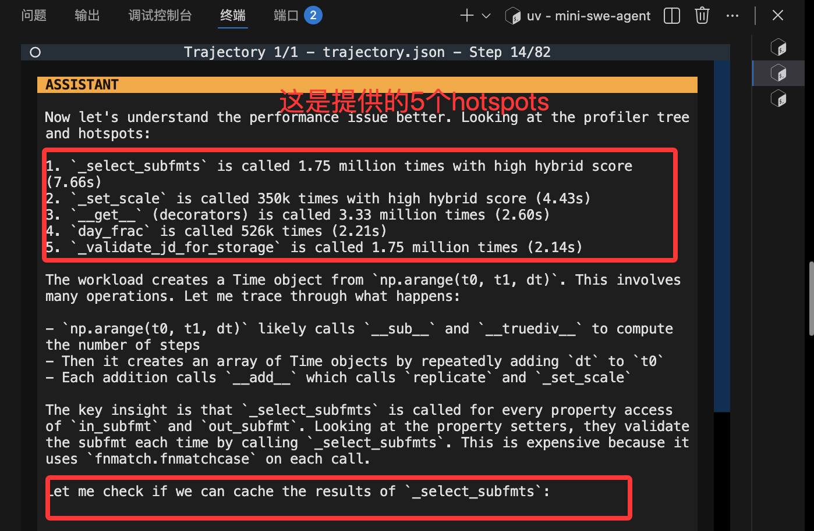
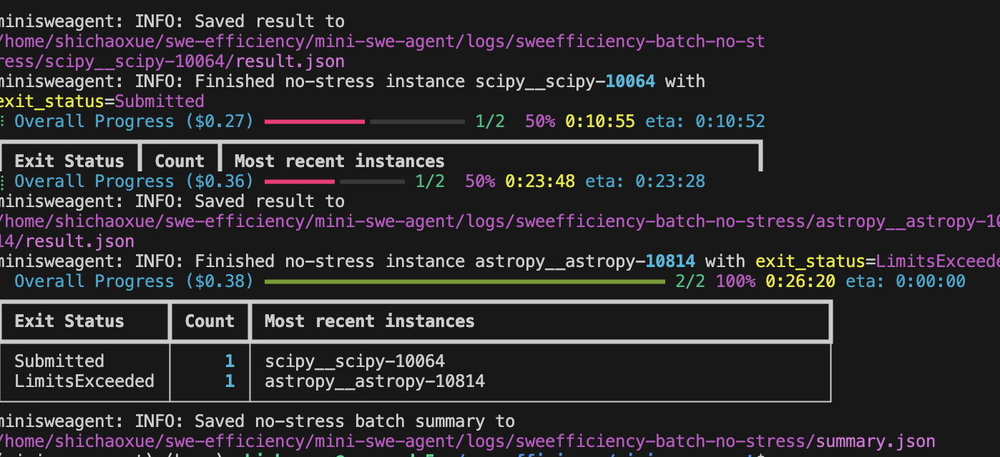
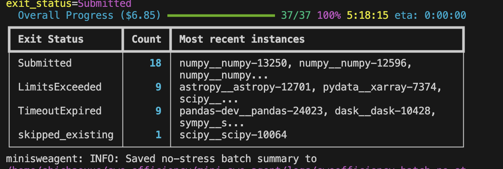
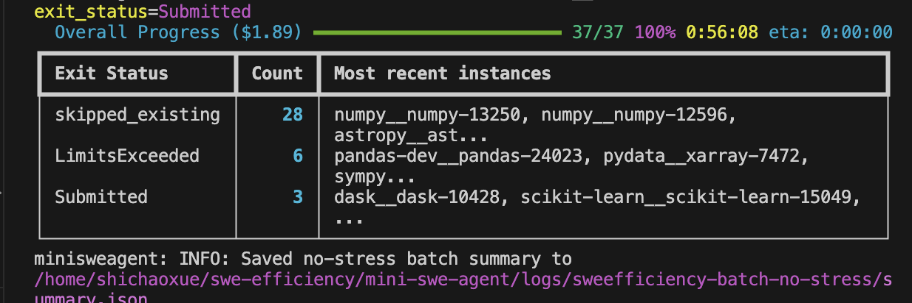
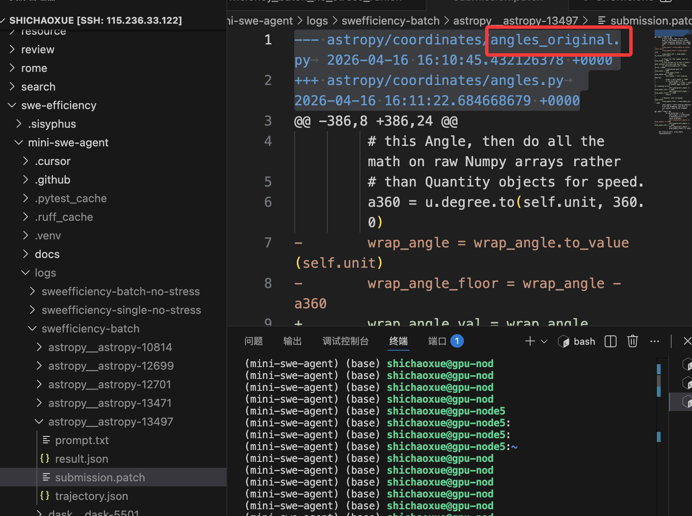

## 思考把pipeline改成插件装上去mini-swe-agent
可以先拆一个porfiler tree
以及base hybrid time表

plugin section1：hybrid time的hotspots

plugin section2：profiler tree

plugin section3：stress暴露的hotspots以及porfiler tree的路径

plugin section4:correctness反馈迭代(这个mini-swe其实已经有了)
plugin section5: SR持续优化(应该就是简单反馈)

### 先转hotspots以及profiler tree
cd /home/shichaoxue/swe-efficiency/mini-swe-agent
bash src/minisweagent/run/benchmarks/sweefficiency_single_no_stress_run.sh

**在astropy__astropy-12701上实现成功**
mini-swe搞不定，在瞎修
no-stress-mini-swe搞定了，(5个hotspots自动决策了)

186.18 -> 184.73
batch的也跑了2个case

-> 137

19+3， 提交了22个

## 分析baseline的trajectory

### 发现了一个bug

修改计划，改prompt约束，加后置formatter，识别常见的 _backup， _original这种

