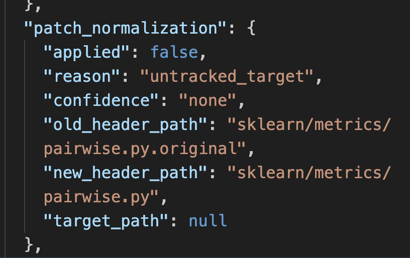
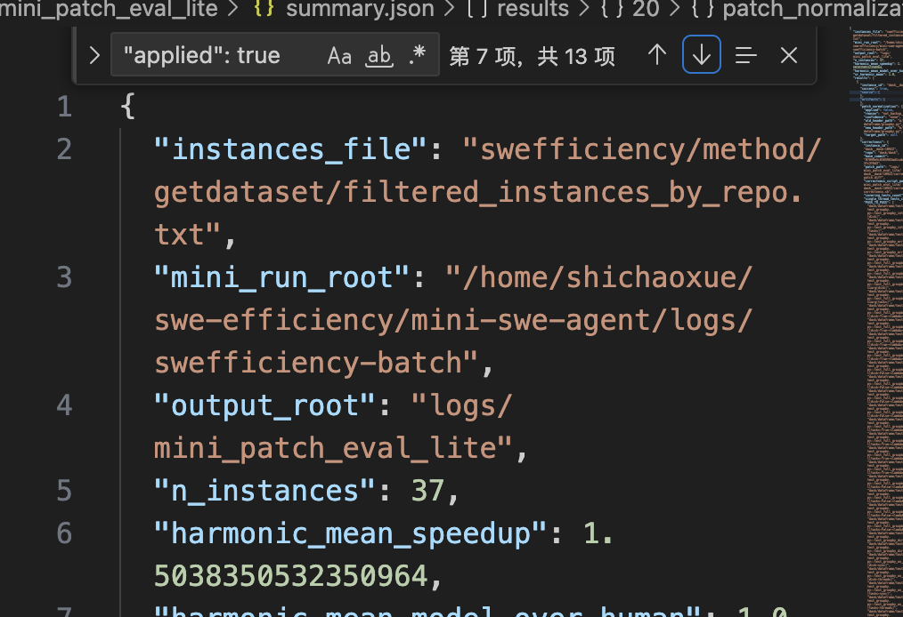
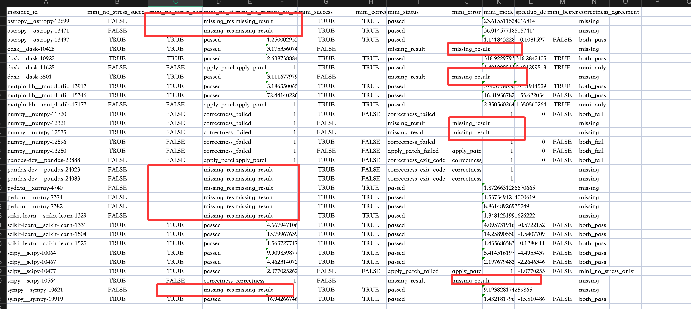
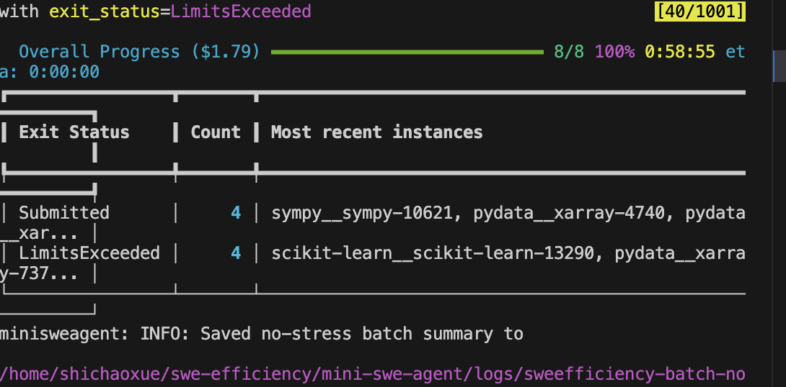

完成新中特考试
看了会cpython设计
完成零茶试炼 
完成工程实训任务 

## 这个评测还有个小bug

是不是没有checkout base commit呢
还是normalize有问题，直接去除校验，高了点。

## 对比no-stress和mini-swe结果

理论应该肯定有效果

完了，貌似没效果，找下bug

猜测是topk5给多了， llm会一直试着确定究竟哪一个是hotspots
查看scikit-learn__scikit-learn-13290
发现他就是根据你这个topk个hotspots，挨个去考虑的

### 还有一个问题，profiler tree很重，这些limits究竟是预算挂了还是101 steps挂了
ok，基本都是101 steps挂了

### topk1的试一下
sk-3a13a5c8eeb8469a8ee6d432cffd1611
只在mini passed了，而mini-no-stress没pass的试一下

还是有两个卡在100 steps

突然觉得应该恢复patch策略，不然对no-stress太不公平了

### 还有一个很诡异的问题
我们配置的明明是temperatur为0
为什么astropy12701 single单独跑是可以的，而batch中就挂了？？

# todo

## 思考把pipeline改成插件装上去mini-swe-agent
可以先拆一个porfiler tree
以及base hybrid time表

plugin section1：hybrid time的hotspots

plugin section2：profiler tree

plugin section3：stress暴露的hotspots以及porfiler tree的路径

plugin section4:correctness反馈迭代(这个mini-swe其实已经有了)
plugin section5: SR持续优化(应该就是简单反馈)

## swe efficiency没中的原因是啥

## 找stress干不过base的bug

## 会不会数据不适合stress呢？

