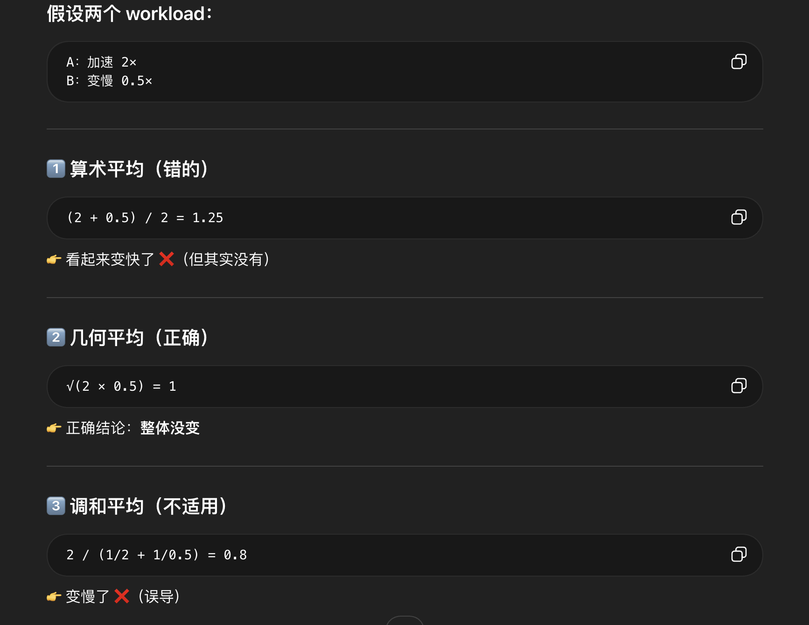

## 组会
1. hotspots分开case统计

2. 直接用pipeline 比不过

3. 改成插件，先做no-stress的，正在调

## todo

1. 详细看看swefficiency被据掉的原因

2. 仔细阅读Formulacode

大致看了下，相当于进一步注意到了正式的asv（这个可以简单再学一下。）
1. 详细看看swefficiency被据掉的原因
3. 仔细阅读GSO

4. no-stress插件做的太拉了

5. 现在的方法换成gpt-5.4-mini模型呢？

