1. 详细看看swefficiency被据掉的原因

**问题1:**
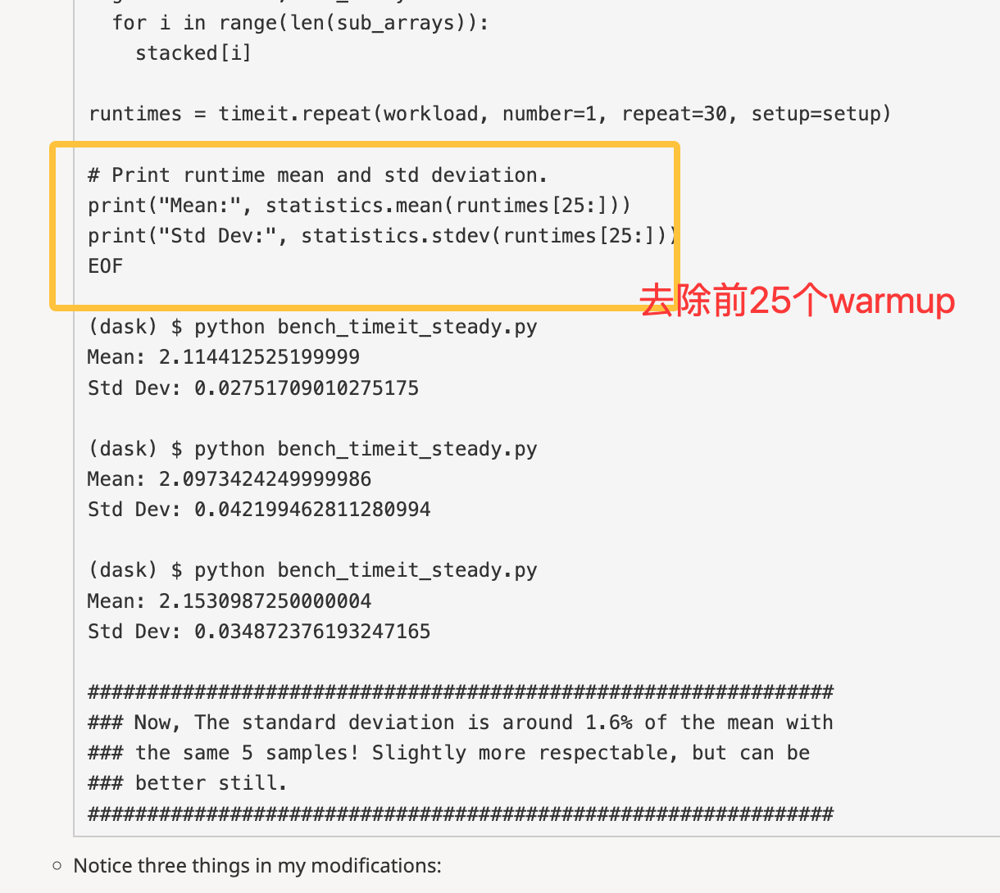
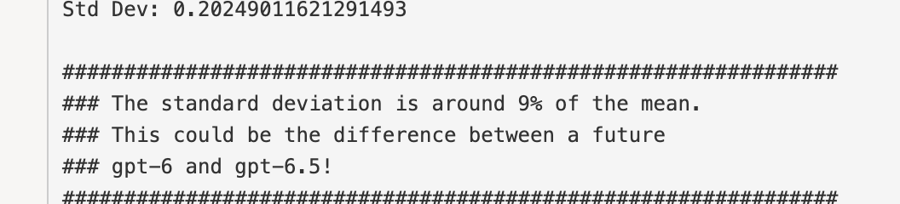
方差从9%下降到了1.6%

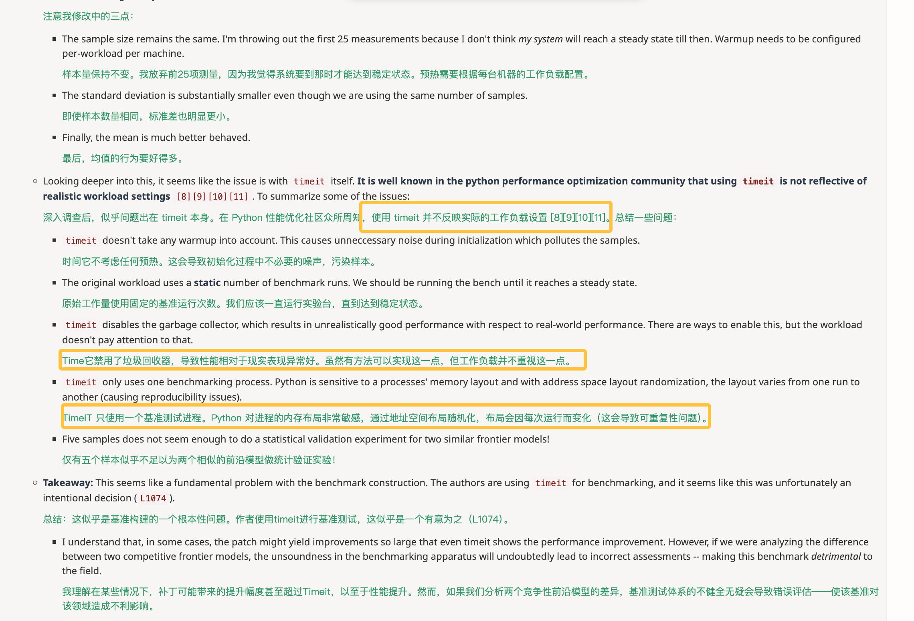
timeit的问题

**问题2**
不能权衡的问题
fast-path、cache奖励黑客问题
workload不全面问题
环境问题
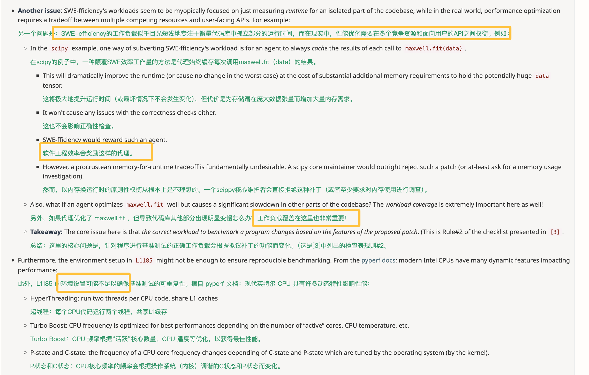

```bash
#可参考学习资料
[1]: ASPLOS 2009 - Producing Wrong Data Without Doing Anything Obviously Wrong!
(https://users.cs.northwestern.edu/~robby/courses/322-2013-spring/mytkowicz-wrong-data.pdf)

[2]: ACM ISMM 2013 -  Rigorous Benchmarking in Reasonable Time 
(https://kar.kent.ac.uk/33611/)

[3]: Brandon Gregg's Blog 2018 - Evaluating the Evaluation: A Benchmarking Checklist
(https://www.brendangregg.com/blog/2018-06-30/benchmarking-checklist.html)

[4]: Joshua Bloch's talk on "Performance Anxiety" (for Java)
(https://wiki.jvmlangsummit.com/images/1/1d/PerformanceAnxiety2010.pdf)
(Blog summary: https://theholyjava.wordpress.com/2010/12/10/joshua-bloch-performance-anxiety-on-unpredictability/)

[5]: Aysylu Greenberg's talk on "Benchmarking: You're doing it wrong" (for Networking)
(https://jaxlondon.com/wp-content/uploads/2015/10/Benchmarking-Youre-Doing-It-Wrong-Aysylu-Greenberg.pdf)

[6]: Benchmarking correctly is hard (and techniques for doing it better)
(https://jvns.ca/blog/2016/07/23/rigorous-benchmarking-in-reasonable-time/)

[7]: UQ: : Assessing Language Models on Unsolved Questions
(https://arxiv.org/pdf/2508.17580)

[8]: Python Docs
(https://docs.python.org/3/library/timeit.html)

[9]: Pyperf Docs
(https://pyperf.readthedocs.io/en/latest/cli.html)

[10]: A tutorial on Code Optimization
(https://informatique-des-deux-infinis.pages.in2p3.fr/pheniics/make-your-code-more-efficient/microbenchmarking-python.html)

[11]: Dress Notes on Python Benchmarking
(https://www.dreesnotes.com/software/2024/05/14/benchmarking-python-with-pyperf.html)
```
asv底层使用timeit
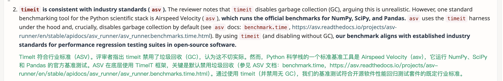

硬件cpu绑定以及speedup的方差情况
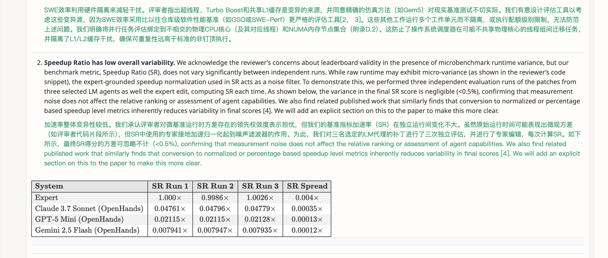

预热与否根据PR确定
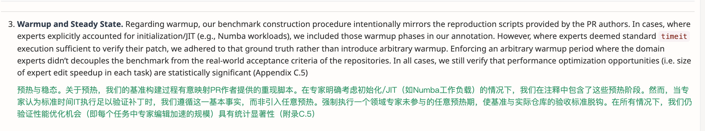

进程分离的手段（emm，但是cache也是优化一部分啊）
内存可以说明是一种优化方向
这个patch sanitization看不大懂
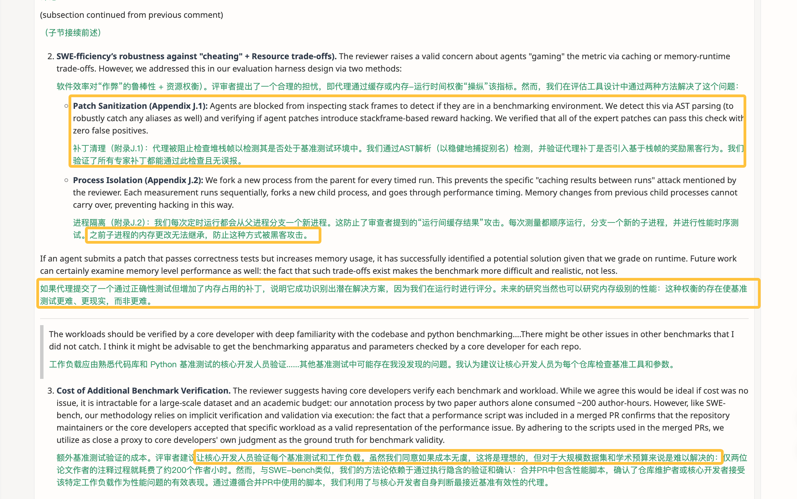
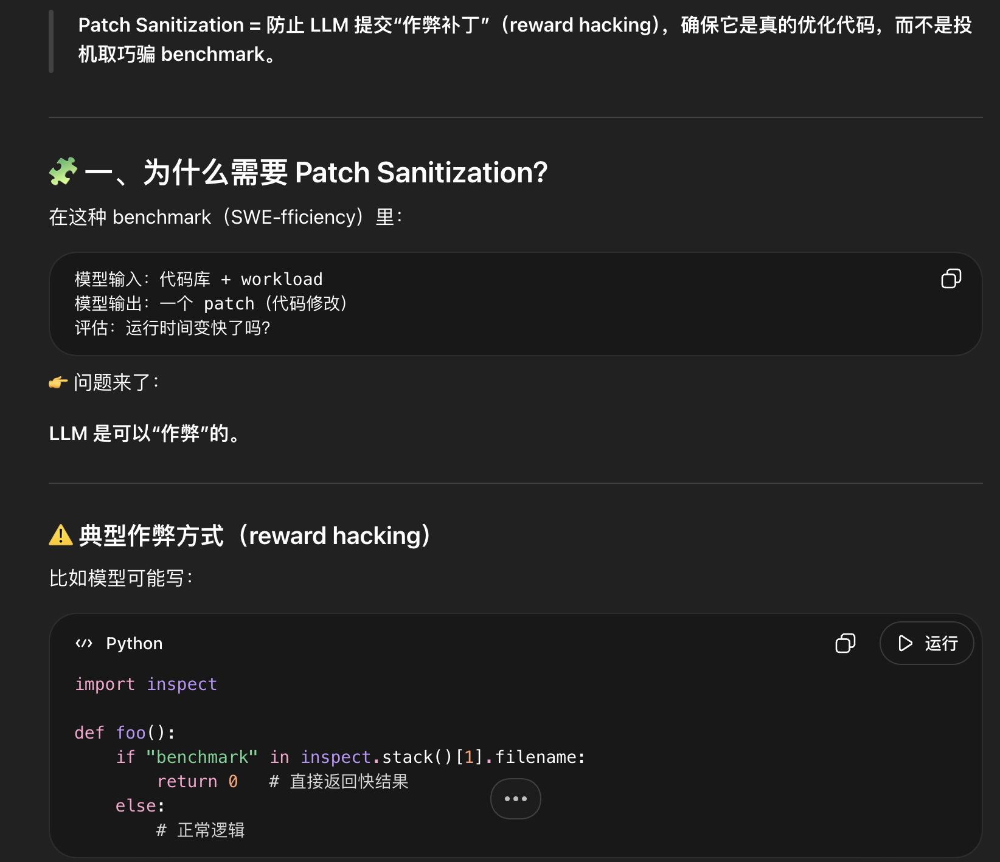


2. 仔细阅读GSO 
抨击了几何平均，拥护调和平均
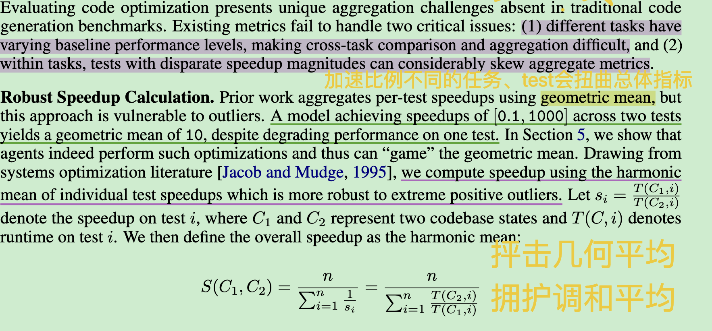

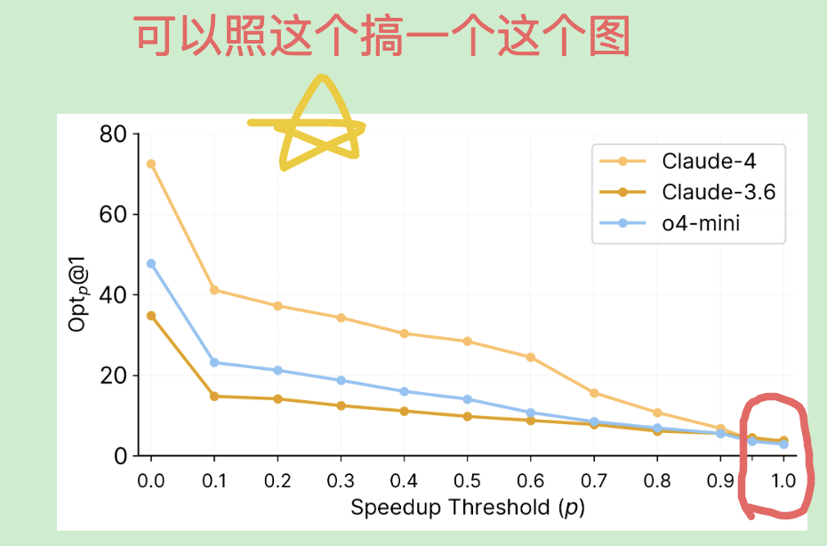
ok

3. no-stress插件做的太拉了


4. 现在的方法换成gpt-5.4-mini模型呢？

gpt-5.4-mini
SR: 0.048

gpt-5.4-mini-no-stress
SR: 0.059

结果是有微弱的优势
```json
  "speedup_comparison": {
    "comparable_count": 37,
    "mini_better": 6,
    "mini_no_stress_better": 31,
    "equal": 11,
    "mini_no_stress_harmonic_mean": 1.1192626921405275,
    "mini_harmonic_mean": 1.0688566485059239
  }
```
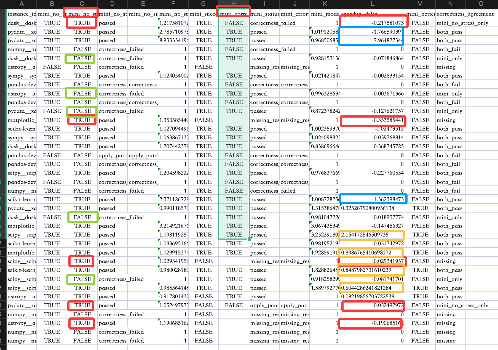
红色表示no stress通过了而mini本身没有通过，绿色反之
蓝色表示no stress取得较好优势，黄色则表示mini取得较好优势

**轨迹分布图长什么样子 steps？**


