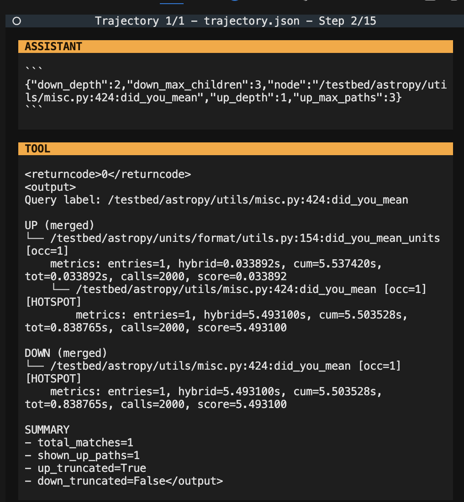
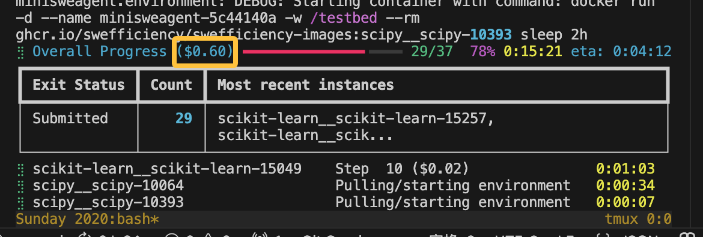
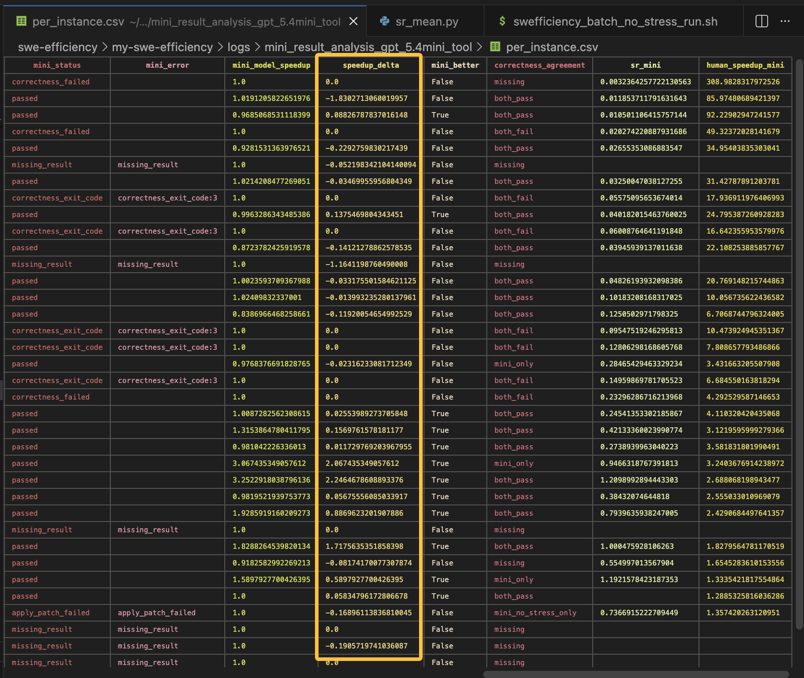

## 现在的方法换成gpt-5.4-mini模型呢？

gpt-5.4-mini
SR: 0.048

gpt-5.4-mini-no-stress
SR: 0.059

gpt-5.4-mini-not-stress-tool
SR: 0.076


结果是有微弱的优势
```json
  "speedup_comparison": {
    "comparable_count": 37,
    "mini_better": 6,
    "mini_no_stress_better": 31,
    "equal": 11,
    "mini_no_stress_harmonic_mean": 1.1192626921405275,
    "mini_harmonic_mean": 1.0688566485059239
  }
```

红色表示no stress通过了而mini本身没有通过，绿色反之
蓝色表示no stress取得较好优势，黄色则表示mini取得较好优势


**轨迹分布图长什么样子 steps？**

```bash
(mini-swe-agent) (base) shichaoxue@gpu-node5:~/swe-efficiency/mini-swe-agent$ python logs/steps_count.py 
matplotlib__matplotlib-17177:  -3 delta steps
scipy__scipy-10064:  -6 delta steps
scikit-learn__scikit-learn-13290:  -5 delta steps
dask__dask-5501:  -5 delta steps
numpy__numpy-13250:  -12 delta steps
dask__dask-10428:  -9 delta steps
astropy__astropy-13471:  -15 delta steps
numpy__numpy-12321:  -9 delta steps
pandas-dev__pandas-23888:  -4 delta steps
pydata__xarray-7472:  -9 delta steps
pandas-dev__pandas-24308:  -4 delta steps
scikit-learn__scikit-learn-13310:  -10 delta steps
scikit-learn__scikit-learn-15049:  0 delta steps
numpy__numpy-11720:  -3 delta steps
scipy__scipy-10467:  -1 delta steps
scipy__scipy-10393:  -4 delta steps
pydata__xarray-5661:  -14 delta steps
pandas-dev__pandas-23772:  -15 delta steps
scipy__scipy-10477:  -2 delta steps
astropy__astropy-12699:  -2 delta steps
sympy__sympy-10621:  46 delta steps
matplotlib__matplotlib-13917:  -3 delta steps
sympy__sympy-10919:  -9 delta steps
numpy__numpy-12575:  -4 delta steps
pydata__xarray-4740:  -3 delta steps
numpy__numpy-12596:  -6 delta steps
dask__dask-11625:  1 delta steps
pydata__xarray-7374:  -5 delta steps
pandas-dev__pandas-24023:  -4 delta steps
scikit-learn__scikit-learn-15257:  -1 delta steps
dask__dask-10922:  -7 delta steps
astropy__astropy-13497:  -5 delta steps
pandas-dev__pandas-24083:  -15 delta steps
scipy__scipy-10564:  -7 delta steps
astropy__astropy-12701:  6 delta steps
pydata__xarray-7382:  -6 delta steps
matplotlib__matplotlib-15346:  8 delta steps
```


## no-stress插件做的太拉了

今天做成渐进式披露，并且跑下gpt5.4-mini，然后汇报下

不是让 LLM 看整棵 profiler tree，而是让它把 hotspot 当成入口，在 tree 上按需“局部展开


就做一个工具就行

ok 就拆解了一个tool function



有一说一，gpt5.4-mini是真省钱





