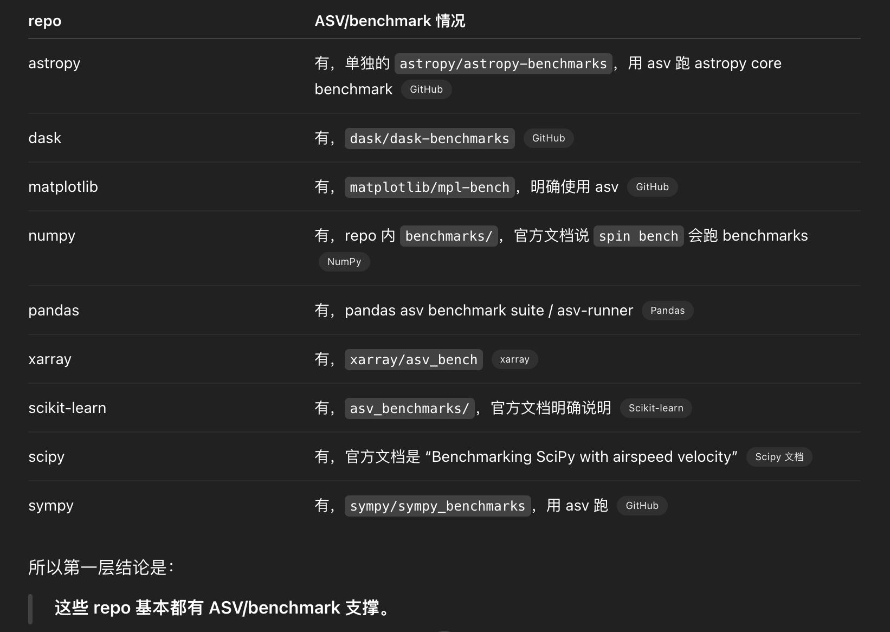

## 制定插件接入计划
只提供hotspots呢？

### 三个tool
- 初始状态 系统先持有 baseline 侧证据：workload_preedit_cprofile.prof、baseline hotspots、baseline tree index。  
- LLM 第一步 调 **get_hotspots**(scope="baseline", metric="hybrid", top_k=5) 选目标；再调 **query_profiler_tree**(scope="baseline", node=..., up/down...) 理解“为什么热”。  
- LLM 第二步 如果 baseline 已足够，直接去读代码/改代码；如果不够，就调 **generate_stress_workload**(instance_id=..., target_ratio=...)，目的是补强证据，不是直接优化。  
- 状态刷新 这个 tool 成功后，系统保留 baseline，同时新增：workload_stress.py、stress_workload_preedit_cprofile.prof、stress hotspots、stress tree index。  
- LLM 第三步 再用同一个查询接口看 stress：get_hotspots(scope="stress", ...)、query_profiler_tree(scope="stress", ...)，最后基于 baseline/stress 两边证据决定 patch。

### 在swefficiency中抽取出一个plugin
mini-swe-agent需要安装相关依赖，然后安装规定来交互

四个实验含义
   - run_oracle.sh
     - 对应已有 oracle/baseline 路径
     - 输出目录应对齐已有：logs/swefficiency-batch
     - 不实际跑，因为你说这个已经有了
   - run_hotspots.sh
     - 调 no-stress batch
     - 加：--swefficiency-toolset-no-stress hotspots
   - run_hotspots_query.sh
     - 加：--swefficiency-toolset-no-stress hotspots_query
   - run_hotspots_query_stress.sh
     - 加：--swefficiency-toolset-no-stress hotspots_query_stress

## 深度探究加速case

## swefficiency这些case都有asv支撑吗？

