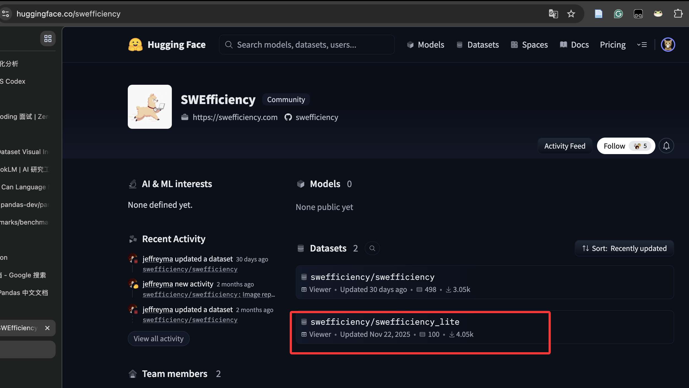
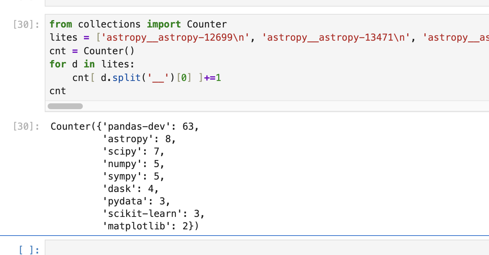
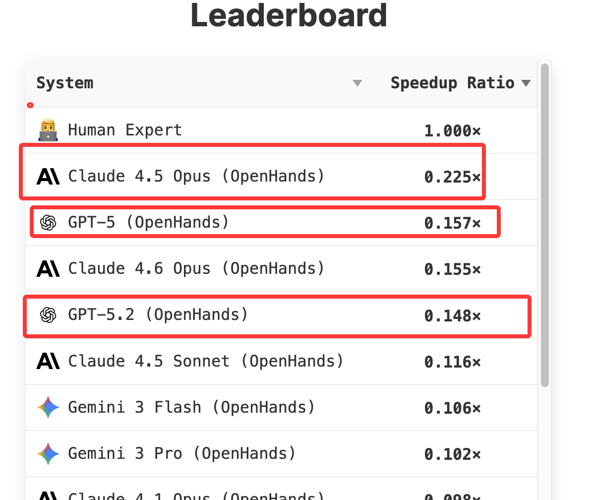

1. 跑gpt5.2
patch都搞出来了
需要评测下

ok，但效果还是不咋地

2. evaluation是不是有bug，怎么pandas的全error了

```bash
per_instance.csv 里 5 个 pandas case 左右两边都是：
correctness_exit_code, correctness_exit_code:3
对应实例：
pandas-dev__pandas-24083
pandas-dev__pandas-24308
pandas-dev__pandas-24023
pandas-dev__pandas-23888
pandas-dev__pandas-23772
它们的 correctness_output.txt 都在同一个地方失败：
+ git remote add upstream https://github.com/pandas-dev/pandas.git
error: remote upstream already exists.
也就是说，脚本还没跑到 pytest，就因为 git remote add upstream 非幂等失败了。
来源：
correct_check.py 里把 correctness 脚本的退出码分类为：
if exit_code not in (0, None, 1):
    error = f"correctness_exit_code:{exit_code}"
其中 1 被允许，因为 pytest exit code 1 通常表示“测试正常运行但有 failed”。但 3 被视为框架级失败。
真正问题：
pandas 的 harness 配置里有：
"pre_install": [
    "git remote add upstream https://github.com/pandas-dev/pandas.git",
    "git fetch upstream --tags",
]
如果容器里的 repo 已经有 upstream remote，这条命令直接失败；再加上 correctness.sh 使用 set -e，所以整个 correctness 检查立刻中断，记录成 correctness_exit_code:3。


事实：确实基本只有 pandas 会触发这类 remote already exists 问题。  
我们 grep 过当前相关 specs，只有 pandas 的 pre_install 里有：
git remote add upstream https://github.com/pandas-dev/pandas.git
git fetch upstream --tags
其他 case 多是 pip install、apt-get、sed -i、git submodule update --init，即使重复执行也通常不会因为“对象已存在”直接退出。
harness 为什么没事：  
原 harness 把 pre_install 当成“一次性 repo setup”，放在 instance image 构建阶段执行：clone 新 repo → reset base commit → 执行 pre_install → install → 固化镜像。这个时候 repo 是干净的，upstream 不存在，所以 git remote add upstream 成功；后续 correctness/eval 不会再次跑 pre_install。
我们为什么炸：  
我们的 standalone correctness 把 pre_install 重新塞进每次 correctness.sh 里执行。运行环境已经是准备好的 image/container，pandas repo 里可能早就有 upstream，所以重复执行 git remote add upstream ... 在 set -e 下直接中断，形成 correctness_exit_code:3。
```

最终解决办法
```python
    if repo == "pandas-dev/pandas":
        filtered = []
        for cmd in raw_pre_install:
            if cmd == "git remote add upstream https://github.com/pandas-dev/pandas.git":
                # filtered.append(
                #     "git remote set-url upstream https://github.com/pandas-dev/pandas.git 2>/dev/null || "
                #     "git remote add upstream https://github.com/pandas-dev/pandas.git"
                # )
                pass
            elif cmd == "git fetch upstream --tags":
                # filtered.append(cmd)
                pass
            else:
                filtered.append(cmd)
        raw_pre_install = filtered
```

3. 读懂这些instance
现在有一个极其重要的事情，需要你辅助我理解完成
对于/home/shichaoxue/swe-efficiency/my-swe-efficiency/swefficiency/method/getdataset/filtered_instances_by_repo.txt，这些case，他们的human  patch的逻辑都是怎么搞出来的，我们在分别记录下/home/shichaoxue/swe-efficiency/my-swe-efficiency/understand，这个举动在于让我理解这些case究竟是怎么搞的，
我们一个个case来就行，你可以启动容器，不过记得加一个特殊的run_id，比如我们用instance-understand来标记，你可以把相关代码保存在这个understand目录，这样子你可以复用，因为任务比较复杂，所以你就给一个instance的就行


难搞


4. 可能的话跑全部instance
不用了
**在huggingface里藏了一个swefficiency-lite子集，这下子可以只跑100条了**




官网还**偷偷摸摸测评**了一些强大模型，可以作为参考



