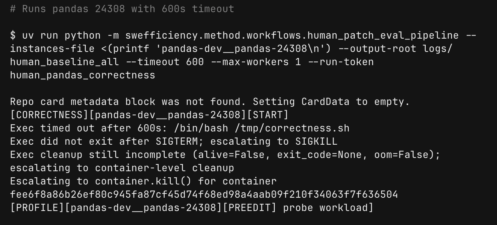
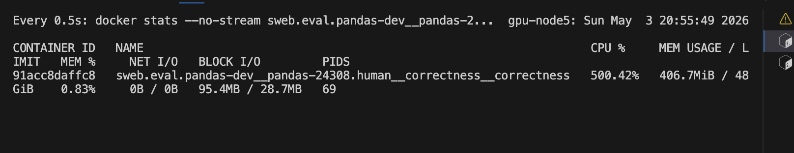
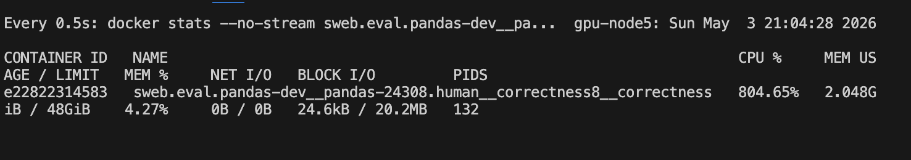

1. 看下5.2在均衡的lite数据集上的表现


2. 读懂instance、简单阅读pandas源代码

合着pandas就是
1）
分type存block，列式numpy存，
然后用blockmanager管理block，以及列索引映射，
用index管理行索引映射，
接着对外提供Series以及Dataframe。
2）
哦哦，
Block 不一定存 numpy array
可以存 DatetimeArray / StringArray / ArrowArray
3）
加上上述数据结构基础上的operataion
如： groupby这种统计还有一个窗口rolling的问题
```bash
selection:
  label -> position -> manager/block take
alignment:
  Index 对齐 -> reindex/take -> block 重排
arithmetic:
  对齐 -> block/array 运算 -> 包装结果
reduction:
  block-wise reduce -> nanops/Cython/EA._reduce
groupby:
  key factorize -> group ids -> Cython/EA 聚合 -> 包装结果
merge:
  key factorize -> join indexers -> reindex_and_concat
reshape:
  index/columns 重排 -> manager/block 重组
```

3. 根据轨迹调整方法、stress、correctness反馈、performance反馈等

## bug human patch也超时，怪不得这么多failed test
human patch 和 model/mini patch 的 correctness 评估不一样：human baseline 目前只跑 speedup，不跑 correctness；mini/model 才走 correct_check.py，使用 rebuild_cmd/test_cmd/covering_tests/single_thread_tests


有问题，这human patch也超时了，绝对有问题


## docker绑定cpu执行

## 重跑这些patch

## edit func相关操作 function level、file level。原本的➕jaccard


## 追踪cpu情况
分配idle cpu
分配8个vcpu



xargs开成4 （它这里是先并行测试能并行的test、然后再串行测试不能并行的）
watch -n 0.5 'docker stats --no-stream sweb.eval.pandas-dev
__pandas-24308.human__correctness__correctness'

xargs改成8



oracle默认是1800s！！！


换到7200s，只剩下pandas-dev__pandas-34178跟pandas-dev__pandas-43518超时
但是还有很多没过的：
report_correctness_passed: false:
pandas-dev__pandas-26702
pandas-dev__pandas-29820
pandas-dev__pandas-23888
pandas-dev__pandas-24308
pandas-dev__pandas-40818
scikit-learn__scikit-learn-17235
pandas-dev__pandas-25953
pandas-dev__pandas-42841
