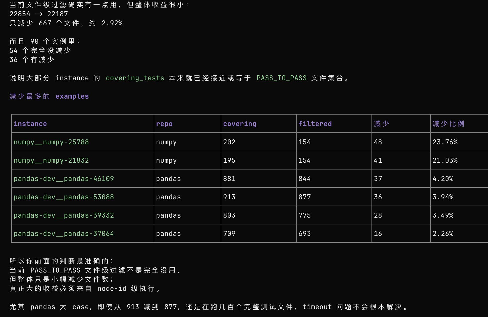
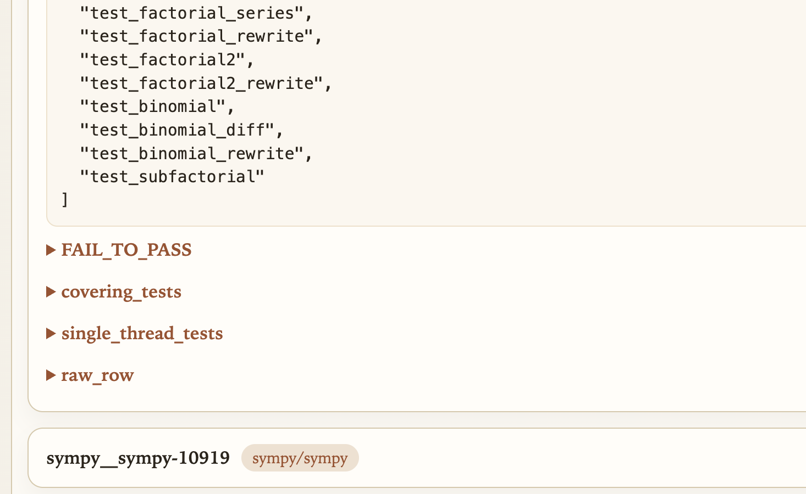
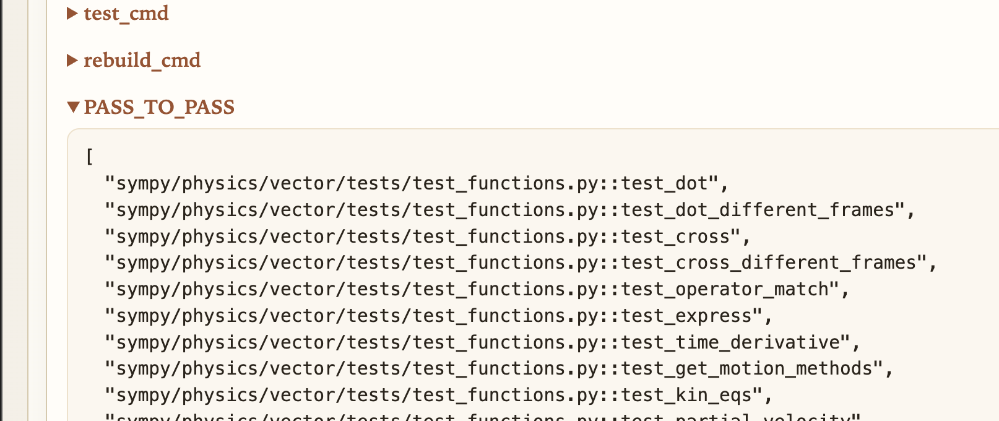

## 把human patch评测通过
评测时长设置为2个小时

还有两个超时的，这给去掉吧，看log就是跑了2个小时


换到7200s，只剩下pandas-dev__pandas-34178跟pandas-dev__pandas-43518超时
而且还有很多虽然不超时，但是correctness没过的：
report_correctness_passed: false:
pandas-dev__pandas-26702
pandas-dev__pandas-29820
pandas-dev__pandas-23888
pandas-dev__pandas-24308
pandas-dev__pandas-40818
scikit-learn__scikit-learn-17235
pandas-dev__pandas-25953
pandas-dev__pandas-42841


总之经过上述行为，最后100个case缩减为90个


在90个case上评测，还是有15个错误

- SymPy 过滤/空测试集问题：  
  sympy__sympy-11675, sympy__sympy-15379, sympy__sympy-16134, sympy__sympy-20989, sympy__sympy-21391
- pandas timeout / cgroup diagnostics 问题：  
  pandas-dev__pandas-37064, pandas-dev__pandas-38560, pandas-dev__pandas-39332, pandas-dev__pandas-43073, pandas-dev__pandas-53088
- pandas SKIPPED 解析 missing 问题：  
  pandas-dev__pandas-27448, pandas-dev__pandas-32825, pandas-dev__pandas-43243, pandas-dev__pandas-43335, pandas-dev__pandas-43352


## operation1  用pass_to_pass的文件过滤pytest的covering tests
这个字段它没做好

整体还是很有用的

## bug1 SymPy 过滤/空测试集问题
原因在于数据格式


这个sympy也是有够奇怪的，有的是 py::func格式，有的不是，导致解析过滤出错

所以这里干脆遇到func格式就回退，不过滤了

## bug2 skipped的问题
```bash
这个评测链路大概是这样：
raw pytest output
  -> log parser
  -> covering_test_status.json
  -> correctness_pass_check.py
  -> harness/grading.py
  -> report_correctness_passed
1. parser 负责生成 status_map
例如 raw output 里有：
pandas/tests/test_downstream.py::test_seaborn SKIPPED (...)
pandas/tests/test_downstream.py::test_statsmodels PASSED
parser 应该生成：
{
  "pandas/tests/test_downstream.py::test_seaborn": "SKIPPED",
  "pandas/tests/test_downstream.py::test_statsmodels": "PASSED"
}
也就是 covering_test_status.json。
2. harness 按 dataset 的 PASS_TO_PASS 判分
correctness_pass_check.py 会读 dataset 里的：
PASS_TO_PASS
FAIL_TO_PASS
然后调用：
get_eval_tests_report(...)
compute_pass_to_pass(...)
核心判断在 swefficiency/harness/grading.py：
def test_passed(case, sm):
    return case in sm and sm[case] in ["PASSED", "XFAIL"]
def test_failed(case, sm):
    return case not in sm or sm[case] in ["FAILED", "ERROR"]
所以：
状态
PASSED
XFAIL
FAILED
ERROR
missing
SKIPPED
3. SKIPPED 在当前逻辑里是“中性 / 不计入分母”
compute_pass_to_pass() 是：
total = len(success) + len(failure)
return len(success) / total
而 SKIPPED 不进入 success，也不进入 failure。
所以如果一个 P2P 测试是 SKIPPED：
不加到 pass_to_pass_success
不加到 pass_to_pass_failure
结果是它被排除在 P2P 计算之外。
4. 这次 pandas 43352 的问题
之前 parser 没记录：
test_seaborn SKIPPED
所以 harness 看到的是：
case not in status_map
于是按 missing 算失败。
修完 parser 后，它会变成：
"pandas/tests/test_downstream.py::test_seaborn": "SKIPPED"
于是不会再被当 missing failure。
```

## 重跑下这些case和之前过滤的10个case
怀疑之前过滤掉的10个case也存在这种skipped情况，因此将这目前还没通过的19个case重跑
sympy那些debug过程中都解决了
```bash
pandas-dev__pandas-27448
pandas-dev__pandas-32825
pandas-dev__pandas-37064
pandas-dev__pandas-38560
pandas-dev__pandas-39332
pandas-dev__pandas-43073
pandas-dev__pandas-43243
pandas-dev__pandas-43335
pandas-dev__pandas-53088
pandas-dev__pandas-26702
pandas-dev__pandas-29820
pandas-dev__pandas-23888
pandas-dev__pandas-24308
pandas-dev__pandas-40818
scikit-learn__scikit-learn-17235
pandas-dev__pandas-25953
pandas-dev__pandas-42841
pandas-dev__pandas-34178
pandas-dev__pandas-43518
```


## 最终超时7200的case
超时的有：
pandas-dev__pandas-37064
pandas-dev__pandas-38560
pandas-dev__pandas-39332
pandas-dev__pandas-40818
pandas-dev__pandas-42841
pandas-dev__pandas-43335
pandas-dev__pandas-43518
还有一个failed的:
scikit-learn__scikit-learn-17235


把37个case和这些再次失败的再跑一边，
xargs为8
明天来了第一件事把model_patch_eval_pipeline做好，大概加了cpu idle selection还需要改改
然后验收37个case和这些再次失败的
然后修stress结合，在37个case上跑

## lite上error的有
超时的有：
pandas-dev__pandas-37064
pandas-dev__pandas-38560
pandas-dev__pandas-39332
pandas-dev__pandas-40818
pandas-dev__pandas-42841
还有一个failed的:
scikit-learn__scikit-learn-17235


意思就是100个case，实质上应该过滤留下94个case

## 37个case超时的有
numpy__numpy-12321 False
numpy__numpy-12575 False
37个case也是应该留下35个case


这两个都是 human patch中存在PASS_TO_PASS failure

