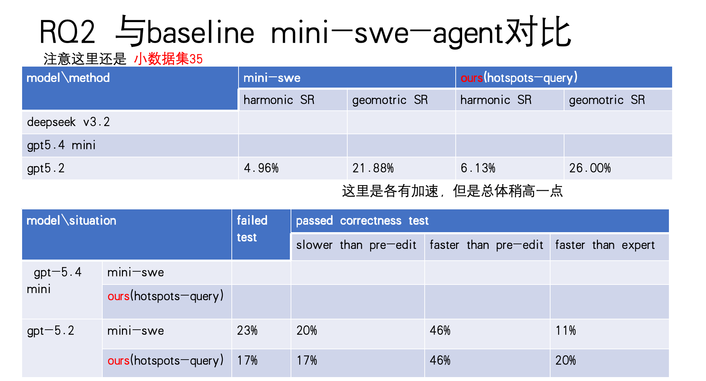
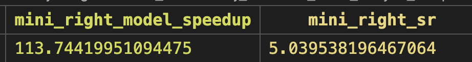
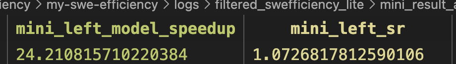

## 0. 选取效果差的case进行深入分析
各有加速，所以导致总体只是稍高一点
**高的**
matplotlib__matplotlib-15346
pandas-dev__pandas-24083
pydata__xarray-7382
scipy__scipy-10064

下面这三个case，加了hotspots-query反而不好
**astropy__astropy-12699**。both_pass
**numpy__numpy-11720**。加了hotspots-query后correctness挂了
**pandas-dev__pandas-23888**。both_pass
看下原因

如果一个 Python 函数（如 dispatch_to_index_op）调用了很多昂贵的 C 扩展或外部函数，它的 hybrid 会大幅提升（因为它会把那些外部子节点的 cumtime 累加起来）。

而纯 Python 叶子函数（如 categorical.py:56:f）如果内部没有调用外部节点，hybrid 就近似等于 tottime。

### 最主要的insight是互有千秋，llm对tool的利用不到位，导致很多没修过来，然后拉低了整体

调了一会prompt
numpy这个好了，astropy好不了
astropy好了，numpy又好不了

明天接着调吧

**主要把这个回退干下去就行**

提升幅度还是不大，主要问题在于第一个特殊case astropy-12699

mini-swe-agent似乎投机了，加速比达到100倍，而mini-swe-agent[hotspost+query\]和human patch是一样的,只有20倍加速

## 1.方法加上stress

核心规则
- generate_stress_workload 不是默认动作，是“诊断放大器”。
- 只有在以下情况才触发：
  1. baseline get_hotspots + query_profiler_tree 之后仍然证据弱/歧义大；
  2. 第一轮候选 patch 的 speedup 很差、接近 1、甚至变差；
  3. workload 本身是小输入/纯内存计算，明显可能被放大后才看出热点。
- 一旦生成 stress，必须立刻：
  - get_hotspots(scope="stress")
  - query_profiler_tree(scope="stress")
  - 再把 stress 和 base 对比后才允许选 edit point。

## 2.采样的数据集上完成stress、所有评测

## 伺机在swefficiency_lite上看效果
