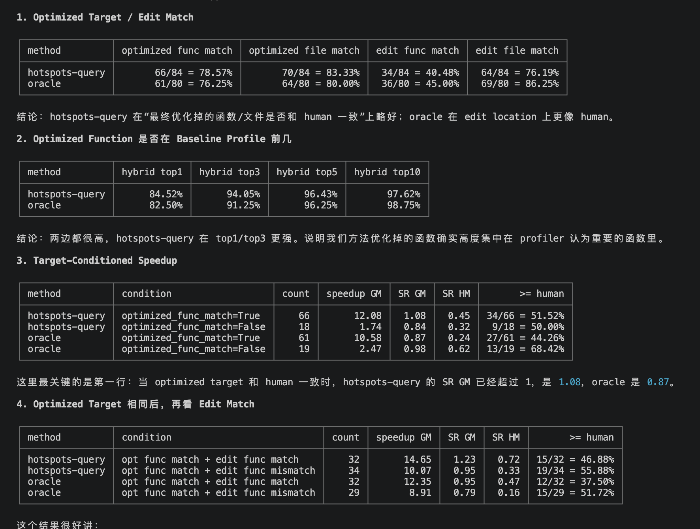

1. 今天把detail分析做好



```bash
 human_top_improved_func =
    human pre profile 和 human post profile 中，hybrid delta 最大的函数

  model_top_improved_func =
    model pre profile 和 model post profile 中，hybrid delta 最大的函数

  delta = pre_hybrid - post_hybrid

  然后：

  optimized_func_match =
    human_top_improved_func == model_top_improved_func

  hybrid top-k hit 的意思是：

  optimized func 是否出现在 baseline pre profile 的 hybrid top-k 里

  这里 baseline 对 model 来说用的是 model_pre_prof，本质就是未打 patch 前的 workload profile。

  target-match 子集就是：

  optimized_func_match == True

  所以 target-match speedup GM / SR GM 是只在“model 和 human 实际最大改善函数一致”的 case 上算：

  model_speedup GM
  SR GM = geometric_mean(model_speedup / human_speedup)

```

2. 看是否跑下deepseek
消融比多llm更重要，改跑消融
```bash
  MODEL_NAME=gpt-5.2 \
  REASONING_EFFORT=none \
  STEP_LIMIT=100 \
  COST_LIMIT=3.0 \
  MAX_WORKERS=3 \
  bash experiment/run_hotspots.sh
```

3. 了解下understand everything plugin


4. 继续常用数据结构


 MSWEA_COST_TRACKING=ignore_errors \
  MODEL_NAME=gpt-5.2 \
  REASONING_EFFORT=none \
  STEP_LIMIT=100 \
  COST_LIMIT=3.0 \
  MODEL_CLASS=litellm \
  MAX_WORKERS=1 \
  INSTANCES_FILE=/tmp/pandas-52430-query-only.txt \
  OUTPUT_DIR=/home/shichaoxue/swe-efficiency/mini-swe-agent/logs/smoke-experiment-query-gpt-5.2-none-steps100-cost3.0 \
  PROF_ROOT=/home/shichaoxue/swe-efficiency/my-swe-efficiency/logs/filtered_swefficiency_lite/swefficiency_lite_human_7200 \
  DATASET_PATH=/home/shichaoxue/swe-efficiency/my-swe-efficiency/dataset/data \
  API_BASE=https://api.asxs.top/v1 \
  bash experiment/run_query.sh