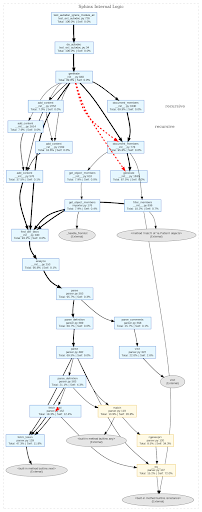
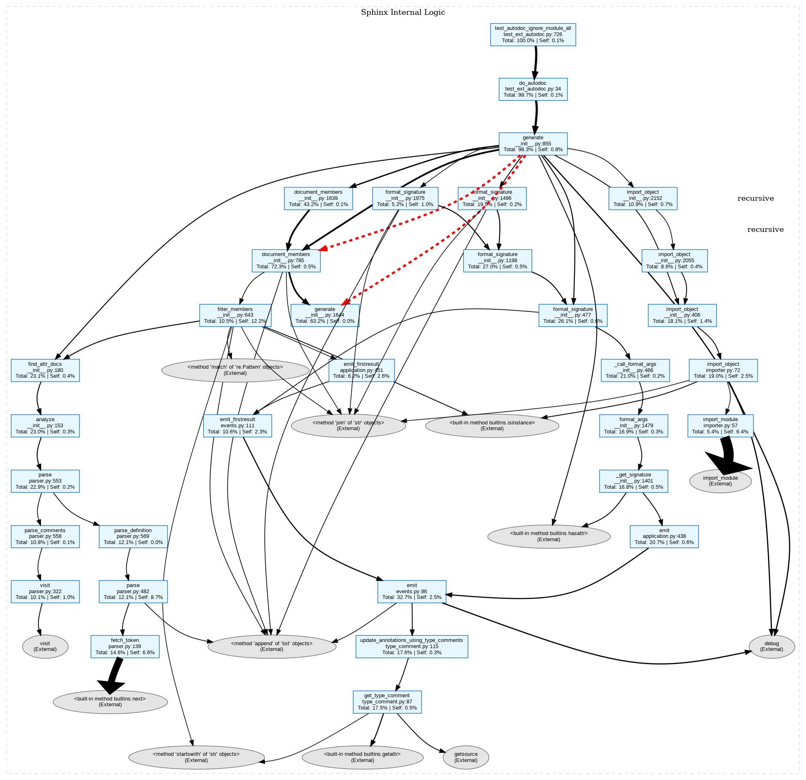

why->what->how->impact
每天推动一点，量变积累质变
先完成再完美

# 代码加速-llm as code optimizer

加速代码执行非常重要， 增效、节能

目前该领域相关工作主要集中在函数级别，对于real-word的code efficiency optimization研究较少。关于细粒度的结合llm与profiler在real-word上做优化方面，存在较大研究空间。
比如PEACE，直接给出了需要优化的target function。


目前的工作有哪些不足？我打算如何解决？
比如 PEACE 需要训练，耗费太大。

我想干的到底是什么？
multi-agent

我将如何解决该任务？


## 算法

## 编译器、解释器

## 并行


why、what、how、impact
为什么需要优化？性能瓶颈
换句话说，小规模数据不需要优化， 1s和10s的程序就使用体验而言没有区别，
当程序由无穷个子程序组成，整个程序运行时间得到堆叠后，就必需优化了，

问题1:属于识别的问题

如何优化？
0.高效算法，换库函数、或手动实现
1.并行化向量化、合理利用硬件资源
2.内存优化


## 调研
PIE
evalperf
effibench、effibench-x
Mercury
COFFEE
enamel

swe-perf
数据质量不高

semopt
没有给策略库

PEACE
初步阅读代码，配置运行
数据还是没有给全！！！

https://github.com/foo123/code-optimization-methods


在enamel上进行了line_profiler反馈的简单baseline的尝试
了解到openmp、mpi等技术，
下一步想能不能通过llm写cython拓展，来使用openmp，然后加速代码执行，
可以作为一个benchmark的构建方法
这个数据集的定位就是，在不涉及gpu的情况下，humaneval、mbpp最快能有多快的算法以及工程上基本最优的benchmark


## 方法

1. cProfiler整体运行，构造基本调用图



apply diff 后，变成




该instance，提升的主要点在，
**问题根源**：之前的代码在解析完成后设置的是 self._parsed = True。
**导致后果**：ModuleAnalyzer 在检查是否已解析时，查找的标志位是 self._analyzed。由于代码错误地设置了 _parsed 而不是 _analyzed，导致每次调用 analyze() 时，程序都认为“从未解析过”，从而触发昂贵的 parser.parse()。
**性能影响**：在递归生成文档时，每一个成员都会触发一次 add_content -> find_attr_docs -> analyze。修复前，这意味着针对同一个源文件进行了成百上千次重复解析（我们在 Profile 中看到的 107 次 parse 调用）。修复后，analyze() 会直接返回，由 $O(N)$ 降为 $O(1)$。
```python
diff --git a/sphinx/pycode/__init__.py b/sphinx/pycode/__init__.py
index d69ab64bd81..31cda67f708 100644
--- a/sphinx/pycode/__init__.py
+++ b/sphinx/pycode/__init__.py
@@ -170,7 +170,7 @@ def analyze(self) -> None:
             self.overloads = parser.overloads
             self.tags = parser.definitions
             self.tagorder = parser.deforders
-            self._parsed = True
+            self._analyzed = True
         except Exception as exc:
             raise PycodeError('parsing %r failed: %r' % (self.srcname, exc)) from exc
```


